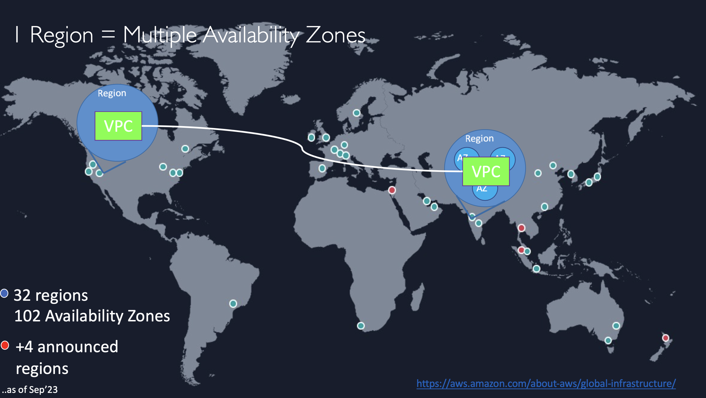

# VPC

### Virtual Private Cloud (VPC)

- AmazonVPC = AmazonVirtual Private Cloud
- Launch AWS resources into a virtual network that you've defined
- VPC closely resembles a traditional on-premises network
- VPC benefits of using the scalable infrastructure of AWS

#### LAN

- LAN: Local Area Network
- vLan: Virtual LAN
- LAN 을 AWS VPC 로 바꾸는데 크게 다를게 없음

### AWS Account -> Region & AZ -> VPC

