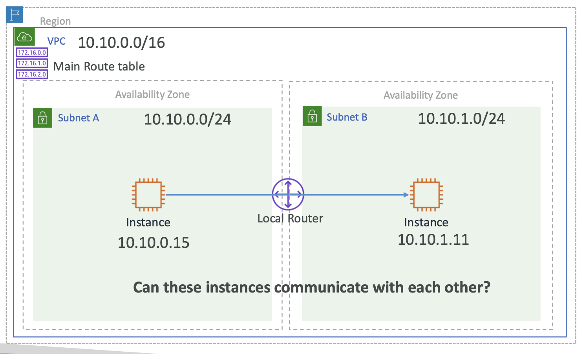

# VPC

### Virtual Private Cloud (VPC)

- AmazonVPC = AmazonVirtual Private Cloud
- Launch AWS resources into a virtual network that you've defined
- VPC closely resembles a traditional on-premises network
- VPC benefits of using the scalable infrastructure of AWS

#### LAN

- LAN: Local Area Network
- vLan: Virtual LAN
- LAN 을 AWS VPC 로 바꾸는데 크게 다를게 없음

### AWS Account -> Region & AZ -> VPC

**VPC 범위**: Region Level. VPC 생성 시 특정 AWS region 에 생성된다는 의미

 

**그렇다면 왜 여러 VPC가 필요할까?**

논리적으로 단일 VPC에 애플리케이션을 배포할 수 있지만,

Best Practice 를 고려할 때, 애플리케이션이나 프로젝트 단위로 네트워크를 분리시키는게 좋음

따라서 Mumbai 리전의 VPC가 가용성 지대(AZ1~AZ3) 에 걸쳐 있는 것을 볼 수 있음

AWS EC2는 특정 AZ에 위치하는데, 다시 말해, 머신 한 대가 동시에 두 개의 AZ에 있을 수 없음

EC2는 VPC 안에 인스턴스를 부팅하면서, 어떤 리전에서 시작할 지 ⎯ AZ1에서 실행할지 AZ2에서 실행할지 ⎯ 결정

이때, EC2를 실행할 AZ는 Subnet을 이용해 결정됨

VPC 생성 후, 그 이하에 여러 개의 Subnet을 생성할 수 있음

서브넷을 생성하는 동안 어느 Subnet이 될지 결정할 수 있음

→ 여기서 3개의 다른 AZ로 EC2 인스턴스를 만들려면 적어도 3개의 Subnet이 필요

정리하자면, **Subnet은 AZ로 매핑되고 VPC는 AWS 리전으로 매핑됨**

VPC 를 생성한 다음 Subnet 을 통해 어느 서브넷이 될지

서브넷은 AZ 로 매핑되고, VPC는 AWS Region 으로 매핑

AWS RDS는 데이터베이스 서비스로, 서비스 범위는 AZ 레벨
용도에 맞게 서브넷을 신중하게 (연결할 EC2 인스턴스외의 위치를 잘 고려해) 디자인해야 한다는 의미

AWS ELB 같은 경우에는 여러 AZ에 걸쳐있을 수 있는 VPC 레벨임
즉, VPC 내로 들어오는 트래픽을 여러 AZ로 분산시킬 수 있다는 의미

AWS S3 는 Region 레벨로, 절대 VPC 레벨에 넣으면 안됨
S3는 AWS에서 완전 관리되는 서비스이고, AWS가 S3의 네트워크를 관리하기 때문

Route 53 은 Global 레벨로, 특정 AWS Region에 속하지 않음 Route 53, Billing, IAM 등도 동일

위 모든 레벨의 최상위 레벨은 AWS Account 로 여러 AWS 리전에 접근할 수 있음

리전마다 하나 이상의 VPC를 생성할 수 있고,
Multiple Available Zone 을 원한다면 해당 VPC 내 서브넷을 생성해서 사용할 수 있음

---

### VPC Building Blocks
aka. Core Components

#### 1.  CIDR
VPC는 생성 시마다 가장 먼저 IPv4 나 IPv6 주소 범위를 할당해야 함

해당 IP 주소는 CIDR 형식으로 할당 되며
Classless Domain Routing 이라고도 함

#### 2. Subnets

IP 범위 할당 이후, Subnet을 생성
서브넷을 생성할 때에는 특정 Availability Zone 에 할당해야 함
서브넷에도 IP 범위를 할당해야 하는데 VPC 범위 내에서 CIDR 범위를 할당

#### 3. Route Table

AWS VPC 가 생성될 때마다 자동으로 메인 경로 테이블을 생성하는데, 모든 서브넷으로 향할 수 있게끔 만듦

많은 경우, 모든 서브넷은 고유의 라우팅 메커니즘이 있어야 함
가령, 어떤 서브넷은 인터넷으로 통하게끔 퍼블릭으로 열려있어야 하고 어떤 서브넷은 DB 연결만을 하고 있어 외부에서 접근하면 안되게 만들어야 함

이를 위해 서브넷 레벨에서의 라우트를 사용할 수 있음

#### 4. Internet Gateway
VPC 를 생성하고 나서 그 내부 리소스에 접근할 수 없는데, 인터넷을 통한 연결 가능 설정을 위해서 Internet Gateway가 필요

VPC 내부에 설치할 수 있는 Firewall 두 가지: Security Groups, Network ACL

#### 5. Security Groups

보안 그룹은 EC2 인스턴스 레벨에서 작동하며, 즉 EC2 인스턴스로 드나드는 모든 트래픽을 제어 하는 역할

EC2 인스턴스 레벨

#### 6. Network ACL

네트워크 액세스 제어 목록은 서브넷 레벨에서 작동

#### 7. DNS, Domain Name Server
aka. AWS DNS Server (Route53 Resolver)

AWS 가 EC2 인스턴스에서 DNS 쿼리를 어떻게 해결하는지 알아보는 것은 중요 - VPC 의 핵심 요소이자 기본 구성 요소 (시험에서도 중요함)

====================================

## Subnets, Route Tables and Internet Gateway

Subnet 이 생성될 때 두 가지 생성

- Local Route Table: Local Router, VPC 내 모든 서브넷 간의 통신 책임
- Main Route Table: Main Router, VPC 내 서브넷 사이에서 트래픽이 어떻게 흐를지 결정

Subnet A - Subnet B 내에 있는 인스턴스가 서로 통신하려면?

| Destination   | Target |
|---------------|--------|
| 10.10.0.0/16  | Local  |

목적지가 Local 이니, Local Router 를 확인할 것

기본 값으로 VPC 와 다수의 서브넷을 만들 때마다 모든 서브넷의 모든 인스턴스는 다른 서브넷의 다른 인스턴스와 통신할 수 있다는 것

✅ 시험에 나올 수 있음

서브넷 내의 모든 서브넷과 EC2 인스턴스는 기본 값으로 서로 통신할 수 있음

현재 EC2 인스턴스가 인터넷에 연결될 수 있을까?

> NO.

이유1. VPC 자체에 인터넷 게이트웨이가 없음 (VPC는 private IP 주소)
이유2. 서브넷에도 Public IP 주소가 필요함

