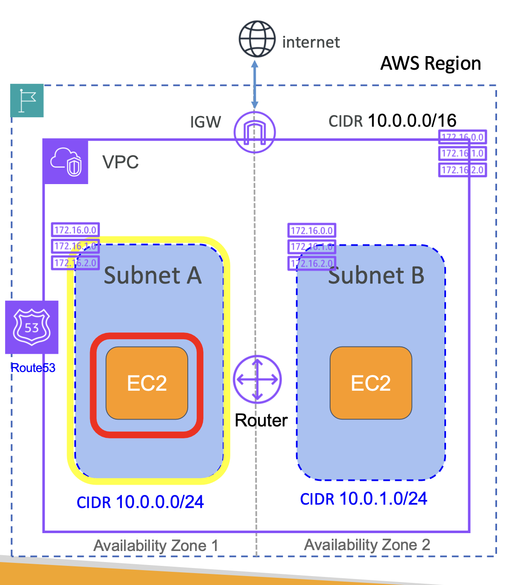

# VPC Building Blocks - Core Components

### 1. VPC

VPC 구성 요소 이해하기 

<br><br>

#### 1.1 VPC 생성

VPC를 생성할 때마다 먼저 Region 을 선택해야 함

그리고 각 Region 마다 Availability Zone (AZ, 이용 가능 지역)이 두 개 이상

간단하게 두 개의 AZ에 VPC가 있다고 가정

```
+-------------------------- Region -------------------------+
|                                                           |
|  +--------- AZ 1 ----------+  +--------- AZ 2 ---------+  |
|  |                         |  |                        |  | 
|  |   +--- VPC --------------------------------------+  |  |    
|  |   |                     |  |                     |  |  |
|  |   |                                              |  |  |    
|  |   |                     |  |                     |  |  |    
|  |   |                                              |  |  |    
|  |   |                     |  |                     |  |  |    
|  |   |                                              |  |  |    
|  |   |                     |  |                     |  |  |
|  |   +----------------------------------------------+  |  |
|  |                         |  |                        |  |    
|  +-------------------------+  +------------------------+  |
|                                                           |    
+-----------------------------------------------------------+
```

#### 1.2 VPC에 IP 범위 할당

VPC를 만들 때마다 제일 먼저 해야 할 일은 IPv4나 IPv6 주소 범위를 할당하는 것

VPC IP 주소 범위를 CIDR 표기 방식인 `10.0.0.0/16` 나타냄

```
+-------------------------- Region -------------------------+
|                                                           |
|  +--------- AZ 1 ----------+  +--------- AZ 2 ---------+  |
|  |                         |  |                        |  | 
|  |   +--- VPC --------------------------------------+  |  |    
|  |   |               < CIDR 10.0.0.0/16 >           |  |  |
|  |   |                     |  |                     |  |  |    
|  |   |                                              |  |  |    
|  |   |                     |  |                     |  |  |    
|  |   |                                              |  |  |    
|  |   |                     |  |                     |  |  |    
|  |   |                                              |  |  |
|  |   |                     |  |                     |  |  |    
|  |   +----------------------------------------------+  |  |
|  |                         |  |                        |  |    
|  +-------------------------+  +------------------------+  |
|                                                           |    
+-----------------------------------------------------------+
```

<br>

### 2. Subnets

VPC 생성 후엔, Subnets (이하 '서브넷') 생성 

서브넷은 VPC 주소 범위를 서브넷 형식의 작은 네트워크로 나누는 것

서브넷은 범위는 AZ 레벨이라, 생성 시 특정 AZ를 지정해서 생성

이후 EC2 인스턴스나 각종 리소스를 시작할 때 특정 서브넷 안에서 시작

```
+-------------------------- Region -------------------------+
|                                                           |
|  +--------- AZ 1 ----------+  +--------- AZ 2 ---------+  |
|  |                         |  |                        |  | 
|  |   +--- VPC --------------------------------------+  |  |    
|  |   |               < CIDR 10.0.0.0/16 >           |  |  |
|  |   |                     |  |                     |  |  |    
|  |   |  +--- Subnet A --+        +--- Subnet A --+  |  |  |    
|  |   |  |               |  |  |  |               |  |  |  |    
|  |   |  |               |        |               |  |  |  |    
|  |   |  |               |  |  |  |               |  |  |  |    
|  |   |  |               |        |               |  |  |  |    
|  |   |  +---------------+  |  |  +---------------+  |  |  |
|  |   |                                              |  |  |    
|  |   +----------------------------------------------+  |  |
|  |                         |  |                        |  |    
|  +-------------------------+  +------------------------+  |
|                                                           |    
+-----------------------------------------------------------+
```

이 때, 서브넷의 주소는 VPC로부터의 작은 범위의 CIDR 를 할당

<br>

### 3. Route Tables

이 때, 서브넷을 생성하면 필수적으로 서브넷으로 향하는 트래픽을 위한 라우팅 설정이 필요

**Root Route Table**: VPC를 만들 때마다 AWS가 자동으로 메인 경로 테이블을 만들는데, 해당 VPC 하위의 모든 서브넷에 적용

하지만 어떤 서브넷은 인터넷에 노출되어야 하고, 
다른 서브넷은 데이터베이스를 호스트하는데 그건 인터넷에 노출될 필요가 없음

이를 가능하게 하려면 서브넷에서 자체 라우팅 메커니즘이 필요

서브넷 레벨에서 라우트 테이블을 가질 수 있음

<br>

### 4. Internet Gateway

위의 설정으로는 외부에서 생성한 EC2 인스턴스에 접근할 수 없음

VPC는 인터넷에 연결되지 않았기 때문

VPC와 인터넷을 연결해주는 인터넷 게이트웨이 필요 → **인터넷 게이트웨이**

또한, 인터넷 게이트웨이에서 서브넷으로 라우팅을 구성해야함

트래픽이 인터넷에서 EC2 인스턴스로 흐를 수 있도록 위함

VPC 내부에 설치할 수 있는 Firewall 두 가지: Security Groups, Network ACL

<br>

#### 4-1. Security Groups

보안 그룹은 EC2 인스턴스 레벨에서 작동하며, 즉 EC2 인스턴스로 드나드는 모든 트래픽을 제어 하는 역할

EC2 인스턴스 레벨

<br>

#### 4-2. Network ACL

네트워크 액세스 제어 목록은 서브넷 레벨에서 작동

#### 5. DNS, Domain Name Server

aka. AWS DNS Server (Route53 Resolver)

AWS 가 EC2 인스턴스에서 DNS 쿼리를 어떻게 해결하는지 알아보는 것은 중요 

→ VPC 의 핵심 요소이자 기본 구성 요소 (시험에서도 중요함)


