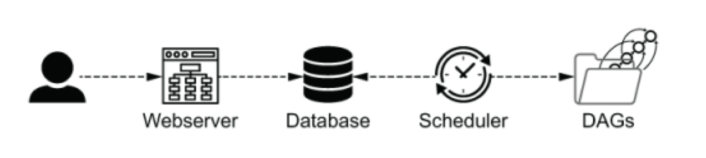

# Airflow Architecture

(이번 장은 Airflow 의 운영 관점에서 Airflow를 이해하는 것이 목표입니다)

<pre>
<b>환경 변수 설정 방법</b>

1. Environment variable (`AIRFLOW__[SECTION]__[KEY]`)
2. Command environment variable (`AIRFLOW__[SECTION]__[KEY]_CMD`)
3. In `airflow.cfg`
4. Command in `airflow.cfg`
5. Default value
</pre>

Airflow 는 세 개의 컴포넌트로 구성되어 있습니다.

- Webserver
- Scheduler
- Database

  

`Webserver` 와 `Scheduler` 모두 Airflow process 입니다.
데이터베이스는 분리된 서비스로, `Webserver` 와 `Scheduler에서` 메타데이터를 저장하기 위해 사용됩니다.
DAG들이 정의된 파일은 반드시 `Scheduler`가 접근할 수 있어야 합니다.

 

#### Airflow 1

`Webserver` 와 `Scheduler`에서 반드시 DAG 파일들에 접근할 수 있게 해야 했습니다.
여러 머신 간에 파일들이 공유되어야 하거나 단순한 프로세스가 아니었기 때문에 이런 복잡한 배포가 필요했습니다.

 

#### Airflow 2

DAG들은 데이터베이스 내 직렬화된(Serialized) 형태로 작성됩니다. `Webserver`는 이렇게 직렬화된 형식을 DB로 부터 읽었으며, 이런 이유로 DAG 에 접근할 필오가 없습니다.

DAG 들의 직렬화는 Airflow 1.10.10 버전부터, 선택적인 기능이지만, 가능합니다.

DAG의 직렬화를 가능하게 하려면 Airflow 1 (≥ 1.10.10) 에서 아래 옵션을 설정해서 사용할 수 있습니다.

- `AIRFLOW__CORE__STORE_DAG_CODE=True`
- `AIRFLOW__CORE__STORE_SERIALIZED_DAGS=True`

`Webserver`의 역할은 파이프라인의 현재 상태에 대해 시각적으로 나타내고 사용자들이 특정 액션을 할 수 있게, DAG를 트리거하는 등, 합니다.
`Scheduler`의 역할은 다음과 같습니다.

- DAG 파일을 파싱합니다 (즉, DAG 파일을 읽어 작게 부분들로 추출한다음, metastore에 저장합니다)
- 실행 태스크를 결정하고 큐에 넣습니다.

`Airflow`는 다양한 방식으로 설치될 수 있는데, 단일 컴퓨터 (설정을 위해 노력이 최소화되지만 스케일러블하지 않음) 혹은 다중 컴퓨터 (더 많은 초반 설정 작업이 필요하지만 수평확장이 가능함) 등이 있습니다.
`Airflow`에서는 executor 타입으로 다양한 실행 모드를 구성할 수 있습니다.

`AIRFLOW__CORE__EXECUTOR` 를 설정함으로써 executor를 구성할 수 있습니다.

| Executor             | Distributed | Ease of installation | Cood fit                                                              |
| -------------------- | ----------- | -------------------- | --------------------------------------------------------------------- |
| `SequentialExecutor` | No          | Very easy            | Demoing/testing                                                       |
| `LocalExecutor`      | No          | Easy                 | When running on a single machine is good enough                       |
| `CeleryExecutor`     | Yes         | Moderate             | If you need to scale out over multiple machines                       |
| `KubernetesExecutor` | Yes         | Complex              | When you’re familiar with Kubernetes and prefer a containerized setup |

 

#### 2.1 어떤 Executor 를 선택해야 할까?

`SequentialExecutor` 는 가장 간단하고 Airflow 와 함께 자동으로 내장됩니다. 이름에서 보여지듯이, task들을 순차적으로 실행시킵니다. 기본적으로 테스팅과 데모의 목적으로 사용되며 꽤 느린
편입니다. 해당 Executor 는 단일 컴퓨터에서만 오직 동작합니다.

단일 컴퓨터에 한해 `LocalExecutor`을 살펴보자면, 특정 시간에 단일 task에 한정되어 있지 않을 뿐만 아니라 여러 task를 병렬로 처리할 수 있습니다. 내부적으로, Executor가 task들을
실행하기 위해 Python FIFO queue 에 등록합니다. 기본적으로, `LocalExecutor`는 32개 까지 병렬 프로세스로 실행될 수 있습니다.

만약 여러 개의 컴퓨터에 당신의 워크로드를 실행시키고 싶다면, `CeleryExecutor` 이나 `KubernetesExecutor` 를 선택할 수 있습니다.
여러 대의 컴퓨터에 분산된 작업들은 여러 이유로 종료될 수 있는데,

- 단일 컴퓨터의 한정된 자원을 다 사용할 때
- 여러 대의 컴퓨터에 job 들을 실행시켜서 중복을 원할 때
- 간단히 여러 대에 컴퓨터에 작업을 분산시켜 워크로드를 더욱 빠르게 실행시키고 싶을 때

분산시키고 싶을 수 있습니다.
