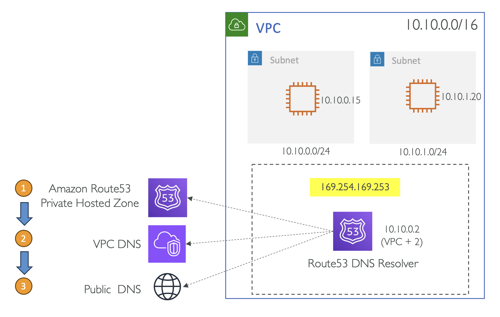
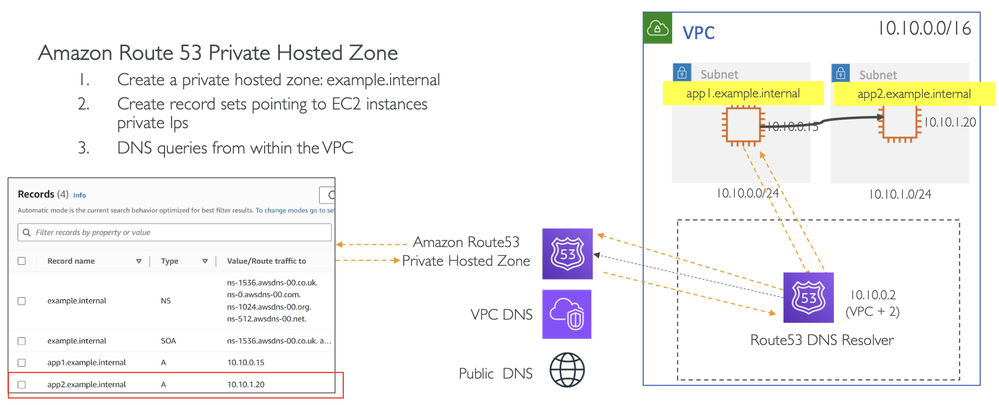
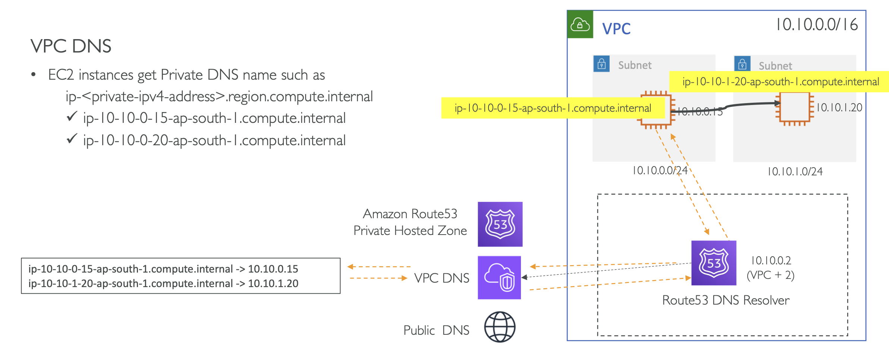
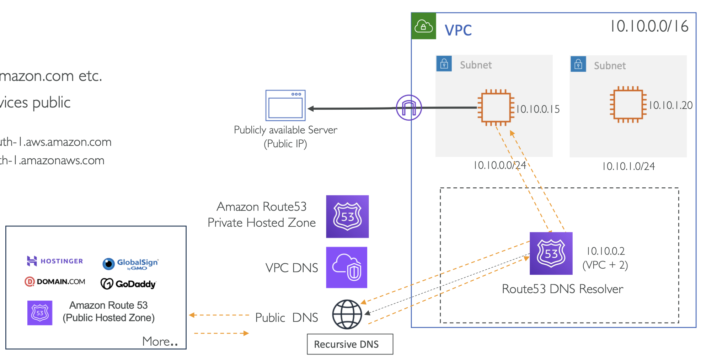
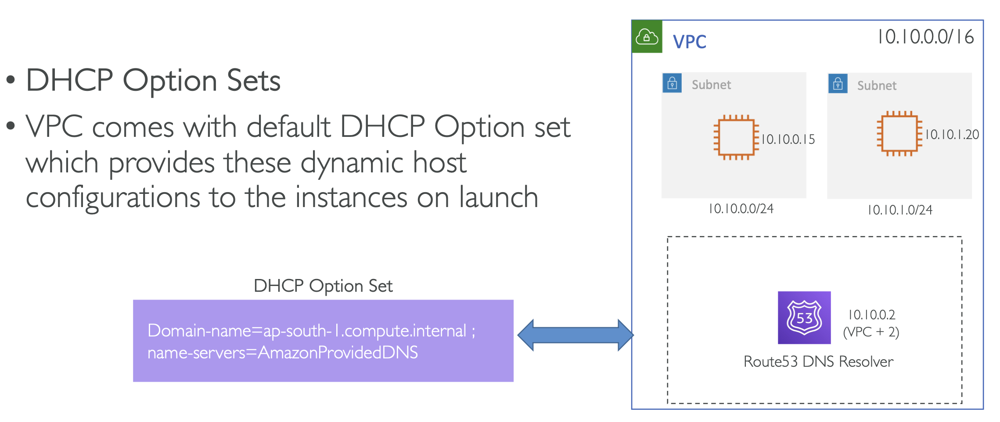

# Amazon VPC DNS Server (Route53 Resolver)

VPC 를 생성하면, AWS는 Default DNS Server 를 생성함

✔️ **생성 위치**

→ 생성된 **VPC 내부**에 배치

✔️ DNS Server 에 **할당되는 IP 주소**

- VPC CIDR 범위의 두 번째 IP (VPC Base + 2 Address)
- 또한 VPC 내의 가상 IP 인 `169.254.169.253` 에 접근할 수 있음

**✔️ DNS 요청이 처리되는 서버** 

(하기 순서대로 질의)

1. Route 53 Private Hosted Zone
   - VPC 리소스를 위한 Private DNS 리졸브
2. VPC 내부 DNS 
   - ex. EC2 인스턴스 생성 시 할당되는 Private & Public 도메인 처리
3. Public DNS 
   - Route53 Public Hosted Zones 포함

  

<pre>💡 Accessible from with in the VPC
: 해당 강의에서는 시험 및 개념 이해를 위해서 VPC 내 접근만을 고려함 
</pre>

#### #1. Route 53 Private Hosted Zone

  

1. Private Hosted Zone 생성: `example.internal`

- 사설 호스트 존 생성
- 내부망이기 때문에 어떤 도메인을 붙여도 상관없음
  - (가령 `google.com` 을 해도 구글의 도메인과는 상관없다는 의미)

2. EC2 인스턴스 Private IPs를 가리키는 레코드셋 생성

3. VPC 내부에서 DNS를 쿼리

가령, `Subnet1`에 있는 `App1` 에서 `app2.example.internal` 을 요청한다면,

'Route53 DNS Resolver'는 해당 요청을 받고 'Amazon Route53 Private Hosted Zone'으로 질의해 아래와 같은 'Record Set'에서 매칭되는 도메인을 찾아 Subnet2의 **App2** 로 전달

<table>
<tr>
<th colspan="4">Records</th>
</tr>
<tr>
<th>Record Name</th>
<th>Type</th>
<th>Value/Route traffic to</th>
<th>...</th>
</tr>
<tr>
<td>...</td>
<td>...</td>
<td>...</td>
<td>...</td>
</tr>
<tr>
<td>app1.example.internal</td>
<td>A</td>
<td>10.10.0.15</td>
<td>...</td>
</tr>
<tr>
<td>app2.example.internal</td>
<td>A</td>
<td>10.10.1.20</td>
<td>...</td>
</tr>
</table>

 

#### #2. VPC DNS

  

EC2 인스턴스가 `ip-<private-ipv4-address>.region.compute.internal` 형식의 Private DNS 이름을 얻었을 때

- ip-10-10-0-15-ap-south-1.compute.internal
- ip-10-10-0-20-ap-south-1.compute.internal

<table>
<tr><td>ip-10-10-0-15-ap-south-1.compute.internal -> 10.10.0.15</td></tr>
<tr><td>ip-10-10-1-20-ap-south-1.compute.internal -> 10.10.1.20</td></tr>
</table>

 

#### #3. Public DNS

  

- `goole.com,amazon.com` etc.
- Amazon services public endpoints
  - `sqs.ap-south-1.aws.amazon.com`
  - `s3.ap-south-1.amazonaws.com`

인터넷을 통해서 DNS Resolving 을 수행

단, 이 때 EC2 인스턴스가 해당 DNS Resolving 을 수행하기 위해서는 

- VPC가 Internet Gateway 에 연결되어 있거나
- Private Subnet에 위치한다면 NAT Gateway가 필요

💡 여기서 구별해야할 점은, 

<u>(1) <b>DNS Resolve 를 위한 Outbound 경로</b></u>와,
<u>(2) <b>EC2 인스턴스에서 Resolved IP를 받아 실제 요청을 보낼 때 경로가 다르다는 것</b></u>

<small>이상 기본적이지만 시험에서 아주 중요한 내용을 다뤘음</small>

 

#### How VPC knows about this Amazon DNS Server?

그렇다면 EC2 인스턴스는 DNS Server의 존재를 어떻게 알까?

→ **DHCP**: Dynamic Host Control Protocol

모든 VPC 는 Default DHCP 설정을 갖고 시작

이때, 이를 통해 DNS Server는 수정할 수 있음

기본적으로, VPC는 Route53를 기본 설정을 가지며, 사용자는 이를 수정 가능함 

DHCP Option Sets 은 쿼리를 위해 VPC 리소스를 어디로 보낼지를 알려줌 

  

위 그림과 같은 경우, **AmazonProvidedDNS** 으로, Route53 DNS Resolver 임
