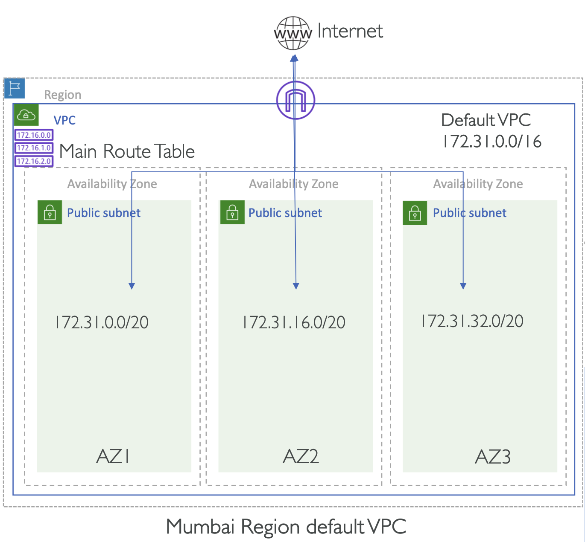

# Default VPC

**AWS는 각 리전마다 디폴트 VPC를 생성**:

  

- **`172.31.0.0/16` CIDR**를 갖는 디폴트 VPC 생성
- 디폴트 VPC 내 모든 AZ에 **`/20` CIDR를 갖는 서브넷**를 생성
- 디폴트 VPC에 단일 **Internet Gateway** 를 생성
- Main Route Table 에는 Internet Gateway 가 등록됨
  - 기본적으로 모두 Public Subnet: 하위 서브넷은 기본으로 Main Route Table을 따르기 때문에 Public Subnet 이 됨

**Main Route Table**

| Destination   | Target     |
|---------------|------------|
| 127.31.0.0/16 | local      |
| 0.0.0.0/0     | igw-xxxxxx |

만약 default VPC 를 삭제했다면, 새로운 default VPC를 생성할 수 있음

- Console > VPC Service > Your VPCs > Action > Create Default VPC

