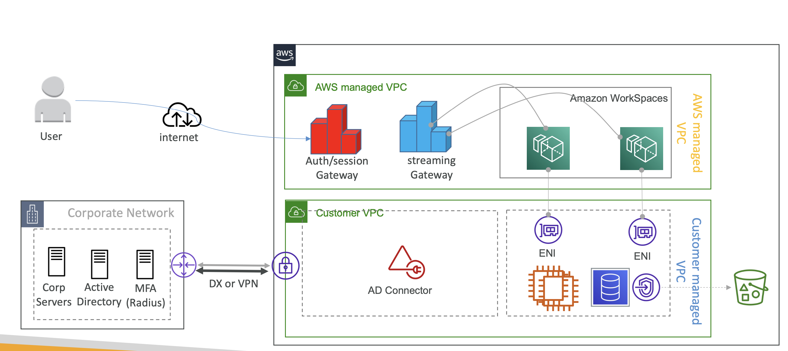
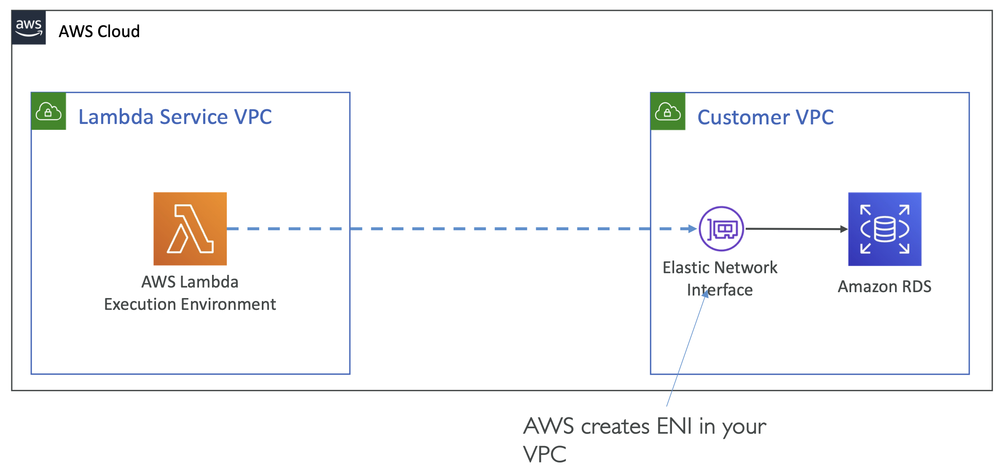
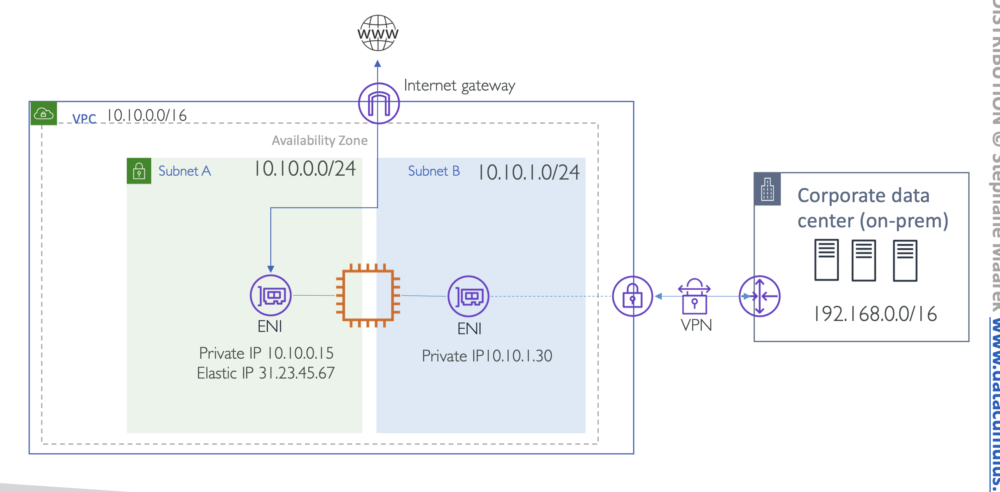
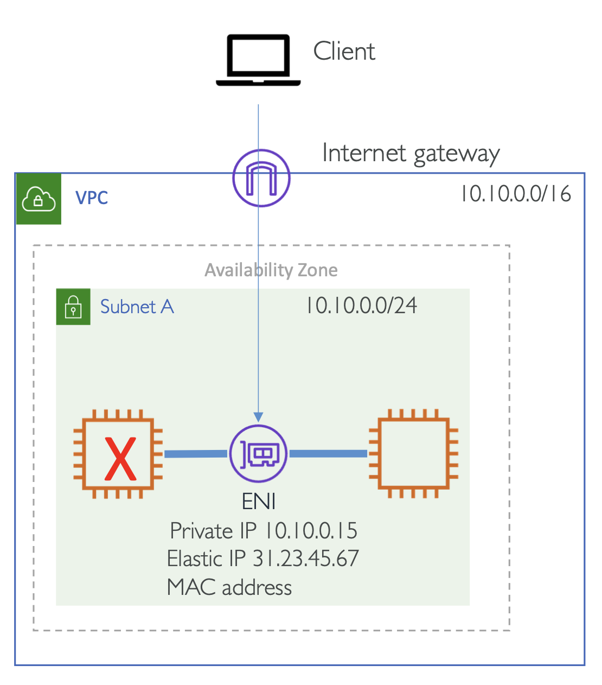
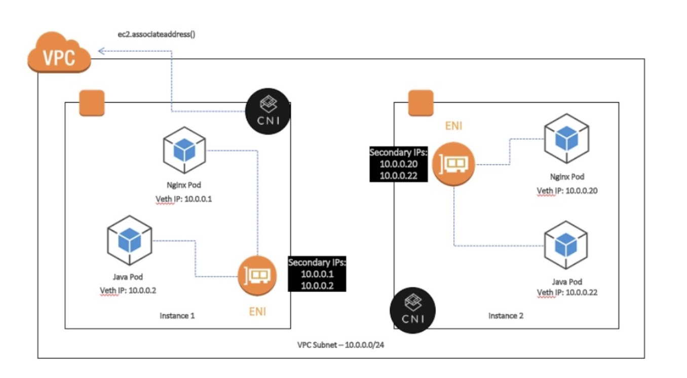

# Elastic Network Interface (ENI) deep dive

EC2 인스턴스에는 어떻게 IP 주소가 할당?

-> EC2 인스턴스가 생성될 때, ENI를 통해 IP 주소 할당

서버의 물리 네트워크 카드와 굉장히 비슷

- VPC 내 **Virtual Network Card**를 의미하는 논리 컴포넌트.
- ENI 는 특정 availability zone (AZ) 범위. 

**ENI 가 가질 수 있는 구성 요소:**

- VPC IPv4 주소 범위 내 Primary IPv4 주소.
- VPC IPv6 주소 범위 내 Primary IPv6 주소.
- VPC IPv4 주소 범위 내 하나 이상의 Secondary IPv4 주소.
- Private IPv4 주소 당 하나의 Elastic IP 주소 (IPv4).
- 하나의 Public IPv4.
- 하나 이상의 IPv6 주소.
- **하나 이상의 Security Group** 을 가질 수 있음.
  - Security Group은 5개로 제한되는데, 이 경우 변경될 수 있음.
- ⭐️ **하나의 MAC 주소**
  - 여러 소프트웨어 라이센스들은 MAC 주소에 연결되어 있음 
    → 즉, 새로 시작하는 인스턴스에 기존의 ENI를 붙이면 됨. (소프트웨어를 새로 살 필요가 없음) 
- Source/Destination Check Flag

<table>
<tr>
<td>

```
 +----------- Available Zone ------------+
 |                                       |
 |  +-- EC2 ---+  Eth0 - primary ENI     |
 |  | Instance |  : 192.168.0.31         |
 |  |          |  Eth1 - Secondary ENI   |
 |  +----------+  : 192.168.0.42         |
 |                                       |
 |  +-- EC2 ---+  Eth0 - primary ENI     |
 |  | Instance |                         |
 |  |          |                         |
 |  +----------+                         |
 +---------------------------------------+
```

</td>
<td>

```
 +----------- Available Zone ------------+
 |                                       |
 |  +-- EC2 ---+  Eth0 - primary ENI     |
 |  | Instance |  : 192.168.0.31         |
 |  |          |                         |
 |  +----------+                         |
 |                                       |
 |  +-- EC2 ---+  Eth0 - primary ENI     |
 |  | Instance |                         |
 |  |          |  Eth1 - Secondary ENI   |
 |  +----------+  : 192.168.0.42         |
 +---------------------------------------+
```

</td>
/tr>
</table>

Secondary ENI를 다른 인스턴스에 붙일 수 있지만, Primary ENI를 붙일 수는 없음

### IP Addresses per instance

EC2 인스턴스에 어떤 ENI가 얼마나 붙어있는지 어떻게 알까

→ EC2 인스턴스에 따라 다름

https://docs.aws.amazon.com/AWSEC2/latest/UserGuide/using-eni.html

### ENI Use cases

<small>많은 사례들이 있지만, 시험에 중요한 네 가지 케이스를 살펴봄</small>

- AWS가 생성한 VPC ENIs를 요청자가 관리 - Requester managed ENIs
- 관리 Network 나 Dual Home 인스턴스 생성
- 인스턴스 장애 시에도 EC2 IP 주소 유지 - High availability solution
- EKS Pods 를 위한 ENI secondary IPs 사용 - Secondary IPs for PODs in EKS

<br>

#### 1. AWS가 생성한 VPC ENI 를 요청자가 관리

**✔️ CASE 1**

RDS 인스턴스는 AWS에 의해 관리되는 VPC 내 위치하지만, Network interface는 사용자가 Security Group 을 통해 트래픽을 조절할 수 있는 커스텀 VPC 에 생성된 경우

**✔️ CASE 2** 

AWS EKS (Control Plane) master 노드들은 AWS에 의해 관리되는 VPC 내 실행되고 VPC 에 ENI가 생성되어, EKS worker 노드 들과 통신할 때

**✔️ CASE 3** 

Workspaces or Appstream2.0 을 사용할 때, 밑단 EC2 인스턴스는 AWS가 관리하는 VPC 내에 실행되고
  ENI들은 VPC 내에 생성되어 해당 인스턴스들이 VPC 내 애플리케이션들과 통신할 때

<br/><br/>

→ Workspaces or Appstream2.0 가 AWS managed VPC 에 위치하고, Customer managed VPC 에 ENI 를 생성해서 연결 관리 

**✔️CASE 4. AWS Lambda to access VPC resources**

<br/><br/>

Lambda 함수는 Lambda Service VPC 내에 생성이 되는데, 실제 ENI는 사용자 VPC에 생성이 되어 접근이 가능해짐

<br>

#### CASE 2. 관리 Network 나 Dual Home 인스턴스 생성

<br/><br/>

애플리케이션이 인터넷 게이트웨이에 연결된 ENI를 통해 인터넷 접근을 할 수 있고, Security Group 를 추가할 수 있음

사내망도 동일하게, 온프렘 네트워크에 연결된 프라이빗 서브넷 내의 ENI를 통해 연결할 수 있음

<br>

#### CASE 3. 인스턴스 장애 시에도 EC2 IP 주소 유지

**✔️High availability solution ⭐⭐️⭐️**

<br/><br/>

- 프라이머리 인스턴스가 다운되면 hot-standby 인스턴스가 ENI 에 연결됨
- Routing 이나 DNS 설정에 변화 없음
- 순단 연결 손실 (Brief loss of connectivity) 발생 가능

<br>

#### CASE 4. Secondary IPs for PODs in EKS

<br/><br/>

EKS Pods에도 Secondary ENI를 할당할 수 있는데, 이는 EKS Networking 섹션에서 더 깊게 살펴볼 예정

---
 
### Exam essentials

1. 인스턴스에 **연결할 수 있는 ENI 수**와 **각 ENI에 설정할 수 있는 Secondary IP 주소의 수**는 **EC2 인스턴스 유형에 따라 다름**.
2. 인스턴스의 Primary 네트워크 인터페이스는 분리 불가. Secondary ENI는 제거(detach)하고 동일 가용 영역(AZ) 내 다른 인스턴스에 연결할 수 있음.
3. **보안 그룹**은 네트워크 인터페이스에 연결됨 - 개별 IP 주소 X.
4. MAC 주소에 바인딩된 애플리케이션 라이선스의 경우 동일한 ENI를 사용하면 MAC 주소를 유지할 수 있음.
5. Secondary ENI를 사용하면 인스턴스가 동일 가용 영역 내에서 여러 서브넷 (multi-homed subnets)에 연결될 수 있으며, 요청자 관리 ENI와 같이 AWS 계정 간에 생성할 수 있음.
   -  e.g. requester managed ENI
6. ENI는 네트워크 인터페이스 카드(NIC) 팀 구성에 사용할 수 없으므로 인스턴스 네트워크 대역폭을 증가시키는 데 사용할 수 없음.
7. 동일 서브넷의 **두 개 이상의 네트워크 인터페이스를 인스턴스에 연결**하면 **비대칭 라우팅 (Asymmetric Routing)과 같은 네트워크 문제**가 발생할 수 있음. 
   - 가능하면 기본 네트워크 인터페이스의 Secondary Private IPv4 주소를 사용하는 것이 좋음.

