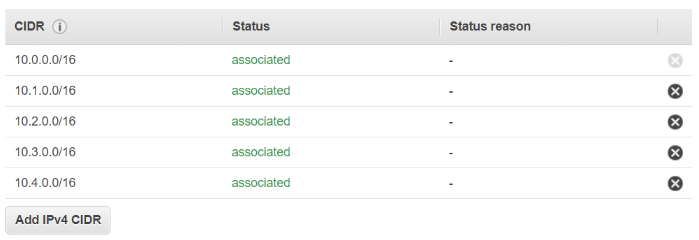
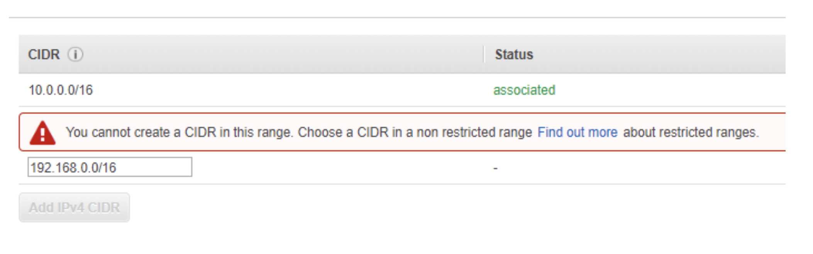
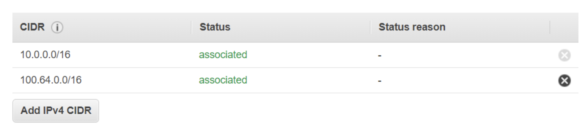

# Extending VPC address space

VPC 내에 더 많은 IP를 사용하고 싶을 때, CIDR 범위를 확장시키고 싶을 수 있음

첫 번째 케이스로, VPC에 너무 작은 CIDR를 설정했을 경우, VPC에 두 번째 CIDR를 설정할 수 있음

두 번째 케이스로, 서로 다른 두 VPC를 연결시키고 싶은데, CIDR 범위가 다른 VPC CIDR 범위와 겹치는 경우.

### VPC secondary CIDR blocks

1. 기존의 VPC에 세컨더리 VPC를 추가할 수 있음
2. CIDR는 기존 CIDR 이나 피어 VPC CIDR 에 오버랩될 수 없음
3. 만약 프라이머리 CIDR가 RFC1918으로 부터 지정되었다면, 세컨더리 CIDR는 다른 RFC1918 IP 범위에서 올 수 없음. (RFC1918 IP 범위: `10.0.0.0/8`, `172.16.0.0/12`, `192.168.0.0/16`)
4. CIDR 블럭은 VPC 라우트 테이블의 어떤 라우트 CIDR 범위와 같거나 더 넓은 범위의 CIDR 범위이어서는 안됨
   - 가령, VPC 프라이머리 CIDR 블럭이 10.0.0.0/16 이고 세컨더리 CIDR 블럭이 10.2.0.0/16 으로 연결시키고 싶다고 가정하자.
     이미  10.2.0.0/24 범위를 Virtual Private Gateway에 사용 중일 때, 더 큰 범위라서 할당 불가능
     만약, 10.2.0.0/25 범위나 더 좁은 범위면 할당 가능
5. 하나의 VPC에 총 5개의 IPv4 와 하나의 IPv6 CIDR 블럭을 가질 수 있음

<br>

<pre>
<b>RFC1918 - Address Allocation for Private Internets</b>
🔗 <b>Link</b>: https://datatracker.ietf.org/doc/html/rfc1918

✔️ <b>TL;DR</b>
- 사설망의 내부 IP대역을 할당할 때 특정 대역 IP를 미리 사용하기로 약속
- RFC1918 addresses are IP address that an enterprise can assign to internals hosts without requiring coordination with an Internet registry.

Address allocation for private internets. 
The allocation permits full network layer connectivity among all hosts inside an enterprise as well as among all public hosts of different enterprises. 
The cost of using private internet address space is the potentially costly effort to renumber hosts and networks between public and private.

<table>
<tr>
<th>Class</th>
<th>RFC 1918 Range</th>
<th>CIDR Prefix</th>
</tr>
<tr>
<td>A</td>
<td>10.0.0.0 - 10.255.255.255</td>
<td>10.0.0.0/0</td>
</tr>
<tr>
<td>B</td>
<td>172.16.0.0 - 172.31.255.255</td>
<td>172.16.0.0/12</td>
</tr>
<tr>
<td>C</td>
<td>192.168.0.0 - 192.168.255.255</td>
<td>192.168.0.0/16</td>
</tr>
</table>

<a href="https://datatracker.ietf.org/doc/html/rfc1918#section-3">Section 3</a>

</pre>

#### VPC with Primary CIDR Block

```
+-------------------- Region ------------------+
|  +------------------  VPC  ---------------+  |    
|  |                           10.0.0.0/16  |  | 
|  |                                        |  | 
|  |  +--- Subnet 1 --+  +--- Subnet 2 --+  |  |       Main Route Table
|  |  |               |  |               |  |  |    +-------------+--------+   
|  |  |  10.0.0.0/17  |  | 10.0.128.0/17 |  |  |    | Destination | Target |
|  |  +---------------+  +---------------+  |  |    |-------------+--------|
|  +----------------------------------------+  |    | 10.0.0.0/16 | local  |
+----------------------------------------------+    +-------------+--------+ 
```

#### VPC with Primary and Secondary CIDR Block

```
+--------------------------   Region   ---------------------------+
|  +-------------------------   VPC   -------------------------+  |    
|  |                                   Primary    10.0.0.0/16  |  |
|  |                                   Secondary  10.2.0.0/16  |  |       Main Route Table
|  |                                                           |  |    +-------------+--------+ 
|  |  +--- Subnet 1 --+  +--- Subnet 2 --+  +--- Subnet 3 --+  |  |    | Destination | Target |
|  |  |               |  |               |  |               |  |  |    |-------------+--------|   
|  |  |  10.0.0.0/17  |  | 10.0.128.0/17 |  |  10.2.0.0/17  |  |  |    | 10.0.0.0/16 | local  |
|  |  +---------------+  +---------------+  +---------------+  |  |    +-------------+--------+
|  +-----------------------------------------------------------+  |    | 10.2.0.0/16 | local  |
+-----------------------------------------------------------------+    +-------------+--------+
```

### Example 1. Add CIDR `10.1...` / `10.2...`

- Create a VPC with CIDR `10.0.0.0/16`
- Select VPC => Actions => Edit CIDR 
  => Add new IPv4 CIDR from `10.1.0.0/16`, `10.2.0.0/16` etc

<br><br>

### Example 2. Add CIDR RFC 1918 Range

- Create a VPC with CIDR `10.0.0.0/16`
- Select VPC => Actions => Edit CIDR 
  => Add other IPv4 CIDR from RFC1918 range `192.168.0.0/16` or `172.16.0.0/16`

<br><br>

### Example 3. Add CIDR Non RFC 1918 Range

- Create a VPC with CIDR `10.0.0.0/16`
- Select VPC => Actions => Edit CIDR => Add new IPv4 CIDR `100.64.0.0/16` (Non RFC1918 range)

<br><br>


### Example

<table>
<tr>
<th>Primary CIDR</th>
<th>Allowed Secondary CIDR</th>
<th>Not allowed Secondary CIDRs</th>
</tr>
<tr>
<td>
<code>10.0.0.0/16</code>
</td>
<td>

- 10.1.0.0/16 etc. in the range of 10.0.0.0/8 
- 100.64.0.0/16 etc. in the range of 100.64.0.0/10
- Public IPv4 Ranges

</td>
<td>192.168.0.0/16, 172.16.0.0/12, Any overlapping CIDR</td>
</tr>
<tr>
<td>
<code>172.16.0.0/16</code>
</td>
<td>

- 172.17.0.0/16 etc. (except 172.31.0.0/16) in the range of 172.16.0.0/12
- 100.64.0.0/16 etc. in the range of 100.64.0.0/10
- Public IPv4 Ranges

</td>
<td>172.31.0.0/16 192.168.0.0/16, 10.0.0.0/8, Any overlapping CIDR</td>
</tr>
<tr>
<td><code>100.64.0.0/16</code></td>

<td>

- 100.65.0.0/16 etc. in the range of 100.64.0.0/10
- Public IPv4 Ranges

</td>
<td>192.168.0.0/16, 10.0.0.0/8, 172.16.0.0/12, Any overlapping CIDR</td>
</tr>
</table>

<br><br>


