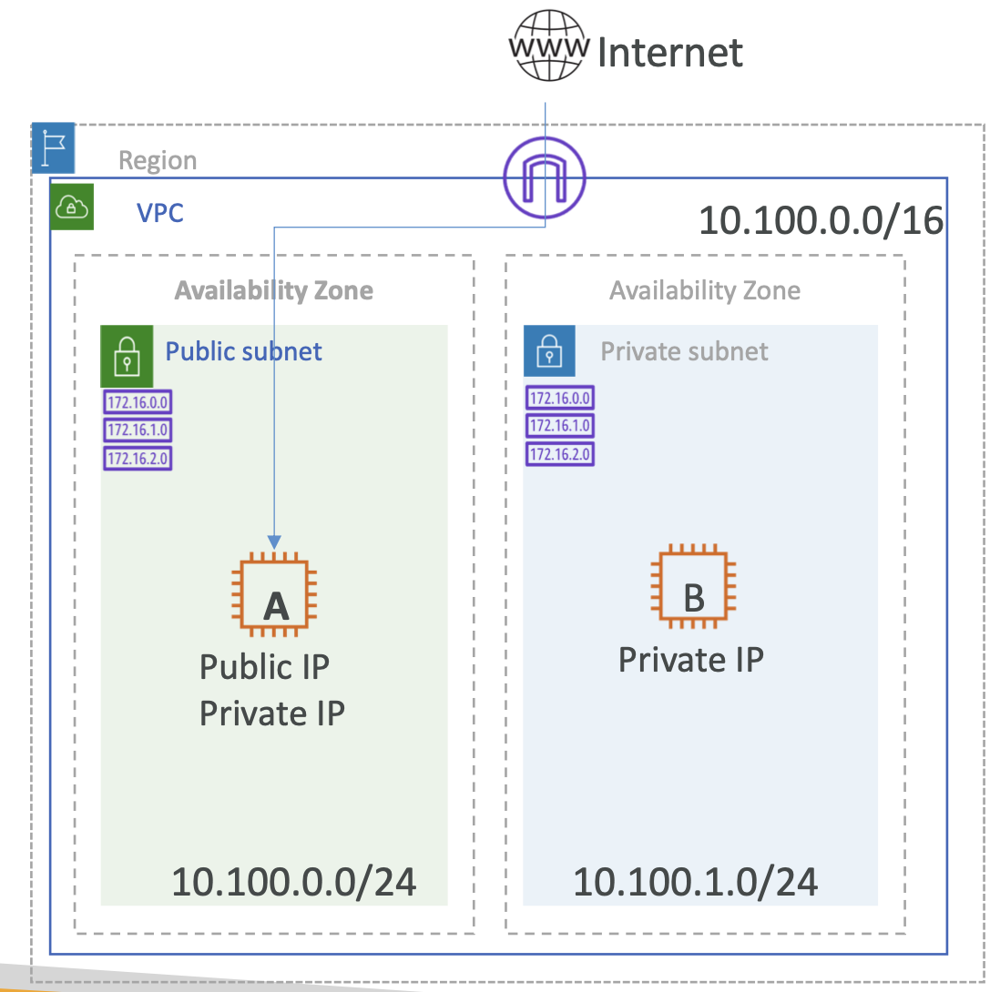

# Hands On: Add Private subnet

  

**Private Subnet Route Table**

| Destination   | Target  |
|---------------|---------|
| 10.100.0.0/16 | local   |

---

1. Create a Private subnet

   a. Create Subnet 
     - Name: MyVPC-Private
     - VPC: MyVPC
     - AZ: Select different AZ (`ap-south-1b`)
     - CIDR: 10.100.1.0/24

2. Create Private route table

   a. Route Tables => Create Route Table 
      - Name: MyVPC-Private
      - VPC: MyVPC

3. Associate Route table with Subnet to make it Private subnet

   a. Select Route table => Subnet Associations => Edit => Check the `MyVPC-Private` subnet => Save

4. Launch another EC2 instance in same VPC but in newly created Private subnet.

   a. Tag this instance with `Name=EC2-B`

   b. New security group
      - Add rule SSH for CIDR of Public Subnet source CIDR
      - Add rule All-ICMP IPv4 for Public Subnet source CIDR

5. Note down EC2-B private IP address

6. Try to ping EC2-B Private IP from EC2-A instance => Should work

7. Try to connect to EC2-B instance from EC2-A (Permissions denied..Why?)

   a. `$ ssh ec2-user@10.100.1.x` (Replace this ip with your EC2-B IP address)

8. Get your ssh `.pem` file on EC2-A instance

   a. Open local `.pem` file with nodepad and copy the content (CTRL+A => CTRL+C)

   b. On EC2 A terminal => `vi key.pem` => enter => press `i` => paste using right click => esc => `:wq`
   => enter

   c. `chmod 600 key.pem`

   d. `ssh -i key.pem ec2-user@10.100.1.x` => should be able to connect

9. Try to `ping google.com` from EC2-B instance

   a. `ping google.com` (You should not be able to ping.Why?)

→ NAT Gateway!
