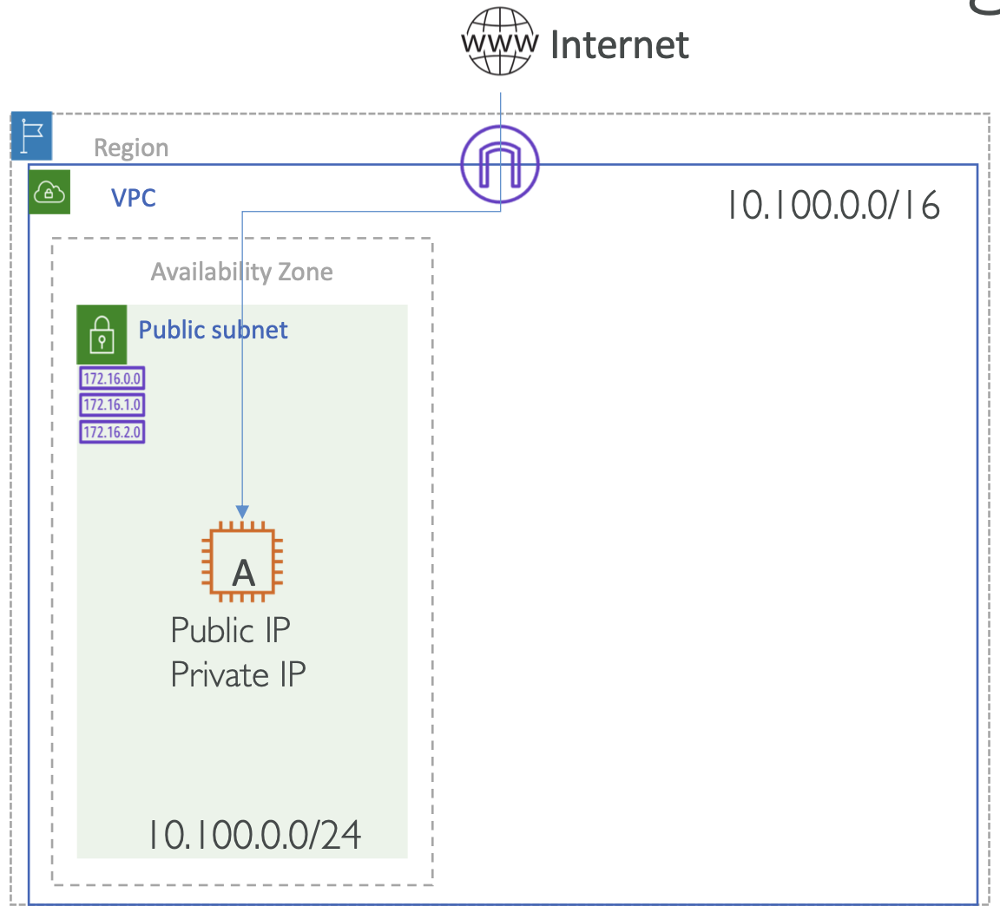

# Hands On: Creating VPC with Public Subnet

  

**Public Subnet Route Table**

| Destination     | Target  |
|-----------------|---------|
| 10.100.0.0/16   | local   |
| 0.0.0.0/0       | igw-xxx |

<small>Note: For EC2 instance to be reachable from internet, it must be in Public Subnet and must have Public/Elastic IP</small>

---

1. Delete default VPC (We will create our own VPC)

2. Create VPC
   
   a. Go to VPC service => Your VPCs => Create VPC (Name: MyVPC, CIDR: 10.100.0.0/16) => Create

3. Create Internet Gateway

   a. Internet Gateways => Create internet gateway

4. Attach Internet Gateway to VPC

   a. Select Internet gateway => Actions => Attach to VPC => Select your VPC

5. Create Subnet

   a. Subnets => Create subnet (Name: MyVPC-Public,VPC: MyVPC, AZ: Select first AZ - ap-south-1a, CIDR: 10.100.0.0/24)

   b. Select Subnet => Action => Modify Auto Assign Public IP => Enable => Save

6. Create Route table

   a. Route Tables => Create Route Table (Name: MyVPC-Public,VPC: MyVPC)
   
   b. Select Route table => Routes => Edit => Add another route (Destination: 0.0.0.0/0,Target: Internet gateway => igw-xxx) => Save

7. Associate Route table with Subnet to make it Public subnet
   
   a. Select Route table => Subnet Associations => Edit => Check the MyVPC-Public subnet => Save

8. Launch EC2 instance in newly created Public Subnet

   a. Go to EC2 Service => Instances

   b. Launch EC2 Instance => Select Amazon Linux 2 => Select t2.micro
   
   c. Configure Instance Details:

      - Network: MyVPC
      - Subnet: MyVPC-Public (rest all defaults)

   d. Add storage (all defaults)

   e. Add Tags
      - Key=Name,Value=EC2-A

   f. Configure Security Group
      - Add rule for SSH port 22 for source as MyIP

   g. Review and Launch

9. Connect to EC2 instance (Public IP) from your desktop/laptop using Putty or terminal (ec2-user)
