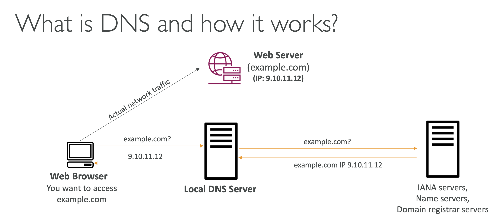

# How DNS works?

Web Browser 에서 `example.com` 로 인터넷 요청을 하게 되면,

**#1. Local DNS Server**

가장 먼저 Local DNS Server 으로 가서 해당 도메인 이름의 IP 주소를 질의

**#2. External DNS Servers**

만약, 해당 도메인에 대한 IP 를 모르면 그 다음으로, 

**IANA Servers, Name Servers, Domain registrar Servers** 등에 요청하여 IP를 질의함

**#3. Request with the IP Address**

그렇게 IP Address 를 알게 되면 Web Browser 는 해당 실제 IP로 요청 (Actual network traffic)

  

**#4. Use Cached information**

해당 도메인-IP 매핑은 캐시되어 이후 요청은 캐시된 IP 주소를 바로 가져와 사용

**=> DNS is the backbone of the Internet**

그래서 DNS 가 Internet의 Backbone 이라고 함 

→ DNS가 작동하지 않으면 인터넷 서버에 연결할 수 없음

### AWS DNS Resolution

  

- **좌**: 위에서 살펴본 DNS 방식
- **우**: AWS DNS 방식

 

### VPC DNS and DHCP

**알아볼 내용**

- AmazonVPC DNS server (Route53 DNS Resolver)
- DHCP Option sets
- EC2 DNS names – internal and external
- VPC DNS Attributes - enableDnsSupport and enableDnsHostname
- Hands-on:
  - VPC DNS with Route53 Hosted Zones • VPC DNS with custom DNS server
  - Introduction to Route 53 resolver endpoints
