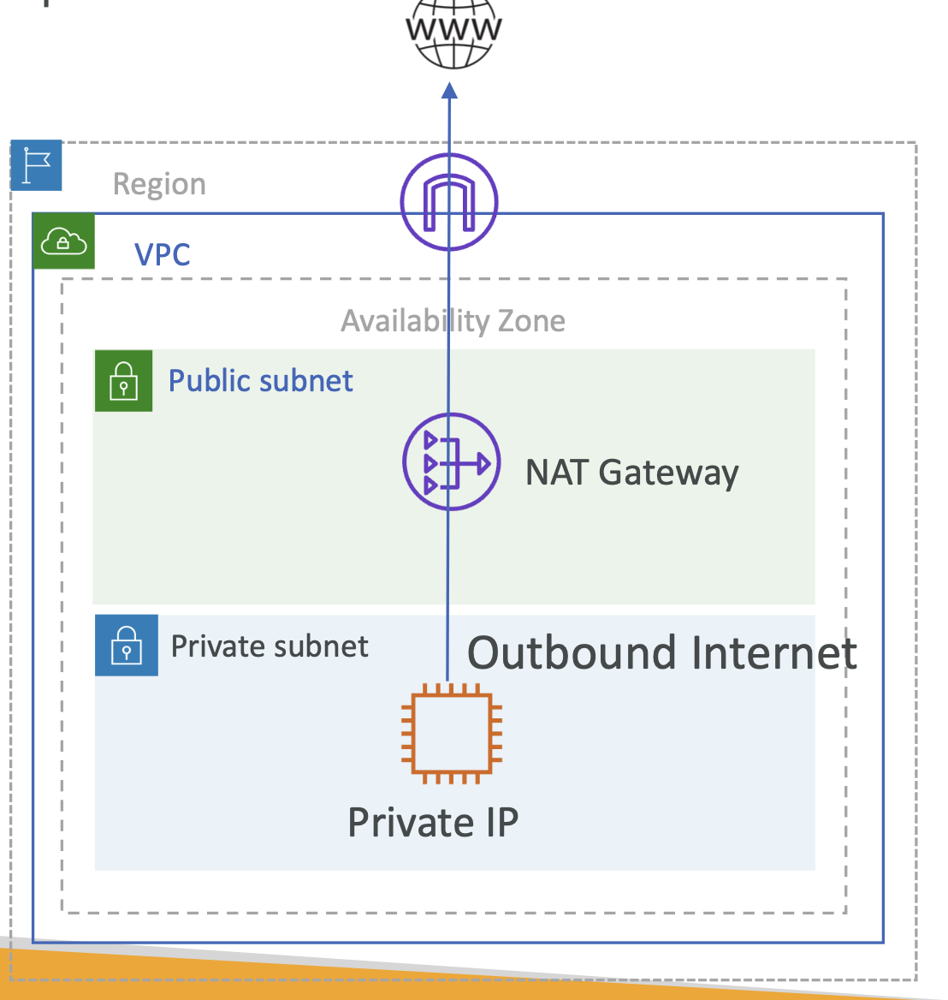

# NAT Gateway

```
+--------------------------- Region -----------------------------+
|  +--------------- VPC [CIDR 10.0.0.0/16] -------------------+  |    
|  |                                          10.100.0.0/16   |  | 
|  |                                                          |  | 
|  |   +-------- AZ 1 --------+  +---------- AZ 2 --------+   |  |
|  |   |                      |  |                        |   |  | 
|  |   |                      |  |                        |   |  |    
|  |   |  +---- Public ----+  |  |  +---- Private ----+   |   |  |    
|  |   |  |    Subnet A    |  |  |  |     Subnet B    |   |   |  |    
|  |   |  |                |  |  |  |                 |   |   |  |    
|  |   |  |  10.100.0.0/24 |  |  |  |  10.100.1.0/24  |   |   |  |    
|  |   |  +----------------+  |  |  +-----------------+   |   |  |    
|  |   +----------------------+  +------------------------+   |  |
|  +----------------------------------------------------------+  |
+----------------------------------------------------------------+
```

B 인스턴스는 인터넷에 연결되어 있지 않음

#### 두 가지 옵션이 존재

**Option 1.** 인스턴스를 퍼블릭 서브넷 내 배치
  - 하지만 아웃바운드 인터넷 연결 만을 원할 땐 한계가 있음 

외부에서 인스턴스에 직접 접근할 수 없어야 한다면?

→ NAT

**Option 2.** NAT (Network Address Translation)

✔️ 외부와 통신해서 인터넷 트래픽을 받음

✔️ **퍼블릭 서브넷**에 위치해야 함

✔️ 즉, **AZ 레벨**

✔️ 프라이빗 서브넷을 위해 라우트 테이블을 수정해야 함

**Private Subnet Route Table**

| Destination   | Target  |
|---------------|---------|
| 10.100.0.0/16 | local   |
| 0.0.0.0/0     | nat-XXX |

→ 트래픽이 인터넷 IP 주소로 가는 거라면 NAT를 통해야 함

이제 패킷은 NAT에 접근하고 NAT가 하는 일은 소스를 Natting 하는 것

→ SNAT

<br>

### SNAT

**1️⃣\[VPC\] Internet Gateway**: 

| **Source** | **Destination** |
|------------|-----------------|
| `1.2.3.4`  | `10.100.1.1`    | 

**2️⃣\[Public Subnet\] NAT Gateway**

Source IP를 NAT Gateway IP 인 `10.100.12.13` 으로 변경

| **Source**                                       | **Destination** |
|--------------------------------------------------|-----------------|
| `10.11.12.13`<br><small>NAT Gateway IP</small>   | `10.100.1.1`    | 

패킷이 NAT로 들어오면 **소스의 주소 대신**, NAT의 퍼블릭 IP 주소나 Elastic IP 주소를 입력

(여기 왜 예시를 10.11.12.13 으로 들었지? CIDR 범위 밖이라도 상관없을..리가 없을텐데)

**3️⃣ \[Private Subnet\]** 

<br>

---

_이하 AWS 에서 사용하는 NAT_

### NAT Gateway and NAT Instance

- Internet Gateway 없이 프라이빗 서브넷 내의 인스턴스에 외부에서 접근할 수 있게 함
- 패킷이 VPC에서 떠날 때 Network Address translation 수행

<br/><br/>

#### **NAT Gateway**

- AWS에 의해 관리: NAT, higher bandwidth, better availability, no admin
- AZ 내 높은 내구성을 가짐 (High availability)
- 사용량(usage)과 대역폭(bandwidth)으로 시간 단위 가격 책정 
- 특정 AZ에 생성하며 EIP 사용
- 5 Gbps 대역폭으로 100 Gbps 까지 스케일링 가능
- **Security group 적용 안됨**.
  - 어떤 트래픽을 받을지 제어할 수 없다는 의미지만, NACL 서브넷 레벨이기 때문에 트래픽 제어 가능
- Supported protocols: `TCP`, `UDP`, and `ICMP`
- Uses ports `1024`–`65535` for outbound connection

AWS에 의해 관리되기도 하고 높은 내구성을 가지기 때문에,
NAT 게이트 웨이를 모니터링하거나 스케일 할 필요가 없음.

하지만 빈번하게도 Managed NAT Gateway를 사용하지 않고 싶을 때가 생김.

대부분의 이유는 **비용**일 것이고, 개발이나 QA 환경에서 HA가 필수는 아니기 때문.

이 땐, NAT를 위한 EC2 인스턴스를 실행해서 적용시킬 수 있음. 

→ **NAT Instance**

#### **NAT Instance**

- Amazon Linux Nat AMI를 사용해 사용할 수 있음
- 인스턴스에 Source/Destination 체크를 비활성
- EIP 할당 필요 

