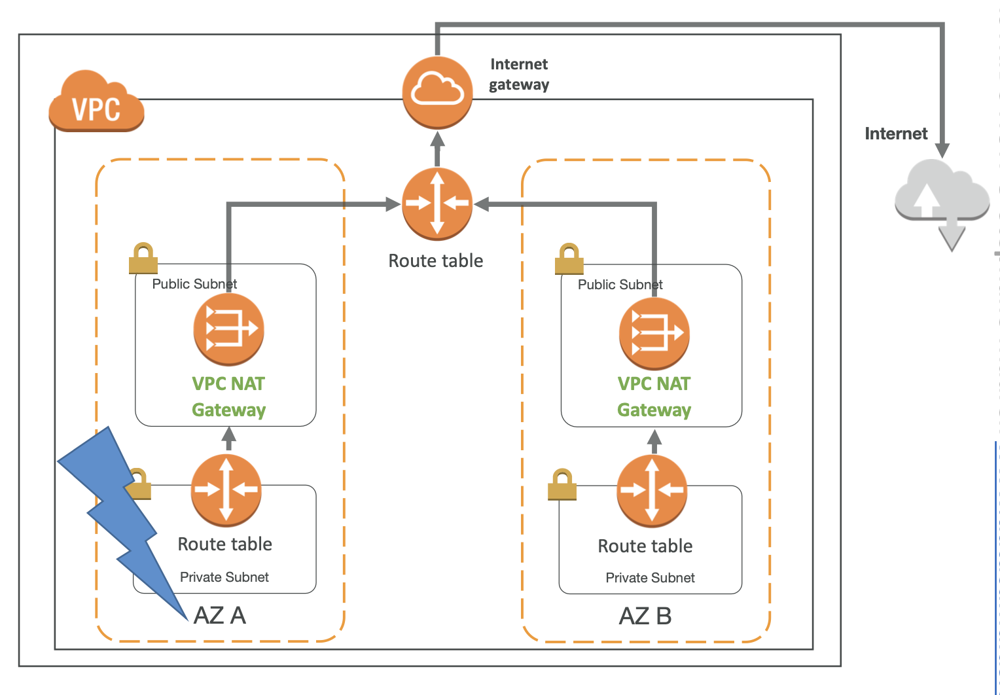

# NAT Gateway with High Availability

- NAT Gateway 는 단일 AZ 내에서 항상 회복 탄력성이 있음
- Fault Tolerance: 여러 AZ 내에서 반드시 여러 NAT Gateway 생성해야함 
  - Exam: how to have the high availability for the NAT gateways across AZ?
  - To have the individual NAT gateways in each AZ.
  - 
- 만약 한 AZ 가 내려가면 NAT가 필요하지 않기 때문에 AZ 장애 조치(Failover)가 필요하지 않음

한 AZ 전체가 내려가도 다른 AZ가 실행되며, 즉 해당 시스템이 안정적이라는 의미.

<small>✍🏻 시험은 이 정도만 알아둬도 됨</small>
