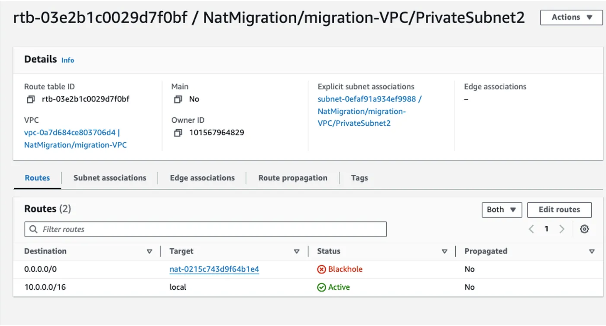

# NAT Instance (EC2 based NAT)

- Must be in **Public Subnet**
- Must have **Public or Elastic IP**
- Should be launched using **AWS provided NAT AMIs**
- ⭐️Disable Source/Destination Check
  - EC2 인스턴스에 기본으로 설정된 **Source 와 Destination 일치 여부 확인 기능**을 꺼야함
- Update Private subnet route tables.
- For internet traffic set target as NAT Instance ID

[VPC NAT Instance](https://docs.aws.amazon.com/vpc/latest/userguide/VPC_NAT_Instance.html)

Funny thing...

NAT gateway 가 삭제되면 AWS 콘솔 창에서 `blackhole` 을 확인할 수 있는데,

트래픽은 해당 경로로 라우팅되는데 목적지가 없어서 생기는 표시

  

<small>Source: https://aws.plainenglish.io/migrating-nat-instance-from-nat-gateway-eb383a09f7ed</small>

| **Attribute**           | **NAT Gateway**                                                                                                                                               | **NAT Instance**                                                                                                          |
|-------------------------|---------------------------------------------------------------------------------------------------------------------------------------------------------------|---------------------------------------------------------------------------------------------------------------------------|
| **Availability**        | Highly available within AZ. Create a NAT Gateway in each Availability Zone to ensure zone-independent architecture.                                           | Use a script to manage failover between instances.                                                                        |
| **Bandwidth**           | Can scale up to 45 Gbps.                                                                                                                                      | Depends on the bandwidth of the instance type.                                                                            |
| **Maintenance**         | Managed by AWS.You do not need to perform any maintenance.                                                                                                    | Managed by you, for example, by installing software updates or operating system patches on the instance.                  |
| **Performance**         | Software is optimized for handling NAT traffic.                                                                                                               | A generic Amazon Linux AMI that's configured to perform NAT.                                                              |
| **Cost**                | Charged depending on the number of NAT Gateways you use, duration of usage, and amount of data that you send through the NAT Gateways.                        | Charged depending on the number of NAT Instances that you use, duration of usage, and instance type and size.             |
| **Type and size**       | Uniform offering; you don’t need to decide on the type or size.                                                                                               | Choose a suitable instance type and size, according to your predicted workload.                                           |
| **Public IP addresses** | Choose the Elastic IP address to associate with a NAT Gateway at creation.                                                                                    | Use an Elastic IP address or a public IP address with a NAT Instance.                                                     |
| **Security groups**     | Cannot be associated with a NAT Gateway.You can associate security groups with your resources behind the NAT Gateway to control inbound and outbound traffic. | Associate with your NAT Instance and the resources behind your NAT Instance to control inbound and outbound traffic.      |
| **Port forwarding**     | Not supported.                                                                                                                                                | Manually customize the configuration to support port forwarding.                                                          |
| **Bastion servers**     | Not supported.                                                                                                                                                | Use as a bastion server.                                                                                                  |

 

### NAT Gateway Troubleshooting / Rules / Limitations

- https://docs.aws.amazon.com/vpc/latest/userguide/nat-gateway-troubleshooting.html
- https://docs.aws.amazon.com/vpc/latest/userguide/vpc-nat-gateway.html#nat-gateway-limits
- https://aws.amazon.com/premiumsupport/knowledge-center/vpc-resolve-port-allocation-errors/
- https://docs.aws.amazon.com/vpc/latest/userguide/nat-gateway-troubleshooting.html#nat-gateway-troubleshooting-tcp-issues

