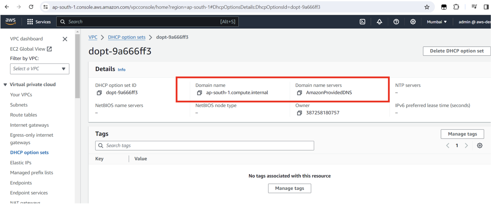
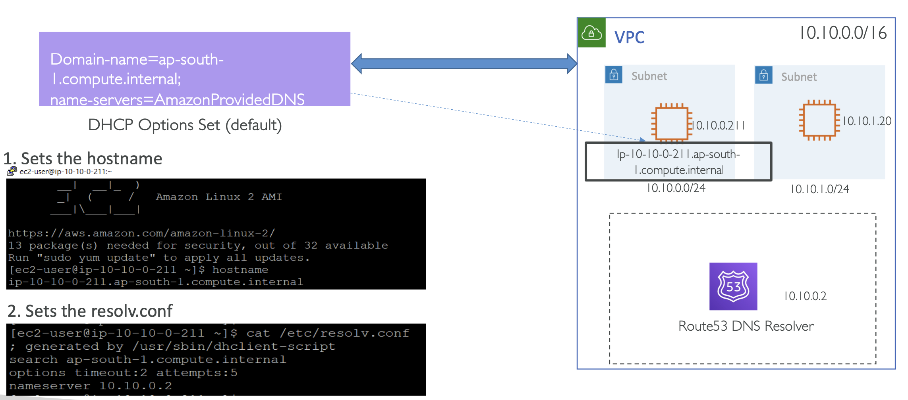
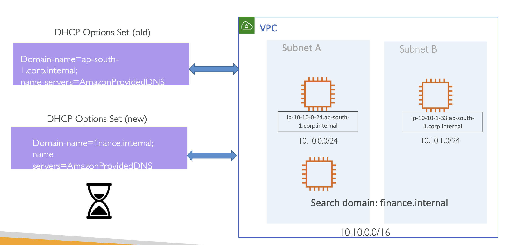

# VPC DHCP Option sets

DHCP Option Sets 을 통해 EC2 인스턴스를 위한 Private Domain Name을 무엇으로 설정할지 지정할 수 있음

그 이후, 기본으로 어떤 Domain Name Server가 지정 되는지 설정할 수 있음 (지정되는 Route53 Resolver 같은 DNS Server)

그리고 NTP(Network Time Protocol) 나 NetBIOS Node type 같은 추가적인 것들을 설정함 

AWS는 VPC 생성 시 자동으로 DHCP Option Set을 생성하고, 다음과 같은 파라미터를 세팅함

- **domain-name-servers**: **AmazonProvidedDNS** 으로 초기 세팅됨
- **domain-name**: 당신의 리전에 internal Amazon domain name으로 초기 세팅됨 
  - e.g `<ip>.ap-south-1.compute.internal`

아래와 같은 Default Setting 을 확인할 수 있음

  

EC2 인스턴스의 경우 항상 Private IP 주소가 할당됨 

가령, 위 이미지의 `ip-10-10-0-211.ap-south-l.compute.internal` 를 보면,
IP 주소의 형태처럼 호스트명이 지정되어 있고, Region 명과 `compute.internal` 이 붙은 것을 확인할 수 있음

  

1. Set the hostname
2. Sets the `resolv.conf`
   - `$ cat /etc/resolv.conf` 명령어를 치게 되면 nameserver IP 주소를 확인할 수 있는데, `nameserver 10.10.0.2` 가 설정되어 있는 것을 확인할 수 있음

VPCs 정보를 확인하면, Details Tab 에 `DHCP option set` 라는 항목을 확인할 수 있음

만약 새로운 DNS Server를 붙이고 싶다면, 새로운 DHCP 옵션을 붙일 수 있음

  

적용되는 데 몇 시간이 걸릴 수 있는데, 혹은 각 운영체제에 맞는 DHCP 명령어를 입력해서 적용할 수 있음

Amazon 에서 제공하는 DNS를 사용하는 대신, 커스텀 도메인 이름에 DNS 쿼리를 하도록 지정할 수 있음

 

### VPC DNS Attributes

#### ✔️ `enableDnsSupport` (= DNS Resolution setting)

- 기본 값: `True`
- VPC에 대한 DNS Resolution 지원 여부를 알려줌
- `True` 일 때, `169.254.169.253` 에 위치한 (혹은 VPC+2 주소의) AWS DNS server 로 쿼리함

 

#### ✔️ `enableDnsHostname` (= DNS Hostname setting)

- 기본 값: 
  - Default VPC에서 `True` 
  - 새로 생성되는 VPC에서 `False` 
- `enableDnsSupport=true`가 아니면 동작하지 않음 
- `True` 일 때, Public IP를 가진다면, EC2 인스턴스에 Public hostname 을 할당

만약 Route 53 Private 호스트 존 내에, 커스텀 DNS Domain Names 를 가진다면, 위 두 옵션이 `True` 일 것

 

### DHCP Options Sets – good to know ⭐️⭐️⭐️

- DHCP 옵션 셋은 한 번 생성되면 수정할 수 없지만, VPC 에 할당할 새로운 DHCP 옵션 셋을 생성할 수 있음
- 하나의 VPC에는 단 하나의 DHCP 옵션 셋만 할당할 수 있음
- VPC는 DHCP 옵션 셋 없이 설정할 수 있음. 
  - 이 경우, VPC 내의 인스턴스는 DNS Server에 접근할 수 없기 때문에 인터넷에 접근하지 못함
- DHCP 옵션 셋을 VPC에 할당한 이후, 인스턴스는 자동으로 새로운 옵션 셋을 사용하지만, 설정에 몇 시간이 걸릴 수 있음
- 운영 체제 명령어로 DHCP 옵션 파라미터를 초기화할 수 있음
  - 가령 Linux 의 경우, `$sudo dhclient -r eth0` 을 사용할 수 있음
