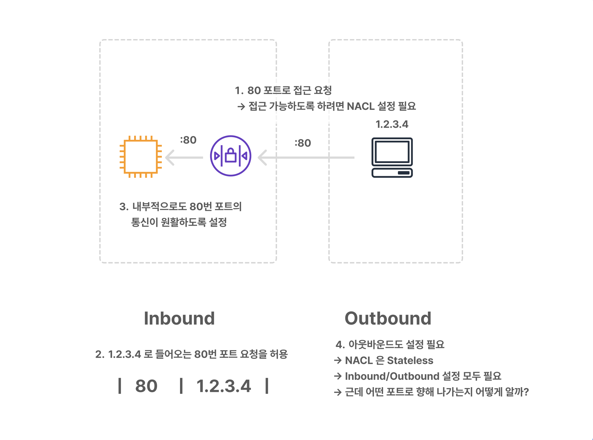
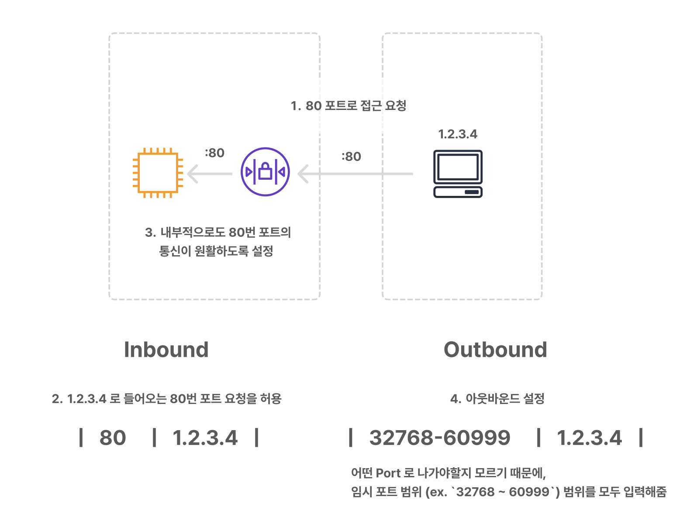

# VPC Firewall - Network Access Control List

## Network Access Control List (NACL)

1. Subnet 레벨: 서브넷 하위 인스턴스 모두에 영향
2. **Stateless**: 명시적으로 Outbound 트래픽을 열어줘야 함
3. Allow 와 Deny 규칙을 모두 포함
   - IP를 특정해서 막을 수 있음
4. 규칙 적용은 규칙의 번호(`#Rule`)에 따라 순서대로 적용됨 (1 to 32766)
5. Default NACL은 모든 inbound 와 outbound traffic 을 허용
6. NACL은 서브넷 레벨에서 특정 IP를 막는데 아주 적합

 

**Example. Network ACL inbound rules**

| #Rule  | Type         | Protocol  | Port  | Source            | Allow/Deny  |
|--------|--------------|-----------|-------|-------------------|-------------|
| 100    | ALL Traffic  | ALL       | ALL   | 180.151.138.43/32 | **DENY**    |
| 101    | HTTPS        | TCP       | 443   | 0.0.0.0/0         | **ALLOW**   |
| *      | ALL Traffic  | ALL       | ALL   |  0.0.0.0/0        | **DENY**    |

 

### 1. Subnet 레벨

즉, 서브넷 하위 인스턴스 모두에 영향

- **Security Group**은 **EC2 레벨**
- **Network ACL**은 VPC에 위치한 **Subnet 레벨**

 

### 2. Stateless

: 명시적으로 Outbound 트래픽을 열어줘야 함

#### ✔️ 외부에서 EC2 인스턴스로 트래픽 허용

1. 80 포트로 접근 요청 → 접근 가능하도록 하려면 NACL 설정 필요
2. `1.2.3.4` 로 들어오는 80번 포트 요청을 허용
3. 내부적으로도 80번 포트의 통신이 원활하도록 설정

  

아웃바운드도 설정 필요

→ NACL 은 Stateless 이기 때문에 In/Out 설정 모두 필요

→ **근데 어떤 포트로 향해 나가는지 어떻게 알까?**

  

어떤 Port 로 나가야할지 모르기 때문에, 임시 포트 범위 (ex. `32768 ~ 60999`) 범위를 모두 입력해줌

→ **Statelessness of your network ACL**: 트러블슈팅 시 굉장히 중요함

> Ephemeral port range
> 
> | Range	      | Operating system               |
> |-------------|--------------------------------|
> | 32768–60999 | used by many Linux kernels.    |
> | 32768–65535 | used by Solaris OS and AIX OS. |
> | 1024–65535  | RFC 6056                       |
> | ...         | ...                            |
> 
> [🔗 Wikipedia - Ephemeral Port](https://en.wikipedia.org/wiki/Ephemeral_port)

 

### 3. Allow 와 Deny 규칙을 모두 포함

NACL은 특정 IP를 명시해서 해당 IP를 막을 수 있음

vs. Security Group: Security Group 는 단순히 규칙을 추가해서 주어진 경로를 막을 수 있지만 IP를 막을 순 없음

가령, Client A, B, C 가 있을 때 A만 막기 위해 A의 IP를 Deny 로 설정하면 됨

 

### 4. 규칙 적용은 규칙 번호(Rule Number)에 따라 순서대로 적용됨 (1 to 32766)

유효한 규칙이 있다면 순서 상 가장 먼저 있는 규칙으로 평가하고 이후 평가 하지 않음

**Example. Network ACL inbound rules**

| #Rule  | Type         | Protocol  | Port  | Source            | Allow/Deny  |
|--------|--------------|-----------|-------|-------------------|-------------|
| 100    | ALL Traffic  | ALL       | ALL   | 180.151.138.43/32 | **DENY**    |
| 101    | HTTPS        | TCP       | 443   | 0.0.0.0/0         | **ALLOW**   |
| *      | ALL Traffic  | ALL       | ALL   | 0.0.0.0/0         | **DENY**    |

가령 위 규칙을 보면, `180.151.138.43` 라는 규칙은 첫 번째 규칙에 의해 `DENY` 됨

두, 세 번째에도 IP가 매칭되지만 이미 첫 번째 규칙이 적용되어서 영향을 주지 않음 ⭐️⭐️⭐️

 

**보통 규칙 번호를 10 이나 100 단위로 지정하는 걸 권장**

→ 각 규칙 사이에 충분한 버퍼를 유지해야 추후 규칙을 추가할 때, 기존 규칙 사이에 배정할 수 있기 때문

단 `1 ~ 32766` 이라는 숫자 제한이 있기 때문에 너무 큰 단위는 안됨

 

### 5. Default NACL은 모든 inbound 와 outbound traffic 을 허용

NACL 의 기본 동작은 **Allow All** 

**vs. Security Group**: Security Group 의 inbound 규칙은 모두 거부

 

### 6. NACL은 서브넷 레벨에서 특정 IP를 막는데 아주 적합

가령, 9.9.9.9 IP가 EC2 인스턴스에 접근하는 것을 막으려고 할 때, 보안 그룹으로는 IP를 특정 지어서 제한할 수 없지만

**NACL은 특정 IP를 지정해서 Deny 시킬 수 있음**

 

## Network ACLs vs Security Groups

  

https://docs.aws.amazon.com/vpc/latest/userguide/VPC_Security.html#VPC_Security_Comparison