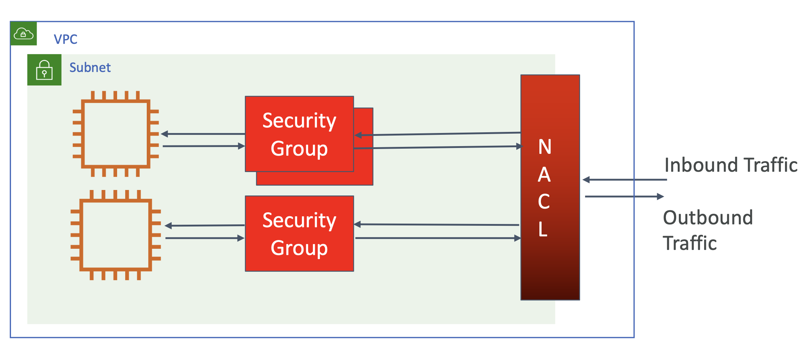
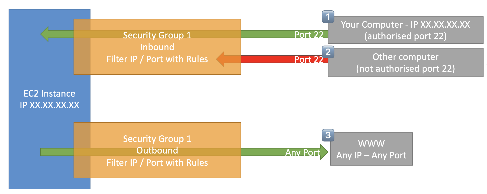
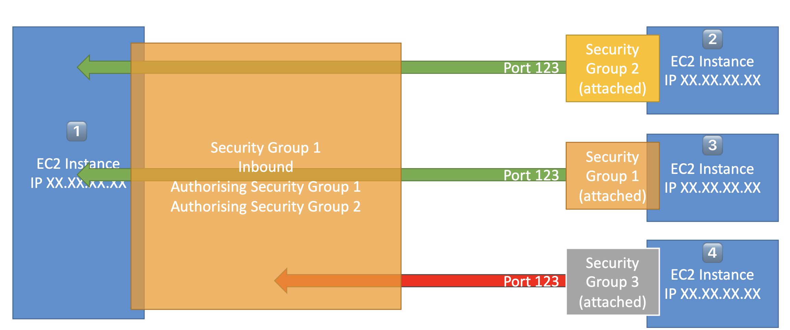

# VPC Firewall - Security Group

## Firewalls inside VPC

서로 다른 EC2 인스턴스가 서로 통신하려면 어떤 네트워크 설정을 해야할까?

즉, 하나의 머신에서 다른 머신으로 트래픽이 흐를 수 있도록 보장하면 됨

그중, 이번엔 방화벽(Firewall)에 대해 다룸

두 인스턴스가 통신하도록 하는 건,
한 도시에서 다른 도시로 고속도로를 뚫는 것과 다를 바 없으며,
방화벽은 그 고속도로에 설피된 톨게이트임

VPC 에서는 두 종류의 방화벽이 존재

- Security Groups → EC2 인스턴스와 밀접한 관련
- Network ACL (Network Access Control List) → 서브넷과 밀접한 관련

정리해보면,

- EC2 인스턴스로 **들어오는** 트래픽
  - : Outside of VPC → NACL → Security Group → EC2
- EC2 인스턴스에서 **나가는** 트래픽
  - : EC2 → Security Group → NACL → Outside of VPC

<br><br>

<br>

### Security Groups (보안 그룹)

> **Goal**
> - 보안 그룹이 어떻게 동작하는지 반드시 이해해야함

- AWS의 네트워크 보안의 기초 지식이자 네트워킹 이슈 트러블슈팅을 위해 알아야 하는 기초 지식임
- 보안 그룹은 일반적으로 EC2 인스턴스의 특정 포트(Port)에 접근하는 걸 막음

그렇다면 보안 그룹은 어떻게 EC2 인스턴스에 인입/인출되는 것을 컨트롤할까?

<small><i>How to use them to allow, inbound and outbound ports?</i></small>

<br>

### Security Groups - Diagram

#### Inbound Rule

- EC2 인스턴스의 <u>1️⃣ 특정 포트에 연결된 특정 IP 주소를 허용하면, 해당 트래픽은 접근 허용됨</u>
  - 가령, 22번 포트 트래픽이 있다고 하면 EC2 인스턴스로 접근 가능 
- 반면 <u>2️⃣ 특정 포트에 인증되지 않은 트래픽이 인입된다면 거부당함</u>
- 반대로 EC2 인스턴스에서 인터넷으로 나가고자 할 때, <u>3️⃣ 해당 트래픽이 아웃바운드 룰에 허용된 상태일 때 인터넷에 접근을 할 수 있음</u>

<br><br>

보안 그룹은 반드시 포트 접근을 규제해야함

EC2 인스턴스에서는 각종 소프트에어가 실행될텐데, 운영을 위해선 이 소프트웨어에  접근하도록 설정해야 할 것임

해당 소프트웨어는 특정 포트 ⎯ 80 혹은 433 포트 ⎯ 에 연결되어 있을 것이고, 이를 보안 그룹 규칙에 추가

#### 특징1. **Regulation** 

- Access to Ports
- Authorised IP ranges – IPv4 and IPv6
- Control of inbound network (from other to the instance)
- Control of outbound network (from the instance to other)

<br>

#### 특징2. Security Groups are Stateful (상태를 가짐) ⭐️⭐️⭐️

Stateful 하다는 의미 이해하기

> ✨ 시험 TIP
>
> Security Group의 Stateful 특성은 NACL 과 비교해서 시험에 잘나옴

만약 당신의 IP가 1.2.3.4 이고 당신의 EC2 인스턴스에 접근하고 싶다면,

보안 그룹 Inbound Rule 에 `HTTP`, `80`, `1.2.3.4` 와 같은 정보를 입력하면 접근이 가능해짐

>    🖥️  ←⎯ Allowed ⎯⎯   👩🏻‍💻
> 
>  **Inbound**
> 
>  | Type | Port Range | Source    |
> |------|------------|-----------|
> | HTTP | `80`       | `1.2.3.4` |
> 
> 
>    🖥️  ⎯⎯ Allowed ⎯→   👩🏻‍💻  ⬅ **Stateful**
> 
>  Even if Outbound Rule doesn't have anything.


위 경우, Outbound Rule 을 적지 않아도 트래픽이 해당 경로로 인입되었기 때문에 기본적으로 출입이 허용됨

반대로, EC2 인스턴스에서 인터넷으로 나가는 경우에도 응답 트래픽을 리턴 받기 위한 인바운드 규칙을 가질 필요가 없음.

인바운드 규칙이 아무것도 없어도 인입 가능.

>    🖥️  ⎯⎯ Allowed ⎯→   👩🏻‍💻
> 
>    Then,
>    🖥️  ←⎯ Allowed ⎯⎯   👩🏻‍💻  ⬅ **Stateful**
>
>  Even if Inbound Rule doesn't have anything.


<br>

#### 특징3. Referencing other security groups - Diagram

다른 보안 그룹에 하나의 자원으로써 참조할 수 있음

<br><br>

##### 3.1. Security Group1 ← Security Group2

위 그림의 2️⃣번 EC2 인스턴스가 1️⃣번 EC2 인스턴스에 접근하고자 할 때, 

`Security Group 1` 에 2️⃣번 EC2 인스턴스의 IP 가 아닌 `Security Group 2` 를 등록할 수 있음 

이는, `Security Group 2`에 IP를 추가할 때 `Security Group 1`에 추가해야하는 번거로움을 줄여주고 해당 인입 규칙의 책임을 `Security Group 2`에 부여

```
 +--Web--+  SG 1      SG 2  +--App--+
 |   🖥️  |   ||        ||   |   🖥️  |
 |   🖥️  |   ||  ←---  ||   |   🖥️  |
 |   🖥️  |   ||        ||   |   🖥️  |
 +-------+   ||        ||   +-------+
```

SG1에 SG2 접근 허용 설정을 해둔다면,  
App 에 새로운 인스턴스가 추가되어도 항상 SG2는 SG1에 접근할 수 있음

<br>

##### 3.2. Security Group1 ← Security Group1

동일한 보안 그룹에서 접근하면 항상 허용

<br>

##### 3.3. Security Group1 ← Security Group3

그 이외의 보안 그룹에서 접근하면 접근 거부

<br>

### Security Groups - Good to know

- 보안 그룹은 여러 개의 인스턴스에 붙을 수 있음
- 보안 그룹은 Region/VPC 조합에 고립(lock down)시킬 수 있음
  - VPC 레벨이라는 의미
- EC2 인스턴스 밖에 위치 ⎯ 트래픽이 거부되면 EC2 인스턴스는 해당 트래픽을 알 수 없음
- 응용 프로그램이 접근 가능하지 않으면 타임아웃 오류가 발생
  - 앱이 **타임아웃**으로 접근 불가한 상태라면, 그건 보안 그룹 문제임
  - 앱이 "Connection Refused" 오류 상태라면, 앱의 오류이거나 아직 실행이 되지 않은 것 (앱 문제, 보안 그룹 문제 X)

- **Inbound 규칙**은 기본적으로 모두 **Block**

>  | Type  | Protocol     | Port Range  | Destination | 
> |-------|--------------|-------------|-------------|
> |       |              |             |             |

- **Outbound 규칙**은 기본적으로 모두 **Authorized** 

>  | Type         | Protocol    | Port Range | Destination | 
> |--------------|-------------|------------|-------------|
> | All Traffic  | All         | All        | 0.0.0.0/0   |


