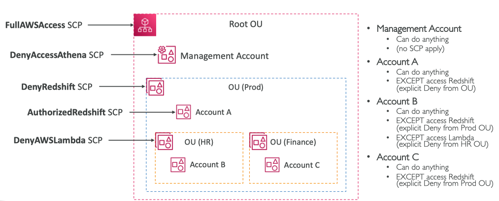

# AWS Organizations

- 글로벌 서비스
- 다수의 AWS 계정을 동시에 관리
- 조직 생성 시, 메인 계정이 관리 계정이 됨
- 멤버 계정: 조직에 가입한 기타 계정 or 조직에서 생성한 계정, 한 조직에만 소속
- 모든 계정의 비용을 통합 결제: 관리 계정에 조직 전체의 비용을 지불할 수 있으며, 집계된 사용량에 기반한 비용 할인을 받을 수 있음
- 계정 간 **예약 인스턴스, Savings Plans 할인 공유**
  - 어떤 계정에서 사용하지 않는 예약 인스턴스를 다른 계정이 해당 인스턴스를 사용할 수 있음
- 자동 계정 생성 API: 계정 쉽게 생성 가능


### Organization Unit
*OU, 조직 단위*

- 루트: 전체 계정 중 가장 외곽 OU, 관리 계정을 포함, 서브 OU를 생성 가능
  - 가령, 개발 계정 OU와 프로덕션 계정 OU을 생성하고 멤버 계정을 생성할 수 있음

### Benefit
- 보안 우수 (단일 게정의 여러 VPC보다 독립적)
- 청구 목적의 태그 기준 적용 가능
- 모든 계정의 CloudTrail을 활성화 -> 모든 로그를 중앙 S3 계정으로 전송할 수 있음
- CloudWatch Logs를 중앙 로깅 계정으로 전송 가능
- 관리 계정에서 모든 멤버 계정 관리

보안 관리에서도 큰 장점
### Security Control Policies
- SCP, 서비스 제어 정책
- 특정 OU 또는 계정에 적용되는 IAM 정책: 사용자와 역할 제한
- 관리 계정(관리자 권한)에는 적용 X
- 기본적으로 모두 허용하지 않고 구체적인 허용 항목을 설정해야 함 (IAM처럼)

### SCP Hierarchy


**SCP Examples Blocklist and Allowlist strategies**
```json
{
    "Version": "2012-10-17",
    "Statement": [
        {
            "Sid": "AllowsAllActions",
            "Effect": "Allow",
            "Action": "*",
            "Resource": "*"
        },
        {
            "Sid": "DenyDynamoDB", 
            "Effect": "Deny",
            "Action": "dynamodb:*",
            "Resource": "*"
        }
    ]
}
```


## Advanced IAM

<table>
<tr>
<td>
<b>aws:SourceIP</b>
<pre><code lang="json">
{
  "Version": "2012-10-17",
  "Statement": {
    "Effect": "Deny",
    "Action": "iam:*",
    "Resource": "*",
    "Condition": {
        "NotIpAddress": {
            "IpAddress": {
                "aws:SourceIp": ["192.0.2.0/24", "203.0.113.0/24"]
            }
        }
    }
  }
}
</code></pre>
클라이언트 IP 제한: 두 CIDR에 포함되지 않는 IP 주소는 모든 작업과 리소스를 거부(Deny)
</td>
<td>
<b>aws:RequestedRegion</b>
<pre><code lang="json">
{
  "Version": "2012-10-17",
  "Statement": {
    "Effect": "Deny",
    "Action": ["ec2:*", "rds:*", "dynamodb:*"],
    "Resource": "*",
    "Condition": {
        "StringEquals": {
            "aws:RequestedRegion": ["eu-central-1", "eu-west-1"]
        }
    }
  }
}
</code></pre>
API 호출 리전을 제한: 특정 리전에서 특정 서비스에 대한 액세스를 거부

-> `eu-central-1`와 `eu-west-1` 리전에서 오는 EC2, RDS, DynamoDB 호출을 제한

</td>
</tr>
<tr>
<td>
<b>ec2:ResourceTag</b>
<pre><code lang="json">
{
  "Version": "2012-10-17",
  "Statement": {
    "Effect": "Allow",
    "Action": ["ec2:startInstances", "ec2:StopInstances"],
    "Resource": ["arn:aws:ec2:us-east-1:111122223333:instance/*"],
    "Condition": {
        "StringEquals": {
            "ec2:ResourceTag": "DataAnalytics",
            "aws:PrincipalTag/Department": "Data",
        }
    }
  }
}
</code></pre>
</td>
<td>
<b>ec2:ResourceTag</b>
<pre><code lang="json">
{
  "Version": "2012-10-17",
  "Statement": {
    "Effect": "Allow",
    "Action": ["ec2:startInstances", "ec2:StopInstances"],
    "Resource": ["arn:aws:ec2:us-east-1:111122223333:instance/*"],
    "Condition": {
        "StringEquals": {
            "ec2:ResourceTag": "DataAnalytics",
            "aws:PrincipalTag/Department": "Data",
        }
    }
  }
}
</code></pre>
1. EC2 인스턴스의 태그가 Project가 DataAnalytics

2\. 사용자의 Department가 Data일 때 

모든 인스턴스의 시작과 종료를 허용
</td>
</tr>
<tr>
<td>
<b>aws:MultiFactorAuthPresent</b>
<pre><code lang="json">
{
  "Version": "2012-10-17",
  "Statement": {
    "Effect": "Allow",
    "Action": "ec2:*",
    "Resource": *
  },
  "Statement": {
    "Effect": "Deny",
    "Action": ["ec2:StopInstances", "ec2:TerminateInstances"],
    "Resource": *
    "Condition": {
        "BoolIfExists": {
            "aws:MultiFactorAuthPresent": false
        }
    }
  }
}
</code></pre>
멀티팩터 인증을 강제: 사용자는 EC2에서 모든 작업을 할 수 있지만 멀티팩터 인증 필수

-> MFA가 false(거짓)일 때 거부
</td>
</tr>
<table>


### S3 버킷에 대한 IAM 정책

```json
{
   "Version":"2012-10-17",
   "Statement":[
      {
         "Effect":"Allow",
         "Action": ["s3:ListBucket"],
         "Resource":"arn:aws:s3:::DOC-EXAMPLE-BUCKET1"
      },
      {
         "Effect":"Allow",
         "Action":[
            "s3:PutObject",
            "s3:GetObject",
            "s3:DeleteObject"
         ],
         "Resource":"arn:aws:s3:::DOC-EXAMPLE-BUCKET1/*"
      }
   ]
}
```

1. 목록 버킷: 버킷 수준의 권한이므로 버킷을 특정해야 함
   - `s3:::DOC-EXAMPLE-BUCKET1` ARN에 적용

2. *Object는 버킷 내의 **객체**에 적용되므로 ARN이 달라짐 ⭐️
   - 버킷 내의 모든 객체를 나타내는 <b>`/*`</b> 추가


### Resource Policies & aws:PrincipalOrgID ⭐️

- **AWS 조직의 멤버 계정**에만 **리소스 정책이 적용**되도록 제한

```json
{
    "Version": "2012-10-17",
    "Statement": [
        {
            "Effect": "Allow",
            "Action": ["s3:PutObject", "s3:GetObject"],
            "Resource": "arn:aws:s3:::2018-Financial-Data/*",
            "Condition": {
                "StringEquals": {
                    "aws:PrincipalOrgID": [ 
                        "o-yyyyyyyyyy" 
                    ]
                }
            }
        }
    ]
}
```

- **PrincipleOrgID의 계정에서 API 호출이 생성된 경우**에만 PutObject, GetObject 작업 수행 가능
- 조직 내의 멤버 계정만 S3 버킷에 액세스 & 조직 외부의 사용자는 거부


---

Condition keys: AWS provides condition keys that you can query to provide more granular control over certain actions.
The following condition keys are especially useful with 
> 특정 작업에 대해 세밀한 제어를 제공하기 위해 쿼리할 수 있는 조건 키를 제공. 다음 조건 키는 AWS 조직에서 특히 유용합니다:


`aws:PrincipalOrgID` – Simplifies specifying the Principal element in a resource-based policy. This global key provides an alternative to listing all the account IDs for all AWS accounts in an organization. Instead of listing all of the accounts that are members of an organization, you can specify the organization ID in the Condition element.

> 리소스 기반 정책에서 기본 요소를 지정하는 작업을 단순화. PrincipalOrgID 키를 사용하면 organization의 모든 AWS 계정의 모든 계정 ID를 나열할 수 있음. 조직의 구성원인 모든 계정을 나열하는 대신 조건 요소에서 조직 ID를 지정할 수 있습니다.

`aws:PrincipalOrgPaths` – Use this condition key to match members of a specific organization root, an OU, or its children. The aws:PrincipalOrgPaths condition key returns true when the principal (root user, IAM user, or role) making the request is in the specified organization path. A path is a text representation of the structure of an AWS Organizations entity.

> 특정 조직 루트, OU 또는 해당 하위 구성원과 일치시킴. 요청을 만드는 주체(루트 사용자, IAM 사용자 또는 역할)가 지정된 조직 경로에 있으면 PrincipalOgPaths 조건 키가 true를 반환. path는 AWS 조직 엔터티의 구조를 텍스트로 표현.