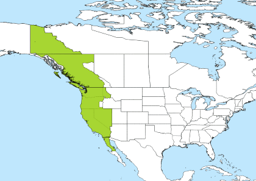

# TIMEZONE

[PST to UTC Converter](https://savvytime.com/converter/pst-to-utc)

### **UTC**

*Universial Time Cordinated*, *협정세계시*

GMT와 동일하게 봐도 무방

GMT와 UTC 사이의 시차는 없고, UTC가 오차가 더 적다. 

**오차가 적은 이유?** 

과학적인 연구로 인해 19세기 중반에 태양시를 기준으로 1초의 길이가 정해진 뒤에 지구의 자전속도가 느려진다는 사실이 밝혀졌고, 1958년에 평균태양시와 같은 원점에서 출발하는 국제원자시가 제정되었다. 국제원자시와 세계시의 차이가 점점 벌어져서 국제원자시나 세계시 대신에 윤초를 삽입하여 세계시와 차이를 맞춘 시간을 세계의 표준 시각으로 사용하기로 결정했다.

즉, 지구와 자전 주기가 일정하지 않아서, 0.9초의 차이가 생길 때 협정 세계시에서는 하루의 마지막 1분을 59초나 61초로 하여 차이를 수정하며, 이때 수정되는 초를 윤초라고 한다.

**GMT(Greenwich Mean Time, 그리니치 평균시)**

영국 그리니치 천문대 위치를 중심으로 표준시를 정함

### **KST**

*Korea Standard Time, 한국표준시, UTC+09:00*

런던을 기준으로 경선을 1도 마다 나누었을 때 360개의 경선이 생기는데, 

15도 마다 1시간씩 차이가 남 (`24h * 15° = 360°`,  `360° / 24h = 15°`)

그리니치 천문대를 기준으로 동쪽으로 시간이 빠르고(동경 +), 서쪽(서경 -)은 시간이 느리다.

우리나라는 런던을 기준으로 +124° ~ 132°도에 속하는데 동경 135°에 속하기 때문에 (135° / 15° = 9h) 9시간을 추가하면 된다.

- **참고**
    
    대한민국의 표준시는 시대마다 조금씩 다르기 때문에 입력된 시간에 따라서 각각 다른 시간대를 표시한다. [위키피디아의 한국 표준시](https://ko.wikipedia.org/wiki/%ED%95%9C%EA%B5%AD_%ED%91%9C%EC%A4%80%EC%8B%9C) 설명을 참고해보면 한국 표준시의 역사는 다음과 같다.(구체적인 역사 이야기는 자료를 참고해보시길)
    
    - ~ 1908-03-31 : UTC+08:28
    - 1908-04-01 ~ 1911-12-31 : UTC+08:30
    - 1912-01-01 ~ 1954-03-20 : UTC+09:00
    - 1954-03-21 ~ 1961-08-09 : UTC+08:30
    - 1961-08-10 ~ : UTC+09:00
    
    ```java
    new Date('2020-04-05') // Sun Apr 05 2020 09:00:00 GMT+0900 (대한민국 표준시)
    new Date('1954-03-21') // Sun Mar 21 1954 08:30:00 GMT+0830 (대한민국 표준시)
    new Date('1908-03-31') // Tue Mar 31 1908 08:27:52 GMT+0827 (대한민국 표준시)
    ```
    

### PST/PDT/EST/EDT

**PT VS ET**

미국의 경우, 지륙이 크기 때문에 기본적으로 여러 개의 시간대로 나누고 있지만, 서부와 동부만 말하자면 PT(Pacific Time)과 ET(Eastern Time)으로 달리 표기합니다. 



**PT** (Pacific Time)


**ET** (Eastern Time)

**ST VS DT** 

일광절약시간제(Daylight Saving Time)인지 아닌지(Standard Time)에 따라 달라진다.

**일광절약시간**

영국에서는 summer time이라고 부른다.

낮 시간이 길어지는 여름(3월 ~ 11월)에 표준시를 1시간 앞당기는 제도.

낮 시간이 길어지면서 사람들이 효율적인 활동을 할 수 있고, 에너지를 절약할 수 있다는 점에서 많은 나라에서 시행하고 있지만, 서머타임이 효과가 없다는 의견이 제시되고 있어 폐지에 대한 논의가 꾸준히 이루어지고 있다. 

 

|  | PT 
Pacific Time, LA, San Francisco ... | ET
Eastern Time, New York, Boston ... |
| --- | --- | --- |
| ST 
Standard Time | PST 
Pacific Standard Time, 태평양 표준시
UTC-08:00 | EST
Eastern Standard Time, 동부 표준시
UTC-05:00 |
| DT
Daylight Saving Time | PDT
Pacific Daylight Time, 태평양 여름시
UTC-07:00 | EDT
Eastern Daylight Time, 동부 여름시
UTC-04:00 |