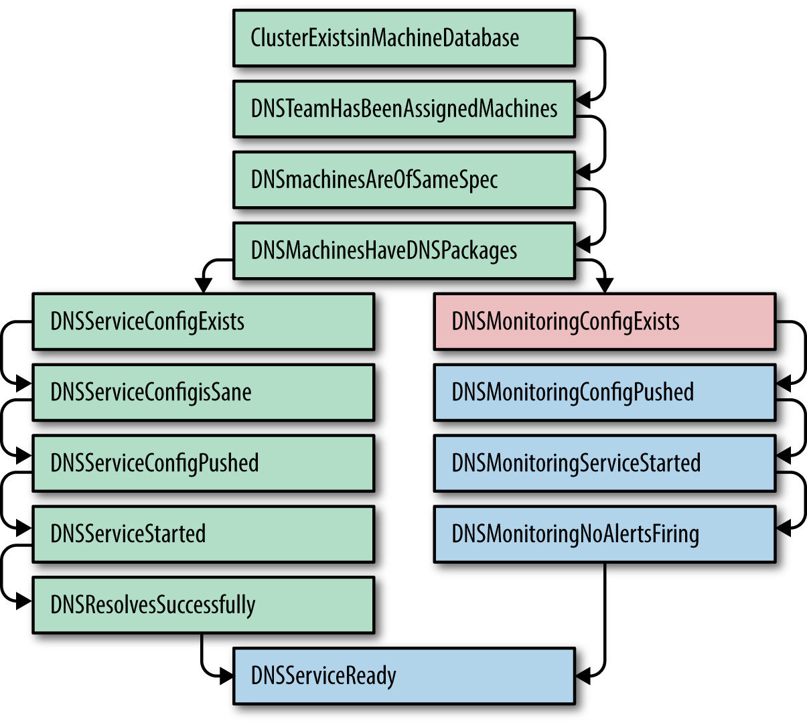

# CHAPTER 07. The Evolution of Automation at Google

<i>구글의 발전된 자동화</i>

- 직접 수행 < 소프트웨어 기반의 자동화 < 고수준의 시스템: 자율(autonomous) 시스템 디자인하는 것

 

## 자동화의 가치

자동화의 진정한 가치란?

자동화는 다음 다섯 가지를 제공: 

 

#### ✔️ Consistency: 일관성

\: **정확히 정의된 업무 범위 + 정해진 절차 수행** → 다양한 측면에서 자동화가 최우선적으로 추구하는 가치

- 예상치 못한 **불규칙한 방식**은 실수와 간과로 인해 데이터 품질 문제를 유발 → **결국 신뢰성 문제로 발전**

 

#### ✔️ A Platform: 플랫폼

\: 올바르게 디자인되고 구현된 자동 시스템은 여러 이점을 가진 플랫폼 제공

- **여러 이점을 가진 플랫폼**: 확장 가능하고, 다른 시스템에도 적용할 수 있거나, 심지어 이윤을 창출할 수 있음
- 실수를 중앙 집중화하는 데 도움
- **재발 방지**: 자동화된 코드에서 수정된 버그는 한 번 수정되면 다시 발생하지 않음

 

#### ✔️ Faster Repairs: 더 신속한 수리

\: 시스템의 일반적인 장애를 해결하는 데 사용됩니다.

- **평균 고장 후 수리 시간(MTTR) 절감**
  - 자동화 시스템이 정기적으로 성공적이게 실행된다면, 통상적인 장애에 대한 평균 고장 후 수리 시간(Mean Time to Repair, MTTR)의 절감 가능

 

#### ✔️ Faster Action: 더 신속한 조치

\: SRE의 자동화 시스템이 주로 배포되는 인프라스트럭처 환경에서는 사람이 기계만큼 빠르게 대응하는 것은 대체로 불가능

- 예: 가장 단적인 예로 장애 복구 혹은 트래픽 전환

 

#### ✔️ Time Saving: 시간 절감

\: 적절하게 자동화를 활용할 수 있다면 시간의 절감 효과를 누릴 수 있음

- 수동으로 실행되어야 할 작업이 필요하지 않도록 하기 위한 노력 대비 자동화 코드를 작성하는 데 드는 노력을 비교할 때 어려움을 느낄 수 있음
  - 그래서 **적절하게** 자동화를 활용해야하는 이유
- 작업을 수행하는 사람과 실질적인 작업을 분리하는 것은 매우 강력한 효과를 발휘

 

## 구글 SRE의 가치

- 전 세계를 대상으로 스케일링이 가능해야 함
  - 진정한 대규모 서비스 자동화에 대해 논의할 때, 일관성, 신속성, 그리고 신뢰성 (consistency, quickness, reliability)에 대한 요소들이 주요 논쟁거리
  - 자동화에 대한 주요 논쟁 중 하나는 **복잡하면서도 놀랍도록 동일한 프로덕션 환경**

- 심지어 단기적으로 특정 작업을 위해 소프트웨어를 구매하는 것이 더 저렴하더라도, 우리는 직접 솔루션을 작성
  - 더 큰 장기적인 이점을 가져오기 때문
- 시스템 관리의 자동화를 위한 장애물을 극복하기 위해 많은 시간을 투자하고, 그 자동화 시스템을 적극적으로 개발

- 플랫폼 기반의 접근법을 관리 용이성(manageability)과 확장성(scalability) 측면에서 반드시 필요한 것으로 봄

 

## 자동화의 사례

자동화(automation)는 주로 다양한 범주의 문제를 해결하기 위해 코드를 작성하는 것을 의미함

자동화의 목적이나 솔루션은 서로 다른 형태로 존재

→ **메타 소프트웨어** (소프트웨어 상에서 동작하는 소프트웨어)

- 사용자 계정 생성
- 서비스를 위한 클러스터 턴업(turn up)이나 턴다운(turn down)
- 소프트웨어 혹은 하드웨어 설치 준비 및 해제
- 새로운 버전의 소프트웨어 출시(rollout)
- 런타임 설정 변경
- 특별한 경우의 런타임 설정 변경: 예를 들면 의존성 개체 변경 등

 

### 구글 SRE의 자동화 사례

구글 SRE에게 자동화란 데이터가 아니라, 서비스를 새로운 클러스터에 배포하는 것처럼 시스템의 생명 주기를 관리하는 데 초점이 맞춰져 있음

자동화를 위한 컴포넌트는 추상화 수준이 서로 다름

1. **낮은 추상화**: 고수준 추상화.
  - 예시: 펄(Perl)
  - 특징: POSIX 수준의 행동 유사성을 제공하는 범용 언어들은 이론적으로 시스템이 접근할 수 있는 API를 통해 거의 제약 없는 자동화가 가능합니다.
  - 구글 프로덕션 환경의 높은 복잡도로 인해 경우에 따라 사태를 즉시 추적하고 파악하기에 더 적합한 경우가 있습니다.

2. **높은 추상화**: 저수준 추상화. 서비스나 좀 더 높은 수준의 엔티티들에 대한 조작을 통해 한 단계 높은 추상화를 제공합니다.
  - 예시: 퍼펫(Puppet), 셰프(Chef)
  - 장점: 관리하고 추론하기가 더 쉽습니다.
  - 단점: 시스템적으로, 반복적으로, 그리고 잠재적 불일치로 인한 실패가 발생할 수 있는 '추상화의 누수' (leaky abstraction)를 경험할 수도 있습니다.

 

### 자동화 클래스의 계층 구조

이상적인 경우라면 자동화를 위한 별도의 시스템으로 구현할 필요는 없습니다.

시스템을 구축할 때는 외부의 다른 시스템과 통합하기 위한 로직은 배제하는 편이 더 낫습니다. (애초에 자동화 시스템 자체가 외부 시스템과의 통합 로직이 필요하지 않도록 고안되었기 때문입니다.)

 

**자동화 혁신의 단계**

1. **자동화를 하지 않는 단계**  
   
- 마스터 데이터베이스에 대한 장애 대응을 각 지역별로 수동으로 진행

2. **별도로 관리되며 시스템에 특화된 자동화를 수행하는 단계**  

- SRE가 홈 디렉토리에서 장애 대응 스크립트를 실행

3. **별도로 관리되는 범용 자동화를 수행하는 단계**  

- SRE가 데이터베이스 장애 대응을 모두가 사용할 수 있는 '범용 장애 대응' 스크립트에 추가하여 실행

4. **내재화되었지만 시스템에 특화된 자동화를 수행하는 단계**  

- 데이터베이스에 자체적으로 내장된 장애 대응 스크립트를 실행

5. **자동화가 불필요한 시스템을 도입하는 단계**  

- 데이터베이스가 문제를 보고하고 사람의 개입 없이 자동으로 장애 대응을 수행

 

### Instance 1. 스스로를 이롭게 하라: 몽땅 자동화하자!

_SRE들이 너무 부지런해서 장기적인 관점에서 진행했던 업무를 어떻게 관리했는지에 대한 이야기_

구글의 클러스터 스케줄링 시스템인 보그에 MySQL을 마이그레이션.

#### 목표
- 자동으로 새로운 작업을 설정하거나 문제가 발생한 작업을 재시작하여 주장비와 복제 장비에 대한 관리 부담 제거.
- 보그의 컨테이너 관리 기능을 통해 머신의 리소스를 더욱 효율적으로 활용하여 동일한 물리적 머신에 여러 개의 MySQL 인스턴스를 바이너리 단위로 패키징 가능.

#### 문제점

- 보그의 주요 운영 특성 중 하나는 설정된 작업이 자동으로 옮겨 다닌다는 점.
- 보그에 설정된 작업들은 일주일에 최소한 한두 번 이동.
- 이 정도의 빈도로 데이터베이스의 복제 인스턴스에는 큰 영향이 없지만, **마스터 인스턴스에는 있어서는 안 되는 일**.
- 마스터 장애 대응 프로세스는 인스턴스당 30분에서 90분 소요.
- 장애 대응 시 발생하는 다운타임은 30초 이내여야 하는 에러 예산. → 수동 장애 대응이 30초 이내에 완료되도록 할 방법 없음.
  - 장애 대응 **자동화** 필요.

#### 해결

구글 애드 담당 SRE들은 "**디사이더(Decider)**"라는 이름의 자동 장애 대응 데몬 개발.

사전에 계획된 장애는 물론 계획되지 않은 장애의 약 95%를 30초 이내에 처리 가능.

자동화를 통한 신속한 복구에 최적화된 인프라스트럭처 구성. 모든 애플리케이션에 지금까지보다 더 튼튼한 장애 처리 로직 추가 필요.

 

### Instance 2. 신의 한 수: 클러스터 턴업의 자동화

실제로 서비스를 사용자에게 제공할 준비가 되었는지 판단하기 위해 필요한 몇 가지 중요한 요소를 제대로 해석하지 못했음

예를 들면:

- 서비스가 의존하는 요소들이 모두 사용 가능하며 올바르게 설정되었는가?
- 모든 설정과 패키지가 다른 배포들과 일관되게 구성되어 배포되었는가?
- 모든 예외적인 설정에 대해 해당 팀의 확인을 받았는가?

#### 해결책

**`Prodtest`** (Production Test의 줄임말)

  

: 파이썬의 단위 테스트 프레임워크를 확장하여 실제 운영 중인 서비스에 대한 단위 테스트가 가능하도록 하고, 클러스터 내에서 해당 팀의 서비스가 제대로 동작하는지 확인하는 데 사용.

#### 효과

엔지니어는 서비스가 모든 클러스터에서 올바르게 설정되었는지, 그리고 그렇지 않은 경우 어디가 잘못되었는지를 신속하게 확인할 수 있음.

 

### 멱등성을 이용한 모순의 해결

Mission: "One Week Turnup" - 단 일주일의 배포 기간.

'잘못된 설정을 찾기 위한 파이썬 단위 테스트'를 '**잘못된 설정을 수정하는 파이썬 코드**'로 개선하면 이런 문제들을 해결할 수 있지 않을까?

각각의 테스트와 해당 테스트가 실패하는 원인을 수정하는 코드를 짝지음

 

<small>DNS 서비스를 위한 Prodtest 구성. 어느 한 테스트가 실패하면 그에 대한 픽스가 실행됨.</small>
 

> `TestDNSMonitoringConfigExists` 테스트가 실패하면 데이터베이스로부터 설정을 가져와 버전 제어 시스템에서 기본 설정 파일을 검사하는 `FixONMonitoringCreateConfig` 단계가 실행될 수 있음. 
> 
> 그런 다음 `TestONSMonitoringConfigExists` 테스트가 성공하게 되면 `TestoNSMonitoringConfigPushed` 테스트가 실행됨. 
> 
> 만일 이 테스트가 실패하면 `FixDnsMonitoringPushConfig` 단계가 실행됨.

=> 버그 픽스가 멱등성을 염두에 두고 작성되었다면 필요한 모든 의존성에 부합하며,
쉽고 안전하게 문제를 해결할 것을 기대할 수 있었음

**하지만, 위 방법의 심각한 결점**

- 테스트와 수정 사이의 지연(latency) 문제
- 두 번째 테스트는 제대로 동작하다가 말다 하는 불안정한 테스트가 되기 일쑤
- 모든 버그 픽스들이 본질적으로 멱등성을 확보할 수 없음 ← 불안정한 테스트를 수정하기 위한 픽스 때문에 시스템이 오히려 모순된 상태에 놓이게 되는 경우도 있었음

 

### 특화된 자동화로의 발전

자동화는 세 가지 관점에 따라 다르게 진행됨.

- **적합성**: 서비스 소유자가 직접 관리하고 실행하는 스크립트. ex. 자동화의 정확성
- **높은 지연 시간**: 서비스 소유자가 자동화 프로세스를 남는 시간에 실행하거나 새로 입사한 엔지니어에게 맡기는 경우
- **높은 연관성**: 서비스 소유자는 실제 세계의 요구사항이 변경되는 시점을 알고 그에 맞춰 자동화 스크립트를 수정할 수 있음.

=> 클러스터 턴업 자동화 완료! 하지만?

**세상은 계속해서 변화한다.**

소프트웨어, 설정, 데이터는 계속해서 바뀌었고 그 결과 시스템에 영향을 주는 변화가 하루에도 수천 가지가 발생함.

 

해결: **조직별 장려 정책**

- **턴업 스크립트의 속도를 높이는 것이 주요 임무인 팀** - 프로덕션 환경에서 서비스를 운영하는 팀의 기술 부채를 해소해야 할 의무가 없음.
- **자동화 스크립트를 실행하지 않는 팀** - 손쉽게 자동화할 수 있는 시스템을 구축해야 할 의무가 없음.
- **제품 관리자** - 자동화 스크립트의 품질이 낮더라도 시스템의 간소화나 자동화보다는 **새로운 기능에 더 높은 우선순위**를 둠.

사실 가장 쓸모 있는 도구는 보통 실제 도구를 사용하는 사람에 의해 만들어짐.
(The most functional tools are usually written by those who use them.)

**클러스터 턴업 자동화 => 높은 자연 시간, 불안정성, 그리고 부적합성의 삼박자를 고루 갖춘, 세상에서 가장 불만족스러운 것.**

 

### 향후 해결: 서비스 지향 클러스터 턴업

턴업 프로세스는 해당 서비스의 소유권을 가진 팀이 담당하는 것이 낫다는 것을 깨달은 후, 클러스터 턴업을 서비스 지향 아키텍처(Service-Oriented Architecture, SOA)와 동일한 시각으로 바라보기 시작.

**턴업 자동화의 진화**

1. 작업자가 수동 작업을 실행 (자동화 없음).
2. 작업자가 시스템에 맞게 작성한 자동화를 실행.
3. 외부에서 관리하는 범용 자동화를 실행.
4. 내부에서 시스템에 맞게 작성한 자동화를 실행.
5. 사람의 개입이 필요하지 않은 자동화된 시스템을 구축.

 

#### Borg (보그): 창고 크기 컴퓨터의 탄생

**초기의 자동화**

- **서비스 관리**: 서비스가 지속적으로 운영되도록 관리함 (예를 들어 세그멘테이션 실패 발생 시 시스템을 재시작하는 등).
- 어떤 머신에서 어떤 서비스가 실행 중인지를 추적함.
- **로그 메시지 파싱**: 각 머신의 SSH 연결 및 정규 표현식을 탐색.

이후, 머신의 상태를 추적하는 적절한 데이터베이스 형태로 변화하고 모니터링 도구와 통합됨.

-> 자동화가 가능해지면서 머신의 생명 주기 중 더 많은 부분을 자동화로 관리할 수 있게 됨.

시스템의 추상화가 물리적인 머신과 너무나도 강력하게 결합되어 그 한계가 명확.

=> 보그 탄생.

클러스터 관리를 API 호출을 위해 중앙의 조정자(coordinator)에게 전달되는 엔티티로 바라보는 생각의 전환.

단일 머신을 사용하는 경우와 클러스터 관리 추상화의 개발 사이에 직접적인 매핑이 가능하다는 점.

 

### 신뢰성은 근본적인 기능이다

운영자들이 제대로 대응하지 못하는 이유는 실전 경험의 부족과 그들이 생각하는 시스템의 동작이 실제 시스템의 동작과 일치하지 않기 때문.

자동화가 수동 작업을 대체하고, 수동 작업은 언제나 그랬듯이 항상 수행이 가능할 것이라는 전제에서 발생한다는 의미.

구글의 경험상, 자동화나 자율적 동작을 필요로 하는 시스템은 계속해서 늘어나고 있다. 규모가 커지는 것도 마찬가지이지만, 규모에 관계없이 스케줄링 없이 시스템에 자율성을 추가하는 것에 대해서는 여전히 논란이 있음. 신뢰성은 근본적인 기능이다. 그러므로 자율적이면서 탄력적으로 구현되었을 때 그 빛을 발함.

 

### 추천 사항

**자동화는 시간을 절약하는 것 이상의 가치를 제공**하므로 단순히 **자동화에 투입하는 시간과 그로 인해 절약되는 시간을 비교하는 것만으로는 판단하지 않았으면 함.**

신속하게 제품을 출시하고 또 개선하는 과정을 반복하다 보면 아직은 탄력적인 시스템을 구현하지 못했을지라도 기능을 더 빠르게 구현할 수 있음.

서브 시스템의 결합도를 낮춘다든가, API를 추가한다거나, 부작용을 최소화하는 것 등은 큰 도움.

