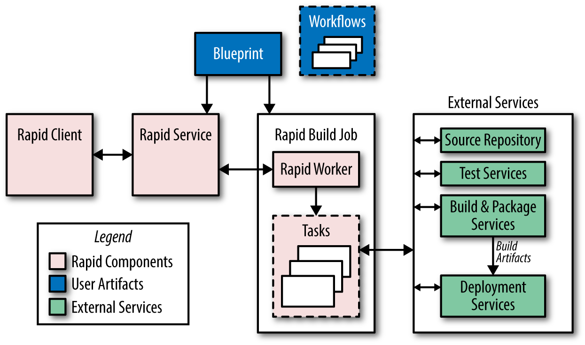

# CHAPTER 08. Release Engineering

<i>릴리즈 엔지니어링</i>

 

- **릴리즈 엔지니어링**
  - 소프트웨어 엔지니어링보다 상대적으로 새로운 개념이며 빠르게 성장하고 있는 분야로, 소프트웨어를 빌드하고 전달하는 과정을 간략하게 기술하는 분야.
  - 신뢰성 있는 서비스를 운영하려면 **견고한 릴리즈 프로세스가 필요**.
  - 모든 릴리즈 과정은 언제든지 동일하게 반복 실행될 수 있어야 함.

- **릴리즈 엔지니어** 
  - 소스 코드 관리, 컴파일러, 빌드 설정 언어, 빌드 자동화 도구, 패키지 관리자 및 설치 도구에 대한 깊은 이해를 보유해야 함. 
  - 스킬 셋: 개발, 설정 관리, 테스트 통합, 시스템 관리 및 고객 지원 등 다양한 도메인에 대한 깊은 이해를 요구.
  - 소프트웨어 엔지니어(SWE) 및 SRE와 협력하여 소프트웨어 릴리즈에 필요한 모든 단계를 정의.

 

## The Role of a Release Engineer

구글은 릴리즈를 위한 다양한 지표를 산출하는 도구를 보유: 코드 변경이 실제 프로덕션 환경에 배포되기까지의 소요 시간, 즉 릴리즈 속도를 측정하고, 빌드 설정 파일에서 사용되는 기능들의 통계 등.

**릴리즈 엔지니어**는 보유한 도구들을 활용해 **일관되고 반복 가능한 방법을 통해 프로젝트를 릴리즈하기 위한 최선의 방법을 정의**. 

가령, 컴파일러 플래그, 빌드 식별 태그 형식, 빌드 과정에서 필요한 단계 등.

 

## Philosophy

릴리즈 엔지니어링은 엔지니어링과 서비스 철학을 따르며, 아래 네 가지 원리를 통해 표현됨.

 

### 1. Self-Service Model - 자기 주도 서비스모델

- 확장 가능한 환경에서 일하기 위해 각 팀은 반드시 자기 주도적이어야 함.
- 개별 팀이 얼마나 자주, 그리고 언제 새로운 버전의 제품을 릴리즈할 것인지를 직접 결정함으로써 빠른 릴리즈가 가능.
- 릴리즈 프로세스 자동화
  - 엔지니어 개입 최소화
  - 자동 빌드 시스템과 배포 도구를 이용해 많은 프로젝트가 자동으로 빌드되고 배포됨. 
  - 릴리즈는 완전히 자동화되어 있어서 문제가 발생하지 않는 이상 엔지니어의 개입이 필요하지 않음.

 

### 2. High Velocity - 빠른릴리즈 주기

변경 사항을 자주, 그리고 빠르게 릴리즈하는 철학을 따름. 이를 통해 테스트와 문제 해결이 용이해짐.

- Example 1: 한 시간 단위로 빌드를 수행한 후, 완료된 빌드 결과물 중 실제로 프로덕션 환경에 배포될 버전을 선택.
- Example 2: '푸시 온 그린(Push on Green)' 릴리즈 모델을 채택하여 매 빌드가 모든 테스트를 통과하면 배포.

 

### 3. Hermetic Builds - 밀폐된 빌드

- 구글의 빌드 환경은 완전히 밀폐된(hermetic) 구조
- 빌드 머신에 설치된 라이브러리나 다른 소프트웨어에 영향을 받지 않음.
- 두 사람이 동일한 제품의 동일한 버전을 소스 코드 저장소에서 각각 다른 머신으로 내려받아 빌드를 수행해도 그 결과는 완전히 동일해야 함.
- 빌드 프로세스는 필요한 도구를 스스로 조달할 수 있어야 하며, 빌드 환경 외부의 서비스에 의존해서는 안 됨.

 

#### ✔️ _tactic **Cherry Picking (전략적 선별)**_

소프트웨어의 버그를 수정하기 위해 기존의 릴리즈를 다시 빌드하는 것은 어려움. 

→ 이를 해결하기 위해 원래의 리비전을 다시 빌드한 후 새로운 변경 사항을 추가하는 방식으로 해결. 

구글의 **빌드 툴은 빌드하는 소스 코드 저장소의 리비전과 동일한 버전**을 가지며, 
이후 빌드에서 어떤 변경 사항을 적용해도 **이전 버전의 컴파일러를 사용하지 않음**. 

이는 최근 버전의 컴파일러가 호환되지 않거나 의도하지 않은 기능을 수행할 수 있기 때문.

 

### 4. Enforcement of Policies and Procedures - 원리와절차의강제

프로젝트 릴리즈 시, 여러 단계의 보안 및 접근 제어 계층이 누가 어떤 작업을 수행할 수 있는지를 결정함.

- 소스 코드 변경 수락: 코드베이스에 흩어져 있는 설정 파일에 의해 관리됨.
- 릴리즈 과정에서 수행해야 할 행위 정의.
- 새 릴리즈 생성.
- 기본 통합 제안(소스 코드 저장소에서 특정 리비전 번호를 빌드하기 위한 요청)의 수락 및 이후의 코드 변경 선별.
- 새 릴리즈 배포.
- 프로젝트 빌드 설정의 변경.

거의 모든 변경은 코드 리뷰를 받아야 함

자동화된 릴리즈 시스템은 릴리즈에 포함된 모든 변경에 대한 보고서를 생성하여 다른 빌드 산출물과 함께 보관.

 

## 지속적 빌드와 배포
래피드(Rapid): 자동화된 릴리즈 시스템.
래피드는 확장 가능하고 독립적이며 신뢰할 수 있는 릴리즈를 빌드하기 위한 프레임워크를 제공하는 구글의 다양한 기술들을 활용하는 시스템.

 

### Building

**블레이즈(Baze)**: 구글의 빌드 도구

- C++, 자바, 파이썬, 고(Go), 자바스크립트 등 다양한 언어의 바이너리를 빌드하는 툴. 
- 모든 바이너리는 빌드 날짜, 리비전 번호, 그리고 빌드 식별자를 표시하는 플래그를 지원. 
- 특정 바이너리와 관련된 빌드 과정 기록을 손쉽게 연동할 수 있음.

 

### Branching

- 모든 코드는 소스 코드 트리(메인라인)의 주 브랜치에 체크인됨. 
- 메인 브랜치로부터 특정 리비전에 대한 브랜치를 생성.
- 이 브랜치는 메인 브랜치로 절대 병합하지 않음.

 

### Testing

- 변경된 코드가 제출될 때마다 코드에 대한 단위 테스트를 실행.
- 지속적 테스트 시스템 → 빌드 및 테스트 실패를 신속하게 알아챌 수 있음.
- 릴리즈 브랜치에서 단위 테스트를 실행하고, 모든 테스트가 성공했는지를 보여주는 감사 기록을 남김.
- 릴리즈될 코드가 모든 테스트를 통과했는지를 보장해야 함.

 

### Packaging

소프트웨어는 Midas 패키지 관리자(Midas Package Manager, MPM)를 통해 프로덕션 환경의 머신에 배포됨.

MPM은 배포에 포함될 빌드 산출물과 그들의 소유자 및 권한을 기록한 블레이즈 규칙에 따라 패키지를 관리함.

패키지는 각각 이름이 있으며(예: `search/shakespeare/frontend`), 유일한 해시를 통해 버전이 지정되며, 인증을 위해 서명됨.

MPM은 패키지의 특정 버전에 레이블을 지정하는 것을 지원함.

 

### Rapid

**래피드 시스템의 주요 컴포넌트:**

- 래피드는 blueprint 라는 파일을 통해 설정.
- blueprint 는 내부의 설정 언어를 이용해 작성.
- 빌드와 테스트 대상, 배포 규칙, 관리용 정보(프로젝트 소유자) 등을 정의.
- 역할 기반 접근 제어 목록은 래피드 프로젝트의 특정 동작을 수행할 권한을 지정하는 데 사용됨.

  

- 래피드 프로젝트는 릴리즈 프로세스 동안 실행될 동작을 정의하는 워크플로우(workflow)를 가짐.
- 워크플로우 동작은 순차적으로 실행되거나 병렬적으로 실행될 수 있으며, 수천 개의 릴리즈 요청을 동시에 처리할 수 있음. 

**통상적인 릴리즈 프로세스**

1. 래피드는 지속적 테스트 시스템에 의해 자동으로 취득된 통합 리비전 번호를 이용해 릴리즈 브랜치를 생성.
2. 모든 바이너리를 컴파일한 후 단위 테스트를 실행. 간혹 병렬적으로 진행.
3. 빌드 산출물을 이용해 시스템 테스트 및 선별적 사전 배포(canary deployment)를 진행. 통상적인 사전 배포는 시스템 테스트가 완료된 후 프로덕션 환경에서 몇 가지 추가 작업을 수행.
4. 프로세스의 각 단계는 모두 로그에 기록. 마지막 릴리즈 이후에 변경된 모든 사항들에 대한 보고서 생성.

 

### Deployment

복잡한 배포의 경우 시시포스(Sisyphus)를 사용.

**시시포스 (Sisyphus)**

- 범용의 롤아웃(rollout) 자동화 프레임워크.
- 어떤 배포 프로세스도 지원이 가능하도록 확장한 파이썬 클래스의 집합을 제공.
- 대시보드를 통해 롤아웃이 실행되는 과정을 제어하고 모니터링.

> **롤아웃**? 하나 혹은 그 이상의 개별 테스트로 이루어진 논리적인 작업 단위.

 

**구글의 배포 형태 예시**
- 개발 환경이나 사전 프로덕션 환경에서는 매 시간마다 빌드를 하고, 빌드가 테스트를 통과하면 자동으로 릴리즈. 
- 사용자를 위한 대형 서비스의 경우, 하나의 클러스터에 먼저 릴리즈한 후 전체 클러스터에 차례로 릴리즈함.

 

## 설정 관리 기법

설정 관리는 릴리즈 엔지니어와 SRE가 특히 가깝게 협업하는 분야 중 하나. 

설정 변경은 잠재적으로 시스템을 불안정하게 만들 수 있음.

 

#### 1. **설정을 주 저장소에 관리하는 방법**
   
- 개발자와 SRE들이 주 브랜치에서 설정 파일을 수정. 
- 변경 사항은 리뷰를 거쳐 실행 중인 시스템에 적용. 
- **장점**: 바이너리 릴리즈와 설정 변경을 분리.
- **단점**: 체크인된 버전의 설정 파일과 실제 동작하는 버전의 설정 파일 간 불일치가 빈번하게 발생.

 

#### 2. **설정 파일과 바이너리를 동일한 MPM 패키지로 묶는 방법**
   
- 설정 파일을 바이너리와 동일한 MPM 패키지에 추가. 
- 주로, 설정 파일이 몇 개 되지 않거나 릴리즈 주기마다 파일(및 하위 파일들)을 변경하는 프로젝트에서 사용. 
- **단점**: 바이너리와 설정 파일을 강하게 결합하기 때문에 유연성 떨어짐. 
- **장점**: 패키지 한 개만 설치하면 되므로 간편함.

 

#### 3. 'MPM 설정 패키지'에 설정 파일을 추가하는 방법

- 해당 기능을 켜거나 끄기 위한 플래그 설정과 함께 릴리즈. 
- 바이너리 설정은 특정 버전의 바이너리와 강력하게 결합되므로, 빌드와 패키징 시스템이 스냅샷과 릴리즈 설정 파일을 바이너리 내에 함께 관리함. 
- 그래서 바이너리와 마찬가지로 설정 패키지에도 빌드 ID를 지정.

- **장점**: 각 패키지의 변경을 독립적으로 유지할 수 있음. 새로운 바이너리 빌드를 배포할 필요가 없음.

 

#### 4. 설정을 외부 저장소에서 읽는 방법

- 일부 프로젝트는 설정 파일이 빈번하게 혹은 동적으로(바이너리가 실행되는 동안) 바뀌어야 함. 
- 이러한 파일들은 처비, 빅테이블 혹은 소스 기반 파일 시스템에 저장됨.

 

## 결론

- 릴리즈 엔지니어링을 **처음부터 도입하는 것이 중요**함.
- 적절한 사례와 프로세스를 처음부터 도입하는 비용은 나중에 도입하는 비용에 비해 훨씬 저렴함.
  -  플랫폼과 서비스의 규모와 복잡도가 증가할 수록 더욱
- 릴리즈 엔지니어의 프로젝트 투입 시점은 **개별 프로젝트 팀이 결정**함.

