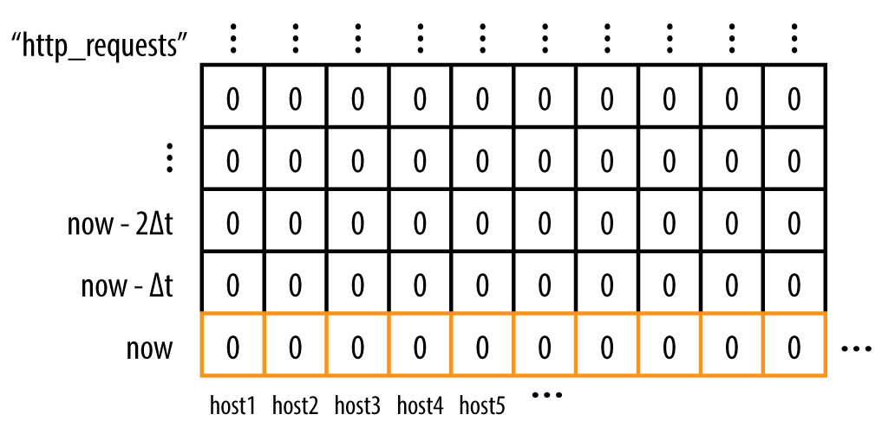
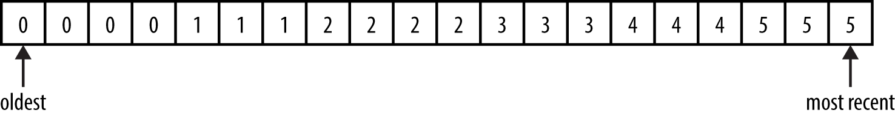

# CHAPTER 10. 

<i>시계열 데이터에 대한 실용적인 알림</i>


- 모니터링은 안정적인 서비스 운영을 위해 반드시 필요한 기본 구성 요소임.
- 서비스 담당자가 서비스 변경에 따른 영향을 합리적으로 결정할 수 있으며, 장애가 발생했을 때 과학적 방법으로 대처 가능함.
- 서비스가 비즈니스 목표에 맞게 운영되는지 측정할 수 있음.

**초대형 시스템을 위한 모니터링의 어려움**

- 분석해야 할 컴포넌트의 수를 정확히 파악해야 함.
- 각 시스템에 대한 엔지니어들의 책임 부담을 최소화해야 함.
- **개별 컴포넌트가 아닌 종합적인 신호 전달 필요**
  - 하나의 머신에서 발생한 실패에 대해 개별 알림을 받을 경우, 과도한 알림 발생 가능성 높음.
  - 종합적 신호를 전달하면서 외부 요인을 배제할 수 있도록 디자인 필요.

<br>

## 보그몬의 탄생

### 보그몬

: 시스템 장애를 탐지하기 위해 스크립트를 실행하는 대신 **공용 데이터 해설 형식**(common data exposition format) 사용.

- 낮은 오버헤드로 대량 데이터 수집 가능.
- 데이터 처리 프로세스 실행과 네트워크 연결 설정 비용 절감.
- 화이트 박스 모니터링(white-box monitoring)으로 불림.

<pre>
<b>구글 외부에서 개발한 시계열 모니터링 도구</b>
보그몬의 시계열 기반 알림과 유사한 기능을 제공하는 도구들이 오픈소스화 됨.
리먼(Remann), 헤카(Heka), 보선(Bosun), 프로메테우스(Prometheus) 등.
특히 <b>프로메테우스는 보그몬과 유사</b>함.
</pre>

보그몬에서 수집한 데이터는 차트 렌더링과 알림 생성에 사용되며, 대량 데이터 수집을 위해 지표 형식을 표준화.

#### `varz`

- 내부 상태를 내보내기 위한 메서드

지표 페이지 수동 확인 명령어

```bash
% curl http://webserver:80/varz
http_requests 37
errors_total 12
```

- 서비스 토폴로지에 따른 계층 구조 구성 및 정보 요약, 일부 정보 폐기 가능
- 클러스터당 하나의 보그몬 실행, 전역적으로 한 쌍의 보그몬 실행

<br>

## 애플리케이션의 조작

`varz` HTTP 핸들러는 내보내는 변수 값들을 평문 형태로 출력하며, 키와 값은 한 줄에 공백으로 구분된다.

**매핑된 변수 값 예시**

```bash
http_responses map:code 200:25 404:0 500:12
```

25개의 HTTP 200 응답과 12개의 HTTP 500 응답이 서비스됨

**장점**

스키마가 없는 인터페이스 덕분에 새로운 동작을 쉽게 추가할 수 있음

**단점**

- 변수 정의를 보그몬 규칙과 분리하려면 변화 관리를 세심하게 해야 함
- 이 문제는 규칙을 검사하고 생성하는 도구도 함께 개발되었기 때문에 실제로 큰 문제는 되지 않음

<pre>
<b>변수 내보내기</b>
기본적으로 구글의 모든 바이너리에 내장된 HTTP 서버에 자동으로 등록되는 변수 내보내기 인터페이스를 구현. 
Go 언어 기반의 expvar 라이브러리와 JSON 형식 결과물을 활용할 수 있음.

(https://golang.org/pkg/expvar/ 참고)
</pre>

<br>

## 내보낸데이터의수집

보그몬인스턴스는자신의대상을찾아내기위해다양한이름해석기법이적용된대상리스 트를가지고있다. ?대상리스트는동적이어서서비스탐색(servicediscovery)을이용하면모니터 링시스템을손쉽게스케일링하고운영비용을줄일수있

1. 보그몬은미리지정된간격으로 `/varz/` UR를각대상마다호출
2. 결과 디코드
3. 해당 값들을 메모리에저장

각 대상을 인식하기위해 통합적 (Synthetic) 변수를 기록

- 대상의이름이호스트와포트번호로해석되었는지여부
- 대상이데이터수집에응답했는지여부
- 대상이건강상태점검요청에응답했는지여부
- 데이터수집이완료된시각

#### `/varz/` 

SNMP와 상당히 다름

**SNMP**
:Simple Networking Monitoring Protocol, 최소한의 전송 요청을 바탕으로 대부분의다른네트워크애플리케이션이실패하는 상황에서 도동작하기위해 디자인된 프로토콜 

엔지니어는보그몬의실패자체 도하나의신호로수집하여알림을발송하기위한규칙을작성

-> 시스템자체가이미네트 워크와머신의실패에대응할수있도록디자인되어있음

<br>

## 시계열데이터를위한저장소

다양한종류의태스크로서실 행되는수많은바이너리들로구성

보그몬은모든데이터를인-메모리(in-memory) 데이터베이스에저장

데이터베이스 는정기적으로디스크에다시저장

데이터가 저장되는 시점은 
일련의 **형태(시간, 값)**를 가지고있으며, 시계열(time-series) 이라고 불리는 연대순 목록의 형태로 저장

시계열은 `name = value` 형 태 의 유니크 레이블 (label) 의 집합으로 구성

시계열은 개념적으로 시간에 대한 수(number)들의 일차원행렬(matrix) 

시계열에 다른 레이블의 순열을 추가하면 행렬은 다차원 행렬

<br><br>

-> 데이터가수집된호스트별레이블을기초로시간의흐름에따른에러를보여주는행렬

**시계열공간(time-series arena)**

고정된크기의메모리블록

일정시간이지나공간이가득차면가비지컬렉터가가장오래된항목부터차례 로제거

가장최근의항목과가장오래된항목간의간격은수평적

쿼리가 가능한 데이터가 RAM에 얼마나 많이 남아있는지를 알 수 있음

대체로데이터센터및범 용보그몬은콘솔을렌더링하기위해12시간의데이터를보관

한데이터저장지점에 필요한 메모리는 24 바이트 정도여서 17GB 의 RAM에1 분단위로 12시간 분량의 시계열데이터 1백만개를저장할수있음

메 모 리 내 의 상 태 는 정 기 적 으 로 시 계 열 데 이 터 베 이 스 ( T i m e - S e n t s D a t a b a s e , 1 5 0 9 ) 라고 알 려 진 외부시스템에보관

보그몬은오래된데이터를TSDB에쿼리

TSDB는보그몬의 RAM보다는상대적으로느리지만저렴한비용으로더많은데이터를보관할 수 있음

<br>

## 레이블과벡터

시계열데이터는일련의숫자와타임스탬프값으로저장

-> 이 값을 벡터(vector)라고 부름

벡터들은공간내의 데이터점의다차원행렬의일부

개념적으로이값들은벡터내에정해진간격(예를들면1초 혹은10초혹은1분등) 으로추가되므로무시해도무방

<br><br>

시 계 열 데 이 터 의 예 시

시계열데이터의이름은레이블셋(labelset)

`key=value` 쌍으로 표현되는 레이블의집합으로구현되기때문

레이블중하나는그자체로변수이름이며, 그 이름에할당된키가varz페이지에나타남

일부레이블이름은중요해서, 식별이 가능해야하므로 최소한 다음의 레이블들을 가지고 있어야 함

- `var` 변수의이름
- `job` 모니터링되는서버의타입의이름
- `service` 사용자에게서비스를제공하는내부및외부잠(0b)의느슨하게정의된집합
- `zone` 변수가수집된보그몬의이름이 이름은지역을의미하는구글의이름규칙(대부분 데이터센터를의미함)을 따름

```
{var=http_requests,job=webserver,instance=host0:80,service=web,zone=us-west}
```

-> **변수표현식**이라고 부름

모든레이블들을명시할필요는없으

레이블셋에 대한 검색은 벡터내에서 발견된 모든 시계열 데이터를 리턴

그래서 클러스터내에 하나 이상의인스턴스가존재하는경우, 
앞서 실행한쿼리에서인스턴스레이블을제거하면한벡터의 결과를모두리턴할수있

```
{var=http_requests,job=webserver,service=web,zone=us-west}
```

위의쿼리는벡터내의다섯줄의데이터를가장최신순으로표시

결과: 

```
{var=http_requests,job=webserver,instance=host0:80,service=web,zone=us-west} 10
{var=http_requests,job=webserver,instance=host1:80,service=web,zone=us-west} 9
{var=http_requests,job=webserver,instance=host2:80,service=web,zone=us-west} 11
{var=http_requests,job=webserver,instance=host3:80,service=web,zone=us-west} 0
{var=http_requests,job=webserver,instance=host4:80,service=web,zone=us-west} 10
```

시계열데이터쿼리에사용할수있는레이블

- 대상 이름
  - e.g., the job and instance
- 대상 자체
  - e.g., via map-valued variables
- 보그몬설정
  - e.g., annotations about location or relabeling
- 평가된 보그몬 규칙

변수표현식에지속시간을추가해서특정시간내의시계열데이터를쿼리할수있음

```
{var=http_requests,job=webserver,service=web,zone=us-west}[10m]
```

위 쿼리는 표현식과일치하는시계열데이터의최근10분간의기록을 리턴

```
{var=http_requests,job=webserver,instance=host0:80, ...} 0 1 2 3 4 5 6 7 8 9 10
{var=http_requests,job=webserver,instance=host1:80, ...} 0 1 2 3 4 4 5 6 7 8 9
{var=http_requests,job=webserver,instance=host2:80, ...} 0 1 2 3 5 6 7 8 9 9 11
{var=http_requests,job=webserver,instance=host3:80, ...} 0 0 0 0 0 0 0 0 0 0 0
{var=http_requests,job=webserver,instance=host4:80, ...} 0 1 2 3 4 5 6 7 8 9 10
```

<br>

## 규칙의평가

보 그몬 은 실 제 로 는 단 지 알 림 을 생 성 하 기 위 한 몇 가 지 문 법 적 편 의 성 을 제 공 하 는 프 로 그래 밍이가능한계산기

<pre>
규칙평가를자식프로세스에위임하지않고모니터링시스템을통해실행하면여러개의 유사한대상에대한계산을병렬적으로실행할수있다는것을의미
</pre>

보그몬규칙(Borgmon rule)
= 보그몬의 프로그램 코드
: 다른 시계열데이터로부터 시계열데이터를계산하는간단한대수학표현식

하나의시계열 데이터(예를들면시간축)의기록을쿼리할수도있고, 여러개의시계열데이터(예를들면공간 축)로부터각기다른레이블의서브셋을한번에쿼리할수도있으며, 다양한수학연산을적 용할수있으므로매우강력

병렬스레드풀에서실행할수도있지만, 이미사전에정의된규칙 을입력으로사용한때는그순서에의존

이런 쿼리표현식에의해리턴되는베터의 크기는 규칙의전체신행시간에의해결정

집계는잡전체를하나로취급하기위해 그잡에서실행중인태스크들로부터일련의시계열데이터의합계를얻어야가능


<pre>
카운터는변수를감소시키지않는모든현상을의미한다. 
다시말해 카운터는값을증가 시킬수만있다.
반면, 게이지(gauges)는원하는어떤값이든취할수있다. 

카운터는 주행한 총 킬로미터 같은 값의 증가를 측정하는 반면,
게이지는 현재의 속도나남은연료의양 같은현재의상태를보여준다.
보그몬 스타일의 데이터를 수집할 때는 카운터를 사용하는 것이 유리하다.
그이유는샘플링간격사이에발생한사건에의한데이터유실이발생 하지않기때문이다.
샘플링 간격사이에 어떤활동이나변경이발생한다면게이지수집은 그에 대한 정보를 놓치게된다
</pre>


1. 모든태스크의응답코드의비율을집계하고특정시점의각코드의비율을 벡터에 저장
2. 벡터의 합을 구해서 전체 에러비율을 계산한 후, 특정 시점의각클러스터별단일 값을 출력. 이총에러율에는HTTP200 코드의합을포함하지 않음
3. 클러스터단위로요청당에러의비율을계산. 총에러비율을 총 요청 비율로 나누어 그결과를특정시점당하나의값으로계산한후, 특정시점의클러스터의값으로출 력

특정시점의각출력값은명명된변수표현식을덧붙여새로운시계열데이터를생성

요청의비율을구하는규칙은보그몬규칙언어로 작성하면,

```
rules <<<
  # Compute the rate of requests for each task from the count of requests
  {var=task:http_requests:rate10m,job=webserver} =
    rate({var=http_requests,job=webserver}[10m]);

  # Sum the rates to get the aggregate rate of queries for the cluster;
  # ‘without instance’ instructs Borgmon to remove the instance label
  # from the right hand side.
  {var=dc:http_requests:rate10m,job=webserver} =
    sum without instance({var=task:http_requests:rate10m,job=webserver})
>>>
```

`rate()` 함수는 전달된 표현식을 취하며, 가장이른값과가장최근값사이의전체시간으로 나눈 값을 리턴

앞 서 쿼 리에 서 추 출 한 예 제 시 계 열 데 이 터에 `task:http_requests:rate10m` 규 칙 을 적 용하면:

```
{var=task:http_requests:rate10m,job=webserver,instance=host0:80, ...} 1
{var=task:http_requests:rate10m,job=webserver,instance=host1:80, ...} 0.9
{var=task:http_requests:rate10m,job=webserver,instance=host2:80, ...} 1.1
{var=task:http_requests:rate10m,job=webserver,instance=host3:80, ...} 0
{var=task:http_requests:rate10m,job=webserver,instance=host4:80, ...} 1
```

또, `dc:http_requests:rate10m` 규칙은:

```
{var=dc:http_requests:rate10m,job=webserver,service=web,zone=us-west} 4
```

두번째 규칙은첫번째규칙의결과를입력으로사용하기때문


**정해진 범위의 시간을 사용한이유**

연속된데이터가아니라 **시계열로분리 된데이터**들을다루었기때문

장점:
- 미분이나적분을사용하는것보다 훨씬 쉽게비율 을계산할수있었지만

단점:
- 충분한 양의데이터를불러와야함
- 최근의 데이터중일부를수집하지못할가능성도고려해야함
- 변수표현식에서10분(10ml)의 시간범위를지정한것도데이터수집오류로인해데이터가유실되는것을피하기위한것

<br>

지금까지 살펴본 쿼리의 비율을계산하는방법과 마찬가지방법으로,
- 에러의비율을계산할 수도있고, 
- 이를토대로요청에대한응답비율을계산하여서비스가얼마나잘운영되고있 는지를파악할수도있음
- 게다가이렇게계산된값을 서비스 수준 목표와 비교하여 목표치에도달하지못했거나또는도달하지못할것같은시점이되면알림을전송할 수도 있음


```
rules <<<
  # Compute a rate pertask and per ‘code’ label
  {var=task:http_responses:rate10m,job=webserver} =
    rate by code({var=http_responses,job=webserver}[10m]);

  # Compute a cluster level response rate per ‘code’ label
  {var=dc:http_responses:rate10m,job=webserver} =
    sum without instance({var=task:http_responses:rate10m,job=webserver});

  # Compute a new cluster level rate summing all non 200 codes
  {var=dc:http_errors:rate10m,job=webserver} =
    sum without code({var=dc:http_responses:rate10m,job=webserver,code=!/200/});

  # Compute the ratio of the rate of errors to the rate of requests
  {var=dc:http_errors:ratio_rate10m,job=webserver} =
    {var=dc:http_errors:rate10m,job=webserver}
      /
    {var=dc:http_requests:rate10m,job=webserver};
>>>
```

사용된계산법은새로운시계열변수명에해당변수를생성한연산자 의이름을덧붙이는규칙을따름

그래서 `datacenter HTTP errors 10 minute ratio of rates.` 와 같은 이름을 갖게 됨
이연산의결과는다음과같을것:

**{var=task:http_responses:rate10m,job=webserver}**
```
{var=task:http_responses:rate10m,job=webserver,code=200,instance=host0:80, ...} 1
{var=task:http_responses:rate10m,job=webserver,code=500,instance=host0:80, ...} 0
{var=task:http_responses:rate10m,job=webserver,code=200,instance=host1:80, ...} 0.5
{var=task:http_responses:rate10m,job=webserver,code=500,instance=host1:80, ...} 0.4
{var=task:http_responses:rate10m,job=webserver,code=200,instance=host2:80, ...} 1
{var=task:http_responses:rate10m,job=webserver,code=500,instance=host2:80, ...} 0.1
{var=task:http_responses:rate10m,job=webserver,code=200,instance=host3:80, ...} 0
{var=task:http_responses:rate10m,job=webserver,code=500,instance=host3:80, ...} 0
{var=task:http_responses:rate10m,job=webserver,code=200,instance=host4:80, ...} 0.9
{var=task:http_responses:rate10m,job=webserver,code=500,instance=host4:80, ...} 0.1
```

**{var=dc:http_responses:rate10m,job=webserver}**
```
{var=dc:http_responses:rate10m,job=webserver,code=200, ...} 3.4
{var=dc:http_responses:rate10m,job=webserver,code=500, ...} 0.6
```

**{var=dc:http_responses:rate10m,job=webserver,code=!/200/}**
```
{var=dc:http_responses:rate10m,job=webserver,code=500, ...} 0.6
```

**{var=dc:http_errors:rate10m,job=webserver}**
```
{var=dc:http_errors:rate10m,job=webserver, ...} 0.6
```

**{var=dc:http_errors:ratio_rate10m,job=webserver}**

```
{var=dc:http_errors:ratio_rate10m,job=webserver} 0.15
```

계산결과는시계열공 간에보관


