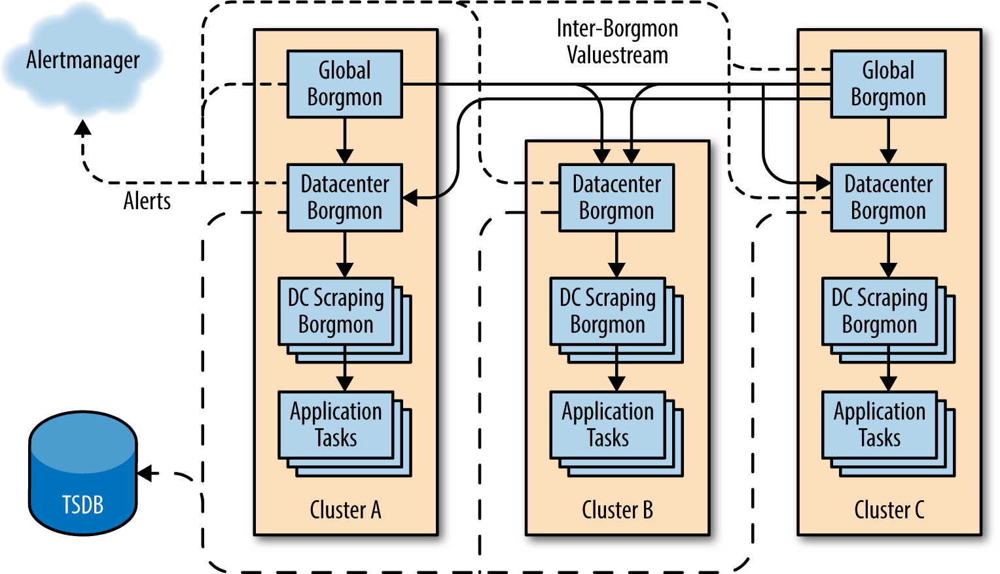

# CHAPTER 10.

<i>시계열 데이터에 대한 실용적인 알림</i>


- 모니터링은 안정적인 서비스 운영을 위해 반드시 필요한 기본 구성 요소임.
- 서비스 담당자가 서비스 변경에 따른 영향을 합리적으로 결정할 수 있으며, 장애가 발생했을 때 과학적 방법으로 대처 가능함.
- 서비스가 비즈니스 목표에 맞게 운영되는지 측정할 수 있음.

**초대형 시스템을 위한 모니터링의 어려움**

- 분석해야 할 컴포넌트의 수를 정확히 파악해야 함.
- 각 시스템에 대한 엔지니어들의 책임 부담을 최소화해야 함.
- **개별 컴포넌트가 아닌 종합적인 신호 전달 필요**
    - 하나의 머신에서 발생한 실패에 대해 개별 알림을 받을 경우, 과도한 알림 발생 가능성 높음.
    - 종합적 신호를 전달하면서 외부 요인을 배제할 수 있도록 디자인 필요.

<br>

## 보그몬의 탄생

### 보그몬

: 시스템 장애를 탐지하기 위해 스크립트를 실행하는 대신 **공용 데이터 해설 형식**(common data exposition format) 사용.

- 낮은 오버헤드로 대량 데이터 수집 가능.
- 데이터 처리 프로세스 실행과 네트워크 연결 설정 비용 절감.
- 화이트 박스 모니터링(white-box monitoring)으로 불림.

<pre>
<b>구글 외부에서 개발한 시계열 모니터링 도구</b>
보그몬의 시계열 기반 알림과 유사한 기능을 제공하는 도구들이 오픈소스화 됨.
리먼(Remann), 헤카(Heka), 보선(Bosun), 프로메테우스(Prometheus) 등.
특히 <b>프로메테우스는 보그몬과 유사</b>함.
</pre>

보그몬에서 수집한 데이터는 차트 렌더링과 알림 생성에 사용되며, 대량 데이터 수집을 위해 지표 형식을 표준화.

#### `varz`

- 내부 상태를 내보내기 위한 메서드

지표 페이지 수동 확인 명령어

```bash
% curl http://webserver:80/varz
http_requests 37
errors_total 12
```

- 서비스 토폴로지에 따른 계층 구조 구성 및 정보 요약, 일부 정보 폐기 가능
- 클러스터당 하나의 보그몬 실행, 전역적으로 한 쌍의 보그몬 실행

<br>

## 애플리케이션의 조작

`varz` HTTP 핸들러는 내보내는 변수 값들을 평문 형태로 출력하며, 키와 값은 한 줄에 공백으로 구분된다.

**매핑된 변수 값 예시**

```bash
http_responses map:code 200:25 404:0 500:12
```

25개의 HTTP 200 응답과 12개의 HTTP 500 응답이 서비스됨

**장점**

스키마가 없는 인터페이스 덕분에 새로운 동작을 쉽게 추가할 수 있음

**단점**

- 변수 정의를 보그몬 규칙과 분리하려면 변화 관리를 세심하게 해야 함
- 이 문제는 규칙을 검사하고 생성하는 도구도 함께 개발되었기 때문에 실제로 큰 문제는 되지 않음

<pre>
<b>변수 내보내기</b>
기본적으로 구글의 모든 바이너리에 내장된 HTTP 서버에 자동으로 등록되는 변수 내보내기 인터페이스를 구현. 
Go 언어 기반의 expvar 라이브러리와 JSON 형식 결과물을 활용할 수 있음.

(https://golang.org/pkg/expvar/ 참고)
</pre>

<br>


## 내보낸 데이터의 수집
보그몬 인스턴스는 자신의 대상을 찾아내기 위해 다양한 이름 해석 기법이 적용된 대상 리스트를 가지고 있음. 

대상 리스트는 동적이어서 **서비스 탐색(service discovery)**을 이용하면 모니터링 시스템을 손쉽게 스케일링하고 운영 비용을 줄일 수 있음.

1. 보그몬은 미리 지정된 간격으로 `/varz/` URL을 각 대상마다 호출함.
2. 결과 디코드.
3. 해당 값들을 메모리에 저장.

각 대상을 인식하기 위해 Synthetic 변수를 기록.

- 대상의 이름이 호스트와 포트 번호로 해석되었는지 여부
- 대상이 데이터 수집에 응답했는지 여부
- 대상이 건강 상태 점검 요청에 응답했는지 여부
- 데이터 수집이 완료된 시각


#### `/varz/`

SNMP와 상당히 다름.

> FYI. **SNMP** : Simple Networking Monitoring Protocol, 최소한의 전송 요청을 바탕으로 대부분의 다른 네트워크 애플리케이션이 실패하는 상황에서도 동작하기 위해 디자인된 프로토콜

엔지니어는 보그몬의 실패 자체도 하나의 신호로 수집하여 알림을 발송하기 위한 규칙을 작성함.

→ 시스템 자체가 이미 네트워크와 머신의 실패에 대응할 수 있도록 디자인되어 있음.

<br>

## 시계열 데이터를 위한 저장소

다양한 종류의 태스크로서 실행되는 수많은 바이너리들로 구성됨.

1. 보그몬은 모든 데이터를 **인-메모리(in-memory) 데이터베이스에 저장**함.
2. 데이터베이스는 정기적으로 디스크에 다시 저장됨.

데이터가 저장되는 시점은 일련의 **형태(시간, 값)** 를 가지고 있으며, **시계열(time-series)** 이라고 불리는 연대순 목록의 형태로 저장됨.

시계열은 `name=value` 형태의 유니크 레이블(label)의 집합으로 구성됨.

> FYI. 시계열: 시간에 대한 수(number)들의 일차원 행렬(matrix).

시계열에 다른 레이블의 순열을 추가하면 행렬은 다차원 행렬이 됨.

<br><br>

→ 데이터가 수집된 호스트별 레이블을 기초로 시간의 흐름에 따른 에러를 보여주는 행렬.

<br>

### Time-series arena (시계열 공간)

(이하 time-series 는 **시계열**로 표기)

- **저장 위치**: 고정된 크기의 메모리 블록.
  - 가장 최근의 항목과 가장 오래된 항목 간의 간격은 수평적임. 
  - → 쿼리가 가능한 데이터가 RAM에 얼마나 많이 남아 있는지를 알 수 있음.
- **저장 관리**: 일정 시간이 지나 공간이 가득 차면 가비지 컬렉터가 가장 오래된 항목부터 차례로 제거함.
- **저장 기간**: 대체로 데이터센터 및 범용 보그몬은 콘솔에 렌더링하기 위해 12시간의 데이터를 보관함.
- **저장 용량**: 한 데이터 저장 지점에 필요한 메모리는 24 바이트 정도여서 17GB의 RAM에 1분 단위로 12시간 분량의 시계열 데이터 1백만개를 저장할 수 있음.

#### Time-Series Database (시계열 데이터베이스)

- 메모리 내의 상태는 정기적으로 시계열 데이터베이스(Time-Series Database, TSDB)라고 알려진 외부 시스템에 보관됨.
- 보그몬은 **오래된 데이터를 TSDB에 쿼리**함. 
- TSDB는 보그몬의 RAM보다는 상대적으로 느리지만 저렴한 비용으로 더 많은 데이터를 보관할 수 있음.

<br>

## 레이블과 벡터

시계열 데이터는 **숫자 시퀀스**와 **타임스탬프** 값으로 저장됨.

→ 이 값을 벡터(vector)라고 부름.

벡터들은 공간 내의 데이터점의 다차원 행렬의 일부임.

개념적으로 타임스탬프는 무시할 수 있는데, 정해진 간격으로 추가되기 때문.

(가령, 1초 or 10초 or 1분 등)

<br><br>

### Labelset

: 시계열 데이터의 이름. `key=value` 쌍으로 표현되는 레이블의 집합으로 구현되기 때문.

**레이블셋**은 임.

레이블 중 하나는 그 자체가 **변수 이름** 이며, 그 이름에 할당된 키가 `varz` 페이지에 나타남.

일부 레이블 이름은 중요해서, 식별이 가능해야 하므로 최소한 다음의 레이블들을 가지고 있어야 함.

- `var`: 변수의 이름
- `job`: 모니터링되는 서버의 타입의 이름
- `service`: 사용자에게 서비스를 제공하는 내부 및 외부 잠재적 서비스의 느슨하게 정의된 집합
- `zone`: 변수가 수집된 보그몬의 이름. 각 `zone`을 지칭하는 구글의 이름 컨벤션을 따름 (대부분 데이터센터를 의미).

```
{var=http_requests,job=webserver,instance=host0:80,service=web,zone=us-west}
```

→ **Variable Expression (변수 표현식)** 이라고 부름.

시계열 데이터 쿼리에는 따로 규격이 없으며, 레이블셋에 대한 검색은 **벡터 내 모든 시계열 데이터를 리턴**.

#### Example. Returns all matching time-series in a vector.

클러스터 내에 **여러 인스턴스**가 존재하는 경우, 위 쿼리에서 `instance` 레이블을 제거하면 모든 인스턴스 결과를 리턴.

**Query:**

```
{var=http_requests,job=webserver,service=web,zone=us-west}
```

위의 쿼리는 가장 최신순으로 표시.

**Result:**

```
{var=http_requests,job=webserver,instance=host0:80,service=web,zone=us-west} 10
{var=http_requests,job=webserver,instance=host1:80,service=web,zone=us-west} 9
{var=http_requests,job=webserver,instance=host2:80,service=web,zone=us-west} 11
{var=http_requests,job=webserver,instance=host3:80,service=web,zone=us-west} 0
{var=http_requests,job=webserver,instance=host4:80,service=web,zone=us-west} 10
```

시계열 데이터 쿼리에 사용할 수 있는 레이블:

- 대상 이름
  - ex. the job and instance
- 대상 자체
  - ex. via map-valued variables
- 보그몬 설정
  - ex. annotations about location or relabeling
- 평가된 보그몬 규칙

#### Example. Query time-series in time by specifying Duration.

변수 표현식에 **duration 을 추가**해서 특정 시간 내의 시계열 데이터를 쿼리할 수 있음.

```
{var=http_requests,job=webserver,service=web,zone=us-west}[10m]
```

위 쿼리는 표현식과 일치하는 시계열 데이터의 **최근 10분간의 기록을 리턴**함.

```
{var=http_requests,job=webserver,instance=host0:80, ...} 0 1 2 3 4 5 6 7 8 9 10
{var=http_requests,job=webserver,instance=host1:80, ...} 0 1 2 3 4 4 5 6 7 8 9
{var=http_requests,job=webserver,instance=host2:80, ...} 0 1 2 3 5 6 7 8 9 9 11
{var=http_requests,job=webserver,instance=host3:80, ...} 0 0 0 0 0 0 0 0 0 0 0
{var=http_requests,job=webserver,instance=host4:80, ...} 0 1 2 3 4 5 6 7 8 9 10
```

<br>

## Rule Evaluation

보그몬은 오직 알림 생성을 위한 문법적 편의성을 제공하는 프로그래밍이 가능한 계산기임.

> 규칙 평가를 모니터링 시스템을 통해 실행하면 **여러 개의 유사한 대상에 대한 계산을 병렬적으로 실행**할 수 있음.

**보그몬 규칙 (Borgmon rule)**

\: 보그몬의 프로그램 코드. 다른 시계열 데이터로부터 시계열 데이터를 계산하는 간단한 대수학 표현식

- 하나의 시계열 데이터(ex. 시간 축)의 기록을 쿼리할 수 있고, 
- 여러 개의 시계열 데이터(ex. 공간 축)로부터 각기 다른 레이블의 서브셋을 한 번에 쿼리할 수 있으며, 
- 다양한 수학 연산을 적용할 수 있으므로 매우 강력함.

병렬 스레드 풀에서 실행할 수도 있지만, 이미 사전에 정의된 규칙을 입력으로 사용한 때는 그 순서에 의존함.

이런 쿼리 표현식에 의해 리턴되는 벡터의 크기는 규칙의 전체 실행 시간에 의해 결정됨.

**Aggregation**
집계는 잡 전체를 하나로 취급하기 위해 그 잡에서 실행 중인 태스크들로부터 일련의 시계열 데이터의 합계를 얻어야 함.

가령, 데이터 센터 내의 잡의 총 QPS 속도는 모든 query counter 변화의 총 속도의 합임.

<pre><b>TIP</b> Counter vs. Gauges 
카운터는 변수를 감소시키지 않는 모든 현상을 의미함 - 즉, 카운터는 값을 오직 증가시킴.
반면, 게이지(gauges)는 원하는 어떤 값이든 취할 수 있음.

카운터는 주행한 총 킬로미터 같은 값의 증가를 측정하는 반면,
게이지는 현재의 속도나 남은 연료의 양 같은 현재의 상태를 보여줌.
보그몬 스타일의 데이터를 수집할 때는 카운터를 사용하는 것이 유리함.
그 이유는 샘플링 간격 사이에 발생한 사건에 의한 데이터 유실이 발생하지 않기 때문임.
샘플링 간격 사이에 어떤 활동이나 변경이 발생한다면 게이지 수집은 그에 대한 정보를 놓치게 됨.
</pre>

1. 모든 태스크의 응답 코드의 비율을 집계하고 특정 시점의 각 코드의 비율을 벡터에 저장함.
2. 벡터의 합을 구해서 전체 에러 비율을 계산한 후, 특정 시점의 각 클러스터별 단일 값을 출력함. 
   - HTTP 200 코드의 합을 포함하지 않음.
3. 클러스터 단위로 요청당 에러의 비율 계산.
   - 총 에러 비율을 총 요청 비율로 나누어 그 결과를 특정 시점당 하나의 값으로 계산한 후, 특정 시점의 클러스터의 값으로 출력함. 

특정 시점의 출력 값은 명명된 변수 표현식(named variable expression)을 덧붙여 새로운 시계열 데이터를 생성.

요청의 비율을 구하는 규칙은 보그몬 규칙 언어로 작성하면,

```
rules <<<
  # Compute the rate of requests for each task from the count of requests
  {var=task:http_requests:rate10m,job=webserver} =
    rate({var=http_requests,job=webserver}[10m]);

  # Sum the rates to get the aggregate rate of queries for the cluster;
  # ‘without instance’ instructs Borgmon to remove the instance label
  # from the right hand side.
  {var=dc:http_requests:rate10m,job=webserver} =
    sum without instance({var=task:http_requests:rate10m,job=webserver})
>>>
```

`rate()` 함수는 전달된 표현식을 취하며, 가장 이른 값과 가장 최근 값 사이의 전체 시간으로 나눈 값을 리턴함.

앞서 쿼리에서 추출한 예제 시계열 데이터에 `task:http_requests:rate10m` 규칙을 적용하면:

```
{var=task:http_requests:rate10m,job=webserver,instance=host0:80, ...} 1
{var=task:http_requests:rate10m,job=webserver,instance=host1:80, ...} 0.9
{var=task:http_requests:rate10m,job=webserver,instance=host2:80, ...} 1.1
{var=task:http_requests:rate10m,job=webserver,instance=host3:80, ...} 0
{var=task:http_requests:rate10m,job=webserver,instance=host4:80, ...} 1
```

이어서, `dc:http_requests:rate10m` 규칙은:

```
{var=dc:http_requests:rate10m,job=webserver,service=web,zone=us-west} 4
```

두 번째 규칙은 첫 번째 결과를 입력값으로 사용하기 때문임.

<br>

#### `[10m]` → time window 를 사용한 이유? 

- 연속된 데이터가 아니라 시계열로 분리된 데이터들을 다루었기 때문임.
- **장점:**
  - 미분이나 적분을 사용하는 것보다 훨씬 쉽게 비율을 계산할 수 있었음.
- **단점:**
  - 충분한 양의 데이터를 불러와야 함.
  - 최근의 데이터 중 일부를 수집하지 못할 가능성도 고려해야 함.
  - 변수 표현식에서 10분(10m)의 시간 범위를 지정한 것도 데이터 수집 오류로 인해 데이터가 유실되는 것을 피하기 위함.

<br>

#### Examples.

지금까지 살펴본 쿼리의 비율을 계산하는 방법과 마찬가지 방법으로,

- 에러의 비율을 계산할 수도 있고,
- 요청에 대한 응답 비율을 계산 → 서비스가 얼마나 잘 운영되고 있는지를 파악할 수도 있음.
- 계산된 값을 서비스 수준 목표와 비교 → 목표치에 도달하지 못했거나 또는 도달하지 못할 것 같은 시점이 되면 알림을 전송할 수도 있음.

```
rules <<<
  # Compute a rate pertask and per 'code' label
  {var=task:http_responses:rate10m,job=webserver} =
    rate by code({var=http_responses,job=webserver}[10m]);

  # Compute a cluster level response rate per 'code' label
  {var=dc:http_responses:rate10m,job=webserver} =
    sum without instance({var=task:http_responses:rate10m,job=webserver});

  # Compute a new cluster level rate summing all non 200 codes
  {var=dc:http_errors:rate10m,job=webserver} =
    sum without code({var=dc:http_responses:rate10m,job=webserver,code=!/200/});

  # Compute the ratio of the rate of errors to the rate of requests
  {var=dc:http_errors:ratio_rate10m,job=webserver} =
    {var=dc:http_errors:rate10m,job=webserver}
      /
    {var=dc:http_requests:rate10m,job=webserver};
>>>
```

사용된 계산법은 **새로운 시계열 변수명에 해당 변수를 생성한 연산자의 이름을 덧붙이는 규칙**을 따름.

그래서 "datacenter HTTP errors 10 minute ratio of rates"와 같은 이름을 갖게 됨.

이 연산의 결과는 다음과 같을 것임:

<table>
<tr>
<td>

```
{var=task:http_responses:rate10m,job=webserver}
```

</td>
<td>

```
{var=task:http_responses:rate10m,job=webserver,code=200,instance=host0:80, ...} 1
{var=task:http_responses:rate10m,job=webserver,code=500,instance=host0:80, ...} 0
{var=task:http_responses:rate10m,job=webserver,code=200,instance=host1:80, ...} 0.5
{var=task:http_responses:rate10m,job=webserver,code=500,instance=host1:80, ...} 0.4
{var=task:http_responses:rate10m,job=webserver,code=200,instance=host2:80, ...} 1
{var=task:http_responses:rate10m,job=webserver,code=500,instance=host2:80, ...} 0.1
{var=task:http_responses:rate10m,job=webserver,code=200,instance=host3:80, ...} 0
{var=task:http_responses:rate10m,job=webserver,code=500,instance=host3:80, ...} 0
{var=task:http_responses:rate10m,job=webserver,code=200,instance=host4:80, ...} 0.9
{var=task:http_responses:rate10m,job=webserver,code=500,instance=host4:80, ...} 0.1
```

</td>
</tr>
<tr>
<td>

```
{var=dc:http_responses:rate10m,job=webserver}
```

</td>
<td>

```
{var=dc:http_responses:rate10m,job=webserver,code=200, ...} 3.4
{var=dc:http_responses:rate10m,job=webserver,code=500, ...} 0.6
```

</td>
</tr>
<tr>
<td>

```
{var=dc:http_responses:rate10m,job=webserver,code=!/200/}
```

</td>
<td>

```
{var=dc:http_responses:rate10m,job=webserver,code=500, ...} 0.6
```

</td>
</tr>
<tr>
<td>

```
{var=dc:http_errors:rate10m,job=webserver}
```

</td>
<td>

```
{var=dc:http_errors:rate10m,job=webserver, ...} 0.6
```

</td>
</tr>
<tr>
<td>

```
{var=dc:http_errors:ratio_rate10m,job=webserver}
```

</td>
<td>

```
{var=dc:http_errors:ratio_rate10m,job=webserver} 0.15
```

</td>
</tr>
</table>

계산 결과는 시계열 공간에 보관됨

<br>

## ## 알림

보그몬은 알림 규칙을 평가하여 그 결과가 참일 경우 알림을 발송하며, 그렇지 않으면 발송하지 않음. 

필자의 경험상 알림의 상태는 수시로 변경되는 값임. 

따라서 알림을 보내기 전에 일정 기간 동안 알림 조건이 유지되는 경우에만 알림을 발송할 수 있음.

예제는 10분 동안의 에러 발생률이 1%를 넘고, 1%를 초과하는 에러의 개수가 1개를 초과하면 알림을 보내는 코드임.

```plaintext
rules <<<
  {var=dc:http_errors:ratio_rate10m,job=webserver} > 0.01
    and by job, error
  {var=dc:http_errors:rate10m,job=webserver} > 1
    for 2m
    => ErrorRatioTooHigh
      details "webserver error ratio at %trigger_value%"
      labels { severity=page };
>>>
```

위의 예시에서는 에러율이 `0.15`였음.

- `0.01`이라는 에러율을 초과
- 그러나 에러의 수가 `1`보다 크지 않아 알림이 발송되지 않음
- 발생한 에러의 수가 `1` 이상으로 증가하면 알림 생성 (_pending_).
- 알림이 생성 후 2분간 대기 → 상태의 변화가 발생하지 않으면 해당 알림이 발송됨 (_fire_).

알림 규칙은 메시지에 문맥에 따른 정보를 추가할 수 있는 템플릿을 가짐: 잡의 이름, 알림의 이름, 알림 발송 규칙을 의미하는 숫자값 등. 

이런 문맥적 정보는 보그몬이 알림을 발송하여 알림 RPC가 그 메시지를 전달받을 때 채워짐.

#### 알림 매니저 (Alertmanager)

보그몬은 중앙 집중식으로 운영되는 알림 매니저(Alertmanager)라는 서비스에 연결됨.

- 다른 알림이 활성화된 상태일 때 특정 알림을 억제
- 동일한 레이블셋을 가진 여러 보그몬으로부터의 중복된 알림을 제거
- 유사한 레이블셋으로부터 여러 알림이 전송된 경우 레이블셋에 따라 알림을 축소하거나 확대

<br>

## 모니터링 토폴로지의 샤딩

보그몬 간의 시계열 데이터 전송에는 스트리밍 프로토콜을 사용하여 CPU 시간을 절약하고, 
텍스트 기반인 `varz` 형식과 비교할 때 네트워크로 전송되는 데이터의 크기를 줄일 수 있음.

**좀 더 복잡한 보그몬 클러스터에서는**:

- 데이터센터 보그몬: 수집 전용 계층
  - 초대용량 서비스의 경우, 단일 보그몬 서버가 가지는 RAM과 CPU의 한계 때문
- DC 집계 계층이 데이터 집계를 위한 규칙 평가의 대부분을 수행하는 형태로 서비스를 구축하는 경우도 있음.

<br><br>

상위 보그몬은 하위 보그몬으로부터 전송할 데이터를 필터링할 수 있어서, 
전역 보그몬 서비스들이 하위 보그몬이 보낸 태스크별 시계열 데이터로 과부하되는 일이 발생하지 않음.

<br>

## 블랙박스 모니터링

**보그몬**

- 화이트박스 모니터링 시스템. 
  - 즉, 대상 서비스의 내부 상태를 언제든 확인할 수 있으며, 모니터링 규칙 역시 내부 동작을 염두에 두고 작성됨. 
- 사용자가 실제로 보는 것을 알아채지 못할 수 있음. 
  - → **프로버(Prober)** 를 이용해 가용성 문제를 해결함. 


### Prober (프로버)

프로버는

- 시계열 데이터를 생성하기 위한 풍부한 변수 추출 기능을 지닌 검사 및 테스트(check-and-test) 모델이 결합된 제품.
- 프로토콜의 응답 페이로드 _(ex. HTTP 응답의 HTML 콘텐츠)_ 의 유효성 검사 
- 위의 검사한 값을 시계열 데이터로 추출하여 내보낼 수 있음.
- 알림 매니저에게 직접 알림을 전송 or 자신의 `varz` API를 구성 → 보그몬이 이를 수집할 수 있음.

<br>

## 설정의 유지보수

보그몬 설정은 모니터링 대상과 모니터링 규칙을 분리하기 위한 것임.

동일한 규칙의 집합을 여러 대상에 동시에 적용할 수 있음을 의미함.

대상 시스템의 설정에 있어 반복적인 부분을 상당 부분 해소할 수 있으므로 모니터링 운영 비용이 크게 감소함.

보그몬은 **언어 템플릿**을 지원.

보그몬은 **광범위한 단위 테스트 및 회귀 테스트**를 지원

<br>

### 레이블 

보그몬에서는 레이블을 추가해서 **시계열 데이터를 그룹화하고 집계하는데 사용**

- 데이터 자체에 대한 구분을 정의하는 레이블 
  - ex. `http_responses` 변수의 HTTP 응답 코드
- 데이터의 원본을 정의하는 레이블 
  - Instance 나 Job 이름
- 장소나 서비스 내에서 데이터의 집계가 발생한 지점을 의미하는 레이블
  - ex. `Zone` label, `Shard` label 등

위 라이브러리는 템플릿을 활용 → 유연하게 활용 가능 

→ 동일한 템플릿으로 각기 다른 계층의 데이터를 집계할 수 있음.

