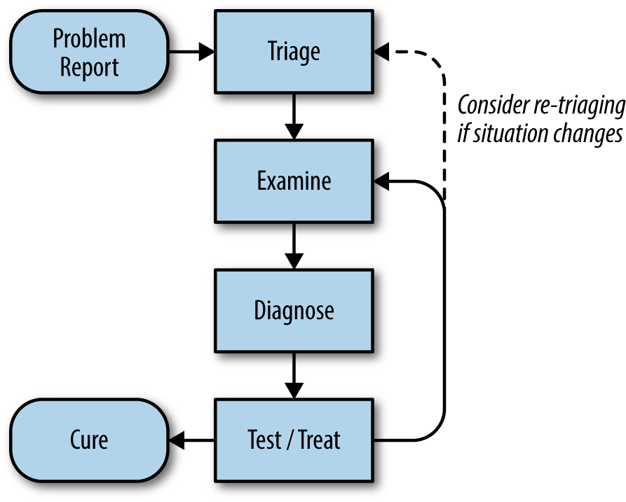
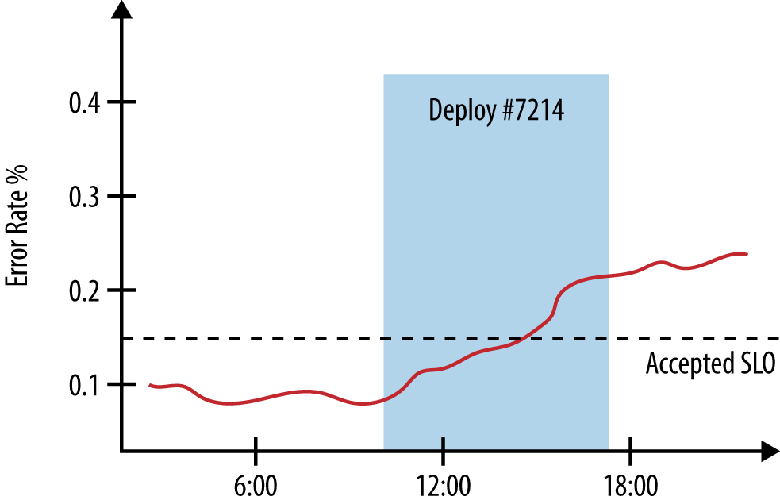
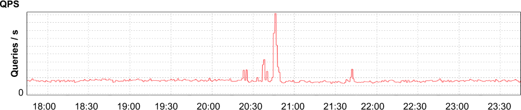
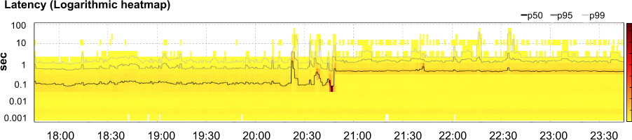

# CHAPTER 12. Effective Troubleshooting

<i>효과적인 장애 조치</i>

 

> 단순히 시스템의 동작을 이해한다고 해서 전문가가 될 수 있는 것은 아니다.  
> **전문성은 시스템이 동작하지 않는 이유에 대해 연구하는 과정에서 얻어지는 것**이다.  
> 
> — 브라이언 레드맨(Brian Redman)

 

장애 조치는 크게 두 가지 요소와 관련이 있음.

- **첫 번째**: 장애 조치를 범용적으로 수행
  - 범용적이란 특정 시스템에 대한 지식 없이 실행할 수 있다는 의미.
  - 이 방법은 결국 효율적이지 않으며 별 효과도 없는 것으로 드러남.
- **두 번째**: 시스템에 대한 탄탄한 이해
  - 해당 시스템에 익숙하지 않은 SRE의 효율성을 제한하는 경향이 있음.

 

## 이론

애플리케이션의 장애 조치 방법: **가설 연역 방법 (hypothetico-deductive method)**

시스템을 관찰한 결과와 시스템의 행동에 대한 이해를 바탕으로 한 이론적 기반을 통해 장애의 잠재적 원인에 대해 계속해서 가설을 세워 나가고, 이 가설을 시험하는 방법.

  

1. 이상이 생겼을 때 문제 보고를 받는 것에서 시작.
2. 시스템의 측정 데이터와 로그를 통해 현재 상태 파악.
3. 이 정보를 시스템의 구현 방식, 동작 방식, 장애 복구 모드 등의 지식과 결합하여 가능한 원인 규명.

근본 원인(root cause)이 발견될 때까지 계속해서 테스트를 수행하고, 
원인이 발견되면 장애 재발 방지를 위해 그에 대한 조치를 수행한 후 포스트모텀 문서 작성. 

직접적인 원인은 근본 원인을 발견하거나 포스트모텀 문서를 작성할 때까지 기다릴 필요 없이 바로 수정 가능.

 

<pre>
<b>Common Pitfalls</b>

비효율적인 장애 조치 세션은 장애 등급 선정, 분석 및 진단 단계에 영향을 미침.

<b>쉽게 빠지기 쉬운 함정들</b>:

- 관련이 없는 증상을 들여다보거나 시스템의 지표의 의미를 잘못 이해하는 경우, 결과만 쫓는 행동일 뿐임.
- 시스템의 변경이나 입력값 혹은 환경에 대한 잘못된 이해는 안전하고 효과적인 가설의 검증을 방해함.
- 장애 원인에 대한 가능성이 희박한 가설을 세우거나 과거에 발생한 문제의 원인과 결부시키는 행위.
- 사실은 우연히 발생했거나 동일한 원인에 의해 발생한 관련 현상들을 계속해서 쫓아다니는 행위.
</pre>

 

## In Practice

 

### #1. Problem Report (문제 보고)

모든 문제 해결은 문제에 대한 보고에서 시작됨.

효과적인 문제 보고는 실제로 기대한 동작, 현재 동작, 문제 재현 방법을 설명해야 함.

이상적인 경우, 문제 보고는 일정한 양식으로 구성되어 버그 추적 시스템(bug tracking system) 등 검색 가능한 위치에 저장해야 함.

특정인에게 문제를 직접 보고하는 방법은 아래와 같은 이유로 많은 팀에서 지양함:

- 보고받은 내용을 버그로 옮겨 적는 불필요한 과정을 요구.
- 팀의 다른 구성원에게 도움되지 않는 낮은 품질의 보고서를 양산.
- 보고자가 특정 구성원에게 문제 해결 부담을 지우는 경향.

 

### #2. Triage (문제의 우선순위 판단)

문제 보고 후 대처 방법을 찾는 단계.

우선 시스템이 가능한 정상적으로 동작하게 만드는 것이 중요.  
근본 원인을 찾다가 시스템이 죽어버리면 사용자에게 도움이 되지 않기 때문.

 

> 숙련된 파일럿은 긴급 상황에서 최우선 과제로 비행기를 계속 비행하게 해야 한다고 가르침.  
> 두 번째로 취할 조치는 비행기와 모든 것을 안전하게 착륙시키는 것.

 

### #3. Examine (문제를 관찰하기)

#### 1️⃣ 모니터링 지표
모니터링 시스템이 시스템의 모든 지표를 기록하고 있어야 함.  
시계열 데이터를 그래프화하여 특정 일부분의 동작을 이해하고 문제 발생 위치를 암시하는 연관관계를 찾는 것이 효과적임.

#### 2️⃣ 로그
Dapper 같은 도구를 이용하여 전체 스택에 걸쳐 요청을 추적하는 것은 분산 시스템이 어떻게 동작하는지를 이해할 수 있는 강력한 방법임.

#### 3️⃣ 상태 외부 노출
구글 서버들은 발신 및 수신한 RPC의 예시를 보여주는 종단점을 가지고 있어 아키텍처 다이어그램 없이도 서버 간 통신을 쉽게 이해할 수 있음. RPC 종류별로 에러율과 지연 응답 기록을 통해 문제가 있는 서버를 빠르게 확인 가능.

#### 4️⃣ 요청/응답 확인

클라이언트가 컴포넌트가 수신할 수 있는 요청과 그에 대한 응답을 미리 확인할 수 있도록 도구 제공 필요.

 

> **셰익스피어 서버의 디버깅**  
> 
> `curl`을 이용해 `/search` 종단점에 요청을 보낸 결과, 데이터 없이 HTTP 응답 코드 `502 (Bad Gateway)` 를 수신.  
> 
> `X-Request-Trace` HTTP 헤더를 통해 모든 백엔드 서버의 주소 목록을 확인하고 각 서버의 응답 여부를 점검함.

 

### #4. Diagnose (진단)

#### 1️⃣ Simplify and reduce

_단순화와 범위 좁히기._ 

시스템을 각 계층별로 분할하여 각 컴포넌트의 올바른 동작을 확인하며 문제를 해결.

거대한 시스템의 경우, 순차적으로 진행하기에는 시간이 오래 걸릴 수 있어 시스템을 반으로 나누어 각 컴포넌트 사이의 통신 경로를 확인하는 것이 바람직함.

#### 2️⃣ Ask "what," "where," and "why"

시스템이 어떤 동작을 수행하고 있는지, 왜 이러한 동작을 하는지, 자원 이용 위치와 결과 전달 위치를 확인함으로써 문제 파악에 도움을 줌.

#### 3️⃣ What touched it last

문제 발생 시 가장 최근에 변경된 부분이 문제 원인일 가능성이 높음.

  

#### 4️⃣ Specific diagnoses

광범위한 문제들을 인지하는 것보다는 특정 서비스 분석에 도움이 되는 도구와 시스템을 개발하는 것이 나음.

 

## Test and Treat

_테스트와 조치_

일단 가능한 원인을 파악한 후, 이들 중 실제 문제의 근본 원인을 규명하는 것이 중요함.

실험적 방법이지만, 가설을 하나씩 적용하거나 제거해보는 방식으로 문제 해결을 시도할 수 있음.

어떤 테스트를 수행했는지와 확인한 결과를 상세히 기록하는 것이 필수적임.

#### 테스트 구상 시 주의 사항

- **상호 배타적 테스트**
  - 이상적인 테스트는 상호 배타적으로 가설의 특정 집합을 검증하여 다른 가설의 가능성을 제거해야 함. 
  - 하지만 실제로 이런 테스트를 구성하는 일은 매우 어려움. 
- **명확하고 우선순위가 높은 테스트 고려**
  - 가능성이 큰 테스트부터 순차적으로 진행하되, 테스트로 인해 시스템에 발생할 수 있는 위험도 함께 고려해야 함.
- **혼란 요소 주의**
  - 특정 테스트가 잘못된 결과를 도출할 수 있음. 
  - 가령, 방화벽 정책이 특정 IP 주소로부터의 요청에만 응답하도록 설정된 경우, 애플리케이션 로직 서버에서는 데이터베이스 서버에 성공적으로 핑(ping)을 보낼 수 있지만 사용자의 머신에서는 실패하는 상황이 발생할 수 있음. 
- **적극적인 테스트의 부작용 고려**
  - 가령, 프로세스가 더 많은 CPU를 사용하게 설정하면 작업은 빨리 끝날 수 있지만 데이터가 Race Condition 에 놓일 가능성이 높아짐.
    또한, 더 방대한 양의 로그 기록 설정은 지연 응답 문제를 유발할 수 있어 테스트 결과에 혼란을 초래할 수 있음. 
    이 경우, 문제가 심각해진 것인지 아니면 로깅 때문인지 판단하기 어려워짐. 
- **설득력이 떨어지는 테스트의 한계**
  - 정기적이고 반복 가능한 형태로 경쟁 상태나 데드락(deadlock) 상황을 인위적으로 만들기란 매우 어려워, 이들이 문제의 원인임을 증명하기 위한 명확한 증거를 확보하기 어려울 수 있음. 
    즉, 불확실한 증거에 만족해야 할 수 있음.

  

## Negative Results Are Magic 

_부정적인 결과의 마법_

 

#### ✔️ 부정적인 결과의 가치

- 부정적인 결과는 무시하면 안됨
- 스스로의 실수를 인식하는 것은 큰 가치를 제공.
- 두 개의 선택지 중 하나를 결정할 때, 나중에 더 나은 방법이 있었는지에 대한 모호함을 줄이고 신중하게 대응할 수 있어야 함.

 

#### ✔️ 부정적인 결과도 결론이 됨

- 부정적인 결과의 축적된 데이터는 향후 새로운 실험이나 이전 디자인의 문제 반복을 방지하는 데 도움을 줄 수 있음.
- 예를 들어, 특정 웹 서버가 8,000개의 연결을 처리해야 하는데 잠금 현상으로 인해 80개만 처리해 사용하지 않기로 결정했다면, 
  후속 개발팀이 이를 참고하여 필요 없는 성능 테스트를 생략하고 Locking 문제 해결 여부를 빠르게 확인 가능.
- **마이크로벤치마크(microbenchmarks)**: 문서화된 안티패턴 및 프로젝트 포스트모텀은 이러한 범주에 해당.

 

#### ✔️ 도구와 방법의 의미

- 테스트 결과에 대해서도 벤치마킹 도구와 부하 테스트 도구를 활용 가능.
- 반복적 실험을 위한 도구를 구현하는 것은 간접적이면서도 유용한 작업임.

 

#### ✔️ 부정적인 결과의 공개는 업계의 데이터 주도성을 촉진

- 상세한 기록은 편견을 해소
- 다른 사람들에게 측정된 데이터를 기반으로 불확실성을 이해하게 하여 업계의 학습 속도를 높이는 효과를 제공함.

 

#### ✔️ 자신의 결과를 공표

자신이 배제한 디자인, 알고리즘, 팀의 업무 흐름을 공유함으로써,
동료들에게 그 결과의 가치있는 테스트였음을 설득하고, 위험을 신중하게 받아들이도록 돕는 것이 중요함.

 

## 처방
문제의 원인을 증명하기 위해 가장 확실한 방법은 해당 원인을 재현해내는 것임.

- 복잡한 시스템
  - 복잡한 아키텍처에서는 특정 상태에서만 장애가 발생하는 경우가 많음.
- **프로덕션 환경 재현 피하기**
  - 운영 중인 시스템에서 문제를 재현하려고 시도하는 것은 복잡하며, 다운타임을 초래할 수 있음.

**⭐️ 시스템을 먼저 복구한 후**

포스트모텀 문서를 작성해야 함 - 발생한 문제, 추적 방법, 해결 방식, 재발 방지 방법 등을 기록

## 사례연구 - CMS 장애

CMS 서비스에서 이상 탐지 -

지연 응답이 두 자릿수로 증가, CPU 사용량과 서비스 프로세스 수는 네 배 가까이 상승함.

 
애플리케이션에 전송된 초당 요청 수. 짧은 시간 동안 급격히 상승했다가 보통 상태로 되돌아감.
 

 
애플리케이션의 지연 응답 증가(50%, 95%, 99% 백분율) 및 특정 시간에 발생한 지연 요청 수.
 

 

애플리케이션 CPU 사용률 변화.

 

 

애플리케이션 인스턴스 수 변화.

 

지연 응답 증가 원인이 데이터 저장소 A의 merge_join 호출 증가와 연관이 있음을 발견.

특정 속성에 복합 인덱스를 추가하여 데이터 저장소에서 요청 처리 속도를 개선하고 애플리케이션 전체 성능을 향상시킴.

데이터 저장소의 성능 최적화 확인을 위해 대퍼(Dapper)를 사용하여 HTTP 요청의 처리 단계를 추적함.

결과적으로, 문제의 원인이 오래된 권한 제어 시스템의 버그로 인해 특정 경로에 대한 무조건적 권한을 생성하여 데이터 저장소에 저장된 것이었음.

보안 스캐너가 애플리케이션의 취약점을 테스트하면서 30분에 걸쳐 수천 개의 무조건적 권한 객체가 생성된 부작용이 발생함.

## 장애 조치를 수월하게 하는 방법

**장애를 빠르게 조치하기 위한 대표적인 방법 두 가지**

- 화이트박스 지표 및 구조화된 로그 활용
  - 처음부터 각 컴포넌트를 관찰할 수 있는 방법을 마련.
- 이해와 관찰이 쉬운 인터페이스 제공
  - 시스템 디자인 시, 컴포넌트 간의 인터페이스를 명확히 하여 장애를 신속하게 조치 가능.

## 결론

변화 관리를 간소화하고, 제어와 로그를 기록하여 장애 조치 필요성을 줄이고, 문제 발생 시 빠른 대응을 가능하게 함.

