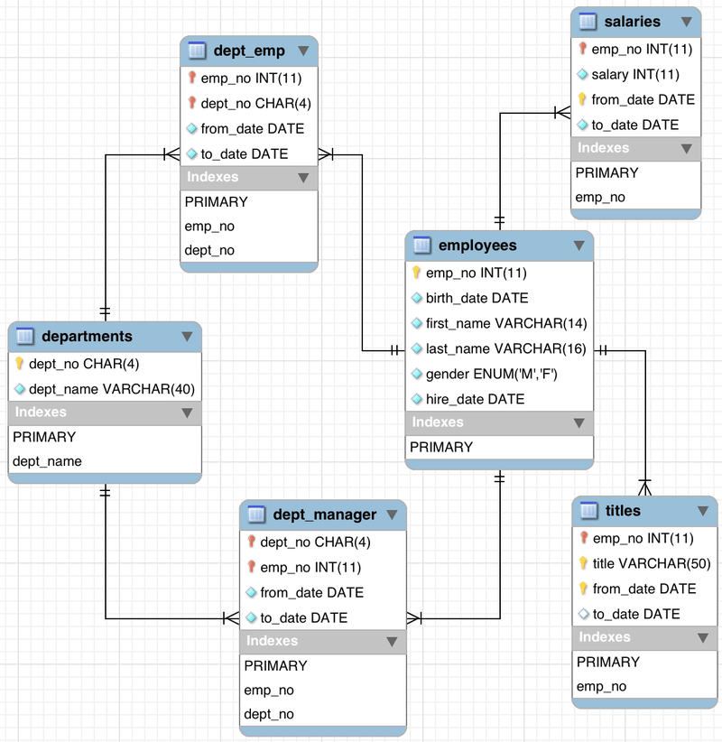

# Execute Plan

실행 계획이란 말 그대로 SQL 문으로 요청한 데이터를 어떻게 불러올 것인지에 관한 계획, 즉 경로를 의미합니다. 지름길을 사용해 데이터를 빠르게 찾아낼 것인지, 지름길이 있어도 멀리 돌아가서 찾을 것인지 미리 확인할 수 있습니다.

실행 계획을 확인하는 키워드로는 EXPLAIN, DESCRIBE, DESC 가 있고, 결과는 모두 같습니다.

<br/><br/>

### MySQL

```java
mysql> explain select * from test;
+----+-------------+-------+------------+------+---------------+------+---------+------+--------+----------+-------+
| id | select_type | table | partitions | type | possible_keys | key  | key_len | ref  | rows   | filtered | Extra |
+----+-------------+-------+------------+------+---------------+------+---------+------+--------+----------+-------+
|  1 | SIMPLE      | test  | NULL       | ALL  | NULL          | NULL | NULL    | NULL | 102112 |   100.00 | NULL  |
+----+-------------+-------+------------+------+---------------+------+---------+------+--------+----------+-------+
1 row in set, 1 warning (0.01 sec)
```

<br/>

mariaDB는 partitions, filtered가 없음

<br/>

## 테스트

[🔗 소스 링크](https://dev.mysql.com/doc/index-other.html)



<br/><br/>

## 기본 실행 계획 항목 분석

<br/>

## 📌 id

*실행 순서*

<br/>

SQL 문이 수행되는 차례를 ID로 표기한 것. 

조인 시 동일한 ID가 표시됨

즉, ID가 작을수록 먼저 수행된 것이고, ID가 같으면 조인되었다는 의미

<br/>

- example code
    
    ```sql
    mysql> EXPLAIN SELECT e.emp_no as 사번, e.first_name as 이름, e.gender as 성별, s.salary,
        -> (SELECT MAX(dept_no) as 매핑 FROM dept_emp WHERE dept_emp.emp_no = e.emp_no)
        -> FROM employees e, salaries s
        -> WHERE e.emp_no = s.emp_no AND e.emp_no = 10001;
    +----+--------------------+-------+------------+-------+---------------+---------+---------+-------+------+----------+------------------------------+
    | id | select_type        | table | partitions | type  | possible_keys | key     | key_len | ref   | rows | filtered | Extra                        |
    +----+--------------------+-------+------------+-------+---------------+---------+---------+-------+------+----------+------------------------------+
    |  1 | PRIMARY            | e     | NULL       | const | PRIMARY       | PRIMARY | 4       | const |    1 |   100.00 | NULL                         |
    |  1 | PRIMARY            | s     | NULL       | ref   | PRIMARY       | PRIMARY | 4       | const |   17 |   100.00 | NULL                         |
    |  2 | DEPENDENT SUBQUERY | NULL  | NULL       | NULL  | NULL          | NULL    | NULL    | NULL  | NULL |     NULL | Select tables optimized away |
    +----+--------------------+-------+------------+-------+---------------+---------+---------+-------+------+----------+------------------------------+
    3 rows in set, 2 warnings (0.00 sec)
    ```
    
<br/><br/>

## 📌 select_type

SQL문을 구성하는 SELECT 문의 유형을 출력하는 항목

SELECT문이 단순히 FROM 절에 위치한 것인지, 서브쿼리인지, UNION 절로 묶인 SELECT문인지 등의 정보를 제공

<br/>

- ✔️ **SIMPLE** : 단순한 SELECT 구문
    
    UNION이나 내부 쿼리가 없는 SELECT 문이라는 걸 의미하는 유형
    
    말 그대로 단순한 SELECT 구문으로만 작성된 경우를 가리킨다
    
    ```sql
    mysql> EXPLAIN SELECT emp_no as 사번, first_name as 이름, gender as 성별
        -> FROM employees WHERE emp_no = 10001;
    +----+-------------+-----------+------------+-------+---------------+---------+---------+-------+------+----------+-------+
    | id | select_type | table     | partitions | type  | possible_keys | key     | key_len | ref   | rows | filtered | Extra |
    +----+-------------+-----------+------------+-------+---------------+---------+---------+-------+------+----------+-------+
    |  1 | SIMPLE      | employees | NULL       | const | PRIMARY       | PRIMARY | 4       | const |    1 |   100.00 | NULL  |
    +----+-------------+-----------+------------+-------+---------------+---------+---------+-------+------+----------+-------+
    1 row in set, 1 warning (0.00 sec)
    ```
    
- ✔️ **PRIMARY** : 서브쿼리나 UNION이 포함된 SQL 문에서 **첫 번째 SELECT 키워드가 작성된 구문**에 표시됨
    
    서브쿼리가 포함된 SQL문이 있을 때 첫 번째 SELECT 문에 해당하는 구문에 표시되는 유형
    
    즉, 서브쿼리를 감싸는 외부 쿼리이거나, UNION이 포함된 SQL 문에서 첫 번째로 SELECT 키워드가 작성된 구문에 표시됨
    
    ```sql
    mysql> EXPLAIN SELECT e.emp_no as 사번, e.first_name as 이름, e.gender as 성별,
        -> (SELECT MAX(dept_no) as 매핑 FROM dept_emp WHERE dept_emp.emp_no = e.emp_no)
        -> FROM employees e
        -> WHERE e.emp_no = 10001;
    +----+--------------------+-------+------------+-------+---------------+---------+---------+-------+------+----------+------------------------------+
    | id | select_type        | table | partitions | type  | possible_keys | key     | key_len | ref   | rows | filtered | Extra                        |
    +----+--------------------+-------+------------+-------+---------------+---------+---------+-------+------+----------+------------------------------+
    |  1 | PRIMARY            | e     | NULL       | const | PRIMARY       | PRIMARY | 4       | const |    1 |   100.00 | NULL                         |
    |  2 | DEPENDENT SUBQUERY | NULL  | NULL       | NULL  | NULL          | NULL    | NULL    | NULL  | NULL |     NULL | Select tables optimized away |
    +----+--------------------+-------+------------+-------+---------------+---------+---------+-------+------+----------+------------------------------+
    2 rows in set, 2 warnings (0.00 sec)
    ```
    
    ### UNION
    
    아래와 같은 UNION ALL 구문으로 통합된 SQL문에서 처음 SELECT 쿼리가 먼저 접근한다는 의미로 PRIMARY가 출력된다.
    
    ```sql
    mysql> EXPLAIN 
        -> 
        -> SELECT employee1.emp_no, employee1.first_name, employee1.last_name
        -> FROM employees employee1
        -> WHERE employee1.emp_no = 10001
        -> 
        -> UNION ALL
        -> 
        -> SELECT employee2.emp_no, employee2.first_name, employee2.last_name
        -> FROM employees employee2
        -> WHERE employee2.emp_no = 10002;
    +----+-------------+-----------+------------+-------+---------------+---------+---------+-------+------+----------+-------+
    | id | select_type | table     | partitions | type  | possible_keys | key     | key_len | ref   | rows | filtered | Extra |
    +----+-------------+-----------+------------+-------+---------------+---------+---------+-------+------+----------+-------+
    |  1 | PRIMARY     | employee1 | NULL       | const | PRIMARY       | PRIMARY | 4       | const |    1 |   100.00 | NULL  |
    |  2 | UNION       | employee2 | NULL       | const | PRIMARY       | PRIMARY | 4       | const |    1 |   100.00 | NULL  |
    +----+-------------+-----------+------------+-------+---------------+---------+---------+-------+------+----------+-------+
    2 rows in set, 1 warning (0.00 sec)
    ```
    
- ✔️ **SUBQUERY** : 독립적으로 수행되는 서브쿼리를 의미
    
    
    ```sql
    mysql> EXPLAIN SELECT 
        ->  (SELECT COUNT(*) FROM dept_emp) as count,
        ->  (SELECT MAX(salary) FROM salaries) as salary;
    +----+-------------+----------+------------+-------+---------------+---------+---------+------+---------+----------+----------------+
    | id | select_type | table    | partitions | type  | possible_keys | key     | key_len | ref  | rows    | filtered | Extra          |
    +----+-------------+----------+------------+-------+---------------+---------+---------+------+---------+----------+----------------+
    |  1 | PRIMARY     | NULL     | NULL       | NULL  | NULL          | NULL    | NULL    | NULL |    NULL |     NULL | No tables used |
    |  3 | SUBQUERY    | salaries | NULL       | ALL   | NULL          | NULL    | NULL    | NULL | 2838426 |   100.00 | NULL           |
    |  2 | SUBQUERY    | dept_emp | NULL       | index | NULL          | dept_no | 16      | NULL |  331143 |   100.00 | Using index    |
    +----+-------------+----------+------------+-------+---------------+---------+---------+------+---------+----------+----------------+
    3 rows in set, 1 warning (0.00 sec)
    ```
    
- ✔️ **DERIVED** : FROM 절에 작성된 서브쿼리
    
    즉, FROM 절의 별도 임시 테이블인 인라인 뷰를 말함
    
    FROM절에 사용된 서브 쿼리로 SELECT 쿼리의 결과로 메모리나 디스크에 임시 테이블을 만드는 경우를 의미한다.
    
    ```sql
    mysql> EXPLAIN
        -> SELECT emp.emp_no, sal.salary
        -> FROM employees as emp,
        ->     (SELECT MAX(salary) as salary 
        ->     FROM salaries 
        ->     WHERE emp_no BETWEEN 10001 AND 20000
        ->     ) as sal;
    +----+-------------+------------+------------+--------+---------------+---------+---------+------+--------+----------+-------------+
    | id | select_type | table      | partitions | type   | possible_keys | key     | key_len | ref  | rows   | filtered | Extra       |
    +----+-------------+------------+------------+--------+---------------+---------+---------+------+--------+----------+-------------+
    |  1 | PRIMARY     | <derived2> | NULL       | system | NULL          | NULL    | NULL    | NULL |      1 |   100.00 | NULL        |
    |  1 | PRIMARY     | emp        | NULL       | index  | NULL          | PRIMARY | 4       | NULL | 299246 |   100.00 | Using index |
    |  2 | DERIVED     | salaries   | NULL       | range  | PRIMARY       | PRIMARY | 4       | NULL | 185516 |   100.00 | Using where |
    +----+-------------+------------+------------+--------+---------------+---------+---------+------+--------+----------+-------------+
    3 rows in set, 1 warning (0.03 sec)
    ```
    
- ✔️ **UNION** : UNION 및 UNION ALL 구문의 첫 번째 SELECT 구문 이후의 SELECT 구문
    
    UNION 및 UNION ALL 구문으로 합쳐진 SELECT 문에서 첫 번째 SELECT 구문을 제외한 이후의 SELECT 구문에 해당한다는 것을 의미
    
    ```sql
    mysql> EXPLAIN 
        -> 
        -> SELECT employee1.emp_no, employee1.first_name, employee1.last_name
        -> FROM employees employee1
        -> WHERE employee1.emp_no = 10001
        -> 
        -> UNION ALL
        -> 
        -> SELECT employee2.emp_no, employee2.first_name, employee2.last_name
        -> FROM employees employee2
        -> WHERE employee2.emp_no = 10002;
    +----+-------------+-----------+------------+-------+---------------+---------+---------+-------+------+----------+-------+
    | id | select_type | table     | partitions | type  | possible_keys | key     | key_len | ref   | rows | filtered | Extra |
    +----+-------------+-----------+------------+-------+---------------+---------+---------+-------+------+----------+-------+
    |  1 | PRIMARY     | employee1 | NULL       | const | PRIMARY       | PRIMARY | 4       | const |    1 |   100.00 | NULL  |
    |  2 | UNION       | employee2 | NULL       | const | PRIMARY       | PRIMARY | 4       | const |    1 |   100.00 | NULL  |
    +----+-------------+-----------+------------+-------+---------------+---------+---------+-------+------+----------+-------+
    2 rows in set, 1 warning (0.00 sec)
    ```
    
- ✔️ **UNION RESULT** : UNION ALL이 아닌 UNION 구문으로 SELECT 절을 결합했을 경우
    
    
    ```sql
    mysql> EXPLAIN
        -> SELECT all_emp.*
        -> FROM (
        -> SELECT MAX(hire_date) FROM employees emp WHERE gender = 'M'
        -> UNION 
        -> SELECT MIN(hire_date) FROM employees emp WHERE gender = 'M'
        -> ) as all_emp;
    +----+--------------+------------+------------+------+---------------+------+---------+------+--------+----------+-----------------+
    | id | select_type  | table      | partitions | type | possible_keys | key  | key_len | ref  | rows   | filtered | Extra           |
    +----+--------------+------------+------------+------+---------------+------+---------+------+--------+----------+-----------------+
    |  1 | PRIMARY      | <derived2> | NULL       | ALL  | NULL          | NULL | NULL    | NULL |      2 |   100.00 | NULL            |
    |  2 | DERIVED      | emp        | NULL       | ALL  | NULL          | NULL | NULL    | NULL | 299246 |    50.00 | Using where     |
    |  3 | UNION        | emp        | NULL       | ALL  | NULL          | NULL | NULL    | NULL | 299246 |    50.00 | Using where     |
    | NULL | UNION RESULT | <union2,3> | NULL       | ALL  | NULL          | NULL | NULL    | NULL |   NULL |     NULL | Using temporary |
    +----+--------------+------------+------------+------+---------------+------+---------+------+--------+----------+-----------------+
    4 rows in set, 1 warning (0.00 sec)
    ```
    
- ✔️ **DEPENDENT SUBQUERY** : FROM절 이외의 서브쿼리가 메인 테이블의 영향을 받는 경우
    
    서브쿼리가 메인 테이블의 영향을 받는 경우 FROM절 이외에 사용된 **서브 쿼리가 바깥쪽 SELECT 쿼리에서 정의된 컬럼을 사용하는 경우**에 해당 서브 쿼리에 표기된다.
    
    ```sql
    mysql> EXPLAIN
        -> SELECT manager.dept_no, (
        -> SELECT emp.first_name 
        ->     FROM employees emp 
        ->     WHERE gender = 'F' AND emp.emp_no = manager.emp_no
        -> ) as name
        -> FROM dept_manager as manager;
    +----+--------------------+---------+------------+--------+---------------+---------+---------+--------------------------+------+----------+-------------+
    | id | select_type        | table   | partitions | type   | possible_keys | key     | key_len | ref                      | rows | filtered | Extra       |
    +----+--------------------+---------+------------+--------+---------------+---------+---------+--------------------------+------+----------+-------------+
    |  1 | PRIMARY            | manager | NULL       | index  | NULL          | dept_no | 16      | NULL                     |   24 |   100.00 | Using index |
    |  2 | DEPENDENT SUBQUERY | emp     | NULL       | eq_ref | PRIMARY       | PRIMARY | 4       | employees.manager.emp_no |    1 |    50.00 | Using where |
    +----+--------------------+---------+------------+--------+---------------+---------+---------+--------------------------+------+----------+-------------+
    2 rows in set, 2 warnings (0.00 sec)
    ```
    
- ✔️ **DEPENDENT UNION** : UNION 또는 UNION ALL을 사용하는 서브쿼리가 메인 테이블의 영향을 받는 경우
    
    UNION 또는 UNION ALL을 사용하는 서브쿼리가 메인 테이블의 영향을 받는 경우로, UNION으로 연결된 단위 쿼리들 중에서 처음으로 작성한 단위 쿼리에 해당되는 경우
    
    즉, UNION으로 연결되는 첫 번째 단위 쿼리가 독립적으로 수행하지 못하고 메인 테이블로부터 값을 하나씩 공급받는 구조이므로 성능상 불리하여 SQL문이 튜닝 대상이 된다
    
    UNION을 사용한 경우 중에서도 UNION으로 결합된 쿼리가 외부 쿼리에 의해 영향을 받는 것을 표기한다.
    
    내부 쿼리가 외부의 값을 참조해서 처리될 때 DEPENDENT 키워드가 추가된다.
    
    ```sql
    mysql> EXPLAIN
        -> SELECT manager.dept_no, (
        -> SELECT emp.first_name FROM employees emp WHERE gender = 'F' AND emp.emp_no = manager.emp_no
        -> UNION 
        -> SELECT emp.first_name FROM employees emp WHERE gender = 'M' AND emp.emp_no = manager.emp_no
        -> ) as name
        -> FROM dept_manager as manager;
    +----+--------------------+------------+------------+--------+---------------+---------+---------+--------------------------+------+----------+-----------------+
    | id | select_type        | table      | partitions | type   | possible_keys | key     | key_len | ref                      | rows | filtered | Extra           |
    +----+--------------------+------------+------------+--------+---------------+---------+---------+--------------------------+------+----------+-----------------+
    |  1 | PRIMARY            | manager    | NULL       | index  | NULL          | dept_no | 16      | NULL                     |   24 |   100.00 | Using index     |
    |  2 | DEPENDENT SUBQUERY | emp        | NULL       | eq_ref | PRIMARY       | PRIMARY | 4       | employees.manager.emp_no |    1 |    50.00 | Using where     |
    |  3 | DEPENDENT UNION    | emp        | NULL       | eq_ref | PRIMARY       | PRIMARY | 4       | employees.manager.emp_no |    1 |    50.00 | Using where     |
    | NULL | UNION RESULT       | <union2,3> | NULL       | ALL    | NULL          | NULL    | NULL    | NULL                     | NULL |     NULL | Using temporary |
    +----+--------------------+------------+------------+--------+---------------+---------+---------+--------------------------+------+----------+-----------------+
    4 rows in set, 3 warnings (0.00 sec)
    ```
    
- ✔️ **UNCACHABLE SUNQUERY** : 메모리에 상주하여 재활용되어야 할 서브쿼리가 재사용되지 못했을 경우
    
    1) 해당 서브쿼리 안에 사용자 정의 함수나 사용자 변수가 포함되는 경우
    
    2) RAND(), UUID() 함수 등을 사용하여 매번 조회 시마다 결과가 달라지는 경우
    
    메모리에 상주하여 재활용되어야 할 서브쿼리가 재사용되지 못했을 때 출력되는 유형
    
    SUBQUERY, DEPENDENT SUBQUERY는 서브 쿼리 결과를 캐시할 수 있는데 특정 조건때문에 캐시를 이용할 수 없을 때 표기된다.
    
    사용자 변수가 서브 쿼리에 들어갔다거나 UUID(), RAND() 같이 결과값이 호출할 때마다 변경되는 함수가 서브 쿼리에 들어갔다거나 NOT-DETERMINISTIC 속성의 스토어드 함수가 서브 쿼리에 들어간 경우가 특정 조건이다.
    
    ```sql
    mysql> EXPLAIN SELECT * FROM employees
        -> WHERE emp_no = (SELECT ROUND(RAND()*1000000));
    +----+----------------------+-----------+------------+------+---------------+------+---------+------+--------+----------+----------------+
    | id | select_type          | table     | partitions | type | possible_keys | key  | key_len | ref  | rows   | filtered | Extra          |
    +----+----------------------+-----------+------------+------+---------------+------+---------+------+--------+----------+----------------+
    |  1 | PRIMARY              | employees | NULL       | ALL  | NULL          | NULL | NULL    | NULL | 299246 |   100.00 | Using where    |
    |  2 | UNCACHEABLE SUBQUERY | NULL      | NULL       | NULL | NULL          | NULL | NULL    | NULL |   NULL |     NULL | No tables used |
    +----+----------------------+-----------+------------+------+---------------+------+---------+------+--------+----------+----------------+
    2 rows in set, 1 warning (0.00 sec)
    ```
    
- ✔️ **MATERIALIZED** : IN 절 구문에 연결된 서브쿼리가 임시 테이블을 생성한 뒤, 조인이나 가공 작업을 수행할 때 출력되는 유형. 즉, IN절의 서브쿼리를 임시 테이블로 만들어서 조인 작업을 수행하는 것
    
    FROM 절이나 IN (subquery) 형태의 쿼리에 사용된 서브 쿼리를 최적화할 때 사용된다. 
    
    이 경우에 보통 서브 쿼리보다 외부 쿼리의 테이블을 먼저 읽어서 비효율적으로 실행되기 마련인데 이렇게 실행하지 않고 서브 쿼리의 내용을 임시테이블로 구체화한 후 외부 테이블과 조인하는 형태로 최적화된다. 이 때, 서브 쿼리가 먼저 구체화되었다는 것을 표기할 때 사용된다.
    
    뭔가 효율적으로 개선된 듯하지만 결국 임시테이블을 사용하므로 엄청 효율적이지는 않다.
    
    ```sql
    mysql> EXPLAIN SELECT * FROM employees
        -> WHERE emp_no IN (SELECT emp_no FROM salaries WHERE from_date > '2020-01-01' AND salary > 200000);
    +----+--------------+-------------+------------+--------+---------------+------------+---------+----------------------------+---------+----------+-------------+
    | id | select_type  | table       | partitions | type   | possible_keys | key        | key_len | ref                        | rows    | filtered | Extra       |
    +----+--------------+-------------+------------+--------+---------------+------------+---------+----------------------------+---------+----------+-------------+
    |  1 | SIMPLE       | employees   | NULL       | ALL    | PRIMARY       | NULL       | NULL    | NULL                       |  299246 |   100.00 | Using where |
    |  1 | SIMPLE       | <subquery2> | NULL       | eq_ref | <auto_key>    | <auto_key> | 4       | employees.employees.emp_no |       1 |   100.00 | NULL        |
    |  2 | MATERIALIZED | salaries    | NULL       | ALL    | PRIMARY       | NULL       | NULL    | NULL                       | 2838426 |    11.11 | Using where |
    +----+--------------+-------------+------------+--------+---------------+------------+---------+----------------------------+---------+----------+-------------+
    3 rows in set, 1 warning (0.00 sec)
    ```
    
<br/><br/>

## 📌  table

테이블명을 표시하는 항목

실행 계획 정보에서 테이블명이나 테이블 명칭을 출력하며, 서브쿼리나 임시 테이블을 만들어서 별도의 작업을 수행할 때는 `<subquery#>` 나 `<derived#>`라고 출력된다.

- **CODE**
    
    ```sql
    mysql> EXPLAIN
        -> SELECT emp.emp_no, sal.salary
        -> FROM employees as emp,
        ->     (SELECT MAX(salary) as salary 
        ->     FROM salaries 
        ->     WHERE emp_no BETWEEN 10001 AND 20000
        ->     ) as sal;
    +----+-------------+------------+------------+--------+---------------+---------+---------+------+--------+----------+-------------+
    | id | select_type | table      | partitions | type   | possible_keys | key     | key_len | ref  | rows   | filtered | Extra       |
    +----+-------------+------------+------------+--------+---------------+---------+---------+------+--------+----------+-------------+
    |  1 | PRIMARY     | <derived2> | NULL       | system | NULL          | NULL    | NULL    | NULL |      1 |   100.00 | NULL        |
    |  1 | PRIMARY     | emp        | NULL       | index  | NULL          | PRIMARY | 4       | NULL | 299246 |   100.00 | Using index |
    |  2 | DERIVED     | salaries   | NULL       | range  | PRIMARY       | PRIMARY | 4       | NULL | 185516 |   100.00 | Using where |
    +----+-------------+------------+------------+--------+---------------+---------+---------+------+--------+----------+-------------+
    3 rows in set, 1 warning (0.03 sec)
    ```
    
<br/><br/>

## 📌  partitions

실행 계획의 부가 정보로, 데이터가 저장된 논리적인 영역을 표시하는 항목

사전에 정의한 전체 파티션 중 특정 파티션에 선택적으로 접근하는 것이 SQL 성능 측면에서 유리합니다.

너무 많은 영역의 파티션에 접근하는 것으로 출력된다면 파티션 정의를 튜닝해봐야 한다

<br/><br/>

## 📌 type

테이블의 데이터를 어떻게 찾을지에 관한 정보를 제공하는 항목

테이블을 처음부터 끝까지 전부 확인할지 아니면 인덱스를 통해 바로 데이터를 찾아갈지 등을 해석할 수 있다.

✔️ **system** : 테이블에 **데이터가 없거나 한 개만 있는 경우**. 성능상 최상의 type

- ✔️ **const** : 조회되는 데이터가 **단 1건**일 때 출력되는 유형. 성능상 유리한 방식
    
    고유 인덱스나 기본 키를 사용하여 단 1건의 데이터에만 접근하면 되므로 속도나 리소스 측면에서 지향해야 할 타입
    
- ✔️ **eq_ref** : 조인이 수행될 때 드리븐 테이블의 데이터에 접근하며, **고유 인덱스** 또는 **기본 키**로 단 **1건의 데이터를 조회하는 방식**
    
    드라이빙 테이블과의 조인 키가 드리븐 테이블에 유일하므로 **조인이 수행될 때 성능상 가장 유리한 경우**
    
    ```sql
    mysql> EXPLAIN 
        -> SELECT dept_emp.emp_no, dept.dept_no, dept.dept_name
        -> FROM dept_emp, 
        ->  departments as dept
        -> WHERE dept_emp.dept_no = dept.dept_no
        -> AND dept_emp.emp_no BETWEEN 10001 AND 10010;
    +----+-------------+----------+------------+--------+-----------------+---------+---------+----------------------------+------+----------+--------------------------+
    | id | select_type | table    | partitions | type   | possible_keys   | key     | key_len | ref                        | rows | filtered | Extra                    |
    +----+-------------+----------+------------+--------+-----------------+---------+---------+----------------------------+------+----------+--------------------------+
    |  1 | SIMPLE      | dept_emp | NULL       | range  | PRIMARY,dept_no | PRIMARY | 4       | NULL                       |   11 |   100.00 | Using where; Using index |
    |  1 | SIMPLE      | dept     | NULL       | eq_ref | PRIMARY         | PRIMARY | 16      | employees.dept_emp.dept_no |    **1** |   100.00 | NULL                     |
    +----+-------------+----------+------------+--------+-----------------+---------+---------+----------------------------+------+----------+--------------------------+
    2 rows in set, 1 warning (0.01 sec)
    ```
    
    → rows 가 1인 것을 확인
    
- ✔️ **ref** : 조인이 수행될 때 드리븐 테이블의 데이터에 접근하며, **고유 인덱스** 또는 **기본 키**로 **2개 이상의 데이터를 조회하는 방식**.
    
    앞에서  설명한 eq_ref 유형과 유사한 방식으로, 조인을 수행할 때 **드리븐 테이블의 데이터 접근 범위가 2개 이상**일 경우
    
    ```sql
    mysql> EXPLAIN 
        -> SELECT emp.emp_no, sal.salary
        -> FROM employees as emp,
        ->  salaries as sal
        -> WHERE emp.emp_no = sal.emp_no;
    +----+-------------+-------+------------+-------+---------------+---------+---------+----------------------+--------+----------+-------------+
    | id | select_type | table | partitions | type  | possible_keys | key     | key_len | ref                  | rows   | filtered | Extra       |
    +----+-------------+-------+------------+-------+---------------+---------+---------+----------------------+--------+----------+-------------+
    |  1 | SIMPLE      | emp   | NULL       | index | PRIMARY       | PRIMARY | 4       | NULL                 | 299246 |   100.00 | Using index |
    |  1 | SIMPLE      | sal   | NULL       | ref   | PRIMARY       | PRIMARY | 4       | employees.emp.emp_no |      9 |   100.00 | NULL        |
    +----+-------------+-------+------------+-------+---------------+---------+---------+----------------------+--------+----------+-------------+
    2 rows in set, 1 warning (0.00 sec)
    ```
    
- ✔️ **ref_or_null** : ref 유형과 비슷하지만 IS NULL 구문에 대해 인덱스를 활용하도록 최적화된 방식
    
    MySQL과 MariaDB는 NULL에 대해 인덱스를 활용하여 검색할 수 있으며, 이때 NULL은 가장 앞쪽에 정렬된다
    
    테이블 검색 시 NULL 데이터양이 적다면 효율적, 하지만 많다면 SQL 튜닝의 대상
    
- ✔️ range : 테이블 내의 연속된 데이터 범위를 조회하는 유형 =, <>, >, >=, <=, IS NULL, <=>, BETWEEN 또는 IN 연산을 통해 범위 스캔을 수행하는 방식
    
    주어진 데이터 범위 내에서 행 단위로 스캔하지만, 스캔할 범위가 넓으면 성능 저하의 요인이 될 수 있음
    
- ✔️ fulltext
- ✔️ index_merge
- ✔️ index
- ✔️ ALL

<br/><br/>

## 📌 possible_keys

옵티마이저가 SQL문을 최적화하고자 사용할 수 있는 인덱스 목록을 출력

다만 실제 사용한 인덱스가 아닌, 사용할 수 있는 후보군의 기본 키와 인덱스 목록만 보여주므로 SQL 튜닝의 효용성을 없다.

<br/><br/>

## 📌 key

옵티마이저가 SQL문을 최적화하고자 사용한 기본 키 (PK) 또는 인덱스명을 의미

어느 인덱스로 데이터를 검색했는지 확인할 수 있으므로, 비효율적인 인덱스를 사용했거나 인덱스 자체를 사용하지 않았다면 SQL 튜닝의 대상

- CODE
    
    ```sql
    mysql> EXPLAIN 
        -> SELECT emp_no
        -> FROM titles
        -> WHERE title = "Engineer";
    +----+-------------+--------+------------+-------+---------------+---------+---------+------+--------+----------+--------------------------+
    | id | select_type | table  | partitions | type  | possible_keys | key     | key_len | ref  | rows   | filtered | Extra                    |
    +----+-------------+--------+------------+-------+---------------+---------+---------+------+--------+----------+--------------------------+
    |  1 | SIMPLE      | titles | NULL       | index | **PRIMARY**       | PRIMARY | 209     | NULL | 442486 |    10.00 | Using where; Using index |
    +----+-------------+--------+------------+-------+---------------+---------+---------+------+--------+----------+--------------------------+
    1 row in set, 1 warning (0.01 sec)
    
    mysql> EXPLAIN SELECT emp_no FROM employees   WHERE first_name = 'Parto';
    +----+-------------+-----------+------------+------+----------------+----------------+---------+-------+------+----------+-------------+
    | id | select_type | table     | partitions | type | possible_keys  | key            | key_len | ref   | rows | filtered | Extra       |
    +----+-------------+-----------+------------+------+----------------+----------------+---------+-------+------+----------+-------------+
    |  1 | SIMPLE      | employees | NULL       | ref  | **IDX_first_name** | IDX_first_name | 58      | const |  228 |   100.00 | Using index |
    +----+-------------+-----------+------------+------+----------------+----------------+---------+-------+------+----------+-------------+
    1 row in set, 1 warning (0.00 sec)
    ```
    

## 📌 key_len

인덱스를 사용할 때는 인덱스 전체를 사용하거나 일부 인덱스만 사용한다.

key_len은 이렇게 사용한 인덱스의 바이트bytes 수를 의미한다.

UTF-8 캐릭터셋 기준으로 INT 데이터 유형은 단위당 4바이트, VARCHAR 데이터 유형은 단위당 3바이트임을 인지하고 key_len을 이해해보자.


## 📌 ref

reference의 약자로, 테이블 조인을 수행할 때 어떤 조건으로 해당 테이블에 엑세스되었는지를 알려주는 정보


- CODE
    
    ```sql
    mysql> EXPLAIN SELECT employees.emp_no, titles.title FROM employees, titles WHERE employees.emp_no=titles.emp_no AND employees.emp_no BETWEEN 10000 AND 10002;
    +----+-------------+-----------+------------+--------+---------------+---------+---------+-------------------------+------+----------+--------------------------+
    | id | select_type | table     | partitions | type   | possible_keys | key     | key_len | ref                     | rows | filtered | Extra                    |
    +----+-------------+-----------+------------+--------+---------------+---------+---------+-------------------------+------+----------+--------------------------+
    |  1 | SIMPLE      | titles    | NULL       | range  | PRIMARY       | PRIMARY | 4       | NULL                    |    2 |   100.00 | Using where; Using index |
    |  1 | SIMPLE      | employees | NULL       | eq_ref | PRIMARY       | PRIMARY | 4       | employees.titles.emp_no |    1 |   100.00 | Using index              |
    +----+-------------+-----------+------------+--------+---------------+---------+---------+-------------------------+------+----------+--------------------------+
    2 rows in set, 1 warning (0.00 sec)
    ```
    

## 📌 rows

SQL 문을 수행하고자 접근하는 데이터의 모든 행row 수를 나타내는 예측 항목. 즉, 디스크에서 데이터 파일을 읽고 메모리에서 처리해야 할 행 수를 예상하는 값이고, 수시로 변동되는 MySQL의 통계정보를 참고하여 산출하는 값이므로 수치가 정확하진 않음 그리고 최종 출력될 행 수가 아니라는 점에 유의해야한다.

SQL문의 최종 결과 건수와 비교해 rows수가 크게 차이 날 때는 불필요하게 MySQL 엔진까지 데이터를 많이 가져왔다는 뜻이므로 SQL 튜닝의 대상이 될 수 있다.

## 📌 filterd

SQL문을 통해 DB엔진으로 가져온 데이터 대상으로 필터 조건에 따라 어느 정도의 비율로 데이터를 제거했는지를 의미하는 항목. 

예를 들어 DB 엔진으로 100건의 데이터를 가져왔다고 가정한다면, 이후 WHERE 절의 **emp_no BETWEEN 1 AND 10** 조건으로 100건의 데이터가 10건로 필터링된다. 

이처럼 100건에서 10건으로 필터링되었으므로 filtered에는 10(%)이라는 정보가 출력된다.

## 📌 extra

SQL문을 어떻게 수행할 것인지에 관한 추가 정보를 보여주는 항목

부가적인 정보들은 세미콜론(;)으로 구분하여 여러가지 정보를 나열할 수 있으며 30여가지 항목으로 정리할 수 있다.

Using index ←→ Using filesort, Using temporary

## 확장된 실행 계획

### EXPLAIN FORMAT = TRADITIONAL

default 포맷


- CODE
    
    ```sql
    mysql> EXPLAIN FORMAT=TRADITIONAL
        -> SELECT *
        -> FROM employees
        -> WHERE emp_no BETWEEN 100000 AND 200000;
    +----+-------------+-----------+------------+-------+---------------+---------+---------+------+-------+----------+-------------+
    | id | select_type | table     | partitions | type  | possible_keys | key     | key_len | ref  | rows  | filtered | Extra       |
    +----+-------------+-----------+------------+-------+---------------+---------+---------+------+-------+----------+-------------+
    |  1 | SIMPLE      | employees | NULL       | range | PRIMARY       | PRIMARY | 4       | NULL | 20086 |   100.00 | Using where |
    +----+-------------+-----------+------------+-------+---------------+---------+---------+------+-------+----------+-------------+
    1 row in set, 1 warning (0.01 sec)
    ```
    

### EXPLAIN FORMAT = TREE


- CODE
    
    ```sql
    mysql> EXPLAIN FORMAT=TREE SELECT * FROM employees WHERE emp_no BETWEEN 100000 AND 200000;
    +-------------------------------------------------------------------------------------------------------------+
    | EXPLAIN                                                                                                     |
    +-------------------------------------------------------------------------------------------------------------+
    | -> Filter: (employees.emp_no between 100000 and 200000)
        -> Index range scan on employees using PRIMARY
     |
    +-------------------------------------------------------------------------------------------------------------+
    1 row in set (0.00 sec)
    ```
    

### EXPLAIN FORMAT = JSON


- CODE
    
    ```sql
    mysql> EXPLAIN FORMAT=JSON SELECT * FROM employees WHERE emp_no BETWEEN 100000 AND 200000;
    +---------------------------------------------------------------------------------------------------------------
    | EXPLAIN
    ----------------------------------------------------------------------------+
    | {
      "query_block": {
        "select_id": 1,
        "cost_info": {
          "query_cost": "4022.44"
        },
        "table": {
          "table_name": "employees",
          "access_type": "range",
          "possible_keys": [
            "PRIMARY"
          ],
          "key": "PRIMARY",
          "used_key_parts": [
            "emp_no"
          ],
          "key_length": "4",
          "rows_examined_per_scan": 20086,
          "rows_produced_per_join": 20086,
          "filtered": "100.00",
          "cost_info": {
            "read_cost": "2013.84",
            "eval_cost": "2008.60",
            "prefix_cost": "4022.44",
            "data_read_per_join": "2M"
          },
          "used_columns": [
            "emp_no",
            "birth_date",
            "first_name",
            "last_name",
            "gender",
            "hire_date"
          ],
          "attached_condition": "(`employees`.`employees`.`emp_no` between 100000 and 200000)"
        }
      }
    } |
    +--------------------------------------------------------------------------------------------
    ```
    

### EXPLAIN FORMAT = ANALYZE