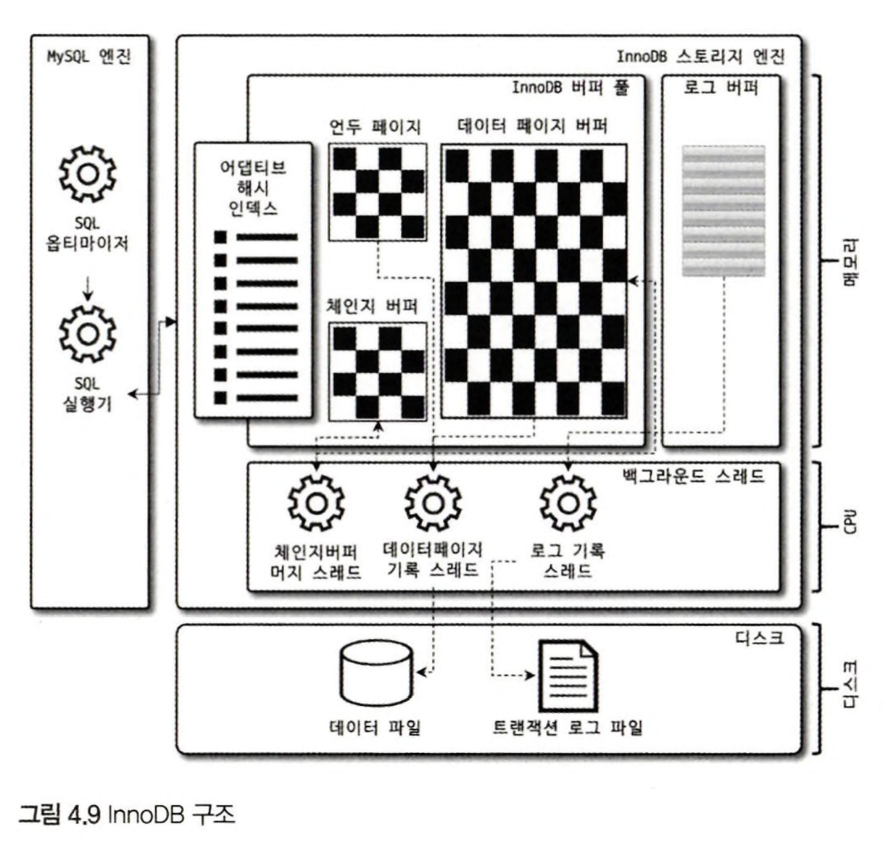
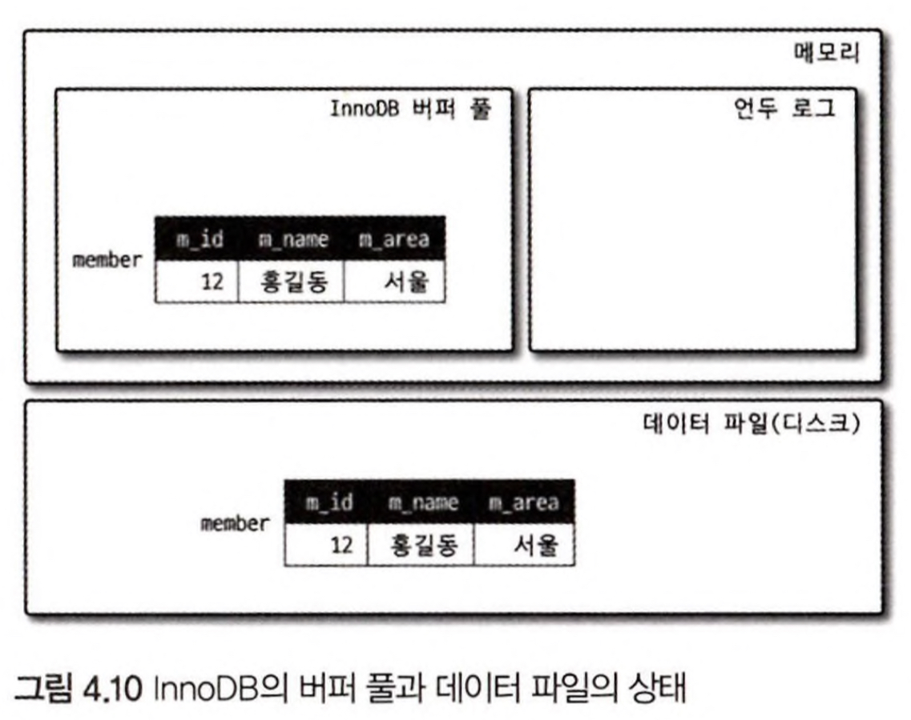

# InnoDB Storage Engine Architecture

*p.98 ~ p.142*

<br/>

**MySQL Server - MySQL engine + storage engine**
*MySQL engine is like Human's brain and Storage engine is hands and foot*


Goal 1. Big Picture: InnoDB Architecture

Goal 2. MVCC: Multi Version Concurrency Control

Goal 3. Indexing (PK Clustering, FK)

Goal 4. MVCC & Locking (Non-Locking Consistent Read, Automation Detection DeadLock)

Goal 5. Buffer (Buffer Pool, Double Writer Buffer, Undo Log, Change Buffer)

Goal 6. Adaptive Hash Index


---

<br />

## Big Picture: InnoDB Architecture

**InnoDB**: MySQL의 스토리지 엔진 가운데 가장 많이 사용되는 InnoDB 스토리지 엔진. 

장점: 거의 유일하게 레코드 기반의 잠금 제공, 높은 동시성 처리가 가능, 안정적, 성능이 뛰어남



아주 간단한 InnoDB Architecture.

1. MySQL Engine 
   1. SQL Optimizer
   2. SQL Executor
2. InnoDB Storage Engine
   1. [Memory] InnoDB Buffer Pool ⊃ Undo Page, Data Page Buffer, Change Buffer
   2. [Memory] Adaptive Hash Index ⊃ intermediary between InnoDB Storage Engine and InnoDB Buffer Pool
   3. [Memory] Log Buffer
   4. [CPU] Background Thread ⊃ Change Buffer Merge Thread, DataPage Record Thread, Log Record Thread
3. Disk
   1. Data File
   2. Transaction Log File


<br /><br />

### Clustering

InnoDB의 모든 테이블은 기본적으로 프라이머리 키를 기준으로 클러스터링되어 저장. = 프라이머리 키 값의 순서대로 디스크에 저장

모든 세컨더리 인덱스는 레코드의 주소 대신 프라이머리 키의 값을 논리적인 주소로 사용된다. 
프라이머리 키가 클러스터링 인덱스이기 때문에 프라이머리 키를 이용한 레인지 스캔은 상당히 빨리 처리될 수 있다.

결과적으로 쿼리의 실행계획에서 프라이머리 키는 기본적으로 다른 보조 인덱스에 비해 비중이 높게 설정 (쿼리의 실행 계획에서 다른 보조 인덱스보다 프라이머리 키가 선택될 확률이 높음, Oracle DBMS의 IOT(Index organized table)와 동일한 구조가 OnnoDB에서는 일반적인 테이블의 구조가 되는 것)
Clustering Index는 [Covering Index, 성능 테스트](https://gngsn.tistory.com/194)에서 많은 힌트를 얻을 수 있음

``` 
**MyISAM**

MyISAM 스토리지 엔진에서는 클러스터링 키를 지원하지 않으며, 때문에 PK와 Secondary Index 구조는 구조적으로 아무런 차이가 없다.
PK는 그저 유니크 제약을 가진 세컨더리 인덱스일 뿐이다. 그리고 MyISAM 테이블의 프라이머리 키를 포함한 모든 인덱스는 물리적인 레코드의 주소 값(ROWID)을 가진다. 
```

#### FK

외래키는 InnoDB 스토리지 엔진 레벨에서 지원하는 기능. (MyISAMm MEMORY 테이블에서는 사용할 수 없음)

InnoDB에서 외래키는 부모 테이블과 자식 테이블 모두 해당 칼럼에 인덱스 생성이 필요, 변경 시에는 반드시 부모 ㅋ테이블이나 자식 테이블에 데이터가 있는지 체크라는 작업이 필요하므로 잠금이 여러 테이블로 전파되고, 그로 인해 데드락이 발생할 대가 많으므로 개발할 때도 외래 키의 존재에 주의하는 것이 좋다.

`foreign_key_checks` system variable: OFF 로 설정하면 외래 키 관계에 대한 체크 작업을 일시적으로 멈출 수 있다. 외래키 관계의 부모 테이블에 대한 작업(ON DELETE CASCADE, ON UPDATE CASCADE Option)도 무시하게 된다.

서비스 문제로 긴급한 상황에서 일시적으로 멈추고 작업할 수 있으며, 레코드 적재나 삭제 등의 작업에서 부가적인 체크가 없기 때문에 훨씬 빠르게 처리할 수 있다. 하지만, 부모와 자식 테이블 내 데이터의 일관성은 개발자의 몫이기 때문에 주의해야한다.


<br/>

### MVCC (Multi Version Concurrency Control)

일반적으로 레코드 레벨의 트랜잭션을 지원하는 DBMS가 제공하는 기능이며, MVCC의 가장 큰 목적은 잠금을 사용하지 않는 일관된 읽기를 제공하는 데 있다. InnoDB는 언두 로그(Undo log)를 이용해 이 기능을 구현한다. 여기서 멀티 버전이라함은 하나의 레코드에 대해 여러 개의 버전이 동시에 관리된다는 의미다. 이해를 위해 격리 수준(Isolation level)이 READ_COMMITTED인 MySQL 서버에서 InnoDB 스토리지 엔진을 사용하는 테이블의 데이터 변경을 어떻게 처리하는지 그림으로 한 번 살펴 보자.

<br/>

``` sql
mysql> CREATE TABLE member ( 
        m_id INT NOT NULL,
        m_name VARCHAR(20) NOT NULL, 
        m_area VARCHAR(100) NOT NULL, 
        PRIMARY KEY (m_id),
        INDEX ix_area (m_area)
    );
mysql> INSERT INTO member (m_id, m_name, m_area) VALUES (12, '홍길동', '서울');
mysql> COMMIT;
```

Insert 문이 실행되면 아래와 같은 상태로 변경된다.

<br/>



<br/><br/>

``` sql
mysql> UPDATE member SET m_area='경기' WHERE m_id=12;
```


UPDATE 문장이 실행되면 커밋 실행 여부와 관계없이 InnoDB의 버퍼 풀은 새로운 값인 '경기'로 업데이트된다. 

그리고 디스크의 데이터 파일에는 체크포인트나 InnoDB의 Write 스레드에 의해 새로운 값으로 업데이트돼 있을 수도 있고 아닐 수도 있다.
(InnoDB가 ACID를 보장하기 때문에 일반적으로는 InnoDB의 버퍼 풀과 데이터 파일은 동일한 상태라고 가정해도 무방하다)

``` sql
mysql> SELECT * FROM member WHERE m_id=12;
```

아직 COMMIT이나 ROLLBACK 이 되지 않은 상태에서 다른 사용자가 위와 같은 쿼리로 작업 중인 레코드를 조회하면 어디에 있는 데이터를 조회할까?

-> MySQL 서버의 시스템 변수(transaction_isolation)에 설정된 격리 수준(isolation level)에 따라 다르다

**READ_UNCOMMITTED**: **InnoDB 버퍼 풀**이나 **데이터 파일**로부터 **변경되지 않은 데이터를 읽어서 반환**. 즉, 데이터가 커밋됐든 아니든 변경된 상태의 데이터를 반환한다. 
**READ_COMITTED or 그 이상의 격리 수준(REPEATABLE_READ, SERIALIZABLE)**: 아직 커밋되지 않았기 때문에 InnoDB 버퍼 풀이나 데이터 파일에 있는 내용 대신 변경되기 이전의 내용을 보관하고 있는 **언두 영역의 데이터를 반환**한다. 이러한 과정을 DBMS에서는 **MVCC**라고 표현한다. 

즉 MVCC란, 하나의 레코드(회원 번호가 12인 레코드)에 대해 2개의 버전이 유지되고, 필요에 따라 어느 데이터가 보여지는지 여러 가지 상황에 따라 달라지는 구조. 여기서는 한 개의 데이터만 가지고 설명했지만 관리해야 하는 예전 버전의 데이터는 무한히 많아질 수 있다(트랜잭션이 길어지면 언두에서 관리하는 예전 데이터가 삭제되지 못하고 오랫동안 관리돼야 하며, 자연히 언두 영역이 저장 되는 시스템 테이블 스페이스의 공간이 많이 늘어나는 상황이 발생할 수도 있다).

정리하자면, UPDATE 쿼리가 실행되면 InnoDB 버퍼 풀은 즉시 새로운 데이터로 변경되고 기존 데이터는 언두영역으로 복사
-> 이 상태에서 COMMIT 명령을 실행하면 InnoDB는 더 이상 의 변경 작업 없이 지금의 상태를 영구적인 데이터로 만들어 버린다. 하지만 롤백을 실행하면 InnoDB 는 언두 영역에 있는 백업된 데이터를 InnoDB 버퍼 풀로 다시 복구하고, 언두 영역의 내용을 삭제해 버린다. 반면, 커밋이 된다고 언두 영역의 백업 데이터가 항상 바로 삭제되는 것은 아니며 언두 영역을 필요로 하는 트랜잭션이 더는 없을 때 비로소 삭제된다.

<br />

### Non-Locking Consistent Read

InnoDB 스토리지 엔진은 MVCC 기술을 이용해 잠금을 걸지 않고 읽기 작업을 수행한다. 잠금을 걸지 않기 때문에 InnoDB에서 읽기 작업은 다른 트랜잭션이 가지고 있는 잠금을 기다리지 않고, 읽기 작업이 가능하다. 격리SERIALIZABLE 아닌 READ_UNCOMMITTED나 READ_COMMITTED, REPEATABLE_READ 수준인 경우 INSERT와 연결되지 않은 순수한 읽기(SELECT) 작업은 다른 트랜잭션의 변경 작업과 관계없이 항상 잠금을 대기하지 않고 바로 실행된다. 그림 4.12에서 특정 사용자가 레코드를 변경하고 아직 커밋 을 수행하지 않았다 하더라도 이 변경 트랜잭션이 다른 사용자의 SELECT 작업을 방해하지 않는다. 이를 ‘잠금 없는 일관된 읽기’라고 표현하며, InnoDB에서는 변경되기 전의 데이터를 읽기 위해 언두 로그를 사용한다.


