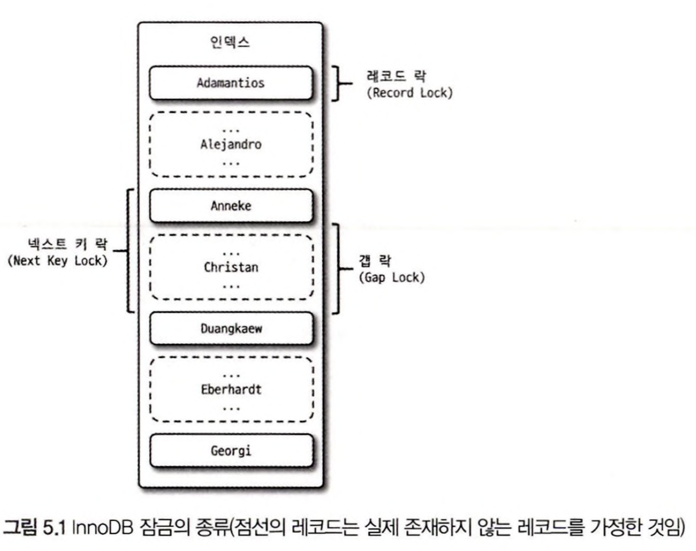

# Transaction & Lock

### Transaction
: 작업의 완정성 보장. 논리적인 작업 셋을 모두 완벽하게 처리 or 처리하지 못할 경우에 원 상태로 복구해서 작업의 일부만 적용되는 현상(Partial update)이 발생하지 않게 만들어주는 기능

### Lock
: 동시성을 제어하기 위한 기능
Transaction과 비슷한 개념같지만 Transaction는 데이터의 정합성을 보장하기 위한 기능.
한 회원 정보 레코드를 여러 커넥션에서 동시에 변경하려고 하는데 잠금이 없다면 하나의 데이터를 여러 커넥션에서 동시에 변경할 수 있게 되고, 결과적으로 해당 레코드의 값은 예측할 수 없는 상태가 된다. 
잠금은 여러 커넥션에서 동시에 동일한 자원(레코드나 테이블)을 요청할 경우 순서대로 한 시점에는 하나의 커넥션만 변경할 수 있게 해주는 역할을 한다. 격리 수준이라는 것은 하나의 트랜잭션 내에서 또는 여러 트랜잭션 간의 작업 내용을 어떻게 공유하고 차단할 것인지를 결정하는 레벨을 의미한다.

## InnoDB 스토리지 엔진의 잠금

InnoDB 스토리지 엔진은 렠코드 기반의 잠금 기능을 제공하며, 잠금 정보가 상당히 작은 공간으로 관리되기 때문에 레코드 락이 페이지 락으로, 또는 테이블 락으로 레벨업되는 경우(락 에스컬레이션)는 없다. 일반 상용 DBMS와는 조금 다르게 InnoDB 스토리지 엔진에서는 레코드 락뿐 아니라 레코드와 레코드 사이의 간격을 잠그는 갭(GAP) 락이 존재한다.

### Record Lock

레코드 자체만을 잠그는 락
사용 DBMS의 레코드 락과 동일한 역할을 한다.
중요한 점은 InnoDB 스토리지 엔진은 레코드 자체가 아니라 인덱스의 레코드를 잠근다는 점

### Gap Lock

### Next Key Lock