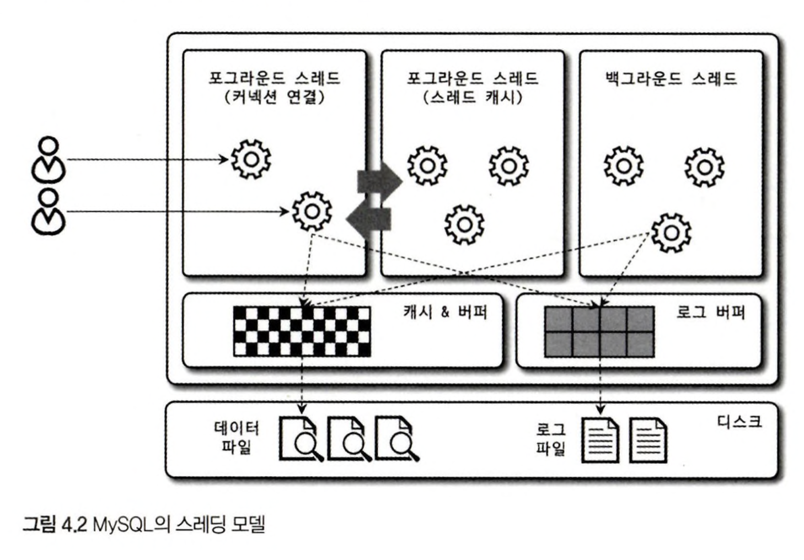

## MySQL Engine Architecture

*p.77p*

<br/>

MySQL Server - MySQL engine + storage engine
사람과 비교하자면 - Brain(MySQL engine) + Hands, foot(Storage engine)

Goal 1. What is MySQL engine?

Goal 2. Default support storage engine: InnoDB, MyISAM storage engine


---


## 4.1 MySQL Engine Architecture


MySQL 고유의 C API나 JDBC, ODBC, .NET 등의 표준 드라이버 제공

모든 언어로 MySQL 서버에서 쿼리를 사용할 수 있게 지원

- MySQL Engine: 요청된 SQL 문장을 분석하거나 최적화하는 등 DBMS의 두뇌에 해당하는 처리를 수행
- Storage Engine: 실제 데이터를 디스크 스토리지에 저장하거나 디스크 스토리지로부터 데이터를 읽어옴

<br/>

### 4.1.1.1 MySQL Engine

MySQL 엔진은 **클라이언트로부터의 접속 및 쿼리 요청을 처리하는 커넥션 핸들러와 SQL 파서 및 전처리기, 쿼리의 최적화된 실행을 위한 옵티마이저로 (중심)구성**

MySQL은 표준 SQL(ANSI SQL) 문법을 지원하기 때문에 표준 문법에 따라 작성된 쿼리는 타 DBMS와 호환되어 실행할 수 있다.

<br/>

### 4.1.1.2 Storage Engine

MySQL 서버에서 MySQL 엔진은 하나지만 스토리지 엔진은 여러 개를 동시에 사용할 수 있다.

아래와 같이 스토리지 엔진을 지정하면 이후 해당 테이블의 모든 읽기 작업이나 변경 작업은 정의된 스토리지 엔진이 처리

``` sql
CREATE TABLE test_table (fd1 INT, td2 INT) ENGINE=INNODB;
```

test_table 테이블은 InnoDB 스토리지 엔진을 사용하도록 지정했다. 

test_table 테이블에 INSERT, UPDATE, DELETE, SELECT, ... 등의 작업이 발생하면 InnoDB 엔진이 처리한다. 그리고 각 스토리지 엔진은 성능 향상을 위해 키 캐시(MyISAM 스토리지 엔진)나 InnoDB 버퍼 풀(InnoDB 스토리지 엔진)과 같은 기능을 내장한다.

<br/>

### 4.1.1.3 Handler API

Handler 요청: MySQL 엔진의 쿼리 실행기에서 데이터를 쓰거나 읽어야 할 때, 각 스토리지 엔진에 쓰기 또는 읽기 시 요청. 

Handler API: Handler 요청에서 사용하는 API.

InnoDB 스토리지 엔진 또한 이 Handler API를 이용해 MySQL 엔진과 데이터를 주고받는다.

Handler API를 통해 얼마나 많은 데이터(레코드) 작업이 있었는지는 `SHOW GLOBAL STATUS LIKE 'Handler%';` 로 확인할 수 있다.

``` sql
mysql> show global status like 'Handler%';
+----------------------------+-----------+
| Variable_name              | Value     |
+----------------------------+-----------+
| Handler_commit             | 606730    |
| Handler_delete             | 5308      |
| Handler_discover           | 0         |
| Handler_external_lock      | 1010387   |
| Handler_mrr_init           | 0         |
| Handler_prepare            | 338212    |
| Handler_read_first         | 6827      |
| Handler_read_key           | 4125708   |
| Handler_read_last          | 27        |
| Handler_read_next          | 81047252  |
| Handler_read_prev          | 122826260 |
| Handler_read_rnd           | 830719    |
| Handler_read_rnd_next      | 357593844 |
| Handler_rollback           | 2566      |
| Handler_savepoint          | 0         |
| Handler_savepoint_rollback | 0         |
| Handler_update             | 2965355   |
| Handler_write              | 126536909 |
+----------------------------+-----------+
18 rows in set (0.46 sec)
```


<br/>

### 4.1.2 MySQL 스레딩 구조



MySQL 서버는 프로세스 기반이 아니라 스레드 기반으로 작동: Foreground Thread, Background Thread 로 구분

MySQL 서버에서 실행 중인 스레드 목록은 다음과 같이 performance_schema DB의 threads 테이블을 통해 확인할 수 있다.

`SELECT thread_id, name, type, processlist_user, processlist_host
FROM performance_schema.threads ORDER BY type, thread_id;`


``` sql
mysql> SELECT thread_id, name, type, processlist_user, processlist_host FROM performance_schema.threads ORDER BY type, thread_id;
+-----------+---------------------------------------------+------------+------------------+------------------+
| thread_id | name                                        | type       | processlist_user | processlist_host |
+-----------+---------------------------------------------+------------+------------------+------------------+
|         1 | thread/sql/main                             | BACKGROUND | NULL             | NULL             |
|         2 | thread/mysys/thread_timer_notifier          | BACKGROUND | NULL             | NULL             |
|         4 | thread/innodb/io_ibuf_thread                | BACKGROUND | NULL             | NULL             |
|         5 | thread/innodb/io_log_thread                 | BACKGROUND | NULL             | NULL             |
|         6 | thread/innodb/io_read_thread                | BACKGROUND | NULL             | NULL             |
|         7 | thread/innodb/io_read_thread                | BACKGROUND | NULL             | NULL             |
|         8 | thread/innodb/io_read_thread                | BACKGROUND | NULL             | NULL             |
|         9 | thread/innodb/io_read_thread                | BACKGROUND | NULL             | NULL             |
|        10 | thread/innodb/io_write_thread               | BACKGROUND | NULL             | NULL             |
|        11 | thread/innodb/io_write_thread               | BACKGROUND | NULL             | NULL             |
|        12 | thread/innodb/io_write_thread               | BACKGROUND | NULL             | NULL             |
|        13 | thread/innodb/io_write_thread               | BACKGROUND | NULL             | NULL             |
|        14 | thread/innodb/page_flush_coordinator_thread | BACKGROUND | NULL             | NULL             |
|        15 | thread/innodb/log_checkpointer_thread       | BACKGROUND | NULL             | NULL             |
|        16 | thread/innodb/log_closer_thread             | BACKGROUND | NULL             | NULL             |
|        17 | thread/innodb/log_flush_notifier_thread     | BACKGROUND | NULL             | NULL             |
|        18 | thread/innodb/log_flusher_thread            | BACKGROUND | NULL             | NULL             |
|        19 | thread/innodb/log_write_notifier_thread     | BACKGROUND | NULL             | NULL             |
|        20 | thread/innodb/log_writer_thread             | BACKGROUND | NULL             | NULL             |
|        21 | thread/innodb/srv_lock_timeout_thread       | BACKGROUND | NULL             | NULL             |
|        22 | thread/innodb/srv_error_monitor_thread      | BACKGROUND | NULL             | NULL             |
|        23 | thread/innodb/srv_monitor_thread            | BACKGROUND | NULL             | NULL             |
|        24 | thread/innodb/buf_resize_thread             | BACKGROUND | NULL             | NULL             |
|        25 | thread/innodb/srv_master_thread             | BACKGROUND | NULL             | NULL             |
|        26 | thread/innodb/buf_dump_thread               | BACKGROUND | NULL             | NULL             |
|        27 | thread/innodb/dict_stats_thread             | BACKGROUND | NULL             | NULL             |
|        28 | thread/innodb/fts_optimize_thread           | BACKGROUND | NULL             | NULL             |
|        29 | thread/mysqlx/worker                        | BACKGROUND | NULL             | NULL             |
|        30 | thread/mysqlx/worker                        | BACKGROUND | NULL             | NULL             |
|        31 | thread/mysqlx/acceptor_network              | BACKGROUND | NULL             | NULL             |
|        35 | thread/innodb/clone_gtid_thread             | BACKGROUND | NULL             | NULL             |
|        36 | thread/innodb/srv_purge_thread              | BACKGROUND | NULL             | NULL             |
|        37 | thread/innodb/srv_worker_thread             | BACKGROUND | NULL             | NULL             |
|        38 | thread/innodb/srv_worker_thread             | BACKGROUND | NULL             | NULL             |
|        39 | thread/innodb/srv_worker_thread             | BACKGROUND | NULL             | NULL             |
|        40 | thread/innodb/srv_worker_thread             | BACKGROUND | NULL             | NULL             |
|        41 | thread/innodb/srv_worker_thread             | BACKGROUND | NULL             | NULL             |
|        42 | thread/innodb/srv_purge_thread              | BACKGROUND | NULL             | NULL             |
|        43 | thread/innodb/srv_worker_thread             | BACKGROUND | NULL             | NULL             |
|        45 | thread/sql/signal_handler                   | BACKGROUND | NULL             | NULL             |
|        47 | thread/mysqlx/acceptor_network              | BACKGROUND | NULL             | NULL             |
|        44 | thread/sql/event_scheduler                  | FOREGROUND | NULL             | NULL             |
|        46 | thread/sql/compress_gtid_table              | FOREGROUND | NULL             | NULL             |
|     15763 | thread/sql/one_connection                   | FOREGROUND | root             | localhost        |
+-----------+---------------------------------------------+------------+------------------+------------------+
44 rows in set (0.11 sec)
```

총 44개의 스레드가 실행 중이며, 41개의 스레드가 백그라운드, 3개만 포그라운드 스레드

마지막 `thread/sql/one_connection` 스레드만 실제 사용자의 요청을 처리하는 포그라운드 스레드.

백그라운드 스레드의 개수는 MySQL 서버의 설정 내용에 따라 가변적일 수 있다.

동일한 이름의 스레드가 2개 이상씩 보이는 것은 MySQL 서버의 설정 내용에 의해 여러 스레드가 동일 작업을 병렬로 처리하는 경우다.

(자세한 내용은 4.1.9절)

<br/>

### Foreground Thread (Client Thread)

Foreground Thread 는 최소한 MySQL 서버에 접속된 클라이언트의 수만큼 존재, 주로 각 클라이언트 사용자가 요청하는 쿼리 문장을 처리한다.

클라이언트 사용자가 작업을 마치고 커넥션을 종료하면 해당 커넥션을 담당하던 스레드는 다시 스레드 캐시(Thread cache)로 되돌아간다.

이미 스레드 캐시에 일정 개수 이상의 대기 중인 스레드가 있으면 스레드 캐시에 넣지 않고 스레드를 종료시켜 일정 개수의 스레드만 스레드 캐시에 존재하게 한다. 

이때, 스레드 캐시에 유지할 수 있는 최대 스레드 개수는 thread_cache_size 시스템 변수로 설정한다.

포그라운드 스레드는 데이터를 MySQL의 데이터 버퍼나 캐시로부터 가져오며, 버퍼나 캐시에 없는 경우에는 직접 디스크의 데이터나 인덱스 파일로부터 데이터를 읽어와서 작업을 처리한다.


