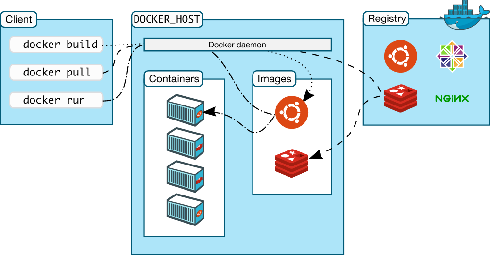

## Docker

<br/>

### Docker의 필요성

**서비스를 제공하기 위한 서버란 ?** 

우리가 작성한 코드를 실제로 서비스하는 컴퓨터

<br/>

**서버에서 작성한 코드를 실행하기 위해서는 다양한 작업이 필요** 

os 설치 , 실행환경 세팅 (java, python 등 ), 어플리케이션 코드( 혹은 빌드 ) 다운로드 , 필요한 다른 코드 다운로드 (library) 등등의 과정이 필요

<br/>

**서비스를 운영할 때 필요한 서버 운영작업**

✔️ 보안 결함이 없어야 함

✔️ 필요할 때 새로운 코드나 ,라이브러리 추가가 가능해야 함

✔️ 많은 수의 요청을 처리하기 위해서 안정성을 위해 최소 2대에서 많게는100+이상의 서버를 관리하게 됨

✔️ 서비스를 운영하다 보면 이외에도 다양한 요청이 들어올 수 있음

EX) ubuntu를 centos로 변경, python3.8 ⇒ python3.9, 새로운 언어 사용 (Node ⇒ Java)

<br/>

👉🏻 위의 운영을 쉽게하기 위해서 **스크립트**를 작성하여 사용

<br/>

서비스가 커지거나 늘어나면 어플리케이션들을 **제대로** 동작시키기 위한 관리가 어려워지는데, 각 서버의 환경에 따른 설정이 필요하고 서비스를 운영하는데 예기치 못한 이슈들을 각각 따로 찾아 해결해야할 수 있기 때문임

<br/><br/>

#### Docker 유용성

서버 운영에서 인프라 관리와 어플리케이션 작성을 분리하자

✔️ 실행환경, 실행하는 코드, 필요한 라이브러리, 설정 파일을 한곳에 정의 ⇒ **도커 이미지**

✔️ 서버에서는 간단하게 이미지를 가지고 실행만 시키면 됨

👉🏻 어플리케이션을 정의하는 이미지를 일관성있게 생성하고, 어디서든 제작할 수 있게 공유하여 실행할 수 있게 만듦. 

<br/>

**즉, 도커란 원하는 프로그램을 쉽게 실행하기 위한 플랫폼**

<br/><br/>

### Virtual Machine VS docker

Docker가 생기기 전, 각각의 application을 원하는 환경에서 실행하는 기술로 가상 머신(VM) 기술이 있었음.


기존 가상화 기술(VMware, VirtualBox) 은 하이퍼바이저를 사용해서 여러개의 운영체재를 하나의 호스트에서 생성해 사용하는 방식

<br/>

**VMware**

✔️ 시스템 자원을 가상화하고, 공간을 생성하는 작업은 **하이퍼바이저를 거치기 때문에 성능의 손실이 발생**.

✔️ OS까지 포함해야하므로 **이미지의 크기 또한 커짐**

✔️ 완벽한 OS를 생성할 수 있다는 장점은 있지만 성능 손실이 있음

<br/>

**Docker**

✔️ 리눅스의 자체 기능인 chroot, namespace, cgroup기술을 사용해서 **프로세스 단위의 격리 환경**을 만들기 때문세 성능 손실이 거의 없음

✔️ OS를 따로 가지고 있는 것이 아니기 때문에 **이미지의 크기도 매우 작음**

✔️ host OS의 kernel을 공유해서 사용하므로 성능 손실이 거의 없음

<br/><br/>

### docker의 구성요소



<br/>

#### docker image

어플리케이션을 실행하기 위한 필요한 모든 것이 생성되어 있는 파일. 단순성과 이식성이 뛰어남.

"제 컴퓨터에서는 잘되는데 .. "가 해결됨 ㅎ

<br/>

#### docker container

container는 image를 사용하여 실행한 것

프로세스의 독립성을 보장하기 위해서 **네트워크나 저장소가 분리**되어 있음

<br/>

#### docker registry

docker image를 저장하는 공간.

수천 개의 Docker 이미지를 관리하는 것이 매우 어렵다는 것을 빠르게 발견

**Docker Hub** : Docker에서 관리하는 호스팅된 Docker registry.  100,000개 이상의 컨테이너 이미지가 존재. Docker Hub에는 NGINX, Logstash, Apache HTTP, Grafana, MySQL, Ubuntu 및 Oracle Linux와 같은 공식 리포지토리의 소프트웨어 및 애플리케이션이 포함되어 있음. 

✔️ 컨테이너를 시작할 때 Docker는 기본적으로 로컬에서 먼저 찾아보고 없으면 Docker Hub에서 해당 이미지를 자동으로 가져옴. 

또한 자체 이미지를 생성하여 Docker Hub에 공용 또는 개인 리포지토리로 푸시할 수도 있음

<br/>

#### dockerd

docker API requests를 받아서 docker object(image, container등)를 관리

<br/>

#### docker client

사용자가 docker를 사용하기 위해서 사용하는 CLI

<br/><br/>

### Docker Command

#### docker run

```
docker run [options] {image_name} [command]
```

`docker run`은 docker image를 사용해서 container를 실행하는 명령어.

<br/>

***Options***

`-p host_port:container_port`  : 컨테이너의 포트와 호스트의 포트를 연결

`-d` : detach. 실행한 docker container가 백그라운드에서 실행된다는 의미

<br/><br/>

#### docker ps

```
$ docker ps
CONTAINER ID   IMAGE                  COMMAND           CREATED          STATUS          PORTS                                       NAMES
74420343a892   docker-test:version1   "python app.py"   20 minutes ago   Up 20 minutes   0.0.0.0:5000->5000/tcp, :::5000->5000/tcp   condescending_joliot
```

<br/>

실행중인 프로세스 출력

**CONTAINER_ID**: container의 고유 ID

**IMAGE**: container를 띄우는데 사용한 image 이름

**COMMAND**: container에서 실행한 command

**CREATED**: conatiner가 생성된 시간

**STATUS**: container의 상태

**PORT**: port를 publish 하는 경우 어떻게 되어 있는지

**NAMES**: container의 이름

<br/><br/>

#### docker stop | kill

```
docker stop {container_id|conatinaer_name}
```

```
docker kill {container_id|conatinaer_name}
```

<br/>

`stop`의 경우에는 **SIGTERM**이라는 신호를 보냄

👉🏻 프로세스 종료. 프로세스의 종료에 필요한 내용을 실행한 후 종료해달라

<br/>

`kill`의 경우에는 **SIGKILL**이라는 신호를 보냄

👉🏻 프로세스 바로 삭제.

<br/><br/>

#### docker restart 

```
docker restart {container_id|container_name}
```

docker container 되살리는 명령어

<br/><br/>

#### docker exec

```
docker exec [options] {container_id|container_name} [command]
```

실행중인 container에서 명령어 실행하기.


*EXAMPLE)*

````
docker exec -ti {id} sh
````

`-i` : interact

`-t` : tty option

<br/><br/>

#### docker rm

```
docker rm {container_id}
```

docker container 삭제하기

<br/><br/>

#### docker history

```
docker hisotry
```

<br/>

docker image는 **layer**라는 개념이 있는데 각각의 이미지가 어떻게 만들어졌는지 `docker history`로 확인할 수 있음

base 이미지에서부터 하나하나 명령어가 실행될 때마다 각각의 레이어가 생성되고, layer가 docker image는 dockerfile로 부터 일관성 있게 생성되기 때문에 동일한 환경에서 동일한 command 로 빌드했을 때, 동일한 결과물을 가져와 사용하기 때문에 빌드하는 시간을 단축시킨다.

<br/><br/>

### Dockerfile

Docker image를 만들기 위해서는 **Dockerfile** 필요

**Dockerfile** ? docker image를 어떻게 생성할 것인지를 정의한 파일

<br/>

*EXAMPLE )*

``` dockerfile
FROM python:3.8

ADD requirements.txt .

RUN pip install -r requirements.txt

ADD templates templates

ADD app.py .

CMD ["python", "app.py"]
```

<br/>

`FROM` : Docker image를 생성할 때 기본으로 사용할 **base image** 지정

`ADD src dst` :  호스트 머신에 있는 파일이나 폴더를, dst라는 위치에 저장

`RUN script` : script를 실행

`CMD` : 생성된 docker image를 실행할 때 자동으로 실행되는 커맨드

<br/><br/>

#### Docker image build

```
docker build [OPTIONS] PATH

ex) docker build -t docker-memo:version1 .
```

<br/>

`-t` 옵션을 사용하면 image에 원하는 이름을 붙일 수 있음

 `{image_name}:{tag}` 의 형태로 사용하며, `{tag}`를 붙이지 않을경우 자동으로 `latest` 로 지정됨

⚠️  동일한 `image_name:tag` 를 사용할경우 **override**되게 됨

<br/>

`docker build .` 에서 `.`는 docker build를 어느 위치에서 실행할 것인지 정의. 이 위치에 따라 `ADD` 커맨드에서 호스트의 파일 위치를 사용하는게 바뀔 수 있음

<br/>

<br/>

#### Docker image 목록 확인하기

``` 
docker images
```

<br/><br/>

#### Docker image 실행하기

```
docker run [OPTIONS] IMAGE[:TAG|@DIGEST] [COMMAND] [ARG...]

// EXAMPLE
docker run -d -p 5000:5000 docker-test:version1
```

<br/><br/>

### docker hub

도커 이미지의 이름을 repository와 동일하게 만들어주어야 함

<br/>

#### docker image 빌드하기

```bash
docker build -t {user_id}/docker-memo:version2 .
```

<br/>

#### docker hub - Sign in

```bash
docker login
# username, password 입력
```

<br/>

#### docker image push

```bash
docker push {user_id}/{image_name}[:{version}]
```


