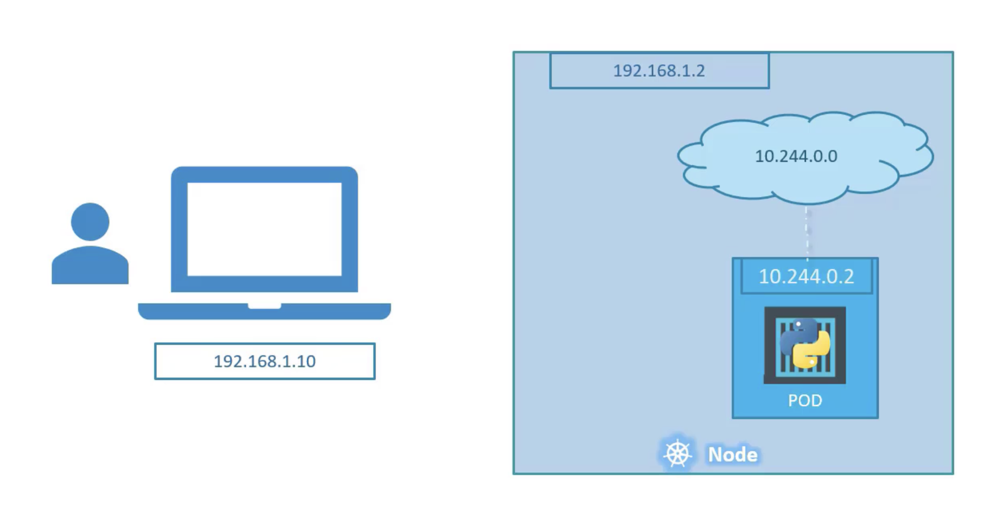
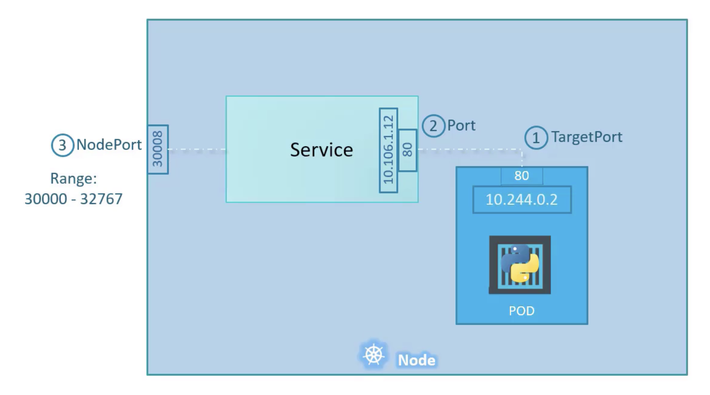
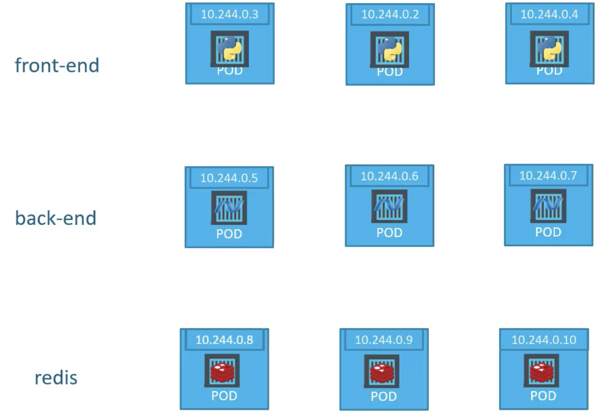
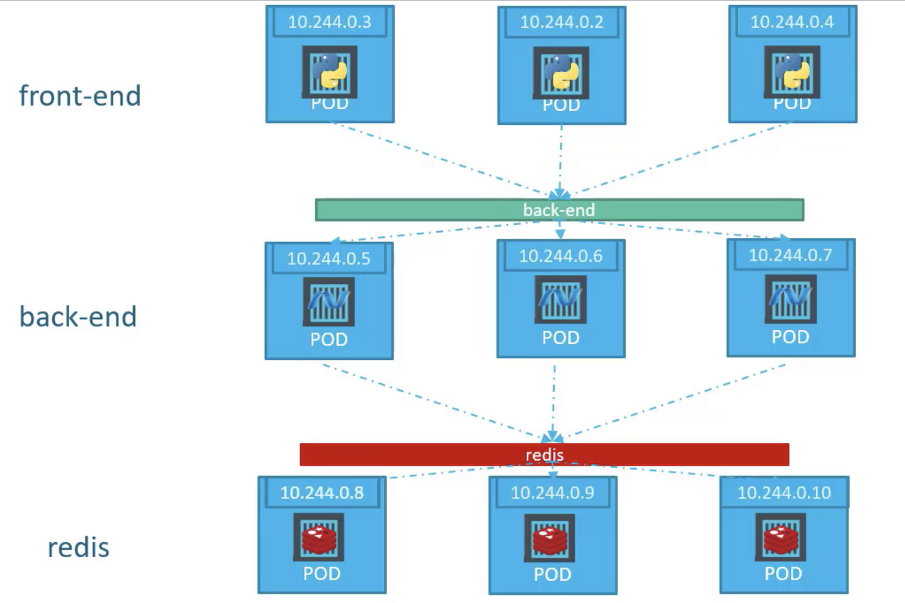

## Kubernetes Service

서비스는 앱 안팎의 구성 요소 간의 통신을 가능하게 함

애플리케이션을 다른 애플리케이션 또는 사용자와 연결하는 걸 도와줌

<br/><br/> 

가령, 위와 같이 설정되어 있다고 가정.

외부 사용자(`192.168.1.10`)는 Pod(`10.244.0.2`)에 직접 접근할 수 없음

접근하는 방법 1. 컨테이너 명령을 붙어서 접근하는 방법

해당 노드에 ssh로 접근한 후, 노드에서 curl을 통해 해당 pod에 접근할 수 있음

접근하는 방법 2. 노드가 GUI를 가지고 있다면 노드 브라우저로 `http://10.244.0.2` 입력 후 접근

하지만, 둘 다 노드 내부에서 접근한 것이기 때문에 목적에 맞지 않음

그래서 외부 사용자와 노드 내부의 POD에 접근할 수 있는 네트워크 매핑이 필요

 => Service 


## Service Types

<br/><br/> 


- **NodePort**: 노드에서 포트를 listen 하고 있다가, 요청이 들어오면 해당 포트를 웹 어플리케이션이 실행하고 있는 POD의 포트로 forwarding
- **CluserIP**: 서비스는 클러스터 내부에 가상 IP를 생성하여 서로 다른 Service 간에 통신을 가능하게 합니다. (가령, 프론트엔드 셋과 백엔드 셋)
- **LoadBalancer**: Cloud Provider 존재 하에, 앱을 위한 프로비저닝된 로드 밸런서

<br/>

### NodePort
노드에서 포트를 listen 하고 있다가, 요청이 들어오면 해당 포트를 웹 어플리케이션이 실행하고 있는 POD의 포트로 forwarding

<br/><br/> 

모든 용어는 Service의 관점
<br/>

**① TargetPort**

실제 웹 서버가 실행되는 Pod 포트 (`80`).
서비스가 인입되는 요청을 포워딩 시켜줘야 하는 Target이기 때문에 TargetPort 이라고 함

<br/>

**② Port**

서비스의 Port (`80`). 사실 서비스는 노드 위에서 실행되는 Virtual Server 같은 존재.
클러스터 내부에는 그 만의 IP 주소를 가지며 (위 그림의 `10.106.1.12`), 해당 IP 주소는 서비스의 ClusterIP 라고 불려짐.

<br/>

**③ NodePort**

노드 자체 Port (`30008`).  
노드 포트는 `30000 ~ 32767` 가용 범위를 가짐

---

**STEP1. Service Spec 정의** 

```yaml
apiVersion: v1
kind: Service
metadata:
  name: myapp-service
  labels:
    app: myapp
    #
spec:
  type: NodePort
  ports:
    targetPort: 80
    port: 80
    nodePort: 30008
    #
```


**STEP2. Pods Selector**

STEP1 까지만 확인하면, Service와 Pod와의 연결점이 없는데, 수많은 Pod 중에서 Service와 연결점을 갖게 하는 건 쿠버네티스에서 자주 보이는 패턴인 `label - selector` 방식

```yaml
# pod-definition
apiVersion: v1
kind: Pod
metadata:
  name: myapp-pod
  labels:
    app: myapp
    type: front-end
spec:
  containers:
    - name: nginx-container
      image: nginx
```

pod 정의 중, `.metadata.labels` 하위를 참고해서 selector 입력

**STEP1. Service Spec 정의**

```yaml
apiVersion: v1
kind: Service
metadata:
  name: myapp-service
  labels:
    app: myapp
    #
spec:
  type: NodePort
  ports:
    targetPort: 80
    port: 80
    nodePort: 30008
  selector:
    app: myapp
    type: front-end
```

<br/><br/>

#### ✔️ NodePort - 한 노드에 여러 Pod가 있을 때

<br/><br/>


서비스는 자동으로 세 개의 Endpoint pod를 선택해, 사용자가 보내는 요청을 전달

추가적인 구성 필요 없음

세 포드의 LoadBalancing 전략으로는 무작위 알고리즘 사용

서비스는 내장된 LoadBalancer 처럼 작용해 다양한 포드로 부하를 분산함


####  ✔️ NodePort - 여러 노드에 Pod가 분산되어 있을 때

<br/><br/>

자동으로 클러스터 내 모든 노드에 걸친 서비스를 생성하고, 클러스터 내 모든 노드 포트를 동일하게 매핑 (모든 Node Port `30080` 사용)

추가적인 구성 필요 없음


<br/><br/>

### ClusterIP

풀 스택 웹 응용 프로그램은 응용 프로그램의 여러 부분을 호스팅하는 다른 종류의 포드가 존재

<br/><br/>

- 프론트엔드 웹 서버를 실행하는 Port
- 백엔드 서버를 실행하는 Port
- Redis 같은 키 값 저장소를 실행하는 Port
- MySQL 같은 Persistent 데이터베이스 Port

서비스나 계층 간의 연결을 확립하는 방법이 필요

- 조건1. 각 앱마다 원하는 통신 대상이 있음
  - 가령, 프론트엔드는 백엔드 서버와, 백엔드 서버는 데이터베이스 혹은 Redis 서비스 등과 통신해야함
- 조건2. 고정 IP
  - 하지만, Pod는 언제든 제거되고 새로 계속 만들어지니 Port는 정적이지 않음

**서비스의 해결책** 

<br/><br/>

각 그룹 별 Pod를 하나로 묶고 하나의 인터페이스를 통해 단일 Port 접근

- 그 하위에서 부터 요청은 무작위로 Port로 전달
- 각 그룹 내에서 확장이 용이해짐

각각의 서비스는 클러스터 내부에서 IP와 그에 할당된 이름을 갖으며, 다른 Pod가 접근할 때 해당 이름을 사용

```yaml
apiVersion: v1
kind: Service
metadata:
  name: back-end
spec:
  type: ClusterIP
  ports:
    targetPort: 80
    port: 80
  selector:
    app: myapp
    type: front-end
```


---


Kubernetes Service:
- 일련의 포드들을 내부적으로 혹은 외부 트래픽에 노출시키는 방법
- 서비스 객체가 생성될 때, 해당 객체는 가상 IP 인 **ClusterIP**를 할당 받음
    - ClusterIP는 Kubernetes 클러스터 내에서만 접근 가능

Kubernetes Endpoint:
- Service 객체 아래에 **모든 IP 주소들과 pod 그룹의 Port**들

- Endpoint Controller: Pod IP 주소 (endpoint) 목록 유지 관리 역할
- Service Controller: Endpoint를 서비스에 구성하는 역할


쿠버네티스 서비스(Kubernetes Service)는 동일한 서비스를 제공하는 포드(pod) 그룹에 대한 하나의 지속적인 진입 지점을 만들기 위해 만드는 자원입니다. 
각 서비스는 서비스가 존재하는 동안 변경되지 않는 IP 주소와 포트를 가지고 있습니다. 
클라이언트는 해당 IP와 포트에 대한 연결을 열 수 있고, 해당 연결은 해당 서비스를 지원하는 포드 중 하나로 라우팅됩니다.
이러한 방식으로 서비스의 클라이언트는 서비스를 제공하는 개별 포드의 위치를 알 필요가 없으므로 해당 포드들이 언제든지 클러스터 주변으로 이동할 수 있습니다.

Kubernetes에서 Service는 클러스터 내 하나 이상의 Pod로 실행 중인 네트워크 애플리케이션을 노출하는 방식입니다.

쿠버네티스에서 서비스의 핵심 목표는 익숙하지 않은 service discovery mechanism을 사용하기 위해 기존 응용프로그램을 수정할 필요가 없다는 것입니다. 클라우드 네이티브 세계를 위해 설계된 코드든 컨테이너화한 이전 응용프로그램이든 포드에서 코드를 실행할 수 있습니다. 고객이 네트워크에서 해당 포드 세트를 사용할 수 있도록 서비스를 사용하여 고객과 상호 작용할 수 있습니다.

배포를 사용하여 앱을 실행하면 배포는 팟을 동적으로 생성하고 파괴할 수 있습니다. 한 순간부터 다음 순간까지 얼마나 많은 팟이 작동하고 건강한지 알지 못하며, 건강한 팟의 이름조차 모를 수 있습니다. 쿠버네티스 팟은 클러스터의 원하는 상태에 맞게 생성되고 파괴됩니다. 팟은 일시적인 리소스입니다. (개개의 팟이 신뢰할 수 있고 내구성이 있다고 기대해서는 안 됩니다.).

각 Pod는 고유한 IP 주소를 가집니다(Kubernetes는 네트워크 플러그인이 이를 보장할 것으로 기대합니다). 클러스터에서 특정 배포 환경에서 한 순간에 실행되는 Pods 집합은 해당 애플리케이션을 실행하는 Pods 집합과 잠시 후에 실행되는 Pods 집합과 다를 수 있습니다.

이로 인해 문제가 발생합니다. 일부 Pods 집합("백엔드"라고 함)이 클러스터 내의 다른 Pods("프론트엔드"라고 함)에 기능을 제공하는 경우, 프론트엔드는 어떤 IP 주소를 파악하고 추적하여 프론트엔드가 워크로드의 백엔드 부분을 사용할 수 있습니까?

서비스를 입력합니다.


---

쿠버네티스의 서비스
Kubernetes의 일부인 Service API는 네트워크를 통해 Pods 그룹을 노출시키는 데 도움이 되는 추상화입니다. 
각 Service 개체는 논리적 엔드포인트 집합(일반적으로 이러한 엔드포인트는 Pods)을 정의하고 이러한 Pods에 액세스할 수 있도록 하는 방법에 대한 정책을 정의합니다.

예를 들어, 3개의 복제본으로 실행되는 상태 비저장 이미지 처리 백엔드를 생각해 보십시오. 이러한 복제본은 대체 가능합니다. 프론트엔드는 어떤 백엔드를 사용하는지 신경 쓰지 않습니다. 백엔드 세트를 구성하는 실제 Pods는 변경될 수 있지만, 프론트엔드 클라이언트는 이 사실을 인식할 필요가 없으며, 백엔드 세트 자체를 계속 추적할 필요도 없습니다.

서비스 추상화는 이러한 디커플링을 가능하게 합니다.

서비스가 목표로 하는 Pods 집합은 일반적으로 정의하는 선택기에 의해 결정됩니다. 서비스 엔드포인트를 정의하는 다른 방법에 대해서는 선택기가 없는 서비스를 참조하십시오.

워크로드가 HTTP를 사용하는 경우 입력을 사용하여 웹 트래픽이 해당 워크로드에 도달하는 방법을 제어할 수 있습니다. 입력은 서비스 유형은 아니지만 클러스터의 진입점 역할을 합니다. 입력을 사용하면 라우팅 규칙을 단일 리소스로 통합하여 클러스터에서 개별적으로 실행되는 워크로드의 여러 구성 요소를 단일 청취자 뒤에서 노출할 수 있습니다.

Kubernetes용 Gateway API는 Ingress 및 Service 이상의 추가 기능을 제공합니다.

파드 집합에서 실행중인 애플리케이션을 네트워크 서비스로 노출하는 추상화 방법
쿠버네티스를 사용하면 익숙하지 않은 서비스 디스커버리 메커니즘을 사용하기 위해 애플리케이션을 수정할 필요가 없다. 쿠버네티스는 파드에게 고유한 IP 주소와 파드 집합에 대한 단일 DNS 명을 부여하고, 그것들 간에 로드-밸런스를 수행할 수 있다.

동기
쿠버네티스 파드는 클러스터 목표 상태(desired state)와 일치하도록 생성되고 삭제된다. 파드는 비영구적 리소스이다. 만약 앱을 실행하기 위해 디플로이먼트를 사용한다면, 동적으로 파드를 생성하고 제거할 수 있다.

각 파드는 고유한 IP 주소를 갖지만, 디플로이먼트에서는 한 시점에 실행되는 파드 집합이 잠시 후 실행되는 해당 파드 집합과 다를 수 있다.

이는 다음과 같은 문제를 야기한다. ("백엔드"라 불리는) 일부 파드 집합이 클러스터의 ("프론트엔드"라 불리는) 다른 파드에 기능을 제공하는 경우, 프론트엔드가 워크로드의 백엔드를 사용하기 위해, 프론트엔드가 어떻게 연결할 IP 주소를 찾아서 추적할 수 있는가?

서비스 로 들어가보자.

서비스 리소스
쿠버네티스에서 서비스는 파드의 논리적 집합과 그것들에 접근할 수 있는 정책을 정의하는 추상적 개념이다. (때로는 이 패턴을 마이크로-서비스라고 한다.) 서비스가 대상으로 하는 파드 집합은 일반적으로 셀렉터가 결정한다. 서비스 엔드포인트를 정의하는 다른 방법에 대한 자세한 내용은 셀렉터가 없는 서비스를 참고한다.

예를 들어, 3개의 레플리카로 실행되는 스테이트리스 이미지-처리 백엔드를 생각해보자. 이러한 레플리카는 대체 가능하다. 즉, 프론트엔드는 그것들이 사용하는 백엔드를 신경쓰지 않는다. 백엔드 세트를 구성하는 실제 파드는 변경될 수 있지만, 프론트엔드 클라이언트는 이를 인식할 필요가 없으며, 백엔드 세트 자체를 추적해야 할 필요도 없다.

서비스 추상화는 이러한 디커플링을 가능하게 한다.
