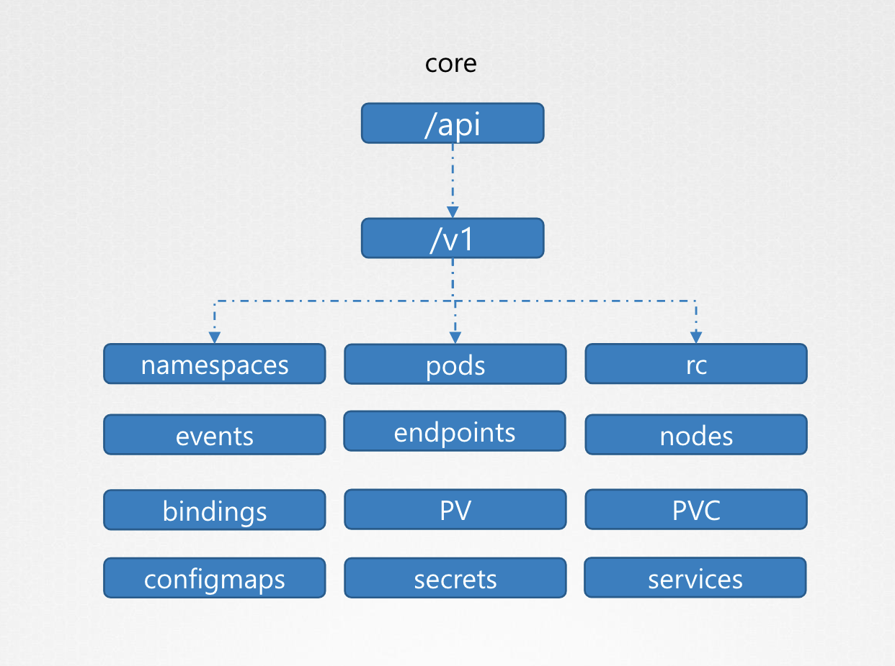
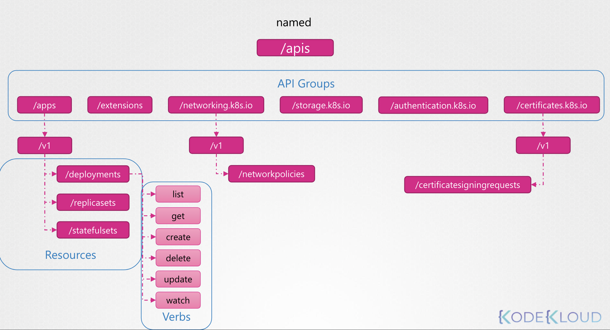

## Persistent Key/Value Store

쿠버네티스는 kube-apiserver 와의 통신으로 API 통신 가능 

```
https://kube-master:6443/version
https://kube-master:6443/api/v1/pods
```

가령, 위와 같은 API를 호출할 수 있음

쿠버네티스 API는 목적에 따라 그룹화

✔️ `/version`: 클러스터 버전 확인

```Bash
❯ curl localhost:6443/version
{
  "major": "1",
  "minor": "29",
  "gitVersion": "v1.29.2",
  "gitCommit": "4b8e819355d791d96b7e9d9efe4cbafae2311c88",
  "gitTreeState": "clean",
  "buildDate": "2024-02-14T22:25:42Z",
  "goVersion": "go1.21.7",
  "compiler": "gc",
  "platform": "linux/arm64"
}
```

✔️ `/healthz`,`/metrics`: 클러스터 상태 모니터링

✔️ `/logs`: 외부 로깅과 통합

✔️ `/api`: **Core Group (핵심 그룹)**. 핵심 기능을 가진 API 

<br/><br/>

✔️ `/apis`: **Named Group(네임드 그룹)**

<br/><br/>

<br>

객체를 선택하고 문서 페이지의 가장 상단에서 그룹 세부 사항이 확인

API 로도 확인할 수 있음

```Bash
❯ curl http://localhost:6443 -k
{
  "paths": [
    "/.well-known/openid-configuration",
    "/api",
    "/api/v1",
    "/apis",
    "/apis/",
    "/apis/admissionregistration.k8s.io",
    "/apis/admissionregistration.k8s.io/v1",
    "/apis/apiextensions.k8s.io",
    "/apis/apiextensions.k8s.io/v1",
    "/apis/apiregistration.k8s.io",
    "/apis/apiregistration.k8s.io/v1",
    "/apis/apps",
    "/apis/apps/v1",
    "/apis/authentication.k8s.io",
    "/apis/authentication.k8s.io/v1",
    "/apis/authorization.k8s.io",
    "/apis/authorization.k8s.io/v1",
    "/apis/autoscaling",
    "/apis/autoscaling/v1",
    "/apis/autoscaling/v2",
    "/apis/batch",
    "/apis/batch/v1",
    ...
```

혹은 `/apis` 를 통해 모든 리소스를 확인할 수 있음

```Bash
❯ curl http://localhost:6443 -k | grep "name"
      "name": "apiregistration.k8s.io",
      "name": "apps",
      "name": "events.k8s.io",
      "name": "authentication.k8s.io",
      "name": "authorization.k8s.io",
      "name": "autoscaling",
      "name": "batch",
      "name": "certificates.k8s.io",
      "name": "networking.k8s.io",
      "name": "policy",
      "name": "rbac.authorization.k8s.io",
      "name": "storage.k8s.io",
      "name": "admissionregistration.k8s.io",
      "name": "apiextensions.k8s.io",
      "name": "scheduling.k8s.io",
      "name": "coordination.k8s.io",
      "name": "node.k8s.io",
      "name": "discovery.k8s.io",
      "name": "flowcontrol.apiserver.k8s.io",
```

---

처음 쿠버네티스 API 서버에 접근하려고 하면, 특정 API (ex. `version`) 을 제외하고는 접근 불가

인증 과정을 거쳐야만 접근할 수 있으며, 인증서와 함께 요청을 보내야만 함

혹은 kubectl proxy 명령어를 사용할 수 있음 

```Bash
❯ kubectl proxy
Starting to serve on 127.0.0.1:8001
```

그럼 이후부터 `127.0.0.1:8001` 를 통해 접근할 수 있음

`kube proxy` 와 `kubectl proxy` 는 다르기 때문에 혼동하면 안됨

