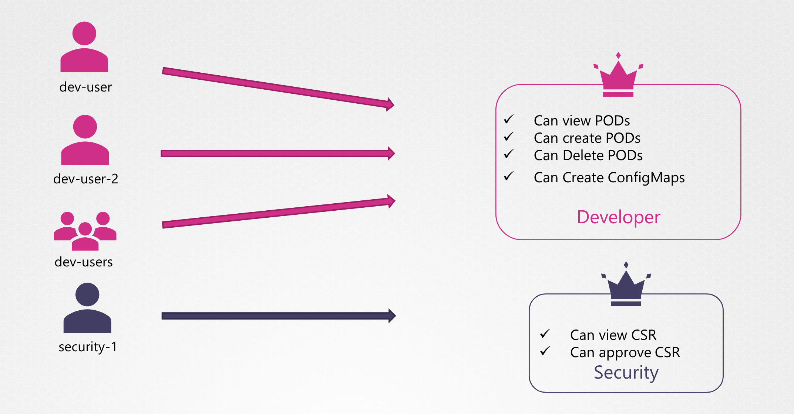

# Authorization

클러스터에 접근 가능한 다양한 방법이 있으며, 누가 어떻게 접근하느냐에 따라 리소스 별 허가 여부를 지정할 필요가 있음

최소한의 액세스만 제공하기 위함

클러스터 내에서 Namespace 를 통해 권한 부여를 관리 - 
클러스터를 팀이나 다른 조직과 공유할 때, 논리적으로 나눠진 네임 스페이스를 이용해 사용자에 대한 접근을 제한

쿠버네테스가 지원하는 인증 방식: Node, ABAC, RBAC, Webhook, AlwaysAllow, AlwaysDeny

<br>

**✔️ Node Authorizer**

kubelet 은 Kube API 에 노드에 대한 정보(ex. 노드 상태)를 지속적으로 보고
 
이 때는 특별한 권한인, `Node Authorizer` 으로 요청

kubelet이 Kube API 에 요청 시 보내는 인증서에는 
`system:node:≪node-name≫` prefix 를 붙이고 시스템 노드 그룹의 일부가 됨

<br>

**✔️ ABAC: Attribute-Based Access Control**
: _속성 기반 접근 제어_

속성 기반 접근 제어은 **사용자** 혹은 **사용자 그룹**과 **권한 허가 세트**를 연결하는 것

가령, `dev-user` 가 Pod를 조회하고, 생성하고, 삭제하는 권한을 갖게 할 때 아래 Json을 API 서버에 전송하면 됨


```JSON
{"kind":  "Policy", "spec": {"user":  "dev-user", "namespace":  "*", "resource":  "pods", "apiGroup": "*"}}
```

파일을 생성해서 관리할 수도 있음

사용자 별로 위와 같은 권한 세트를 정의해줘야 하는데,

```JSON
[{"kind":  "Policy", "spec": {"user":  "dev-user", "namespace":  "*", "resource":  "pods", "apiGroup": "*"}},
{"kind":  "Policy", "spec": {"user":  "prod-user", "namespace":  "*", "resource":  "pods", "apiGroup": "*"}},
{"kind":  "Policy", "spec": {"user":  "aws-user", "namespace":  "*", "resource":  "pods", "apiGroup": "*"}},
{"kind":  "Policy", "spec": {"user":  "admin", "namespace":  "*", "resource":  "pods", "apiGroup": "*"}}]
```

사용자가 생성되고 속성이 변경되면 수기로 하나씩 직접 변경해야함

따라서, 관리가 까다로움

<br>

**✔️ RBAC (Role-Based Access Control)**
: _역할 기반 접근 제어_

**역할 기반 접근 제어**는 **속성 기반 접근 제어** 시 인증 데이터 관리의 어려움을 훨씬 쉽게 만듦 

**속성 기반 접근 제어**처럼 권한 세트를 직접 연결 시키지 않고, **역할을 정의**

사용자에게 부여할 권한 묶음을 **역할**로 정의 후, 해당 역할을 가질 모든 사용자와 연결

가령, 개발자를 위한 역할 생성 후, 모든 개발자에게 해당 역할을 부여

<br><br>

이후 사용자의 액세스 조건이 변경될 때마다 역할을 수정하기만 하면 됨

쿠버네테스 클러스터 내에서 액세스 관리에 좀 더 표준적인 접근법을 제공

<br>

**✔️ Webhook**
: _웹훅_

혹은 모든 권한 관리를 외부 시스템에 맡기고자 할 경우가 있음

사용자가 쿠버네티스에 특정 액션을 요청하면, 쿠버네티스가 외부 시스템에 인가 확인을 위한 요청을 해서 액세스 정보를 확인

즉, 외부 시스템이 사용자의 허용 여부를 결정하게 하는 방식

<br>

**✔️ AlwaysAllow / AlwaysDeny**

항상 허용 / 항상 거부


### Authorization Mode 

인가 모드는 API 서버에 시작 옵션에 명시하며, Default 값은 `AlwaysAllow`

```--authorization-mode=AlwaysAllow```

여러 개의 인가 정책을 적용하고 싶다면 콤마로 연결해서 여러 모드를 순서대로 입력

```--authorization-mode=Node,RBAC,Webhook```

만약 여러 개의 인가 정책이 연결되어 있다면, 순서대로 확인하고 매칭하는 하나를 확인 

```
         Node   →   RBAC   →   Webhook
👩🏻‍💻   →    ❌
```

접근 허용 확인에 실패하면 다음 정책을 살펴봄

<pre><code>         <s>Node</s>   →   RBAC   →   Webhook
👩🏻‍💻   →    ❌     →    ✅
</code></pre>

모듈이 요청을 거부할 때마다 체인의 다음 단계로 넘어가고,
모듈이 요청을 승인하는 순간 더는 확인하지 않고 사용자가 승인을 받음


적용된 mode 를 확인하려면 `kube-apiserver`를 확인하면 됨

```yaml
❯ kubectl describe pod kube-apiserver-controlplane -n kube-system
Name:                 kube-apiserver-controlplane
Namespace:            kube-system
...
Containers:
  kube-apiserver:
    Image:         registry.k8s.io/kube-apiserver:v1.29.0
    Command:
      kube-apiserver
      ...
      --allow-privileged=true
      --authorization-mode=Node,RBAC
      ...
```