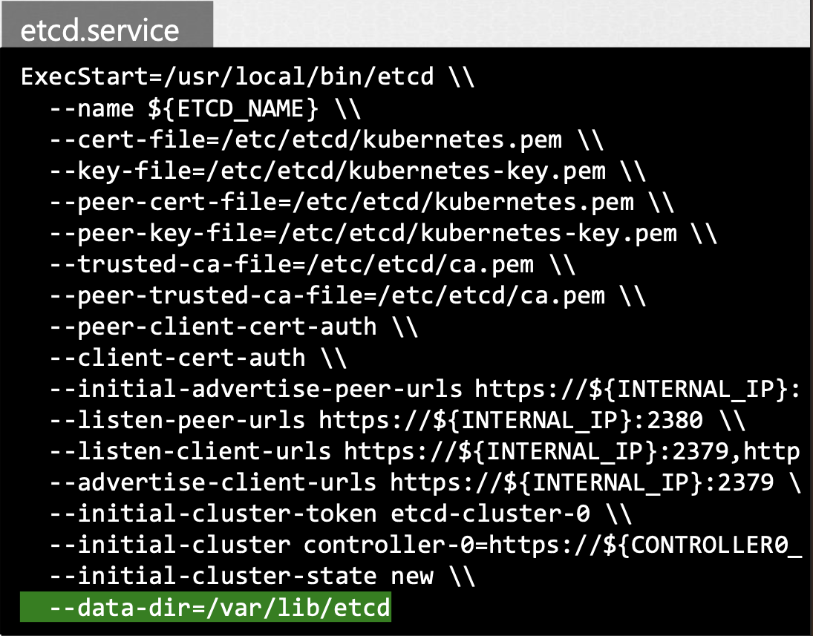
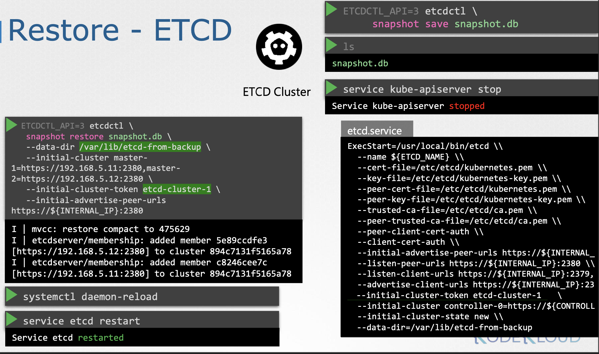

# Backup and Restore Methods

## Backup Candidates

<small>
1. Resource Configuration<br>
2. Etcd Cluster<br>
3. Persistence Volumes
</small>

<br>

### 1. Resource Configuration

**1.1 Declarative: Resource Configuration**

- 정의 파일을 생성해 `kubectl create` 같은 명령형 방식으로 개체를 생성
- 구성을 저장하고 싶을 때 권장되는 접근법: 단일 응용 프로그램에 필요한 모든 개체가 단일 폴더에 정의 파일 형식으로 존재하기 때문
    - 재사용하거나 다른 사람과 공유 용이
    - 정의 파일은 항상 저장 해두어야 하는데, 팀이 관리할 수 있도록 소스 코드 리포지토리에 저장하는 것이 좋음 
    - 소스 코드 리포지토리는 올바른 백업 솔루션으로 구성돼야 하는데, GitHub와 같은 관리 혹은 공공 소스의 리포지토리에서는 걱정할 필요가 없음
    - 응용 프로그램이 다운되어도 해당 파일로 클러스터에 쉽게 재배치할 수 있음

<br>

**1.2 Backup: Resource Configs**

리소스 구성을 백업하는 더 나은 방법은 Kube API 서버를 쿼리하는 것

kubectl을 이용해 Kube API 서버를 쿼리하거나 API 서버에 직접 액세스함으로써 클러스터에 생성된 모든 개체에 대한 리소스 구성을 복사해 저장할 수 있음

가령, 백업 스크립트에서 사용되는 명령 중 하나인 kubectl 유틸리티를 이용해 네임스페이스에 있는 모든 포드, 배포, 서비스를 가져오는 것

```Shell
kubectl get all --all-namespaces -o yaml > all-deploy-services.yaml
```
      
단, 작은 사이즈의 클러스터에서 가능

Heptio에서 Velero 등의 툴들이 쿠버네티스 클러스터 백업을 가져올 때 도움이 될 수 있음

- [Velero](https://velero.io/)
- [Heptio](https://blog.heptio.com/)

<br>

### 2. Etcd Cluster

Etcd 에 클러스터 자체에 관한 정보와 노드 및 클러스터 내부에서 생성된 모든 리소스가 저장

즉, 리소스를 백업하는 대신, Etcd 서버 자체로 백업할 수 있음

Etcd 클러스터는 마스터 노드에 호스트되어 있는데, 구성하는 동안 모든 데이터가 저장될 데이터 디렉터리 명시

<br><br>

**`--data-dir`**: 백업 툴이 지원할 수 있도록 구성될 수 있는 디렉터리

Etcd는 또한 빌트인 스냅샷 솔루션으로 사용할 수도 있음

Etcd 컨트롤 유틸리티의 스냅샷을 이용해 데이터베이스 스냅샷을 찍어낼 수 있음

<br>

#### #1. 백업 스냅샷 생성

**1.1 Save Snapshot**

```Shell
ETCDCTL_API=3 etcdctl snapshot save snapshot.db
```

다른 장소에서 생성하고 싶다면 해당 위치의 전체 경로 입력

<br>

**1.2 Check the Snapshot**

스냅샷에 이름을 붙일 수도 있음

```Shell
ETCDCTL_API=3 etcdctl snapshot status snapshot.db
+-----------+---------------+---------------+---------------+
|   HASH    |   REVISION    |   TOTAL KEYS  |   TOTAL SIZE  | 
+-----------+---------------+---------------+---------------+
|   e63b3fc5    |   473353  | 875 | 4.1 MB  |
+-----------+---------------+---------------+---------------+
```

`etcdctl snapshot status` 명령어를 이용해서 백업의 상태 확인 가능

<br>

#### #2. 백업 스냅샷으로 클러스터 복원

<br>

**2.1. Kube API 서버 서비스 중단**

```Shell
service kube-apiserver stop
```

복원 프로세스는 기타 등등 클러스터를 다시 시작해야 함

모든 클러스터와 연결된 Kube API 서버를 먼저 정지

<br>

**2.2. `etcdctl snapshot restore` 실행**

```Shell
ETCDCTL_API=3 etcdctl snapshot restore snapshot.db \
     --data-dir /var/lib/etcd-from-backup
```

etcd가 백업에서 복구될 때, 새 클러스터 구성을 초기화하고 해당 etcd를 해당 클러스터에 새 멤버로 구성

새 멤버가 실수로 기존의 클러스터에 합류하는 걸 막기 위함

이 명령을 실행하면 **새 데이터 디렉터리가 생성됨**

<br><br>

예시엔 `/var/lib/etcd-from-backup` 파일

<br>

**2.3. `systemctl daemon-reload` 실행**

서비스 데몬을 다시 로드하고 재시작

<br>

**2.4. `service etcd restart` 실행**

Kube API 서버 서비스를 시작

그럼 클러스터가 원래 상태로 돌아옴

**⚠️ 모든 Etcd는 한 명령과 함께 인증서 파일을 지정: 엔드포인트를 Etcd 클러스터와 CS 인증서 기타 등등한 서버 인증서와 키로 지정**

관리되는 쿠버네티스 환경을 사용하는 경우 때로는 Etcd 클러스터에 엑세스조차 안 할 수도 있는데,
그 경우엔 Kube API 서버를 쿼리하는 백업이 아마 더 나은 방법

<br>

#### 3. Persistent Volumes

응용 프로그램이 Persistent Volume과 함께 구성

<br>

---

### Working with ETCDCTL


[etcdctl](https://github.com/etcd-io/etcd)
: etcd를 위한 Command Line client 

백업이나 복원 같은 작업에 etcdctl을 사용하려면 `ETCDCTL_API`를 3으로 설정 (`ETCDCTL_API=3`)

혹은 아래처럼 환경 변수로 지정

```Shell
export ETCDCTL_API=3
```

On the Master Node:
```Shell
master $ export ETCDCTL_API=3
master $ etcdctl version
etcdctl version: 3.3.13
API version: 3.3
master $ 
```

자세한 사항은 `-h` or `--help` flag 입력 후 참고

가령, etcd의 스냅샷을 생성하려면 아래를 입력하고 필수 글로벌 옵션을 기록

```Bash
etcdctl snapshot save -h
```

<br>

ETCD database 가 TLS 사용이 가능하기 때문에, 아래 옵션이 필수:

| option                         | description                                                                          |
|--------------------------------|--------------------------------------------------------------------------------------|
| `--cacert`                     | verify certificates of TLS-enabled secure servers using this CA bundle               |
| `--cert`                       | identify secure client using this TLS certificate file                               |
| `--endpoints=[127.0.0.1:2379]` | This is the default as ETCD is running on master node and exposed on localhost 2379. |
| `--key`                        | identify secure client using this TLS key file                                       |

<br>

도움말 옵션으로 백업 복원에 사용할 수 있는 모든 옵션 확인 가능

```Bash
etcdctl snapshot restore -h
```

<br>

---

### Reference

- https://kubernetes.io/docs/tasks/administer-cluster/configure-upgrade-etcd/#backing-up-an-etcd-cluster
- https://github.com/etcd-io/website/blob/main/content/en/docs/v3.5/op-guide/recovery.md
- https://www.youtube.com/watch?v=qRPNuT080Hk