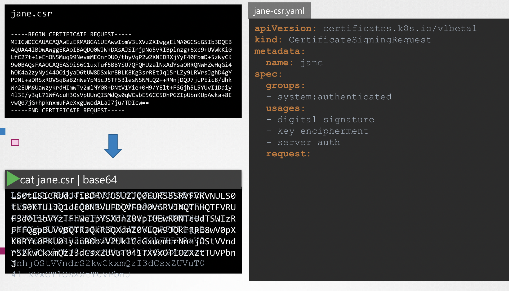
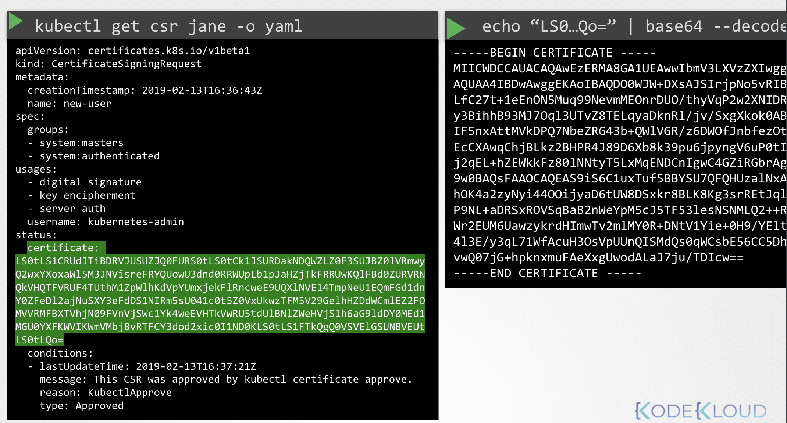
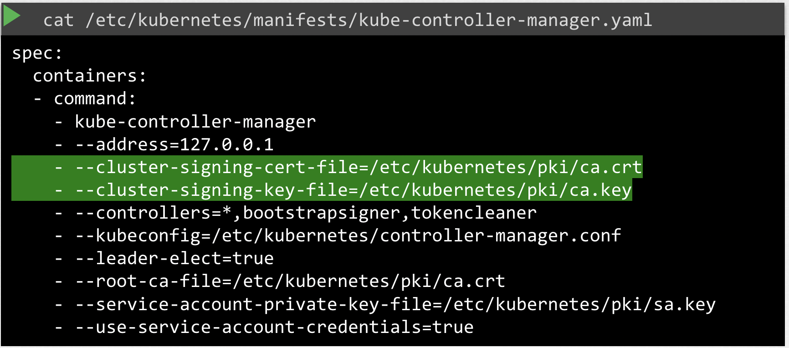

# Certificates API

이미 인증된 구성을 가진 클러스터 내, 클러스터의 유일한 관리자이자 사용자인 **관리자 A** 생성

```
    +----------------------------+ 
    |     Kubernetes Cluster     |
    +----------------------------+
        ↑
      관리자 A   --→  CA
       📜 🔑        🏛️
```

이 때, 새 **관리자 B**를 추가한다면 클러스터에 접속하기 위해 인증서와 키 한 쌍이 필요

```
    +----------------------------+ 
    |     Kubernetes Cluster     |
    +----------------------------+
                   ↑
   🆕관리자 B     관리자 A   --→  CA
                  🔏✅        🏛️
```

<br>

**목표**: 관리자 B에게 클러스터에 접근할 수 있도록 설정

그럼, **관리자 B**는 개인 키를 생성해 인증서 서명 요청(Certificate Singing Request)을 생성해 기존 **관리자 A**에게 전송


```
    +----------------------------+ 
    |     Kubernetes Cluster     |
    +----------------------------+
                   ↑
    관리자 B  -→  관리자 A   --→  CA
     📜 🔑       🔏✅        🏛️
  (csr, key)
```


**관리자 A**는 유일한 관리자이기 때문에, 
해당 '인증서 서명 요청'을 **관리자 A**의 CA 서버로 보내 서명된 인증서를 받음 


```
    +----------------------------+ 
    |     Kubernetes Cluster     |
    +----------------------------+    (private key, 
                   ↑                    root crt)
    관리자 B  -→  관리자 A  -- [ B's 📜 🔑 + CA's 🔏] -→  CA
                 🔏✅       (csr, key)                 🏛️ (A's CA)
```

이 때, CA 서버로 요청 시, CA 서버의 private key와 root 인증서 사용

```
    +----------------------------+ 
    |     Kubernetes Cluster     |
    +----------------------------+
                           ↑
    관리자 B ←- [ 🔏✅ ]- 관리자 A  ←--  CA
     📜 🔑     (crt)     🔏✅        🏛️
```

그리곤 발급받은 인증서를 관리자 B에게 전송

이후 부터는 관리자 B 도 유효한 인증서 키 쌍을 갖게 되어서 클러스터에 접근할 수 있게 있게 됨

```
    +----------------------------+ 
    |     Kubernetes Cluster     |
    +----------------------------+
      ↑           ↑
    관리자 B      관리자 A       CA
     🔏✅        🔏✅        🏛️
```

단, 증명서에는 유효 기간이 있기 때문에 만료 시마다 위 과정을 동일하게 진행해야 함


---

### CA Server

_CA: Certificate Authority_

<br>

CA 서버가 무엇이고, 쿠버네티스 설정 어느 위치인지?

CA는 사실 그저 생성된 키와 인증서 파일 한 쌍임

해당 인증서 파일에 접근하면, 누구든 쿠버네티스 환경에 대한 인증서에 서명할 수 있음

원하는 만큼 원하는 권한을 가진 많은 사용자를 만들 수 있음

따라서, 이 파일들은 안전한 환경에 보호되고 저장되어야 함

완전히 안전한 서버에 설치한다고 했을 때, 해당 서버가 바로 **CA 서버**

<br>

해당 서버에만 인증서 키 파일을 저장

쿠버네티스의 마스터 노드는 이러한 인증서들을 가지는데, 따라서 마스터 노드는 **CA 서버**임

마스터 노드는 CA 인증서와 키 쌍을 생성하며 저장함

---

사용자가 많아질 수록 계속되는 인증 과정이 끊임 없이 반복됨

그래서 쿠버네티스는 Built-in 인증서 API를 가짐

인증서 API 호출을 통해 쿠버네티스로 인증 요청을 바로 전달

```
    +-----------------------------------+ 
    |         Kubernetes Cluster        |
    |                                   |
    |     +--------------------+        |
    |     |  Certificates API  |        |
    |     +---------------↑----+        |
    +------------------[ 📜🔑]----------+
                          ↑
    관리자 B -[ 📜🔑] -→ 관리자 A       CA
                         🔏✅        🏛️
```

<br>

**1. Create CertificateSigningRequest**

이제는 관리자 A가 인증서 서명 요청을 받은 후, 
마스터 노드로 전달해 인증서 CertificateSigningRequest 라는 쿠버네티스 API Object 를 생성

개체가 생성되면 클러스터의 관리자가 모든 인증서 서명 요청을 볼 수 있음

<br>

이후, kubectl 명령어를 통해 쉽게 검토(**2. Review Requests**)하고 승인 (**3. Approve Requests**) 가능

**4. Share Certs to Users**

이후 해당 인증서는 추출되어 사용자와 공유될 수 있음

사용자와 공유하는 과정을 살펴보면 다음과 같음

<br>

**#1. 사용자는 먼저 키 생성**

```Bash
openssl genrsa -out jane.key 2048
```
→ `jane.key` 생성

<br>

**#2. 이름이 적힌 키를 사용해 인증서**

```Bash
openssl req -new jane.key -subj "/CN=jane" -out jane.csr
```
→ `jane.csr` 생성

<br>

**#3. 이름이 적힌 키를 사용해 인증서**

CSR 서명 요청을 생성 후, 관리자한테 요청 전송

관리자가 키를 가지고 CertificateSigningRequest 객체 생성

CertificateSigningRequest 객체는 다른 쿠버네티스 객체와 동일하게 manifest 파일로 생성

`.spec` 섹션 하위의 `.req.request` 에는 전송 받은 인증 요청 파일의 데이터를 Base64 명령을 이용해 인코딩해 기입

<br><br>

인코딩된 텍스트를 `.req.request` 필드로 옮겨서 요청

객체가 생성되면 모든 인증서 서명 요청은 관리자 한해, `kubectl get csr` 명령으로 확인 가능

```Bash
$ kubectl get csr
NAME            AGE     REQUESTOR       CONDITION
jane        10m     admin@example.com       Pending
```

`kubectl certificate approve` 명령을 통해 새로운 요청을 식별하고 승인할 수도 있음

```Bash
$ kubectl certificate approve jane
jane approved!
```

쿠버네티스는 CA 키 페어를 가지고 인증서에 서명한 후, 해당 인증서는 추출해서 사용자와 공유할 수 있음 

YAML 포맷으로 확인하고 싶다면 `kubectl get csr jane -o yaml` 명령어를 사용할 수 있음


<br><br>

디코드 하려면 `base64 --decode` 명령어로 확인 가능

플레인 텍스트으로 인증서를 얻을 수 있음 

---

누가 이걸 다 하는지 알아보자

Control Plane 에는 kube-apiserver, scheduler, controller-manager, Etcd 서버 등등이 존재

모든 인증서 작업은 controller-manager 이 책임을 가짐 

controller-manager에는 CSR-Approving, CSR-Syncing 같은 컨트롤러 존재 

_→ 인증이라는 특정 업무를 수행하는 책임자들_

<br>

인증서에 서명하려면, CA 서버의 루트 인증서와 개인 키가 필요하기 때문에,
controller-manager manifest 구성 파일에는 두 가지 옵션 존재

<br><br>

