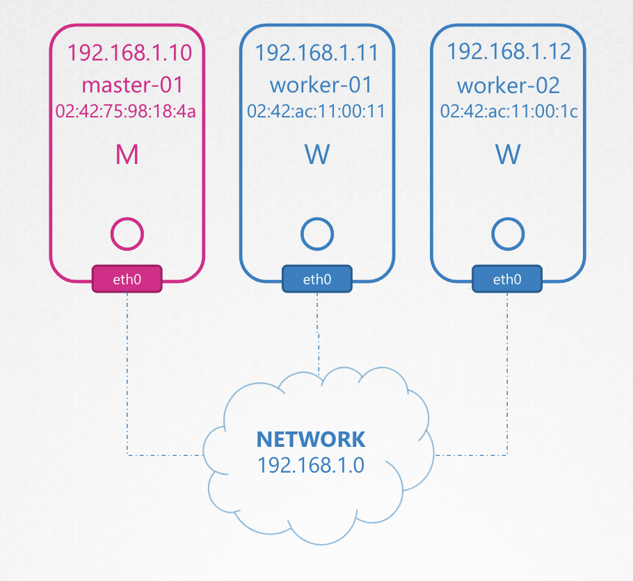
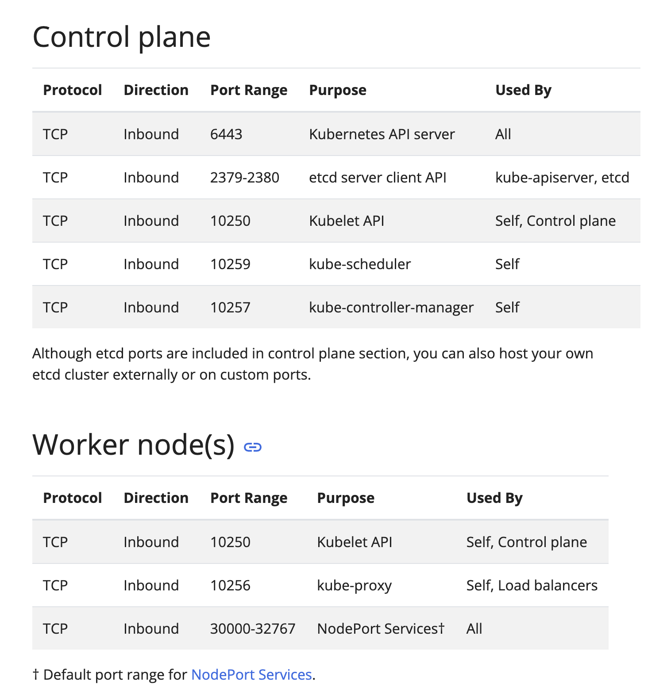
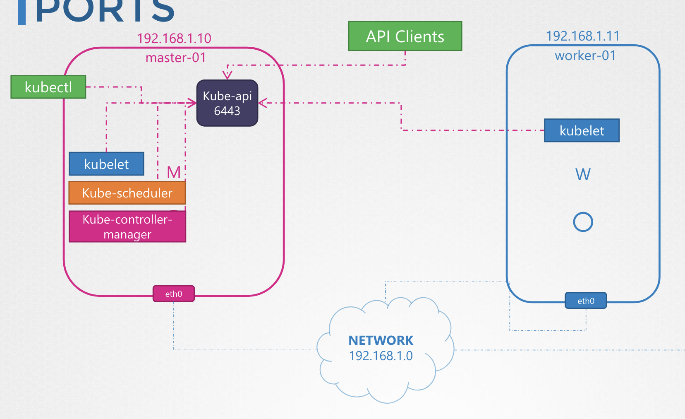
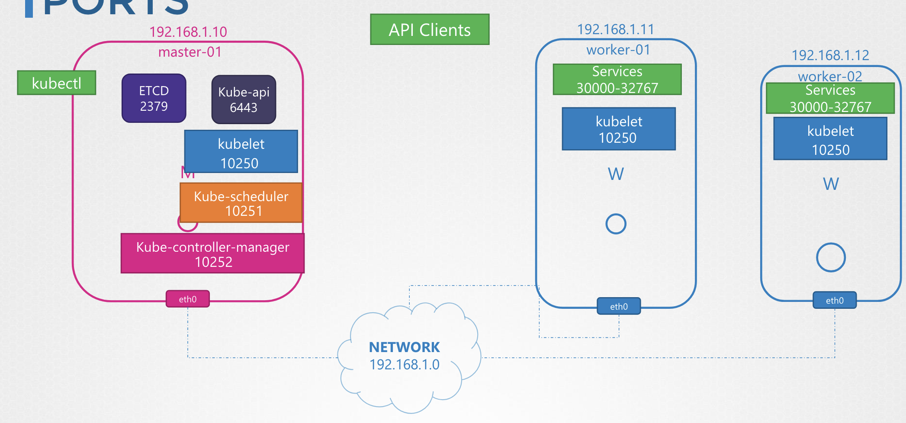
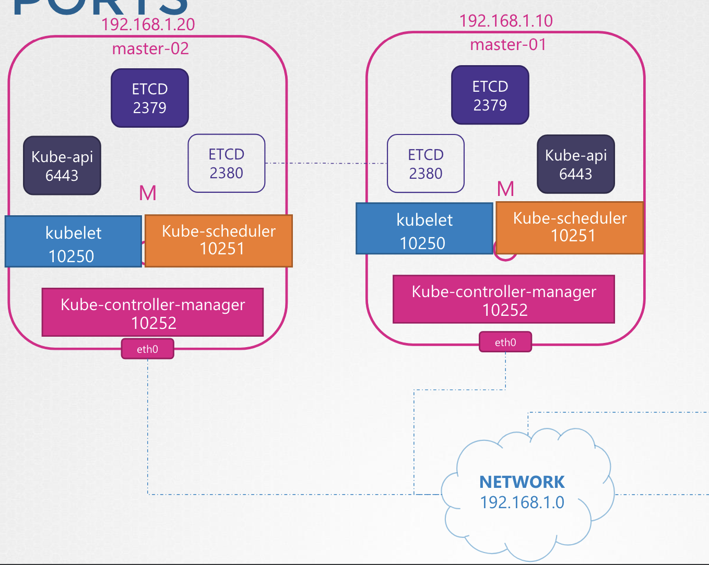

# Cluster Networking

### IP & FQDN

쿠버네티스 클러스터는 마스터와 작업자 노드로 구성됨

각 노드는 네트워크에 연결된 인터페이스가 최소한 하나는 있어야 하고,
각 인터페이스는 반드시 구성된 주소가 있어야 함 

  

호스트는 고유한 호스트 이름 세트와 고유한 MAC 주소가 있어야 함

Control Plane의 다양한 컴포넌트 들에 의해 사용될 아래 포트들도 열려있어야 함

 

[🔗 Kubernetes Check Required Port](https://kubernetes.io/docs/reference/networking/ports-and-protocols/)

  

- `kube-api-server`는 `6443`로 열려있는데, Worker Node, kube kubelet, 외부 users 들 모두가 해당 포트로 접근할 수 있음

  

- Master 과 Worker Node에 있는 `kubelet` 들은 모두 `10250`로 열려 있음

  

- `kube-scheduler`는 `10259`번 포트에 열려있음

- `kube-controller-manager` 는 `10257`번 포트에 열려 있음

- Worker Node 는 `30000-32767` 범위 포트에 열려 있음

- `etcd`는 `2379`번 포트에 열려 있으며, 만약 여러 Master Node가 있다면 `etcd` 클라이언트끼리 통신할 수 있도록 `2380`가 열려 있어야 함

  

