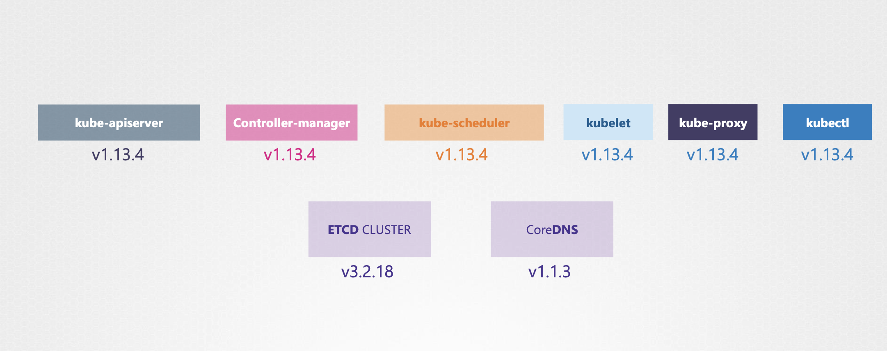
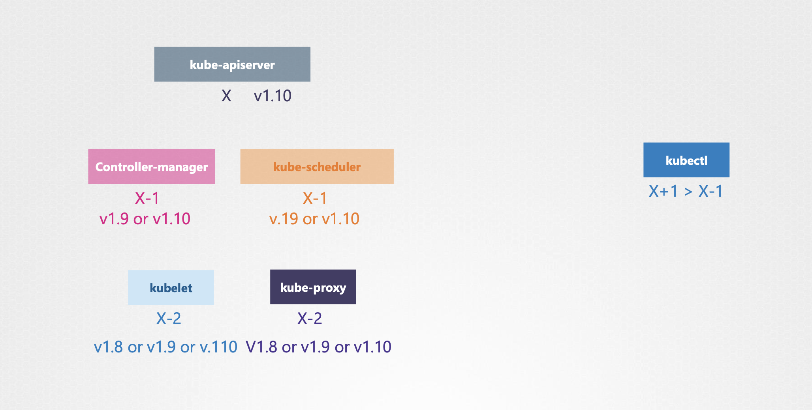
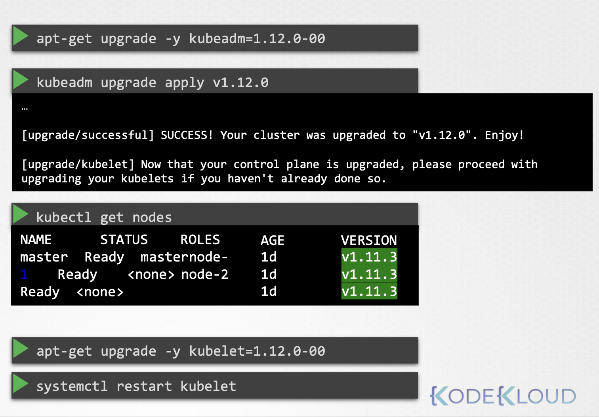

# Cluster Upgrade Process

쿠버네티스가 소프트웨어 컴포넌트 중엔 자체 프로젝트의 버전을 가진 컴포넌트가 존재

<br/><br/>

ETCDNS와 CoreDNS 같은 외부 컴포넌트 종속성을 가짐

핵심 컨트롤 플레인 컴포넌트를 알아보자

모두 같은 버전을 갖는 게 의무는 아님 

컴포넌트는 다른 릴리스 버전이 될 수 있음

`kube-apiserver`는 컨트롤 플레인의 주요 구성요소이고 다른 구성요소들과 통신하는 구성요소이기 때문에,
어떤 다른 구성요소도 kube-apiserver보다 높은 버전으로 되어 있어서는 안됨

`controller-manager`와 `kube-scheduler`는 한 버전은 더 낮출 수 있음

<br/><br/>

`kube-apiserver` 버전이 `X`라면
`controller-manager` 나 `kube-scheduler`는 `X-1` 버전까지 호환 가능
`kubelet`과 `kube-proxy` 는 `X-2` 버전까지 호환 가능

가령, `kube-apiserver` 버전이 `v1.10`라면
`controller-manager` 나 `kube-scheduler`는 `v1.9` 혹은 `v1.10` 버전이어야 하고,
`kubelet`과 `kube-proxy` 는 `v1.8` ~ `v1.10` 버전이어야 함

하지만 kubectl 은 다름: API 서버보다 높은 버전인 `v1.11` 이나 `v1.11`일 수 있음

---


버전 `v1.10`에 있을 때, 쿠버네티스는 버전 `v1.11`과 버전 `v1.12`를 언제든지 출시한다고 가정해보자

쿠버네티스는 최근 세 가지 `minor` 버전까지만 지원

따라서 `v1.12`가 최신 릴리스이므로 Kubernetes는 버전 `v1.12`, `v1.11` 및 `v1.10`을 지원

따라서 `v1.13`이 출시되면 버전 `v1.13`, `v1.12` 및 `v1.11`만 지원됨

권장하는 업데이트 방식은, 한 번에 마이너 버전 하나씩 업그레이드

> ❌ `v1.10` ---X--→ `v1.13`
> 
> ✅️ `v1.10` -→ `v1.11` -→ `v1.12` -→ `v1.13`

<br>

업그레이드 프로세스는 클러스터 설정에 달림

- Cloud Provider: Managed by Cloud Service
- Tools like kubeadm: Kubeadm Command
- Manual Installation: The hard way

가령, Google 클라우드 쿠버네테스와 같이 관리되는 클러스터라면, 쉽게 클릭 몇 번으로 업그레이드하게 해줌

클러스터를 `kubeadm` 같은 툴로 배포했다면, `upgrade plan` 이나 `upgrade apply` 명령어를 통해 업그레이드 해야 함

```Shell
❯ kubeadm upgrade plan
❯ kubeadm upgrade apply
```

직접 하나하나 설치했다면, 하나씩 수기로 업데이트 시켜줘야 함

---

## `kubeadm`

production 환경에 클러스터가 있고, 클러스터의 major 버전을 두 번 업그레이드 한다고 가정해보자

이 클러스터는 master node(이하 마스터 노드) 와 worker node(이하 워커 노드)가 pod 를 통해 사용자에게 제공

<br>
<pre>
          Master     🟠🔴     🟠🟡     🟡🟢
           Node     Node 1   Node 2   Node 3
Version:  v1.10     v1.10    v1.10   v1.10
</pre>
<br>

클러스터 업그레이드는 두 가지 주요 단계가 존재: 마스터 노드 선 업그레이드 → 워커 노드를 후 업그레이드

<br/>

### Upgrading Master Node

마스터가 업그레이드되는 동안
컨트롤 플레인의 컴포넌트, `kube-apiserver` 나 `kube-scheduler`나 `kube-controller-manager` 등, 잠시 다운됨

<br>
<pre>
         <b>Master</b>       🟠🔴     🟠🟡     🟡🟢
          <b>Node</b>      Node 1   Node 2   Node 3
Version: <b>v1.10 🔃</b>    v1.10    v1.10   v1.10
</pre>
<br>

마스터가 다운된다고 클러스터 상의 워커 노드와 앱이 영향을 받는 건 아님

워커 노드에 호스트된 모든 작업은 평소처럼 사용자들에게 제공됨

마스터가 다운됐으니 관리 기능도 다운되는데, kubectl이나 다른 쿠버네티스 API를 통해 클러스터에 액세스할 수 없음

새 앱을 배포하거나 기존 앱을 삭제, 수정할 수 없음

`kube-controller-manager`도 작동 하지 않음 

Pod가 고장 나면 새 포드가 자동으로 생성되지 않겠지만,
노드와 포드가 작동하는한 앱은 실행되고 사용자는 영향을 받지 않음

업그레이드가 완료되고 클러스터가 백업되면 정상적으로 작동

<br>
<pre>
          Master     🟠🔴     🟠🟡     🟡🟢
           Node     Node 1   Node 2   Node 3
Version:  <b>v1.11</b>     v1.10    v1.10   v1.10
</pre>
<br>

이제 마스터 노드의 버전이 `v1.11` 로 업데이트 됨

이후, 워커 노드를 업그레이드할 차례

<br>

### Upgrading Worker Node

워커 노드 업그레이트에는 다양한 방식이 있음 

**Strategy 1. Upgrade All of Them At Once**

첫 번째는 한번에 업그레이드

<br>
<pre>
          Master      🟠🔴        🟠🟡       🟡🟢
           Node      <b>Node 1     Node 2     Node 3</b>
Version:  v1.11     <b>v1.10 🔃    v1.10 🔃   v1.10 🔃</b>
</pre>
<br>

하지만 Pod가 모두 다운되어, 잠시동안 사용자가 앱에 접속할 수 없음

업그레이드가 완료되면 노드가 백업되고, 새 Pod가 스케줄링 된 후 사용자가 다시 접근할 수 있음

다운타임을 발생시키는 전략

<br>

**Strategy 2. Upgrade One Node At a Time**

두 번째 전략은, 한 번에 노드 하나씩 업그레이드

<br>
<pre>
          Master                 🟠🟡🔴      🟡🟢🟠
           Node      <b>Node 1</b>     Node 2     Node 3
Version:  v1.11     <b>v1.10 🔃</b>     v1.10      v1.10
</pre>
<br>

첫 번째 노드를 업그레이드 할 때, Pod가 두 번째와 세 번째 노드로 이동

첫 번째 노드가 업그레이드 된 후, 두 번째 노드를 업데이트

<br>
<pre>
          Master    🟠🟡🟢                  🟡🔴🟠
           Node     Node 1     <b>Node 2</b>     Node 3
Version:  v1.11     v1.11     <b>v1.10 🔃</b>     v1.10
</pre>
<br>


첫 번째와 세 번째 노드로 작업이 이동

마지막, 세 번째 노드가 업데이트 될 때, 이전과 마찬가지로 다른 노드로 Pod가 이동

<br>

**Strategy 3. Add New Nodes to the Cluster**

세 번째 전략은 클러스터에 **새로운 소프트웨어 버전을 가진 노드**를 추가

<br>
<pre>
          Master     🟠🔴     🟠🟡     🟡🟢     
           Node     Node 1   Node 2   Node 3   <b>Node 4</b>
Version:  v1.11     v1.10    v1.10    v1.10    <b>v1.11</b>
</pre>
<br>

클라우드 환경에서 특히 편리: 새 노드를 프로비전하고 오래된 걸 해체할 수 있기 때문

Pod을 새 노드로 옮기고 옛 노드를 제거

<br>
<pre>
          Master              🟠🟡      🟡🟢     🟠🔴     
           Node     <s>Node 1</s>   Node 2   Node 3   <b>Node 4</b>
Version:  v1.11     <s>v1.10</s>    v1.10    v1.10    <b>v1.11</b>
</pre>
<br>

새 소프트웨어 버전의 노드로 모두 교체될 때까지 진행

---

이 클러스터를 `v1.11`에서 `v1.13` 으로 업그레이드 할 때, 
`kubeadm`에는 클러스터 업그레이드를 돕는 명령이 있음

```Shell
❯ kubeadm upgrade plan
```

`kubeadm upgrade plan` 명령을 실행하면 많은 정보를 얻을 수 있음

<br><br>

현재 클러스터 버전과 kubeadm 도구 버전 쿠버네테스의 안정적인 최신 버전을 보여줌

그리곤 모든 컨트롤 플레인 컴포넌트과 해당 버전, 또 어떤 버전으로 업데이트 가능한지 보여줌

**⚠️ kubeadm은 kubelet을 업데이트 시키지 않음 (`N\A`)**

마지막으로, 클러스터를 업데이트하려면 kubeadm 툴 자체를 업그레이드 해야 함

---

### kubeadm - upgrade

#### 1. upgrade kubeadm

kubeadm 업데이트 먼저 진행 

```Bash
❯ apt-get upgrade -y kubeadm=1.12.0-00
...
[upgrade/successful] SUCCESS! Your cluster was upgraded to "v1.12.0". Enjoy!
[upgrade/kubelet] Now that your control plane is upgraded, please proceed with upgrading your kubelets if you haven't already done so.
```

kubeadm 버전을 `v1.11.0` 에서 `v1.12.0`으로 업그레이드

이후 클러스터를 해당 커맨드를 통해 업그레이드 

```Shell
❯ kubeadm upgrade apply v1.12.0
```

명령이 완료되면 컨트롤 플레인의 구성요소는 1.12로 변경됨

하지만, `kubectl get nodes` 명령어로 확인해보면, 아직 버전이 1.11이 것을 볼 수 있음 

이유는 api 서버 자체의 버전이 아니라 api 서버에 등록된 각 노드들의 kubelet 버전을 보여주는 것 **(?)** 

<br><br>

---

#### 2. upgrade kubelet

다음 단계는 마스터 노드에 있는 kubelet 업그레이드

여러분의 setup에 따라 마스터 노드에서 kubelet이 실행될 수도 아닐 수도 있음

이 경우 kubeadm과 함께 배포된 클러스터는 마스터 노드에 kubelet가 있는데, 컨트롤 플레인 컴포넌트를 실행하는 데 사용됨

apt-get 업그레이드 쿠벨렛 명령을 실행

```Shell
❯ apt-get upgrade -y kubelet=1.12.0-00
```

패키지가 업그레이드 되고 난 후, kubelet 서비스를 다시 시작

```Shell
❯ systemctl restart kubelet
```

`kubectl get nodes` 명령을 실행하면 마스터가 `v1.12.0`로 업그레이드 됨

```Shell
❯ kubectl get nodes
NAME    STATUS  ROLES   AGE   VERSION
master  Ready   master  1d
node-1  Ready   <none>  1d  v1.11.3 
node-2  Ready   <none>  1d  v1.11.3
```

---

#### 3. upgrade worker nodes

다음 단계는 워커 노드 업그레이드

한 노드 씩 작업을 위해 Pod를 이동시켜야 함

`kubectl drain` 명령어로 노드에서 모든 Pod를 안전하게 종료하 다른 노드의 일정을 재조정할 수 있음

```Shell
❯ kubectl drain node-1
```

그 다음, 워커 노드에서 `kubeadm`과 `kubelet` 패키지 업그레이드

```Shell
❯ apt-get upgrade -y kubeadm=1.12.0-00
❯ apt-get upgrade -y kubealet=1.12.0-00
❯ kubeadm upgrade node config --kubelet-version v1.12.0
❯ systemctl restart kubelet
```

그런 다음 kubeadm 도구 업그레이드 명령을 이용해 새 kubelet 버전을 위해 노드 구성을 업데이트

이후 kubelet 서비스 다시 시작

이제 노드는 새 소프트웨어 버전(v1.12)과 함께 재생성

하지만 노드를 비울 때 `Unscheduleable` 표시를 했기 때문에 이를 취소해야 다시 스케줄링을 할 수 있음 

이 때, `kubectl uncordon` 명령어를 통해 스케줄링을 걸 수 있음 

```Shell
❯ kubectl uncordon node-1
```

하지만 이는 단지 Schedule 가능하다는 표시를 한 거지, Pod가 이 노드로 바로 돌아온다는 걸 의미하진 않음

이렇게 모든 노드를 업그레이드 함
