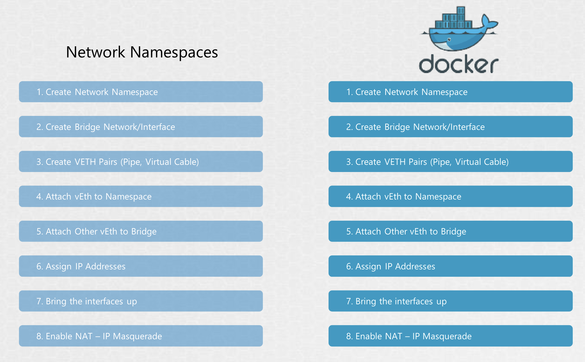

# CNI - Container Networking Interface

Docker가 브리지 네트워크를 생성하는데, 다른 이름 패턴을 쓴다는 점만 빼면 거의 비슷한 과정을 거침

<br><br>

Rocket, Mesos, 쿠버네티스처럼 네트워킹을 구성하는 다른 솔루션들도 같은 방식으로 네트워킹 문제를 해결함

모두가 따를 수 있는 하나의 표준 접근법을 만듦

다양한 솔루션에서 네트워킹 문제 해결을 하나의 프로그램 혹은 코드로 옮겨서 공용화

가령, 브리지 네트워크를 생성하는 과정을 담은 스크립트를 만들어,
프로그램을 실행하고 특정 네트워크 네임스페이스에 이 컨테이너를 추가하고 싶다고 명시할 수 있음

그런데, 각 컨테이너 환경에서 원하는 사항을 모두 맞춰서 인수와 명령을 만들어야 할까?

생성한 스크립트가 모든 컨테이너 런타임에 맞게 작동되게 하려면 어떻게 해야 할까?

모두가 단일 표준 집합을 준수하고 실행 시간에 따라 작동하는 솔루션을 개발할 수 있도록,
스크립트가 호환될 프로그램의 표준이 정의돼야 함

→ **CNI**

CNI는 컨테이너 런타임 환경에서 네트워킹 문제를 해결하기 위해 프로그램이 어떻게 개발되어야 하는지 정의하는 표준의 집합

네트워킹 문제를 해결한 프로그램을 플러그인이라고 하고, CNI는 컨테이너 런타임에서 플러그인을 어떻게 호출할지를 정의

CNI는 **컨테이너 런타임**과 **플러그인**에 각 역할을 정의함

- **컨테이너 런타임**:
  - 각 컨테이너마다의 네트워크 네임스페이스를 생성해야 함 
  - 컨테이너 런타임은 `add` 명령으로 컨테이너가 생성되면 플러그인을 호출해야 하고 컨테이너가 삭제되면 `del` 명령을 이용해 플러그인을 호출해야 함
  - JSON 파일을 이용해 네트워크 플러그인을 구성하는 방법을 지정해줌
- **플러그인**
  - ADD/DEL/CHECK 명령어 인수를 지원해야 함
  - container ID 나 네트워크 네임스페이스 같은 매개 변수를 받아들여야 함 
  - 플러그인이 Pod 에 IP Address 를 배정하고 네트워크 상의 다른 컨테이너에 닿기 위해 필요한 관련 경로를 관리해야 함 
  - 응답 특정 형식이어야 함


컨테이너 런타임과 플러그인이 이 기준을 준수한다면, 모든 컨테이너 런타임은 어떤 플러그인에서도 작동할 수 있음

이미 CNI를 기반으로 지원되는 플러그인들이 존재

- Bridge, VLAN, IP VLAN, MAC VLAN, Windows
- IPAM plugins: Host Local, DHCP, etc 
- Third Party: Weave, Flannel, Cilium, VMware NSX, Calico, Infoblox

모든 컨테이너 런타임은 CNI 표준을 구현함

하지만 도커는 CNI를 구현하지 않음

Docker는 CNM (Container Network Model) 이라는 자체 표준이 있음

CNI와 동일하게 컨테이너 네트워킹 문제를 해결하는 걸 목표로 하지만, 몇 가지 차이가 있음

이로 인해, Docker 컨테이너 런타임은 CNI를 구현한 플러그인을 지정할 수 없음

```Bash
❌ docker run --network=cni=bridge nginx
```

그렇다고 CNI와 함께 Docker를 전혀 못 쓰는 건 아님

가령, 네트워크 구성 없이 Docker 컨테이너를 생성해 수동으로 브리지 플러그인을 호출할 수 있음

```Bash
❯ docker run --network=none nginx
❯ bridge add 2e34dcf34 /var/run/netns/2e34dcf34
```

쿠버네티스가 바로 이렇게 동작함 

네트워크를 none으로 설정하고 구성된 CNI 플러그인을 호출
