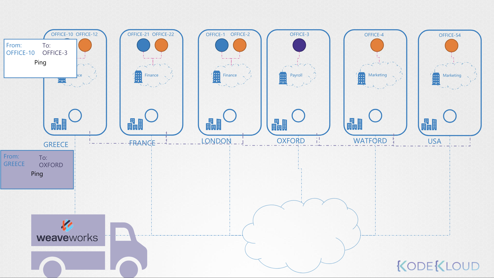

# CNI Weave

Weave Works 는 CNI 플러그인 중 하나

직접 설정한 Networking Solution은 호스트 위에 네트워크를 매핑해둔 Routing Table 을 가지고 있었음

```
+---------- Node ----------+  +------ Node ------+  +------ Node ------+ 
|                          |  |                  |  |                  |     
|  10.244.1.2  10.244.1.3  |  |    10.244.2.2    |  |    10.244.3.2    |     
|       🟩        🟧       |  |        🟪         |  |        🟧        |     
|       |          |       |  |        |         |  |        |         |
|       +-(bridge)-+       |  |     (bridge)     |  |     (bridge)     |
|          v-net-0         |  |      v-net-0     |  |     v-net-0      |
|       10.244.1.0/24      |  |   10.244.2.0/24  |  |  10.244.3.0/24   |
|                          |  |                  |  |                  |
+--------------------------+  +------------------+  +------------------+
       192.168.1.11               192.168.1.12           192.168.1.11          
             |                        |                       |
             |        +---------------+--------------+        | 
             +--------|    NETWORK    |    GATEWAY   |--------+
                      |  ------------ | ------------ |
                      | 10.244.1.0/24 | 192.168.1.11 |
                      | 10.244.2.0/24 | 192.168.1.12 |
                      | 10.244.3.0/24 | 192.168.1.13 |
                      +---------------+--------------+ 
```

위 처럼 직접 하나 하나 설정해야 하면, 
Pod 에서 Node를 타고 Host를 거쳐 Routing Table을 확인하고, 목적지 Pod 로 이동하는 구조

즉, `Pod A` - `Node` → `Host` - `Node` → `Pod B` 으로 통신하며, 적절한 방식이 아님

Node가 N개 일 때, Routing Table 은 N개의 노드에서 요청하는 모든 네트워크를 받아서 적절한 목적지를 안내 해야하는데, 
N의 규모가 커질수록 너무 많은 부담이 됨

이 때 해결한 솔루션이 Weave Works.

Weave Works는 각 Node에 전담 Agent를 할당해두고 서로 통신하기 때문에, 각 Node의 요청을 처리하여 Host 까지 전달되지 않음

<br><br>

각 Agent는 해당 Node의 요청을 패키징해서 전송함

도착지 Node로 전송된 패키지는 해당 Node의 Agent가 인터셉트해서 알맞은 Pod로 이동시킴

Weave works는 클러스터가 배포될 때 각 Node 마다 Agent를 배포해서, 서로 해당 Node와 Pod에 대한 정보를 교환하기 위해 통신함

각 Agent와 Peer는 전체 세팅의 토폴로지를 저장하고 각 IP를 가짐 

알아둘 점은, 단일 Pod는 여러 Bridge Network에 연결될 것임

가령, 단일 Pod는 Weave Bridge에 연결할 수도 있고, Docker가 생성한 Docker Bridge와 연결할 수도 있음 

Weave는 각 Agent에 설정된 적절한 route를 가지는 Pod 를 보장하고 각 Agent는 그들의 Pod 들을 관리함 

---

Deploy Weave 

Weave 와 Weave Peer 들은 클러스터의 각 노드에 서비스나 데몬으로 배포됨

혹은 쿠버네티스 클러스터가 이미 배포되었다면, 클러스터 내에 Pod로 배포하는 방법이 있음

기본 쿠버네티스 시스템이 준비가 되고,
노드와 각 노드 사이에 올바르게 설정된 네트워킹과 기본 Control Plane 컴포넌트가 배포된 후에,

Weave는 클러스터 내에 `kubectl apply` 명령어로 배포될 수 있음

Weave에 필요한 모든 구성 요소를 배포하는데,
이 때 가장 중요한 Weave Peer들을 Daemon Set 으로 배포함

```Bash
❯ kubectl apply -f https://github.com/weaveworks/weave/releases/download/v2.8.1/weave-daemonset-k8s.yaml
serviceaccount/weave-net created
clusterrole.rbac.authorization.k8s.io/weave-net created
clusterrolebinding.rbac.authorization.k8s.io/weave-net created
role.rbac.authorization.k8s.io/weave-net created
rolebinding.rbac.authorization.k8s.io/weave-net created
daemonset.apps/weave-net created
```

kubeadm 툴로 클러스터와 Weave 플러그인을 배포했으면, Weave Peer를 각각 노드에 파드로 배포된 것을 확인할 수 있음  

<pre><code lang="bash">
❯ kubectl get pod -n kube-system
NAME                                         READY   STATUS             RESTARTS     AGE
coredns-76f75df574-l6tsh                     1/1     Running            0            28d
coredns-76f75df574-s787j                     1/1     Running            0            28d
etcd-kind-control-plane                      1/1     Running            0            28d
kindnet-z87jr                                1/1     Running            0            28d
kube-apiserver-kind-control-plane            1/1     Running            0            28d
kube-controller-manager-kind-control-plane   1/1     Running            0            28d
kube-proxy-8v42q                             1/1     Running            0            28d
kube-scheduler-kind-control-plane            1/1     Running            0            28d
<b>weave-net-mvjxx                              2/2     Running            0            82s
weave-net-4dh7H                              2/2     Running            0            82s</b>
</code></pre>

트러블슈팅을 위해 kubectl logs 명령어를 사용해서 확인할 수 있음

```Bash
❯ kubectl logs weave-net-mvjxx weave -n kube-system
INFO: 2019/03/03 03:41:08.643858 Command line options: map[status-addr:0.0.0.0:6782 http-addr:127.0.0.1:6784 ipalloc-range:10.32.0.0/12 name:9e:96:c8:09:bf:c4 nickname:node02 conn-limit:30
datapath:datapath db-prefix:/weavedb/weave-net host-root:/host port:6783 docker-api: expect-npc:true ipalloc-init:consensus=4 no-dns:true]
INFO: 2019/03/03 03:41:08.643980 weave 2.2.1
INFO: 2019/03/03 03:41:08.751508 Bridge type is bridged_fastdp
INFO: 2019/03/03 03:41:08.751526 Communication between peers is unencrypted.
INFO: 2019/03/03 03:41:08.753583 Our name is 9e:96:c8:09:bf:c4(node02)
INFO: 2019/03/03 03:41:08.753615 Launch detected - using supplied peer list: [172.17.0.11 172.17.0.23 172.17.0.30 172.17.0.52]
INFO: 2019/03/03 03:41:08.753632 Checking for pre-existing addresses on weave bridge
INFO: 2019/03/03 03:41:08.756183 [allocator 9e:96:c8:09:bf:c4] No valid persisted data
INFO: 2019/03/03 03:41:08.761033 [allocator 9e:96:c8:09:bf:c4] Initialising via deferred consensus
INFO: 2019/03/03 03:41:08.761091 Sniffing traffic on datapath (via ODP)
INFO: 2019/03/03 03:41:08.761659 ->[172.17.0.23:6783] attempting connection
INFO: 2019/03/03 03:41:08.817477 overlay_switch ->[8a:31:f6:b1:38:3f(node03)] using fastdp
INFO: 2019/03/03 03:41:08.819493 sleeve ->[172.17.0.52:6783|8a:31:f6:b1:38:3f(node03)]: Effective MTU verified at 1438
INFO: 2019/03/03 03:41:09.107287 Weave version 2.5.1 is available; please update at https://github.com/weaveworks/weave/releases/download/v2.5.1/weave
INFO: 2019/03/03 03:41:09.284907 Discovered remote MAC 8a:dd:b5:14:8f:a3 at 8a:dd:b5:14:8f:a3(node01)
INFO: 2019/03/03 03:41:09.331952 Discovered remote MAC 8a:31:f6:b1:38:3f at 8a:31:f6:b1:38:3f(node03)
INFO: 2019/03/03 03:41:09.355976 Discovered remote MAC 8a:a5:9c:d2:86:1f at 8a:31:f6:b1:38:3f(node03)
```


---


### Important Update: -

https://github.com/weaveworks/weave/issues/3960

Before going to the CNI weave lecture,
we have an update for the Weave Net installation link.
They have announced the end of service for Weave Cloud.

To know more about this, read the blog from the link below: -

https://www.weave.works/blog/weave-cloud-end-of-service

As an impact, the old weave net installation link won’t work anymore: -

```
kubectl apply -f "https://cloud.weave.works/k8s/net?k8s-version=$(kubectl version | base64 | tr -d '\n')"
```

Instead of that, use the below latest link to install the weave net: -

```
kubectl apply -f https://github.com/weaveworks/weave/releases/download/v2.8.1/weave-daemonset-k8s.yaml
```

**References:**

- https://www.weave.works/docs/net/latest/kubernetes/kube-addon/#-installation
- https://github.com/weaveworks/weave/releases
