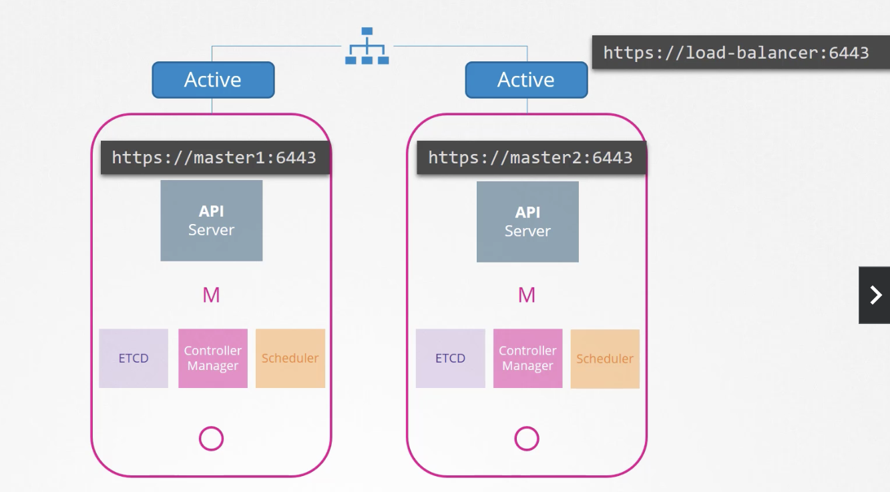
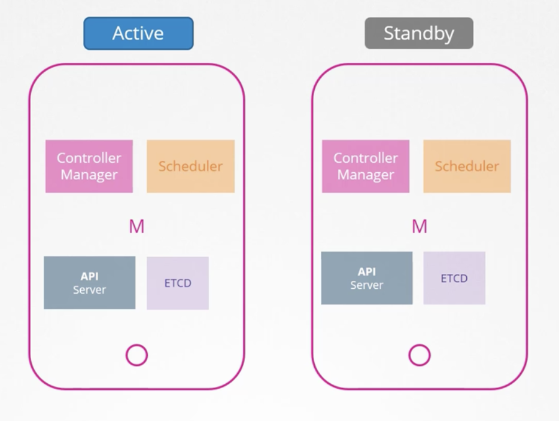
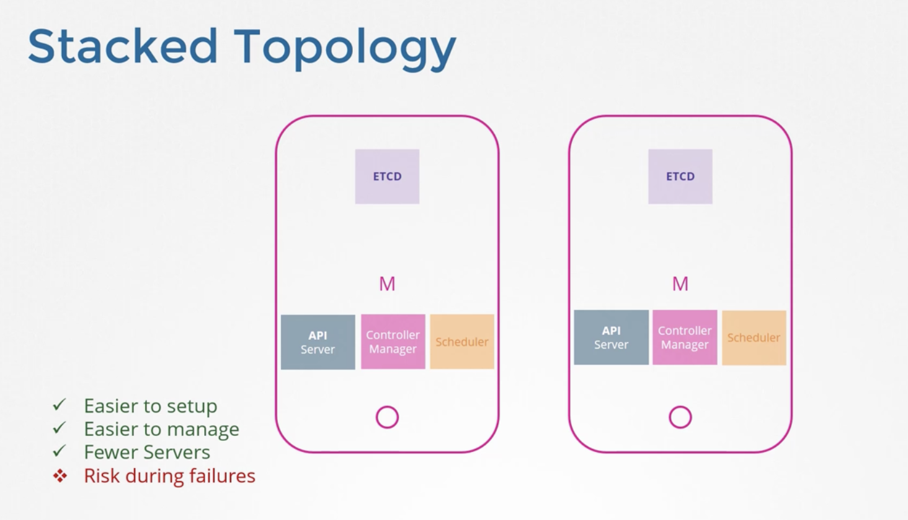

# Configure High Availability

한 개의 마스터 노드와 두 개의 워커 노드가 는 클러스터를 생각해보자

마스터 노드가 고장난다면?

Cotroller, Scheduler 를 사용하지 못하기 때문에 Pod를 다시 생성하거나 스케줄링을 할 수도 없음

→ 프로덕션 환경에서 고가용성 구성을 위한 **다중 마스터 노드를 고려해야 하는 이유**


고가용성 구성이란 **Single Point of Failure 를 피하기 위해 클러스터 내 모든 구성 요소에 걸쳐 중복을 갖는 것**

모든 구성요소를 한 개 이상의 복사본으로 더 갖음

마스터 노드가 여러 개일 때 작업은 어떻게 실행되어야 할까

→ 마스터 노드의 구성요소가 무엇을 하느냐에 따라 다름

<br>

### API Server

<br/><br/>

API 서버는 요청을 수신하고 프로세싱하고 클러스터에 관한 정보를 제공할 책임을 가짐

한 번에 하나씩 요청에 따라 작업되어, 클러스터 노드의 모든 API 서버가 동시에  **Active-Active**  모드로 실행됨

어느 쪽이든 요청을 해도 상관없지만, 양쪽을 동시에 요청하는 건 안됨

그래서 API 서버 앞에 트래픽을 분할하는 LoadBalancer를 갖는 게 좋음

(NginX 나 HA Proxy 등)

<br/><br/>

<br>

### Scheduler / Controller Manager

컨트롤러는 클러스터 상태를 보고 행동을 취함

예를 들어 Pod를 관리하는 컨트롤러는 Pod 상태를 계속 관찰하고, Pod 하나가 고장 나면 새 Pod를 만드는 등 필요한 조치를 취함

Pod Controller 가 여러 개일때, 다수의 인스턴스가 병렬로 실행된다면 작업을 중복 실행하여, 필요 이상으로 Pod를 늘릴 수 있음

스케쥴러도 마찬가지임

따라서 평행으로 달리면 안됨

그래서 **Active-Stanby** 로 실행됨

<br/><br/>

둘 중 누가 주도하고 누가 대기할지를 결정하는 건 **리더 선거 과정**을 통해 선발함

가령, Controller Manager는 처음 프로세스가 구성될 때 `--leader-elect` 옵션을 지정할 수 있는데 Default 는 True 임

```Bash
kube-controller-manager --leader-elect true [other options]
```

컨트롤러 관리자 프로세스가 시작되면 kube-controller-manager 의 Endpoint 개체가 lease나 lock를 얻으려고 하는데,
어떤 프로세스든 해당 정보와 함께 끝점을 업데이트하는 쪽이 리스를 획득해 둘 중 하나가 활성화가 되고 다른 한 명은 Standby가 됨

lease 기간 옵션을 이용해 지정된 임대 기간을 위한 잠금장치를 설정할 수 있는데, 기본 설정은 15초임

```Bash
kube-controller-manager --leader-elect true [other options]
                        --leader-elect-lease-duration 15s
```

Active된 프로세스는 10초마다 lease를 갱신하는데 옵션 리더 선택 갱신 기한의 기본값임

```Bash
kube-controller-manager --leader-elect true [other options]
                        --leader-elect-lease-duration 15s
                        --leader-elect-renew-deadline 10s
```

두 개체 모두 2초마다 리더가 되려고 리더 선출을 시도하는데,
첫 번째 마스터에 장애가 나도 두 번째 마스터가 로그를 획득해 리더가 될 수 있기 때문

```Bash
kube-controller-manager --leader-elect true [other options]
                        --leader-elect-lease-duration 15s
                        --leader-elect-renew-deadline 10s
                        --leader-elect-retry-period 2s
```

스케쥴러도 동일한 접근법과 명령줄 옵션을 가짐

<br>

### Etcd

Etcd 를 구성하는 방법은 2가지가 있음

<br>

**첫 번째, Stacked Topology**

쿠버네티스 마스터 노드의 일부로 구성

<br/><br/>

설정과 관리가 더 쉽고 노드도 적게 필요

하지만, 노드가 다운되면 두 컨트롤 플레인 인스턴스는 분실되고 Redundancy 는 의미 없어짐

<br>

**두 번째, External ETCD Topology**

Etcd가 컨트롤 플레인 노드에서 분리돼 외부 서버에서 실행됨

위 토폴로지와 비교하면 덜 위험함

하지만 세팅이 더 어렵고 서버 수도 두 배가 필요함

API 서버는 Etcd 서버에 통신하는 유일한 컴포넌트로,
API 서비스 구성 옵션을 보면 etcd 서버를 확인할 수 있고, 또 설정할 수 있음


<pre><code lang="bash">$ cat /etc/systemd/system/kube-apiserver.service
[Service]
ExecStart=/usr/local/bin/kube-apiserver \\
--advertise-address=${INTERNAL_IP} \\
--allow-privileged=true \\
--apiserver-count=3 \\
--etcd-cafile=/var/lib/kubernetes/ca.pem \\
--etcd-certfile=/var/lib/kubernetes/kubernetes.pem \\
--etcd-keyfile=/var/lib/kubernetes/kubernetes-key.pem \\
<b>--etcd-servers=https://10.240.0.10:2379,https://10.240.0.11:2379</b>
</code></pre>


etcd는 분산 시스템이기 때문에 여러 서버를 입력할 수 있음 