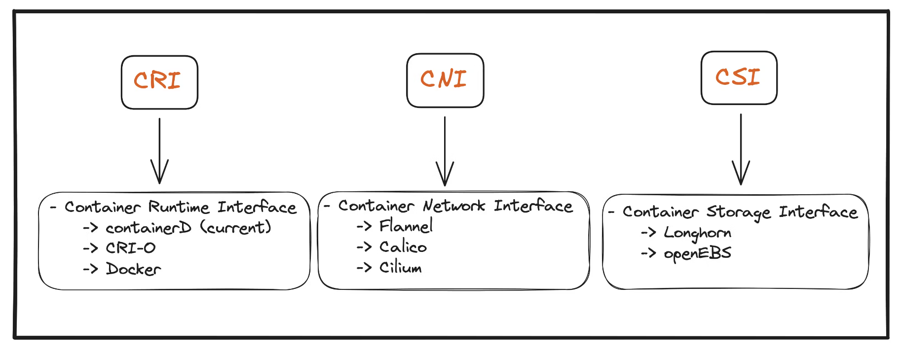

# Container Storage Interface

- **Container Runtime Interface**: 쿠버네티스 같은 오케스트레이션 솔루션이 Docker 같은 컨테이너 런타임과 어떻게 통신할지 정의하는 표준

- **Container Network Interface**: 다양한 네트워킹 솔루션 지원을 확장하기 위해 컨테이너 네트워킹 인터페이스

- **Container Storage Interface**: 다중 저장소 솔루션을 지원하도록 개발됨

  

CSI는 유니버설 표준으로, 쿠버네티스에서만 사용할 수 있는 게 아님

가령, Kubernetes, Cloud Foundry, Mesos 등이 CSI를 따라 개발

CSI 내용을 조금 살펴보면, 

- SHOULD call to provision a new volume
- SHOULD call to delete a volume
- SHOULD call to place a workload that uses the volume onto a node
- SHOULD provision a new volume on the storage
- SHOULD decommission a volume
- SHOULD make the volume available on a node
