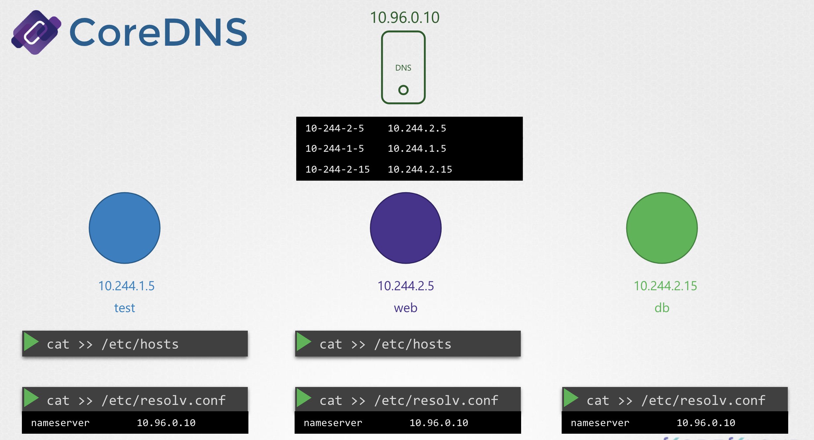
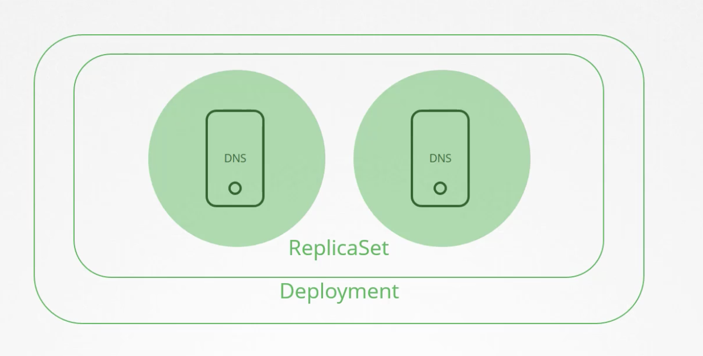

# CoreDNS in Kubernetes

컨테이너 사이의 통신은 `/etc/hosts` 파일에 이름과 IP를 매핑하거나 `/etc/resolv.conf` 에 지정된 Name Server에서 참조해서 IP를 얻어옴

<br><br>

쿠버네티스 Cluster 내부에서도 위와 같이 DNS 방식을 사용하여 자체 DNS 서버를 배포

1.12 버전 이전, `kube-dns` 로 불리는 DNS 서버를 추천했음

1.12 버전 부터, `core-dns` 로 불리는 DNS 서버를 추천함

<br>

### How is the CoreDNS set up in the cluster?

CoreDNS server는 Kubernetes Cluster 의 `kube-system` Namespace 에 Pod 형태로 배포됨

이 때, 두 개의 Replica Set 형식으로 두 개의 Pod가 배포됨

엄밀히 말하면, Deployment 내 하나의 ReplicaSet 객체임

<br><br>

해당 Pod는 CoreDNS 실행가능 파일을 실행 시킴

CoreDNS 는 `/etc/coredns/Corefile` 설정 파일이 필요

<pre><code lang="bash">.:53{
errors
health
<b>kubernetes cluster.local in-addr.arpa ip6.arpa {
pods insecure
upstream
fallthrough in-addr.arpa ip6.arpa
}</b>
prometheus :9153
proxy . /etc/resolv.conf
cache 30
reload
}
</code></pre>

파일에는 다양한 플러그인 설정 내용을 가질 수 있음: Error handling, Reporting health, Monitoring metrics, Cache 등을 설정함

Kubernetes 에 적용되는 플러그인은 Kubernetes Plugin 으로, 
**클러스터의 최상위 도메인 이름이 설정되는 곳**이며, CoreDNS 서버의 모든 레코드가 이 도메인 하위에 있음

가령, 위의 예시에서는 `cluster.local` 이며, 모든 도메인이 `sub-domain.cluster.local`가 됨 

Kubernetes 플러그인에는 다양한 옵션이 있음


<blockquote>

### Coredns Syntax

[🔗 coredns plugins -kubernetes](https://coredns.io/plugins/kubernetes/)
```bash
    kubernetes [ZONES...] {
        endpoint URL
        tls CERT KEY CACERT
        kubeconfig KUBECONFIG [CONTEXT]
        namespaces NAMESPACE...
        labels EXPRESSION
        pods POD-MODE
        endpoint_pod_names
        ttl TTL
        noendpoints
        fallthrough [ZONES...]
        ignore empty_service
    }
```

- `endpoint` specifies the **URL** for a remote k8s API endpoint. If omitted, it will connect to k8s in-cluster using the cluster service account.
- `tls` **CERT KEY CACERT** are the TLS cert, key and the CA cert file names for remote k8s connection. This option is ignored if connecting in-cluster (i.e. endpoint is not specified).
- `kubeconfig` **KUBECONFIG \[CONTEXT\]** authenticates the connection to a remote k8s cluster using a kubeconfig file. [CONTEXT] is optional, if not set, then the current context specified in kubeconfig will be used. It supports TLS, username and password, or token-based authentication. This option is ignored if connecting in-cluster (i.e., the endpoint is not specified).
- `namespaces` **NAMESPACE \[NAMESPACE…\]** only exposes the k8s namespaces listed. If this option is omitted all namespaces are exposed
- `namespace_labels` **EXPRESSION** only expose the records for Kubernetes namespaces that match this label selector. The label selector syntax is described in the [Kubernetes User Guide - Labels](https://kubernetes.io/docs/concepts/overview/working-with-objects/labels/). An example that only exposes namespaces labeled as “istio-injection=enabled”, would use: labels istio-injection=enabled.
- `labels` **EXPRESSION** only exposes the records for Kubernetes objects that match this label selector. The label selector syntax is described in the [Kubernetes User Guide - Labels](https://kubernetes.io/docs/concepts/overview/working-with-objects/labels/). An example that only exposes objects labeled as “application=nginx” in the “staging” or “qa” environments, would use: labels environment in (staging, qa),application=nginx.
- `pods` **POD-MODE** sets the mode for handling IP-based pod A records, e.g. 1-2-3-4.ns.pod.cluster.local. in A 1.2.3.4. This option is provided to facilitate use of SSL certs when connecting directly to pods. Valid values for POD-MODE:
  - `disabled`: Default. Do not process pod requests, always returning NXDOMAIN
  - `insecure`: Always return an A record with IP from request (without checking k8s). This option is vulnerable to abuse if used maliciously in conjunction with wildcard SSL certs. This option is provided for backward compatibility with kube-dns.
  - `verified`: Return an A record if there exists a pod in same namespace with matching IP. This option requires substantially more memory than in insecure mode, since it will maintain a watch on all pods.
- `endpoint_pod_names` uses the pod name of the pod targeted by the endpoint as the endpoint name in A records, e.g., endpoint-name.my-service.namespace.svc.cluster.local. in A 1.2.3.4 By default, the endpoint-name name selection is as follows: Use the hostname of the endpoint, or if hostname is not set, use the dashed form of the endpoint IP address (e.g., 1-2-3-4.my-service.namespace.svc.cluster.local.) If this directive is included, then name selection for endpoints changes as follows: Use the hostname of the endpoint, or if hostname is not set, use the pod name of the pod targeted by the endpoint. If there is no pod targeted by the endpoint or pod name is longer than 63, use the dashed IP address form.
- `ttl` allows you to set a custom TTL for responses. The default is 5 seconds. The minimum TTL allowed is 0 seconds, and the maximum is capped at 3600 seconds. Setting TTL to 0 will prevent records from being cached.
- `noendpoints` will turn off the serving of endpoint records by disabling the watch on endpoints. All endpoint queries and headless service queries will result in an NXDOMAIN.
- `fallthrough` **\[ZONES…\]** If a query for a record in the zones for which the plugin is authoritative results in NXDOMAIN, normally that is what the response will be. However, if you specify this option, the query will instead be passed on down the plugin chain, which can include another plugin to handle the query. If [ZONES…] is omitted, then fallthrough happens for all zones for which the plugin is authoritative. If specific zones are listed (for example in-addr.arpa and ip6.arpa), then only queries for those zones will be subject to fallthrough.
- `ignore empty_service` returns NXDOMAIN for services without any ready endpoint addresses (e.g., ready pods). This allows the querying pod to continue searching for the service in the search path. The search path could, for example, include another Kubernetes cluster.

Enabling zone transfer is done by using the _transfer_ plugin.
</blockquote>

그 중 `pod` 옵션은 해당 클러스터 내의 Pod 들의 Record 생성을 책임짐

이 때, Pod 들의 이름이 IP 주소에서 Dot(`.`)을 Dash(`-`) 로 변경하는 옵션은 기본적으로 비활성화 되어 있는데 여기에서 활성화 시킬 수 있음 

<table>
<tr>
<th>Hostname</th>
<th>Namespace</th>
<th>Type</th>
<th>Root</th>
<th>IP Address</th>
</tr>
<tr>
<td>10-244-1-5</td>
<td>default</td>
<td>pod</td>
<td>cluster.local</td>
<td>10.244.1.5</td>
</tr>
</table>

Pod가 `www.google.com` 로 요청하려고 시도한다고 가정하면, CoreDNS Pod 내의 `/etc/resolv.conf`에 명시한 Namespace로 포워딩 됨

(`/etc/resolv.conf` 는 Nameserver를 명시함)

또한, 이 Corefile은 Pod에 ConfigMap 객체로써 전달됨

```Bash
❯ kubectl get configmap -n kube-system
apiVersion: v1
data:
  Corefile: |
    .:53 {
        errors
        health {
           lameduck 5s
        }
        ready
        kubernetes cluster.local in-addr.arpa ip6.arpa {
           pods insecure
           fallthrough in-addr.arpa ip6.arpa
           ttl 30
        }
        prometheus :9153
        forward . /etc/resolv.conf {
           max_concurrent 1000
        }
        cache 30
        loop
        reload
        loadbalance
    }
kind: ConfigMap
metadata:
  annotations:
    kubectl.kubernetes.io/last-applied-configuration: |
      {"apiVersion":"v1","data":{"Corefile":".:53 {\n    errors\n    health {\n       lameduck 5s\n    }\n    ready\n    kubernetes cluster.local in-addr.arpa ip6.arpa {\n       pods insecure\n       fallthrough in-addr.arpa ip6.arpa\n       ttl 30\n    }\n    prometheus :9153\n    forward . /etc/resolv.conf {\n       max_concurrent 1000\n    }\n    cache 30\n    loop\n    reload\n    loadbalance\n}\n"},"kind":"ConfigMap","metadata":{"annotations":{},"name":"coredns","namespace":"kube-system"}}
  creationTimestamp: "2024-06-16T10:12:39Z"
  name: coredns
  namespace: kube-system
  resourceVersion: "297"
  uid: 0d3ae133-591e-4003-a3af-5985cf56546e
```

그래서 설정을 수정하고 싶다면, ConfigMap 객체를 수정할 수 있음

--- 

### CoreDNS Pod

CoreDNS 를 설정한 이후, CoreDNS는 쿠버네티스 클러스터 내의 Pod 나 서비스가 새로 뜨는지 지켜보고,
Pod나 서비스가 생성될 때마다 데이터베이스에 해당 Record를 저장함

```
 +------------------------ Cluster -------------------------+
 |                                                          |
 |        +------------------------------------+            |
 |        |               CoreDNS              |            |
 |        |  +--------------+---------------+  |            |
 |        |  | 10-244-1-5   | 10.244.1.5    |  |            |
 |        |  | 10-244-2-5   | 10.244.1.5    |  |            |
 |        |  | web-service  | 10.107.27.188 |  |            |
 |        |  +--------------+---------------+  |            |
 |        +-----+-------------------------+-----+           |
 |              |                         |                 |
 |     [📄 /etc/resolv.conf]     [📄 /etc/resolv.conf]      |
 |              |                         |                 |
 |  +-----------+---+  +-----------------+---------------+  |
 |  | Default       |  |                          Apps   |  |
 |  | Namespace     |  |                      Namespace  |  |
 |  |               |  |                                 |  |
 |  |       🔵      |  |          🟠            🟪        |  |
 |  |     Pod A     |  |        Pod B      web-service   |  |
 |  |  10.244.1.5   |  |   10.107.37.188  10.107.37.188  |  |
 |  +---------------+  +---------------------------------+  |
 +----------------------------------------------------------+
```

CoreDNS Pod가 생성될 때, 동시에 Service를 생성하는데, 이를 통해 Pod 가 CoreDNS를 DNS 서버로 참조함

```Bash
❯ kubectl get service –n kube-sytem
NAME      TYPE        CLUSTER-IP  EXTERNAL-IP   PORT(S)
kube-dns  ClusterIP   10.96.0.10  <none>        53/UDP,53/TCP
```

Pod가 새로 생성되면, Kubelet 은 `/etc/resolv.conf` 파일에 CoreDNS 를 DNS Server 로서 자동으로 지정함

<pre><code lang="bash">❯ cat /etc/resolv.conf
search default.svc.cluster.local svc.cluster.local cluster.local
<b>nameserver 10.96.0.10</b>
options ndots:5
</code></pre>

이렇게 DNS 서버가 명시되면 이후부터는 CoreDNS 가 가진 Record 모음에 접근할 수 있다.

```Bash
❯ host web-service
# or
❯ host web-service.default
# or
❯ host web-service.default.svc
# or
❯ host web-service.default.svc.cluster.local
web-service.default.svc.cluster.local has address 10.97.206.196
```

여기서, 단순히 `web-service` 를 요청했을 뿐인데 어떻게 풀네임을 붙여서 요청하게 되는 걸까?

`/etc/resolv.conf` 파일에는 `search` entry 또한 설정되어 있기 때문에 각 설정에 명시된 이름 하위로 검색함

<pre><code lang="bash">❯ cat /etc/resolv.conf
<b>search default.svc.cluster.local svc.cluster.local cluster.local</b>
nameserver      10.96.0.10
</code></pre>

하지만, 오직 Service 만이 해당 Entry를 갖고 있으며 Pod는 갖고 있지 않음

Pod는 명시적으로 **FQDN**(fully qualified domain name)을 표기해야함
