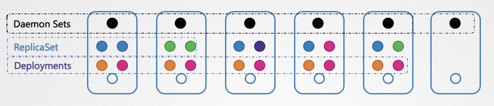
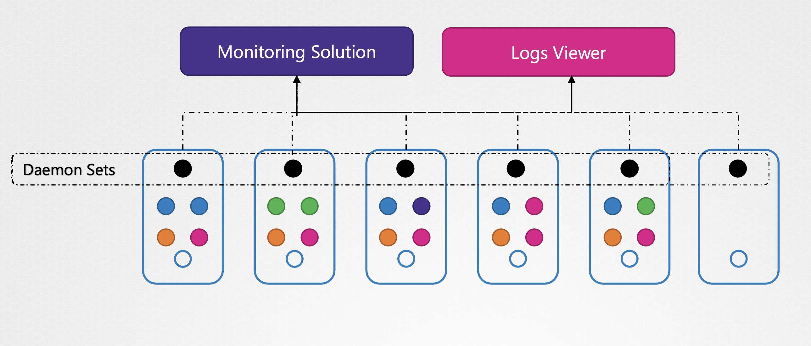

## Daemon Sets

ReplicaSet과 Deployment을 통해 여러 Worker Node 에서 애플리케이션을 복제하면서,

Cluster 내 다양한 노드에 다양한 포드를 배포할 수 있었음

DaemonSet 은 ReplicaSet 와 비슷하게 여러 개의 인스턴스 Pod를 배포할 수 있게 하는데,
클러스터의 노드마다 단 하나의 Pod를 실행

클러스터에 새 노드가 추가될 때마다 포드 복제본이 자동으로 해당 노드에 추가되고,
노드가 제거되면 Pod는 자동으로 제거됨

<table>
<tr>
<th>Before Deployment</th>
<th>After Deployment</th>
</tr>
<tr>
<td>

```
 🟠🔴     🟡🟠     🟡🟢     🟢🟢
 🔴🟠     🟠🟠     🟠🟡     🟡🟢
Node 1    Node 2   Node 3   Node 4
```

</td>
<td>

```
  ⚫️       ⚫️      ⚫️       ⚫️
 🟠🔴     🟡🟠     🟡🟢     🟢🟢
 🔴🟠     🟠🟠     🟠🟡     🟡🟢
Node 1    Node 2   Node 3   Node 4
```

</td>
</tr>
<tr><td colspan="2">

```
⚫️: Deamon Set
```

</td></tr>
</table>


<br/><br/>

DaemonSet은 Pod의 복제본을 클러스터 내 모든 노드에 항상 존재하게 함

<br/>

### Use cases

#### 1. Monitoring, Logs Viewer

데몬셋을 활용할 수 있는 아주 적합한 예시들이 존재: Monitoring, Logs Viewer 

<br/><br/>

Monitoring 에이전트나 Logs Collector를 클러스터 내 각 노드에 배포하면,
데몬셋은 모든 노드에 한 Pod로 배치하기 때문에 최적

클러스터에 변화 생기면, 데몬셋이 알아서 제거/추가하기 때문에 따로 관리할 필요가 없음

<br/>

#### 2. kube-proxy

kube-proxy 는 데몬셋의 좋은 예

kube-proxy 구성 요소는 클러스터에서 데모셋으로 배포될 수 있음

#### 3. Networking

weave-net 같은 네트워킹 솔루션은, 
해당 에이전트가 클러스터 내 각 노드에 배치되어야 하기 때문에 데몬셋을 활용하기 적합

(추후 네트워킹 파트에서 상세히 짚어보기)

---

## DaemonSet Definition

데몬셋을 생성은 ReplicaSet 생성 정의와 비슷

Template, Selector 필드가 존재해서 Pod와 연결하는 설정이 필요하기 때문

그래서 정의 파일도 구조가 비슷

<table>
<tr>
<th><code>deamon-set-definition.yaml</code></th>
<th><code>replicaset-definition.yaml</code></th>
</tr>
<tr>
<td>

```yaml
apiVersion: apps/v1
kind: DaemonSet
metadata:
  name: monitoring-daemon
spec:
  selector:
    matchLabels:
      app: monitoring-agent
  template:
    metadata:
      labels:
        app: monitoring-agent
    spec:
      containers:
      - name: monitoring-agent
        image: nginx
```

</td>
<td>

```yaml
apiVersion: apps/v1
kind: ReplicaSet
metadata:
  name: monitoring-daemon
spec:
  selector:
    matchLabels:
      app: monitoring-agent
  template:
    metadata:
      labels:
        app: monitoring-agent
    spec:
      containers:
      - name: monitoring-agent
        image: nginx
```

</td>
</tr>
</table>

ReplicaSet의 `selector`에 지정한 레이블(`selector.matchLabels`)과 Pod `template` 하위의 레이블이 일치하는지 확인 필요

---

### Command

1. `kubectl create` 명령어로 DaemonSet 생성

```Bash
❯ kubectl create -f daemon-set-definition.yaml
daemonset.apps/monitoring-daemon created
```

<br/>

2. `kubectl get` 명령어로 DaemonSet 조회

```Bash
❯ kubectl get daemonsets
NAME                DESIRED   CURRENT   READY   UP-TO-DATE   AVAILABLE   NODE SELECTOR   AGE
monitoring-daemon   1         1         1       1            1           <none>          2m21s
```

<br/>

2. `kubectl describe` 명령어로 DaemonSet 상세 조회

```Bash
❯ kubectl describe daemonsets monitoring-daemon                                                                                                                ─╯
Name:           monitoring-daemon
Selector:       app=monitoring-agent
Node-Selector:  <none>
Labels:         <none>
Annotations:    deprecated.daemonset.template.generation: 1
Desired Number of Nodes Scheduled: 1
Current Number of Nodes Scheduled: 1
Number of Nodes Scheduled with Up-to-date Pods: 1
Number of Nodes Scheduled with Available Pods: 1
Number of Nodes Misscheduled: 0
Pods Status:  1 Running / 0 Waiting / 0 Succeeded / 0 Failed
Pod Template:
  Labels:  app=monitoring-agent
  Containers:
   monitoring-agent:
    Image:        nginx
    Port:         <none>
    Host Port:    <none>
    Environment:  <none>
    Mounts:       <none>
  Volumes:        <none>
Events:
  Type    Reason            Age   From                  Message
  ----    ------            ----  ----                  -------
  Normal  SuccessfulCreate  3m7s  daemonset-controller  Created pod: monitoring-daemon-vtnsp
```

---

### How does it work?

DaemonSet 작동법

어떻게 모든 노드에 포드가 있는지 보장할 수 있을까?

클러스터의 각 노드에 포드를 지정해야 한다면, Node Affinity 를 사용할 수 있음

이전 강의에서 다뤘던 내용 중 하나는, 
포드에서 노드 이름 속성을 설정해 스케쥴러를 우회해 포드를 노드에 직접 놓는 것

각 Pod의 스팩 정의에 nodeName 속성 설정

```
Affinity:  Node 1    Node 2   Node 3   Node 4
              ⚫️      ⚫️       ⚫️       ⚫️
              ↓       ↓️        ↓       ↓️
              🟥️      🟧️       🟨       🟩
            Node 1   Node 2   Node 3   Node 4 
```


[How Daemon Pods are scheduled](https://kubernetes.io/docs/concepts/workloads/controllers/daemonset/#how-daemon-pods-are-scheduled)

**`< v.1.12`**: Pod가 생성될 때 각 노드에 자동 배치
**`>= v.1.12`**: NodeAffinity + default scheduler
