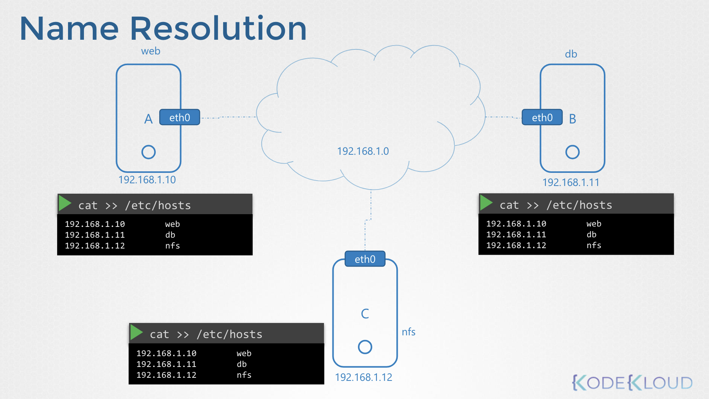
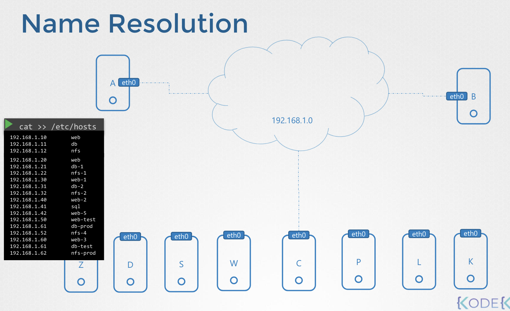
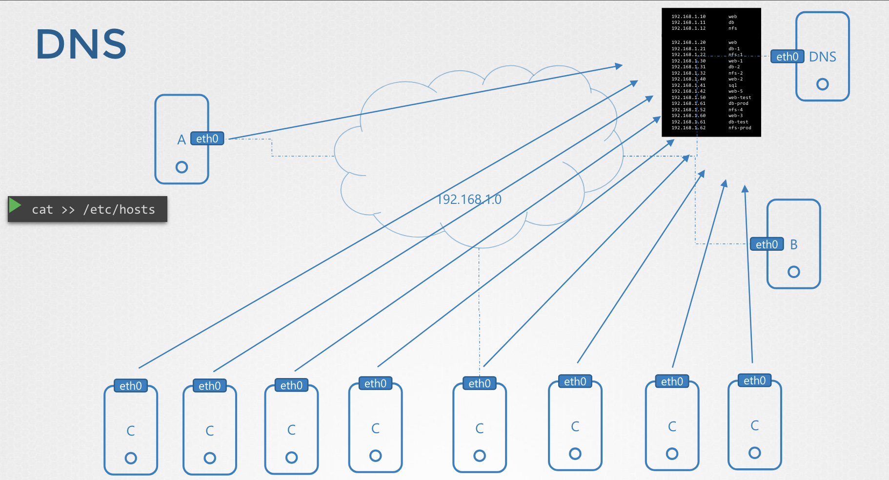
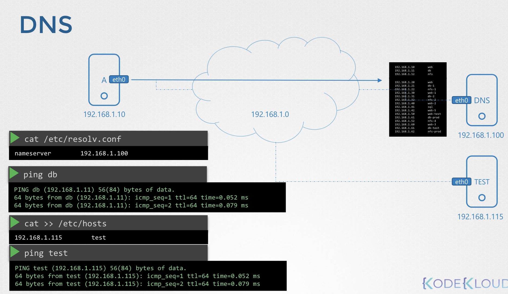

# DNS

A와 B 컴퓨터 두 대가 있고 각각 `192.168.1.10`, `192.168.1.11` 로 할당 되어 있음

```
    🖥️   --[eth0]-- 192.168.1.0 --[eth0]--→   🖥️      
    A                                         B                                         C     
192.168.1.10                               192.168.1.11   
```

IP 주소로 다른 컴퓨터에서 다른 컴퓨터로 핑을 보낼 수 있음

```Bash
# Host A
$ ping 192.168.1.11
Reply from 192.168.1.11: bytes=32 time=4ms TTL=117
Reply from 192.168.1.11: bytes=32 time=4ms TTL=117
```

시스템 B에 데이터베이스 서비스가 있어서, 
시스템 B의 IP 주소말고 **`db`** 라는 이름을 붙여서 기억하기 쉽게 지정하고자 함

```Bash
# Host A
$ ping db
ping: unknown host db
```

현재는 설정이 없기 때문에 오류가 발생 

<br>

#### `/etc/hosts` 수정

이를 `/etc/hosts` 를 수정해 도메인 이름을 설정할 수 있음 

```Bash
# Host A
$ cat >> /etc/hosts
192.168.1.11        db
```

시스템 B의 데이터베이스 **`db`** 가 IP 주소가 `192.168.1.11`라는 것을 호스트 A에게 알려주면 됨

```Bash
# Host A
$ ping db
PING db (192.168.1.11): 56 data bytes
64 bytes from 192.168.1.11: icmp_seq=0 ttl=56 time=0.056 ms
64 bytes from 192.168.1.11: icmp_seq=1 ttl=56 time=0.079 ms
```

그런데 여기서 짚어봐야 할 점은, 호스트 A는 `/etc/hosts` 에서 읽어온 값을 검증하지 않고 무조건 취함

하지만, db 라는 이름과 매핑된 IP가 실제 일치하는 IP 가 아닐 수도 있음 

`/etc/hosts` 파일을 조작한다면 문제가 발생

```Bash
# Host A
$ cat /etc/hosts
192.168.1.11        db
192.168.1.11        www.google.com
```

위 예시에서 `google.com`에 접근할 때, google이 아닌 서버 B와 통신하게 될 것

ping 명령 또는 SSH 명령을 통해 호스트 A에서 다른 호스트의 이름을 참조하거나
이 시스템 내의 애플리케이션 또는 도구를 통해 참조할 때마다 
해당 호스트의 `/etc/hosts` 파일을 확인하여 해당 호스트의 IP 주소를 찾음

이러한 방식으로 호스트 이름을 IP 주소로 변환하는 것을 Name Resolution 이라고 함

---

### DNS

작은 규모의 네트워크에서는 각 서버마다 `/etc/hosts` 파일을 관리하곤 했었는데,
네트워크의 규모가 커짐에 따라 이를 관리하는 것이 어렵다는 것을 느낌

<table>
    <tr>
        <td></td>
        <td> → </td>
        <td></td>
    </tr>
</table>


→ 각 도메인 데이터들을 한 서버에서 관리하게 바뀜 

<br><br>

=> 이를 **DNS 서버** 라고 함

<br>

### `/etc/resolv.conf`

그래서 각 서버가 갖고 있던 `/etc/hosts` 파일로 도메인을 구분하는 대신, 
DNS 서버에 요청해서 등록된 IP를 찾게 됨

모든 호스트는 `/etc/resolv.conf`에 DNS Resolution Configuration 파일을 갖음

```Bash
$ cat /etc/resolv.conf
nameserver      192.168.1.100
```

이제 IP가 변경되면 DNS 서버 한 군데만 수정하면 됨

하지만 각 서버는 여전히 자체적으로 Name Resolution 을 할 수 있음

가령, Private 망에 test 라는 서버가 존재할 때, `/etc/hosts` 파일에 해당 항목을 추가하여 이 서버를 확인할 수 있음

<br>

#### `/etc/hosts`

```Bash
$ cat /etc/hosts
192.168.1.115        test
```

<br><br>

**정리하자면, 원격 DNS 서버뿐만 아니라 로컬 `/etc/hosts` 파일에서 호스트 이름과 IP 매핑을 사용할 수 있음**

만약 동일한 호스트 이름이 있다면 **로컬 `/etc/hosts` 파일을 먼저 확인하고 취함** 

이 순서를 수정할 수 있는데, [`/etc/nsswitch.conf`](https://man7.org/linux/man-pages/man5/nsswitch.conf.5.html) 를 정의되어 있음

<br>

#### `/etc/nsswitch.conf`

```Bash
$ cat /etc/nsswitch.conf
...
hosts:          files dns
...
```

- `files`: `/etc/hosts`
- `dns`: DNS Server


`/etc/resolv.conf`에는 여러 개의 네임 서버를 등록할 수 있음

```Bash
$ cat /etc/redolv.cong
nameserver      192.168.1.100
nameserver      8.8.8.8
```

`8.8.8.8` 는 Google이 관리하는 잘 알려진 퍼블릭 네임서버

근데 각 호스트의 `/etc/resolv.conf` 파일 마다 설정해야 하기 때문에,
차라리 알 수 없는 호스트 이름을 인터넷의 **퍼블릭 네임서버**로 전달하도록 DNS 서버 자체를 구성할 수 있음

---

### Domain Names

`www.google.com`

도메인 이름 중, `www` 와 `com` 의 의미

**도메인은 IP를 기억할 수 있는 이름으로 정의한 것이고, `www` 와 `com`는 이 도메인을 그룹 지은 것**

```
.           → root 
.com        → top level domain
google      → google에 할당된 domain name
www         → sub-domain
```

서브 도메인은 Google 하위의 서비스를 구분하기 위한 도메인

- `maps.google.com` 은 구글맵의 도메인
- `drive.google.com` 은 구글 드라이버의 도메인
- `mail.google.com` 은 구글 메일의 도메인

트리 구조로 나열됨

---

### DNS 요청 시 동작 과정

특정 도메인에 요청을 보내게 되면 가장 먼저 그룹의 내부 DNS 서버를 거치게 됨

<pre><code>[apps.google.com]</code> → <b><code>Org DNS Server</code></b></pre>

만약, 내부 DNS 서버에 `apps.google.com` 가 없다면, Root DNS 서버로 요청 전송

<pre><code>[apps.google.com]</code> → <code>Org DNS Server</code> → <b><code>Root DNS Server</code></b></pre>

Root DNS 서버가 도메인을 확인하고 `.com` DNS 서버로 전달

<pre><code>[apps.google.com]</code> → <code>Org DNS Server</code> → <code>Root DNS Server</code> → <b><code>.com DNS Server</code></b></pre>

`.com` DNS 서버가 도메인을 확인하고 Google DNS 서버로 전달

<pre><code>[apps.google.com]</code> → <code>Org DNS Server</code> → <code>Root DNS Server</code> → <code>.com DNS Server</code> → <b><code>Google DNS Server</code></b></pre>

이후, 구글은 애플리케이션을 제공할 IP를 찾아 사용자에게 전달

<pre><code>[apps.google.com]</code> → <code>Org DNS Server</code> → <code>Root DNS Server</code> → <code>.com DNS Server</code> → <code>Google DNS Server</code> → <b><code>216.58.221.78</code></b></pre>

DNS 서버는 IP를 캐시 해서 매 번 이런 과정을 거치지 않고 바로 응답을 전달함

---

`mygroup.com` 이라는 DNS에서 `web.mygroup.com`를 찾을 때, 

- 해당 그룹 외부: 풀네임 명시 
- 해당 그룹 내부: `web` 만으로 명시 가능 → `/etc/resolv.conf` 에 설정 추가

```Bash
$ /etc/resolv.conf
nameserver      192.168.1.100
search          mygroup.com
```

`search` 로 해당 그룹 이름 적음

`web` 으로 검색해도 `web.mygroup.com` 으로 해석함

혹은 아래와 같이 두 개를 입력할 수도 있음

```Bash
$ /etc/resolv.conf
nameserver      192.168.1.100
search          mygroup.com prod.mygroup.com
```

그럼 두 도메인 서버 모두에서 서브 도메인을 검색함 

---

### Record Types

DNS 서버에서 각 레코드를 저장하는 방식은 아래와 같음 

| Type  | Name            | Record                                  |
|-------|-----------------|-----------------------------------------|
| A     | web-server      | 192.168.1.1                             |
| AAAA  | web-server      | 2001:0db8:85a3:0000:0000:8a2e:0370:7334 |
| CNAME | food.web-server | eat.web-server, hungry.web-server       |

<br>

[🔗Common types of DNS records](https://www.ibm.com/topics/dns-records)

DNS 관리는 DNS 서버의 상호 연결성에 의존

DNS 레코드를 통해 DNS 서버가 서로 상호 작용하는 방식을 알면 DNS 관리가 덜 까다로워짐

#### 일반적인 DNS 레코드 유형

<table>
<tr>
<th><code>A</code> records</th>
<td>
도메인 네임을 IPv4 주소에 연결

주소 레코드 또는 A 레코드는 가장 일반적으로 사용되는 DNS 레코드

ex. IPv4 Format: `93.184.216.34`
</td>
</tr>
<tr>
<th><code>AAAA</code> records</th>
<td>
도메인 네임을 IPv6 주소에 연결

IPv6 주소는 IPv4 주소보다 숫자가 더 많으며 IPv4 주소의 옵션이 부족해짐에 따라 점점 더 보편화되고 있음
</td>
</tr>
<tr>
<th><code>CNAME</code> records</th>
<td>
정식 이름 레코드 또는 CNAME 레코드는 별칭 도메인을 정식 도메인으로 연결

즉, 이 유형의 레코드는 하위 도메인을 도메인 A 또는 AAAA 레코드에 연결하는 데 사용됨


예를 들어, `www.example.com` 및 `product.example.com`에 대한 두 개의 A 레코드를 만드는 대신,

`product.example.com`을 CNAME 레코드에 연결한 다음 `example.com`의 A 레코드에 연결할 수 있음

이 값은 루트 도메인의 IP 주소가 변경되면 A 레코드만 업데이트하면 되고 CNAME은 그에 따라 업데이트됨
</td>
</tr>
<tr>
<th><code>DNAME</code> records</th>
<td> 
여러 개의 하위 도메인을 다른 도메인을 가리키는 데 사용

예를 들어 `domain.com`을 `example.com`으로 `DNAME`으로 연결하면,
`product.domain.com`, `trial.domain.com`, `blog.domain.com`을 `example.com`으로 연결

이러한 레코드는 하위 도메인 연결을 확실하게 하기 때문에, 대규모 도메인을 관리하고 도메인 네임 변경을 관리하는 데 유용
</td>
</tr>
<tr>
<th><code>CAA</code> records</th>
<td> 
<i>Certification authority authorization records</i>

도메인에 대한 인증서를 발급할 수 있는 CA(인증 기관)를 지정할 수 있음

FYI. CA는 디지털 인증서를 발급하여 웹사이트의 신원을 확인하고 암호화 키에 연결하는 조직
</td>
</tr>
<tr>
<th><code>CERT</code> records</th>
<td> 
<i>Certificate</i>

인증서 또는 CERT 레코드는 관련된 모든 당사자의 진위 여부를 확인하는 인증서를 저장

민감한 정보를 보호하고 암호화할 때 특히 유용
</td>
</tr>
<tr>
<th><code>MX</code> records</th>
<td> 
<i>Mail exchange</i>

이메일을 도메인 메일 서버로 직접 전달

이메일 서버와 함께 도메인에 연결된 개별 이메일 계정(e.g. `user@example.com`)을 생성할 수 있게 해줌 (e.g. `example.com`)
</td>
</tr>
<tr>
<th><code>NS</code> records</th>
<td> 
<i>Nameserver</i>

도메인의 권한 있는 네임 서버(Authoritative Nameserver)로 작동하는 DNS 서버를 보여줌

권한 있는 네임서버에는 특정 도메인과 해당 IP 주소에 대한 최종 정보가 포함되어 있음

NS 레코드는 도메인이 보유한 모든 다른 레코드를 가리킴

NS 레코드가 없으면 사용자는 웹사이트에 액세스할 수 없음
</td>
</tr>
<tr>
<th><code>SOA</code> records</th>
<td> 
<i>Start of authority</i>

도메인에 대한 중요한 관리 정보를 저장

이 정보에는 도메인 관리자의 이메일 주소, 도메인 업데이트에 대한 정보, 서버가 정보를 새로 고쳐야 하는 시기 등이 포함될 수 있음
</td>
</tr>
<tr>
<th><code>PTR</code> records</th>
<td> 
<i>Pointer records</i>

포인터 레코드 또는 PTR 레코드는 A 레코드와 반대 방향으로 작동
</td>
</tr>
<tr>
<th>...</th>
<td> 
이 외에도 SPF records, SRV records, ALIAS record, URLFWD records, TXT records 등이 존재
</td>
</tr>
</table>

---

ping 명령어는 DNS Resolution 에 적합하지 않음

#### `nslookup`

nslookup을 이용해 DNS 서버에서 호스트 이름을 쿼리할 수 있음

하지만 nslookup은 `/etc/hosts` 파일의 항목은 고려하지 않음

오직 DNS 서버만을 고려해서 찾음

```Bash
❯ nslookup www.google.com
Server:		210.220.163.82
Address:	210.220.163.82#53

Non-authoritative answer:
Name:	www.google.com
Address: 142.250.76.132
```

#### `dig`

서버에 저장된 것과 유사한 형태로 세부 사항을 더 반환

`nslookup`와 동일하게 오직 DNS 서버만을 고려해서 찾음

```Bash
❯ dig www.google.com

; <<>> DiG 9.10.6 <<>> www.google.com
;; global options: +cmd
;; Got answer:
;; ->>HEADER<<- opcode: QUERY, status: NOERROR, id: 14247
;; flags: qr rd ra; QUERY: 1, ANSWER: 1, AUTHORITY: 0, ADDITIONAL: 1

;; OPT PSEUDOSECTION:
; EDNS: version: 0, flags:; udp: 4096
;; QUESTION SECTION:
;www.google.com.			IN	A

;; ANSWER SECTION:
www.google.com.		257	IN	A	142.250.76.132

;; Query time: 11 msec
;; SERVER: 210.220.163.82#53(210.220.163.82)
;; WHEN: Sun Jun 02 21:59:40 KST 2024
;; MSG SIZE  rcvd: 59
```

---

## CoreDNS

[CoreDNS](https://coredns.io/manual/toc/)
[Kubernetes DNS-Based Service Discovery](https://github.com/kubernetes/dns/blob/master/docs/specification.md)

CoreDNS 바이너리를 깃허브 릴리스 페이지에서 다운로드하거나 도커 이미지로 다운로드

```Bash
❯ wget https://github.com/coredns/coredns/releases/download/v1.11.1/coredns_1.11.1_linux_amd64.tgz
...
❯ tar -xzvf coredns_1.11.1_linux_amd64.tgz
coredns
```

실행 파일을 실행하여 DNS 서버를 시작

```Bash
❯ ./coredns
coredns
```

DNS 서버의 기본 포트인 포트 `53`에서 수신

먼저 IP/Domain 매핑할 항목을 `/etc/hosts` 파일에 입력

그런 다음 해당 파일을 사용하도록 CoreDNS 구성: Corefile이라는 이름의 파일에서 구성 로드

```Bash
❯ cat Corefile
. {
    hosts /etc/hosts
}
```

DNS 서버가 실행되면 이제 서버의 `/etc/hosts` 파일에서 Ips와 이름을 선택

CoreDNS는 플러그인을 통해 DNS 엔트리를 구성하는 다른 방법들도 지원

쿠버네티스가 사용하는 플러그인은 나중에 살펴볼 것
