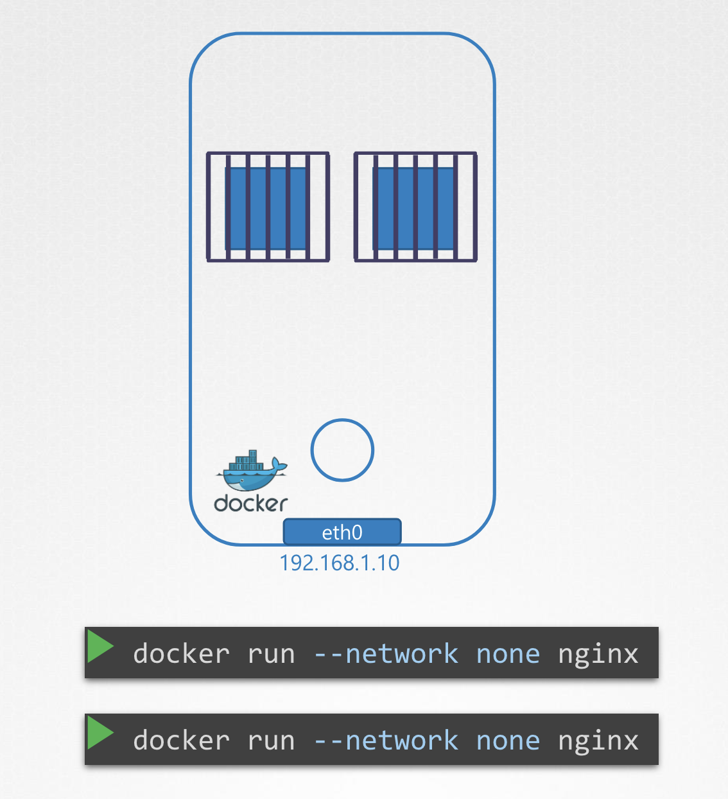
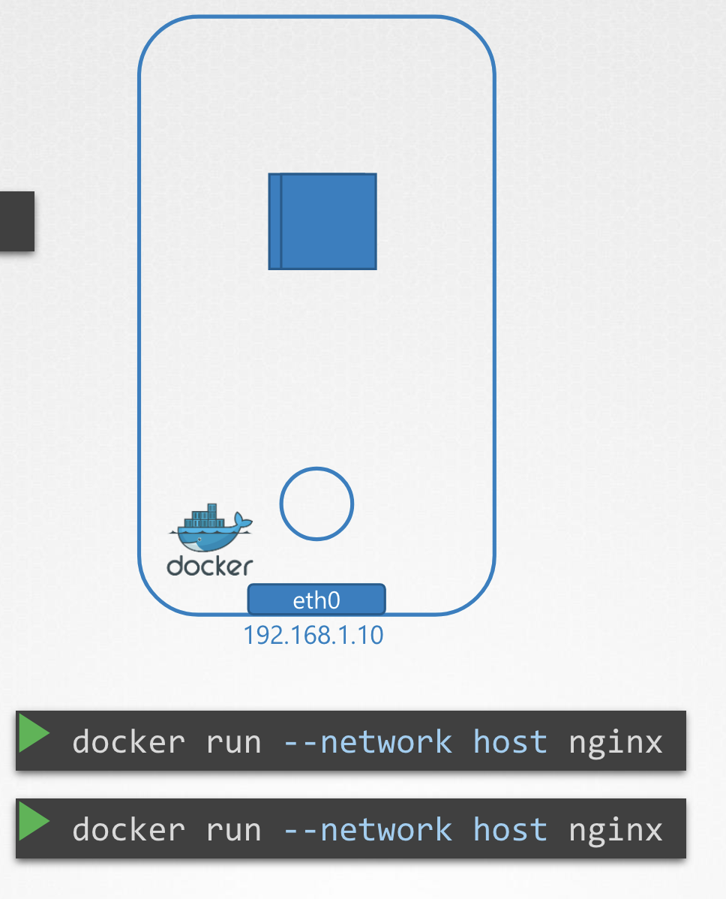
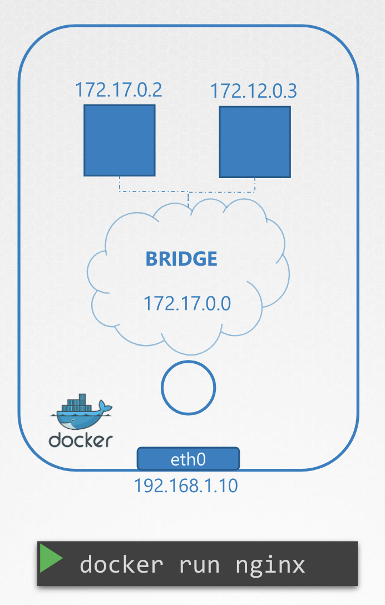
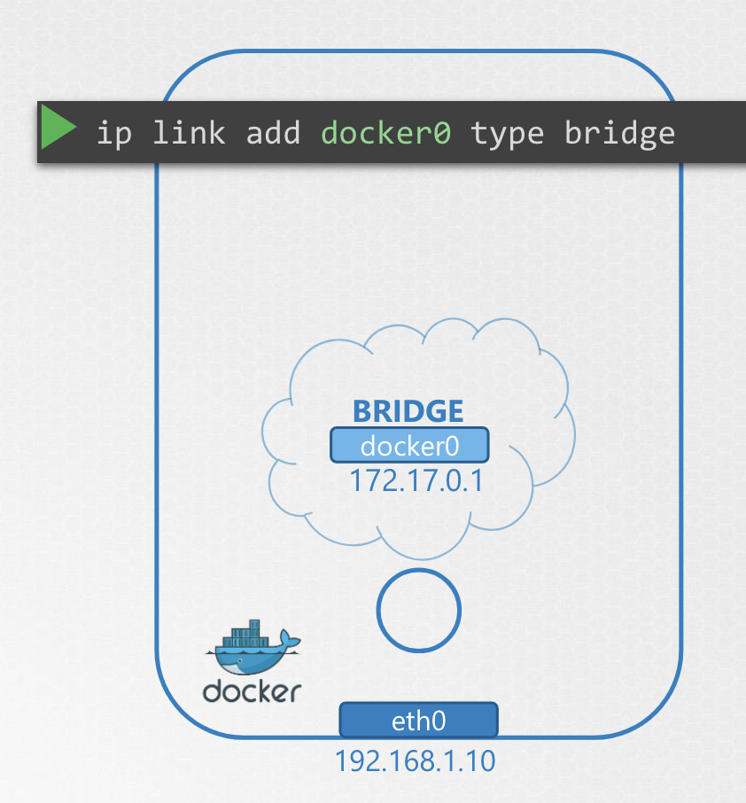
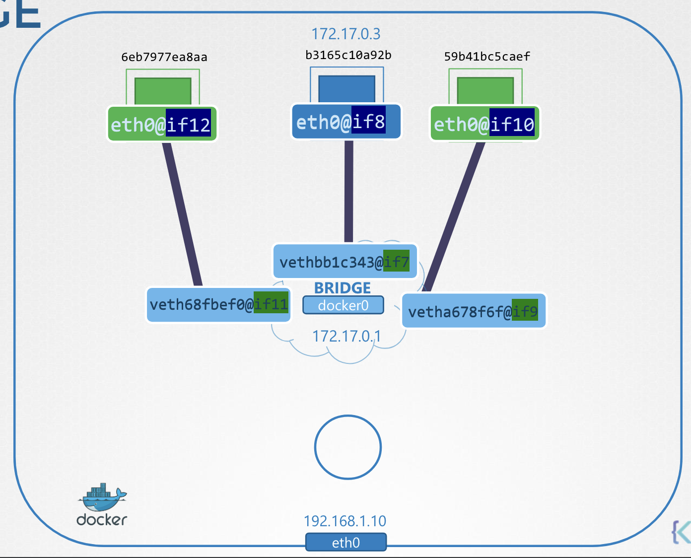

# Docker Networking

IP 주소 `192.168.1.10` 을 가진 호스트에 Docker 가 존재한다고 가정해보자

<br>

### ✔️ `NONE` Network

<br><br>

- 도커 컨테이너는 어떤 네트워크에도 연결되지 않음
- 안에서 밖으로, 밖에서 안으로 접근 모두 불가 

<br>

### ✔️ `HOST` Network

도커 컨테이너는 어떤 네트워크에도 연결되지 않음

<br><br>

- 컨테이너가 호스트 네트워크에 연결됨
- 호스트와 컨테이너 사이에 네트워크 격리가 없음
- 컨테이너 내 포트 `80`에서 수신되는 웹 응용 프로그램을 배포하면 웹 응용 프로그램은 호스트의 포트 `80`에서 사용 가능 
- `80` 번 포트에서 실행하는 두 개 이상의 컨테이너는 동작하지 않음 - 동시에 같은 포트에서 수신할 수 없음 

<br>

### ✔️ `BRIDGE` Network

<br><br>

- Internal Private 네트워크가 생성됨
- Docker 호스트와 컨테이너가 연결
- 기본적으로 `172.17.0.0`을 가짐 
- 브릿지 네트워크에 연결되는 각 장치는 네트워크의 Internal Private 네트워크 주소를 갖음

---

## Bridge Network

Docker가 호스트에 설치되면 기본값으로 **Bridge**라고 하는 내부 사설 네트워크를 만듦

`docker network ls` 명령어로 확인할 수 있음

```Bash
❯ docker network ls
NETWORK ID     NAME                           DRIVER    SCOPE
fb18818e82c8   bridge                         bridge    local
940447dbf8d1   host                           host      local
ce92394842d3   none                           null      local
```

Docker는 `bridge` 로 명시하지만, 호스트에선 `docker0`이란 이름으로 생성됨

<br>

<pre><code lang="bash">❯ p link
1: lo: <LOOPBACK,UP,LOWER_UP> mtu 65536 qdisc noqueue state UNKNOWN
mode DEFAULT group default qlen 1000
    link/loopback 00:00:00:00:00:00 brd 00:00:00:00:00:00
2: enp0s3: <BROADCAST,MULTICAST,UP,LOWER_UP> mtu 1500 qdisc
fq_codel state UP mode DEFAULT group default qlen 1000
    link/ether 02:42:ac:11:00:08 brd ff:ff:ff:ff:ff:ff
3: <b>docker0</b>: <NO-CARRIER,BROADCAST,MULTICAST,UP> mtu 1500 qdisc
noqueue state <b>DOWN</b> mode DEFAULT group default
    link/ether 02:42:88:56:50:83 brd ff:ff:ff:ff:ff:ff
</code></pre>

Docker 는 내부적으로 `ip link add docker0 type bridge` 를 사용해서 브릿지 네트워크를 생성 

<br><br>

**주목할 부분**

1. Docker 내 `bridge` == 호스트의 `docker0`
2. `docker0`의 상태는 현재 `DOWN`
3. `docker0`은 IP `172.17.0.1/24` 대역을 할당받음

<pre><code lang="bash">❯ ip addr
3: docker0: <NO-CARRIER,BROADCAST,MULTICAST,UP> mtu 1500 qdisc
noqueue state DOWN group default
    link/ether 02:42:88:56:50:83 brd ff:ff:ff:ff:ff:ff
    inet <b>172.17.0.1/24</b> brd 172.17.0.255 scope global docker0
        valid_lft forever preferred_lft forever
</code></pre>

컨테이너가 생성될 때마다 Docker는 이를 위한 **네트워크 네임스페이스**를 생성

✅ Hack: `ip netns` 명령어로 도커에 의해 생성된 namespace 목록 확인

<pre><code lang="bash">❯ ip netns
b3165c10a92b

❯ docker inspect 942d70e585b2
"NetworkSettings": {
    "Bridge": "",
    "SandboxID": "<b>b3165c10a92b</b>50edce4c8aa5f37273e180907ded31",
    "SandboxKey": "/var/run/docker/netns/<b>b3165c10a92b</b>",
</code></pre><br>

이하부터 network namespace와 container를 동일하게 간주

<br>

**✔️ docker network interface 확인**

`ip netns` 명령어로 확인했던 문자열을 `ip link` 명령어의 `-n` 옵션 값으로 입력하면, 숨겨진 인터페이스를 발견할 수 있음

<pre><code lang="bash">❯ ip -n <b>b3165c10a92b</b> link
...
7: <b>eth0@if8</b>: <BROADCAST,MULTICAST,UP,LOWER_UP> mtu 1500 qdisc noqueue state UP mode DEFAULT
group default
    link/ether 02:42:ac:11:00:03 brd ff:ff:ff:ff:ff:ff link-netnsid 0
</code></pre><br>

<br>

**✔️ docker IP address 확인**

`ip addr` 도 동일하게 `-n` 옵션 값으로 입력하면 IP 주소를 확인할 수 있음

<pre><code lang="bash">❯ ip -n <b>b3165c10a92b</b> addr
7: eth0@if8: <BROADCAST,MULTICAST,UP,LOWER_UP> mtu 1500 qdisc noqueue
state UP group default
    link/ether 02:42:ac:11:00:03 brd ff:ff:ff:ff:ff:ff link-netnsid 0
    inet <b>172.17.0.3/16</b> brd 172.17.255.255 scope global eth0
        valid_lft forever preferred_lft forever
</code></pre><br>


새 컨테이너가 만들어질 때마다 같은 과정을 거침

1. 네임스페이스를 만들고 
2. 한 쌍의 인터페이스를 만들어 
3. 한쪽 끝은 컨테이너에 다른 끝은 bridge 네트워크에 연결

<br><br>

번호로 인터페이스 쌍을 식별할 수 있는데,
홀수와 짝수 쌍 - `7 & 8`, `9 & 10`, `11 & 12`이 한 쌍

---

nginx 컨테이너는 포트 80에서 웹 페이지를 처리하는 웹 응용 프로그램

컨테이너가 호스트 내 프라이빗 네트워크 내에 있기 때문에,
**같은 네트워크의 다른 컨테이너들** 혹은 **호스트**만이 이 웹페이지에 액세스할 수 있음

Docker 호스트 포트 80 내에서 컨테이너의 IP로 컬을 이용해 웹페이지에 액세스하려 하면 웹페이지가 보임

호스트 밖에서 같은 걸 하려고 하면 웹페이지를 볼 수 없음

컨테이너에 호스팅된 응용 프로그램에 외부 사용자가 엑세스할 수 있도록
Docker는 port publishing 또는 port mapping 옵션을 제공

컨테이너를 실행 시, Docker에게 Docker의 포트 8080을 컨테이너의 포트 80과 매핑하라고 명시

<pre><code lang="bash">❯ docker run <b>-p 8080:80</b> nginx</code></pre><br>

Docker 호스트의 8080 으로 요청을 하면 컨테이너의 80으로 연결됨

외부에서 이 URL을 이용해 호스트에 배포된 응용 프로그램에 액세스할 수 있음

```Bash
❯  curl http://192.168.1.10:8080
Welcome to nginx!
```

그럼 Docker 는 어떻게 8080 번 포트를 연결시킬까?

**NAT 규칙 생성**

```Bash
❯ iptables
    –t nat \
    -A PREROUTING \
    -j DNAT \
    --dport 8080 \
    --to-destination 80
```

`iptables`를 이용해 NATs 테이블에 엔트리를 생성해 PREROUTING 체인 (prerouting chain) 규칙을 추가

목적지를 8080에서 80으로 바꿈 → Docker도 마찬가지

```Bash
❯ iptables
    –t nat \
    -A DOCKER \
    -j DNAT \
    --dport 8080 \
    --to-destination 127.17.0.3:80
```

Docker는 DOCKER 체인에 규칙을 추가하고 컨테이너의 IP도 포함하도록 목적지를 설정

IP 테이블에 규칙을 나열하면 Docker가 만드는 규칙을 볼 수 있음

<pre><code lang="bash">❯ iptables -nvL -t nat
Chain DOCKER (2 references)
target      prot opt source     destination
RETURN      all  --  anywhere   anywhere
DNAT        tcp  --  anywhere   anywhere        tcp <b>dpt:8080</b> to:<b>172.17.0.2:80</b>
</code></pre>