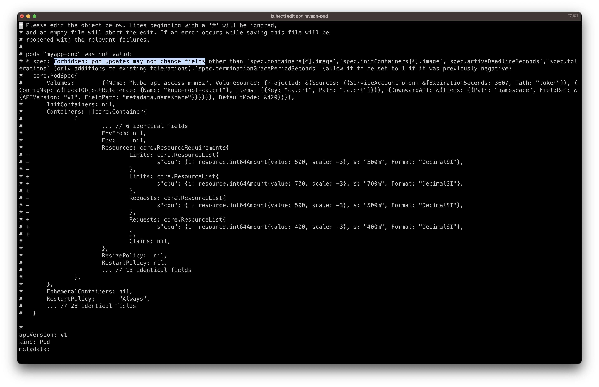

### Editing Pods and Deployments

### Method 1. Edit a POD

아래를 포함하여, 기존 Pod 스팩 설정은 수정 불가

- `spec.containers[*].image`
- `spec.initContainers[*].image`
- `spec.activeDeadlineSeconds`
- `spec.tolerations`

가령 Environment Variables, Service Account, Resource Limits 등과 같은 경우, 실행 중인 Pod를 수정 불가.

만약, 정말 변경이 되어야 한다면, 두 옵션이 있음:

1. `kubectl edit pod <pod name>` command

명령어 입력 시, Pod 스팩을 에디터(ex. Vim)로 열텐데, 꼭 필요한 속성을 수정하라

저장하려고 할 때, 거부 당할 텐데, 수정 불가한 필드를 수정하려고 시도하기 때문

<br/><br/>

<details>

```Bash
# Please edit the object below. Lines beginning with a '#' will be ignored,
# and an empty file will abort the edit. If an error occurs while saving this file will be
# reopened with the relevant failures.
#
# pods "myapp-pod" was not valid:
# * spec: Forbidden: pod updates may not change fields other than `spec.containers[*].image`,`spec.initContainers[*].image`,`spec.activeDeadlineSeconds`,`spec.tolerations` (only additions to existing tolerations),`spec.terminationGracePeriodSeconds` (allow it to be set to 1 if it was previously negative)
#   core.PodSpec{
#       Volumes:        {{Name: "kube-api-access-mmn8z", VolumeSource: {Projected: &{Sources: {{ServiceAccountToken: &{ExpirationSeconds: 3607, Path: "token"}}, {ConfigMap: &{LocalObjectReference: {Name: "kube-root-ca.crt"}, Items: {{Key: "ca.crt", Path: "ca.crt"}}}}, {DownwardAPI: &{Items: {{Path: "namespace", FieldRef: &{APIVersion: "v1", FieldPath: "metadata.namespace"}}}}}}, DefaultMode: &420}}}},
#       InitContainers: nil,
#       Containers: []core.Container{
#               {
#                       ... // 6 identical fields
#                       EnvFrom: nil,
#                       Env:     nil,
#                       Resources: core.ResourceRequirements{
# -                             Limits: core.ResourceList{
# -                                     s"cpu": {i: resource.int64Amount{value: 500, scale: -3}, s: "500m", Format: "DecimalSI"},
# -                             },
# +                             Limits: core.ResourceList{
# +                                     s"cpu": {i: resource.int64Amount{value: 700, scale: -3}, s: "700m", Format: "DecimalSI"},
# +                             },
# -                             Requests: core.ResourceList{
# -                                     s"cpu": {i: resource.int64Amount{value: 500, scale: -3}, s: "500m", Format: "DecimalSI"},
# -                             },
# +                             Requests: core.ResourceList{
# +                                     s"cpu": {i: resource.int64Amount{value: 400, scale: -3}, s: "400m", Format: "DecimalSI"},
# +                             },
#                               Claims: nil,
#                       },
#                       ResizePolicy:  nil,
#                       RestartPolicy: nil,
#                       ... // 13 identical fields
#               },
#       },
#       EphemeralContainers: nil,
#       RestartPolicy:       "Always",
#       ... // 28 identical fields
#   }
#
```

</details>

<pre><code lang="Bash">
❯ k edit pod myapp-pod
error: pods "myapp-pod" is invalid
A copy of your changes has been stored to <b>"/var/folders/8t/1y7tw5tx0f5gz3rvdmvjbnth0000gn/T/kubectl-edit-4293451670.yaml"</b>
error: Edit cancelled, no valid changes were saved.

# Please edit the object below. Lines beginning with a '#' will be ignored,
</code></pre>

위의 로그에서 볼 수 있듯이, 변경된 파일의 복사본이 저장되기 때문에, 해당 파일을 통해 재생성 

**1. 기존 Pod 제거** 

```Bash
❯ k delete pods myapp-pod
pod "myapp-pod" deleted
```

**2. 임시 저장된 파일을 기반으로 새로운 Pod 생성**

```Bash
❯ k create  -f "/var/folders/8t/1y7tw5tx0f5gz3rvdmvjbnth0000gn/T/kubectl-edit-4293451670.yaml"
pod/myapp-pod created
```

<br/><br/>

### Method 2. Extract the pod definition

두 번째 방법은, Pod 정의 YAML를 명령어를 통해 추출해내는 것

**1. Pod 정의 YAML 추출**

```
kubectl get pod webapp -o yaml > my-new-pod.yaml
```

**2. 저장된 추출 YAML 파일을 수정**

```Bash
vi my-new-pod.yaml
```

**3. 기존 Pod 제거**

```Bash
kubectl delete pod webapp
```

**4. 수정된 파일을 통해 Pod 생성**


```Bash
kubectl create -f my-new-pod.yaml
```

or

```Bash
kubectl replace --force -f <<file_name>>
```

`kubectl replace`는 실제적으로 `delete` → `create` 과 동일

<br/><br/>

### Edit Deployments

Pod Template이 Deployment 스팩의 하위 속성이기 때문에

Deployments 통한 Pod Template 의 field/property 수정은 쉬움

모든 변경 사항들은 자동으로 모든 Pod를 제거하고 변경된 내용을 반영한 Pod로 생성됨

그래서 만약 Deployment 에 의해 관리되는 Pod의 속성을 수정하고 싶다면, 간단히 아래 명령어 입력하면 됨 

```
kubectl edit deployment my-deployment
```
