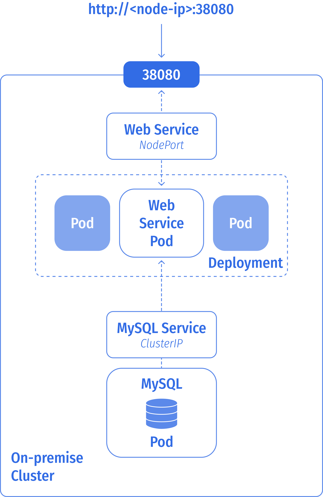
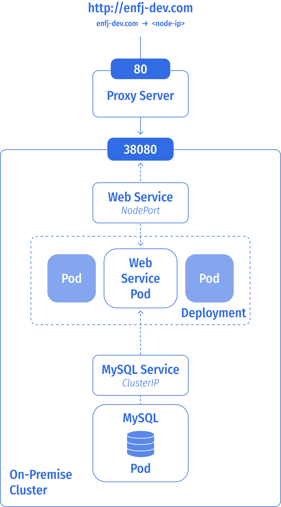
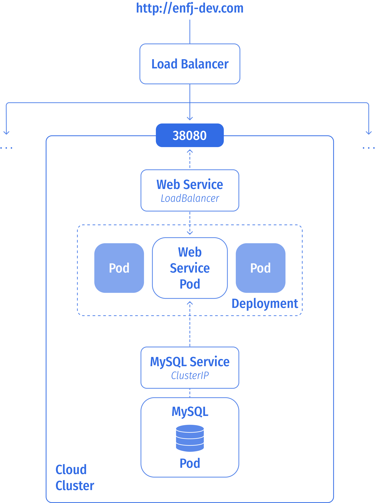
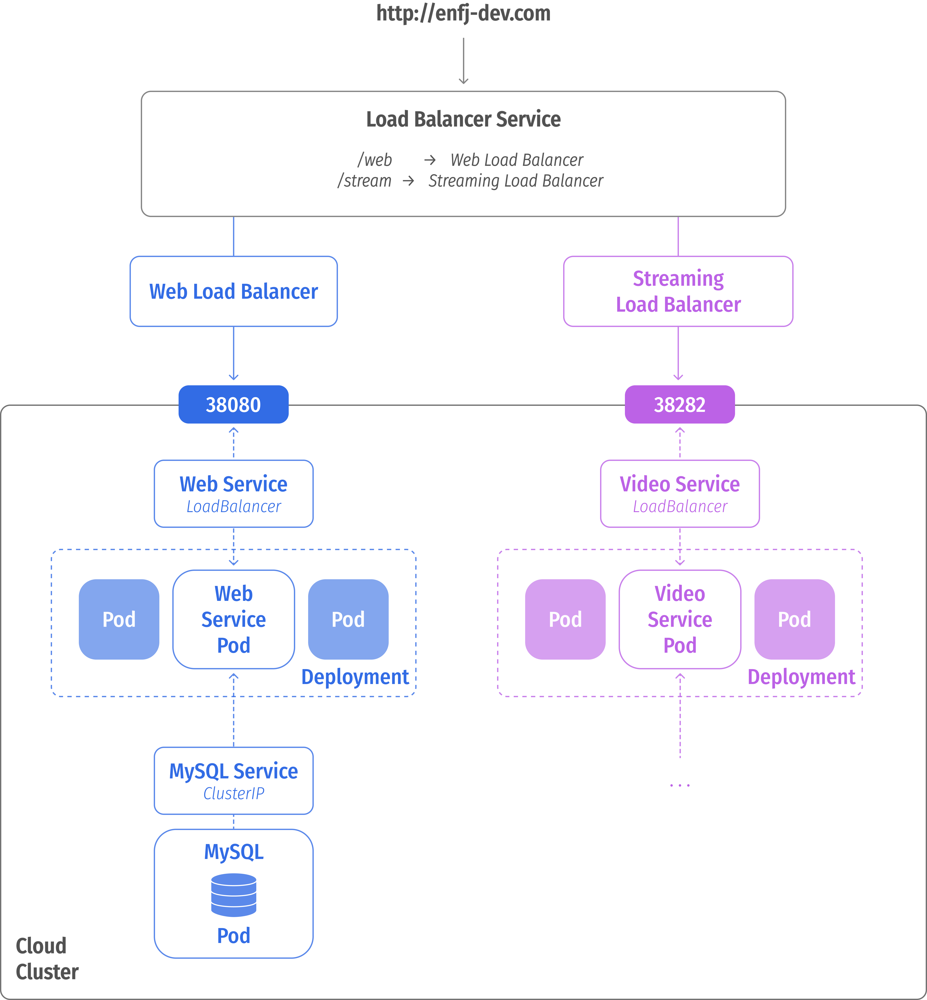
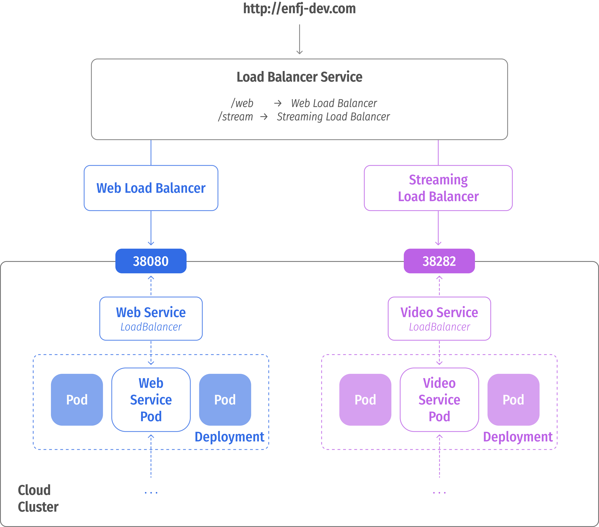
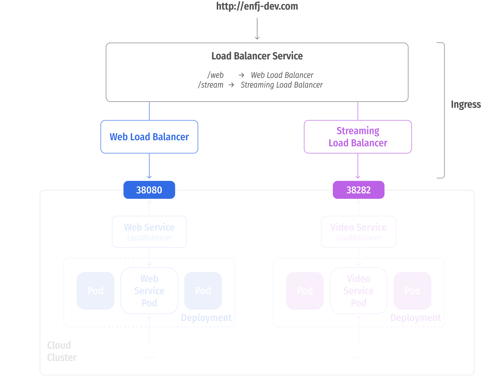
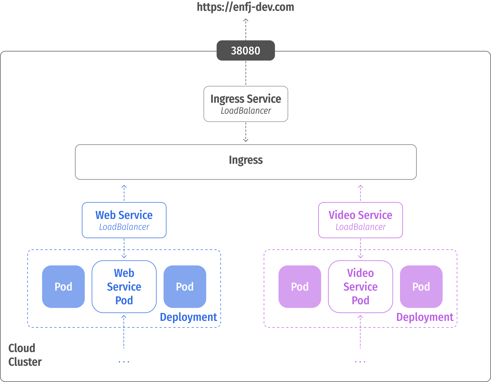

# Ingress

웹 서비스를 운영한다고 할 때, Cluster에 웹 서비스 Pod와 데이터베이스 Pod가 있다고 가정해보자

<br><br>

데이터베이스와 웹 Pod 는 ClusterIP 타입의 Service 를 통해 서로 통신할 수 있도록 설정해야 함

또, 웹 Pod는 외부와 연결되어야 하기 때문에 NodePort 타입의 Service 를 설정해야 함

그럼, node의 IP와 Port를 통해 정상 작동하는 앱에 접근할 수 있음 

<br><br>

DNS 서버에 Domain Name을 등록하고, 중간에 Proxy Server를 배치해서 Port Forwarding 을 설정

Could 환경에서는 NodePort를 설정하는 대신, LoadBalancer 를 설정

<br><br>

클라우드 서비스에서 배포하는 LoadBalancer는 트래픽을 자동으로 모든 노드 서비스 포트로 라우팅하고, 해당 정보를 쿠버네티스에 전달하도록 구성됨

로드 밸런서는 외부 IP를 갖고 있어서 사용자가 애플리케이션에 액세스할 수 있게 함

<br>

#### + 두 번째 서비스

위 클러스터에 새로운 서비스를 추가해야 한다고 가정해보자.

웹 서비스와 분리되어 배포되어야 하며, 동일하게 Service를 생성하고 클라우드 환경 내의 새로운 IP를 가진 Load Balancer 를 붙임.

<br><br>

<small><i>단, 각 LoadBalancer 마다 비용을 지불할 수 있어 예산을 고려해봐함</i></small>

이후, 각 서비스로 사용자들의 트래픽을 redirect 시켜야 하기 때문에, 또 새로운 서비스가 필요함

<br><br>

여기에 또, SSL 설정이나 방화벽 등의 설정을 해야 한다면 또 다른 레벨의 설정이 필요함

위 처럼 많은 설정들을 관리하기는 어려운데, Kubernetes에서는 클러스터 내에 설정을 모두 정의할 수 있음

**→ Ingress**

---

### Ingress

Ingress는 사용자가 외부에서 접근 가능한 단일 url을 이용해 클러스터 내 애플리케이션에 접근할 수 있도록 지원

<br><br>

다른 쿠버네티스 객체와 동일하게 하나의 객체로 정의해 두는 것

하지만, 여전히 클러스터 외부와 연결될 수 있도록 Node Port / LoadBalancer 를 연결해야 함

<br><br>

Ingress 를 사용하는 방법은 두 단계를 거침 

**1. Deploy Reverse Proxy or Load Balancing Solution**

LoadBalancer나 SSL 설정을 하는 방식은 **Reverse Proxy**를 사용하거나,
**Nginx**, **HA Proxy**, **Traefik** 같은 Load Balancing 솔루션을 사용할 수 있음

**→ Ingress Controller**

<br>

**2. Configure Ingress Rules**

Ingress 규칙을 지정

이전 객체랑 동일하게 정의 파일로 설정 

**→ Ingress Resources**

---

### Ingress Controller

Ingress Controller 는 기본적으로 Kubernetes가 설정하지 않기 때문에 필요하면 직접 배포해야 함

- GCP HTTP(S), Load Balancer (GCE)  ← maintained by the Kubernetes
- Nginx                             ← maintained by the Kubernetes
- Contour
- HA Proxy
- Traefik
- Istio


로드 밸런서 구성 요소는 그저 Ingress Controller의 일부임

Ingress Controller 들은 새로운 정의들 또는 Ingress Resources 을 위해 쿠버네티스 클러스터를 모니터링하고,
Nginx 서버를 구성하기 위해 추가적인 쿠버네티스에 내장된 정보를 가짐

Ingress Controller를 Nginx Deploy 정의 파일로 생성해보자

<table>

<tr>
<th>Nginx Deployment</th>
<td>

```yaml
apiVersion: extension/v1beta1
kind: Deployment
metadata:
  name: nginx-ingress-controller
spec:
  replica: 1
  selector:
    matchLabels:
      name: nginx-ingress
    template:
      metadata: 
        labels: 
          name: nginx-ingress
      spec: 
        containers: 
          - name: nginx-ingress-controller 
            image: quay.io/kubernetes-ingress-controller/nginx-ingress-controller:0.21.0 
        args: 
          - /nginx-ingress-controller 
          - --configmap=$(POD_NAMESPACE)/nginx-configuration
        env: 
          - name: POD_NAME 
            valueFrom: 
              fieldRef: 
                fieldPath: metadata.name
          - name: POD_NAMESPACE 
            valueFrom: 
              fieldRef: 
                fieldPath: metadata.namespace
        port: 
          - name: http 
            containerPort: 80
          - name: http s
            containerPort: 443
```

Ingress Controller 들은 새로운 정의들 또는 Ingress Resources 을 위해 쿠버네티스 클러스터를 모니터링하고, Nginx 서버를 구성하기 위해 추가적인 쿠버네티스에 내장된 정보를 가짐
</td>
</tr>
<tr>
<th>ConfigMap</th>
<td>

```yaml
apiVersion: v1
kind: ConfigMap
metadata:
  name: nginx-configuration
```

이 때, 로깅이나 Keep-alive나 ssl-protocol 같은 실서비스에서 필요한 요소들이 있을 텐데,
이는 ConfigMap 에 정의해야 함

그래야 이후 수정을 원할 때, Nginx 설정 파일을 직접 수정하는 게 아닌, ConfigMap 객체 내 데이터 만을 수정할 수 있게 만들 수 있음

</td>
</tr>
<tr>
<th>Service (NodePort)</th>
<td>

```yaml
apiVersion: v1
kind: Service
metadata:
  name: nginx-ingress
spec:
  type: NodePort
  ports:
  - port: 80
    targetPort: 80
    protocol: TCP
    name: http
  - port: 443
    targetPort: 443
    protocol: TCP
    name: https
  selector:
    name: nginx-ingress
```

두 번째로 이후, NodePort 가 필요함

</td>
</tr>

<tr>
<th>Auth - ServiceAccount</th>
<td>

두 번째로 이후, NodePort 가 필요함

마지막으로, 이를 접근하기 위해 올바른 권한을 가진 서비스 계정이 필요함

```yaml
apiVersion: v1
kind: ServiceAccount
metadata:
  name: nginx-ingress-serviceaccount
```

Roles, ClusterRoles, RoleBinding 등

</td>
</tr>

</table>

정리하자면, Nginx Ingress 를 배포하기 위해서 네 가지 객체 정의 - Deployment, Service, ConfigMap, Auth - 가 필요

---

### Ingress Resource

이제 트래픽을 앱으로 보내거나 url에 따라 여러 앱으로 라우팅할 수 있도록 규칙을 구성

```yaml
apiVersion: extensions/v1beta1
kind: Ingress
metadata:
  name: test-ingress
spec:
  backend: 
    serviceName: test
    servicePort: 80
```

```bash
$ kubectl create -f Ingress-wear.yaml
ingress.extesions/ingress-wear created

$ kubectl get ingress
NAME           HOSTS   ADDRESS         PORTS   AGE
test-ingress   *       203.0.113.123   80      59s
```

이제 지정한 이름과 Port로 들어오는 트래픽은 위 Rule이 적용될 것임

위의 형식으로 다양한 방식의 규칙을 정의할 수 있음

| www.enfj-dev.com  | www.portfolio.enfj-dev.com | www.video.enfj-dev.com | Everything Else |
|-------------------|----------------------------|------------------------|-----------------|
| Path `/portfolio` | Path `/`                   | Path `/`               | Path `/`        |
| Path `/contact`   | Path `/projects`           | Path `/vlog`           | 404 Page        |
| Path `/`          | Path `/contact`            | Path `/reels`          |                 |

위 처럼, 각각의 Host 와 domain 이름 하위에 각각의 Path를 정의할 수 있음

위 표의 첫 번째 규칙을 작성해보면 아래와 같음 

```yaml
apiVersion: networking.k8s.io/v1
kind: Ingress
metadata:
  name: ingress-blog-path
spec:
  rules:
    - http:
        paths:
          - path: /portfolio
            pathType: Prefix
            backend:
              service:
                name: portfolio-page
                port:
                  number: 80
          - path: /contact
            pathType: Prefix
            backend:
              service:
                name: contact-page
                port:
                  number: 80
```

만약 도메인 이름으로 분리하고 싶으면 아래와 같이 `host`를 설정

```yaml
apiVersion: networking.k8s.io/v1
kind: Ingress
metadata:
  name: ingress-blog-host
spec:
  rules:
  - host: "portfolio.enfj-dev.com"
    http:
      paths:
      - pathType: Prefix
        path: "/projects"
        backend:
          service:
            name: projects-service
            port:
              number: 80
  - host: "video.enfj-dev.com"
    http:
      paths:
      - pathType: Prefix
        path: "/vlog"
        backend:
          service:
            name: vlog-service
            port:
              number: 80
```

---

k8s version 1.20+ 부터 Ingress 변경

**Format** - `kubectl create ingress <ingress-name> --rule="host/path=service:port"`

**Example** -` kubectl create ingress ingress-test --rule="wear.my-online-store.com/wear*=wear-service:80"`


✔️ References

- https://kubernetes.io/docs/reference/generated/kubectl/kubectl-commands#-em-ingress-em-

- https://kubernetes.io/docs/concepts/services-networking/ingress

- https://kubernetes.io/docs/concepts/services-networking/ingress/#path-types