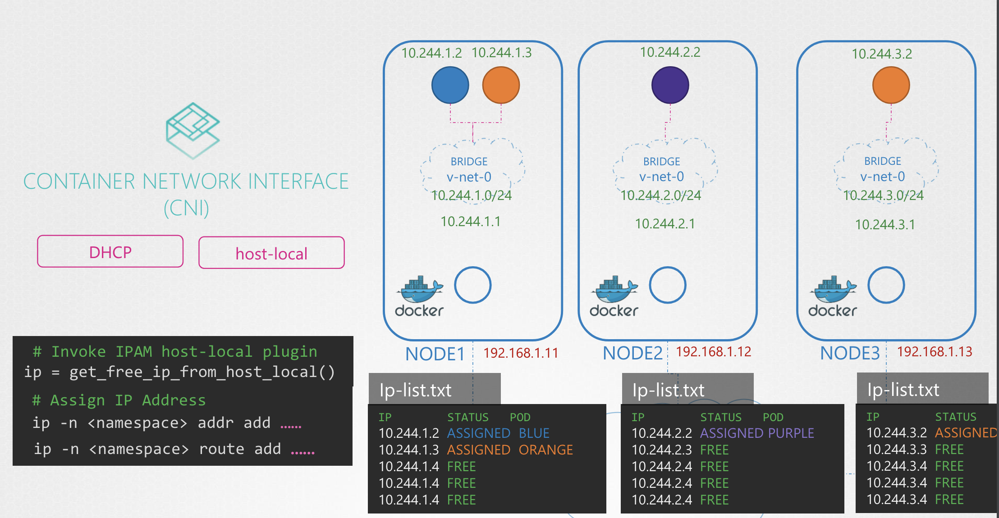

# IP Address Management

IP가 할당은 스스로 설정할 수도 있고 IPAM 솔루션을 사용할 수도 있음

그럼 노드의 Virtual Bridge Network과 그 내부의 Pod에는 어떻게 IP 서브넷이 할당될까?

IP를 컨테이너에 할당하는 건 CNI 자체의 책임은 아니고, CNI Plugin 의 Network Solution Provider 의 책임

적절하게 IP를 배분하고 서로 중복되지 않게 할당시켜야 함

가장 간단한 방법은 각 노드마다 사용 가능한 IP 리스트를 파일에 저장해서 관리하는 것

<br><br>

CNI 은 두 개의 Built-in 플러그인 ⎯ **`DHCP`**, **`host-local`** ⎯ 이 있어서, IP 할당 작업을 아웃소싱할 수 있게 함

<br>

### Method 1. invoke `get_free_ip_from_host_local()`

<br>
<pre><code># Invoke IPAM host-local plugin
ip = <b>get_free_ip_from_host_local()</b>
# Assign IP Address
ip -n <namespace> addr add ……
ip -n <namespace> route add ……
</code></pre>
<br>

위 처럼 `get_free_ip_from_host_local()` 함수를 호출해서 할당 할 수 있음

<br>

### Method 2. set CNI `IPAM` Plugin

CNI 설정 파일의 ipam 설정으로 해결할 수 있음 

<pre><code>$ cat /etc/cni/net.d/net-script.conf
{
    "cniVersion": "0.2.0",
    "name": "mynet",
    "type": "net-script",
    "bridge": "cni0",
    "isGateway": true,
    "ipMasq": true,
    <b>"ipam": {
        "type": "host-local",
        "subnet": "10.244.0.0/16",
        "routes": [
            { "dst": "0.0.0.0/0" }
        ]
    }</b>
}</code></pre>

host local 를 사용할 때, 위 파일을 읽어 적절한 플러그인을 호출함

---

### Weave

Weave 는 기본적으로 전체 네트워크 중 `10.32.0.0/12` IP 대역을 할당하고 있고, 
그중  `10.32.0.1` ~ `10.32.255.254` 대역의 네트워크 IP 를 할당해줌

그래서 총 `10.32.0.1` ~ `10.47.255.254` 는 `1,048.574` 개의 IP를 할당할 수 있음

```Bash
00001010.00010010.00000000.00000001    ← 10.32.0.1
00001010.00011111.11111111.11111110    ← 10.47.255.254
```

그리고 각 노드에 균등하게 IP 대역을 나눠줌

가령, 3개의 노드가 있다면 아래와 같이 나눌 수 있음 

- Node A: 10.32.0.1
- Node B: 10.38.0.0
- Node C: 10.44.0.0

위 설정은 Weave 설정 파일에서 설정할 수 있음


