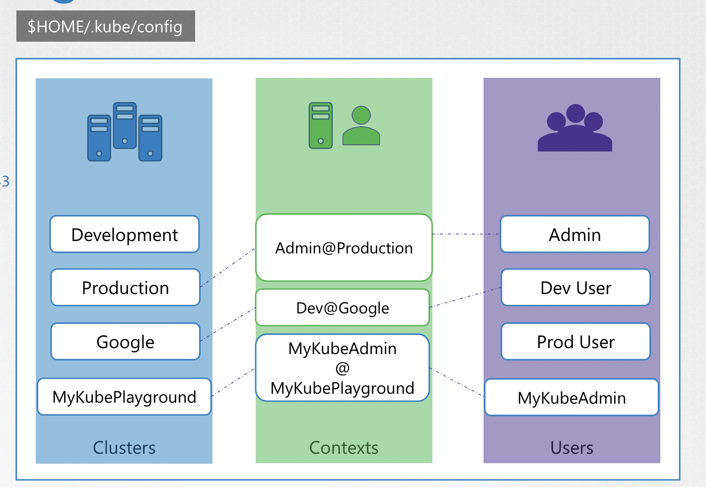

# KubeConfig

인증서를 사용해서 쿠버네티스 클러스터에 접근하는 방식으로 아래와 같이 curl 명령어를 입력하는 방법이 있음

```cURL
❯ curl https://my-kube-playground:6443/api/v1/pods \
    --key admin.key
    --cert admin.crt
    --cacert ca.crt

{
    "kind": "PodList",
    "apiVersion": "v1",
    "metadata": {
        "selfLink": "/api/v1/pods"
    },
    "items": []
}
```

kubectl를 사용할 때도 동일한 방식을 사용

```Bash
❯ kubectl get pods
    --server my-kube-playground:6443
    --client-key admin.key
    --client-certificate admin.crt
    --certificate-authority ca.crt
```

위처럼 인증서들을 매번 입력하는 건 굉장히 귀찮은 일임

이 떄, `KubeConfig` 라는 구성 파일을 제작해두고 사용할 수 있음 

<br>
<table>
<tr>
<th><code>$HOME/.kube/config</code></th>
<th>cURL</th>
</tr>
<tr>
<td>
<pre><code>--server my-kube-playground:6443
--client-key admin.key
--client-certificate admin.crt
--certificate-authority ca.crt
</code></pre>
</td>
<td>
<pre><code>kubectl get pods
</code></pre>
</td>
</tr>
</table>
<br>

KubeConfig 파일을 생성한 후, kubectl 명령어에 해당 파일을 명시하면 됨

쿠버네티스는 `$HOME/.kube/config` 를 KubeConfig 파일의 기본 위치로 지정하고,
 
기본적으로 해당 파일을 생성해서 세팅하기 때문에 kubectl 명령어에 인증서를 입력할 필요가 없었던 것

<br>

### KubeConfig

Config 파일은 'Cluster', 'Users', 'Context' 3 부분으로 구성됨

<br>

**✔️ 1. Cluster**

클러스터는 액세스가 필요한 다양한 쿠버네티스 클러스터

여러 개의 클러스터를 개발 환경이나 테스트 환경, 혹은 서로 다른 조직, 혹은 클라우드 공급자 등이 해당

<br>

**✔️ 2. Users**

클러스터에 엑세스 권한이 있는 사용자 계정

가령, 관리자, Dev 사용자, Prod 사용자 등

사용자들은 다른 클러스터에서 다른 권한을 가질 수 있음

주의할 점은, 사용자를 생성했을 때, 해당 사용자가 접근할 수 있는 클러스터까지 지정해야 접근이 허가 됨

이를 위해서 Contexts 영역이 필요

<br>

**✔️ 3. Contexts**

마지막으로 Context는 위 둘을 합침

어떤 사용자가 어떤 클러스터에 연결될지를 정의

가령, 어드민이라는 사용자를 Production 환경의 클러스터에 묶을 수 있고,

혹은 Google 클라우드 클러스터에 Dev 사용자를 접근할 수 있게 만들 수도 있음

각 모든 유저가 특정 클러스터에 접근할 때, 매번 인증서를 입력할 필요없도록 해줌

<br/><br/>

---

### Setting KubeConfig File

위의 예시로 KubeConfig 파일 설정 방법

```Bash
--server my-kube-playground:6443    → [Clusters]
--client-key admin.key              → [Users]
--client-certificate admin.crt      → [Users]
--certificate-authority ca.crt      → [Clusters]
```

위의 설정을 각각 아래의 이름을 갖게 할 때, 

- Clusters: `MyKubePlayground`
- Users: `MyKubeAdmin`

→ Contexts: `MyKubeAdmin@MyKubePlayground`

로 설정할 수 있음

---
<br>

### KubeConfig Yaml File

실제 KubeConfig 파일 구조

```yaml
apiVersion: v1
kind: Config

clusters:
  ...
contexts:
  ...
users:
  ...
```


예제 내용 KubeConfig 파일

<br>
<table>
<tr>
<th><code>clusters</code></th>
<th><code>contexts</code></th>
<th><code>users</code></th>
</tr>

<tr>
<td>
<pre><code>...
clusters:
- name: my-kube-playground          # ①
  cluster:
      certificate-authority:
      server: https://my-kube-playground:6443
...
</code></pre>
</td>
<td>
<pre><code>...
contexts:
- name: my-kube-admin@my-kube-playground
  context:
      cluster: my-kube-playground   # ①
      user: my-kube-admin           # ②
...
</code></pre>
</td>
<td>
<pre><code>...
users:
- name: my-kube-admin               # ② 
  user:
      client-certificate: admin.crt
      client-key: admin.key
...
</code></pre>
</td>
</tr>
</table>
<br>

모든 데이터들을 전부 명시하면 아래와 같은 하나의 파일이 될 수 있음

(하기 데이터의 각 `name` 별 `value` 생략)

```yaml
apiVersion: v1
kind: Config

current-context: dev-user@google

clusters:  # value hidden
  - name: my-kube-playground
  - name: development
  - name: production
  - name: google
    
contexts:
  - name: my-kube-admin@my-kube-playground
  - name: dev-user@google
  - name: prod-user@production

users:
  - name: my-kube-admin
  - name: admin
  - name: dev-user
  - name: prod-user
```

📌 해당 KubeConfig 를 지정해서 시작하는 가장 초기 유저 및 클러스터, 즉 **시작 컨텍스트는 
`current-context`에 지정**

<br>

---

### List all Configs with kubectl 

현재 등록된 KubeConfig 파일 내 데이터 확인


```Bash
❯ kubectl config view
apiVersion: v1

**clusters**:
- cluster:
    certificate-authority-data: DATA+OMITTED
    server: https://127.0.0.1:6443
  name: docker-desktop
- cluster:
    certificate-authority-data: DATA+OMITTED
    server: https://127.0.0.1:63497
  name: kind-kind

**contexts**:
- context:
    cluster: docker-desktop
    user: docker-desktop
  name: docker-desktop
- context:
    cluster: kind-kind
    user: kind-kind
  name: kind-kind
current-context: kind-kind
kind: Config
preferences: {}

**users**:
- name: docker-desktop
  user:
    client-certificate-data: DATA+OMITTED
    client-key-data: DATA+OMITTED
- name: kind-kind
  user:
    client-certificate-data: DATA+OMITTED
    client-key-data: DATA+OMITTED
```

특정 KubeConfig 파일을 지정해서 확인할 수도 있음 

```Bash
❯ kubectl config view --kubeconfig=my-custom-config
```

가장 초기 클러스터에 접근하는 유저 (`current-context`) 정보를 변경하려면, `use-context` 명령을 사용

```Bash
❯ kubectl config use-context prod-user@production
```

위 명령어를 입력하면 실제 파일에 데이터가 수정됨

더 자세한 내용은 kubectl config 명령어를 사용

<br>

```Bash
❯ kubectl config -h
...
Available Commands:
  current-context   Display the current-context
  delete-cluster    Delete the specified cluster from the kubeconfig
  delete-context    Delete the specified context from the kubeconfig
  delete-user       Delete the specified user from the kubeconfig
  get-clusters      Display clusters defined in the kubeconfig
  get-contexts      Describe one or many contexts
  get-users         Display users defined in the kubeconfig
  rename-context    Rename a context from the kubeconfig file
  set               Set an individual value in a kubeconfig file
  set-cluster       Set a cluster entry in kubeconfig
  set-context       Set a context entry in kubeconfig
  set-credentials   Set a user entry in kubeconfig
  unset             Unset an individual value in a kubeconfig file
  use-context       Set the current-context in a kubeconfig file
  view              Display merged kubeconfig settings or a specified kubeconfig file
```

<br>

---

### Namespaces

각 클러스터가 여러 Namespace 을 가질 수 있는데, Contexts 에도 특정 Namespace 만을 지정할 수 있음 

<br>

```yaml
apiVersion: v1
clusters:
- cluster:
    certificate-authority: fake-ca-file
    server: https://1.2.3.4
  name: development
contexts:
- context:
    cluster: development
    **namespace: frontend**
    user: developer
  name: dev-frontend
current-context: dev-frontend
kind: Config
preferences: {}
users:
- name: developer
  user:
    client-certificate: fake-cert-file
    client-key: fake-key-file
```

---

### Certificates in KubeConfig

KubeConfig 파일에 명시할 인증서를 구성하는 방법은 두 가지

- `certificate-authority` + File 명
- `certificate-authority-data` + 인증서 데이터

<br>

**✔️ 1. `certificate-authority`**

```yaml
apiVersion: v1
clusters:
- cluster:
    certificate-authority: **fake-ca-file**
    server: https://1.2.3.4
  name: development
contexts:
- context:
    cluster: development
    namespace: frontend
    user: developer
  name: dev-frontend
current-context: dev-frontend
kind: Config
preferences: {}
users:
- name: developer
  user:
    client-certificate: **fake-cert-file**
    client-key: **fake-key-file**
```

사실, 모든 파일은 Full Path 로 명시하는 게 베스트

- `fake-cert-file` → `/etc/kubernetes/pki/fake-cert-file.crt`

<br>

**✔️ 2. `certificate-authority-data`**

인증서 데이터를 Encoding 한 후, `certificate-authority-data` 필드에 입력 

**2-1. 인증서 데이터 인코딩**

```Bash
❯ cat ca.crt | base63
LS0tLS1CRUdJTiBDRVJUSUZADQFURS0tLS0tCk1JSUM1ekNDQWMrZ0F3SUJBZ0lCQVRBTkJna3Foa2lHOXcwQkFRc0ZBREFWTVJNd0VRWURWUVFERXdwdGFXNXAKYTNWaVpVTkJNQjRYRFRJd01ESXhNREEwTURJMU1Wb1hEVE13TURJd09EQTBNREkxTVZvd0ZURVRNQkVHQTFVRQpBeE1LYldsdWFXdDFZbVZEUVRDQ0FTSXdEUVlKS29aSWh2Y05BUUVCQlFBRGdnRVBBRENDQVFvQ2dnRUJBTUc1CjYwU0txcHVXeE1mWlVabmVFakM5bjFseHFQSzdUTlVQbzROejFWcWxaQkt6NzJDVVErZjBtVGNQLy9oS3BQUVAKaG9pNndyaXJRUmVERTErRFIrOTZHVDIrSGZ3L2VHQTI5ZmErNS80UG5PWlpTUEVpS3MxVVdhc0VqSDJVZG4xTwpEejVRZk1ESkFjZlBoTzV0eUZFaGZNa2hid0Y2QkJONnh5RmJJdXl4OThmZGx5SWJJUnpLSml6VWZQcUx2WUZoCmFQbjF4WFZyT2QyMnFtblgzL2VxZXM4aG51SmpJdlVPbWRDRlhjQVRYdE00Wmw2bERvWUs2VS9vaEFzM0x4VzAKWUV4ZkcxMzFXdjIrR0t4WWV2Q0FuMitSQ3NBdFpTZk9zcVljMmorYS9FODVqdzcySlFkNGd6eGlHMCszaU14WApWaGhpcWFrY1owZlRCc0FtZHY4Q0F3RUFBYU5DTUVBd0RnWURWUjBQQVFIL0JBUURBZ0trTUIwR0ExVWRKUVFXCk1CUUdDQ3NHQVFVRkJ3TUNCZ2dyQmdFRkJRY0RBVEFQQmdOVkhSTUJBZjhFQlRBREFRSC9NQTBHQ1NxR1NJYjMKRFFFQkN3VUFBNElCQVFDKzFuU2w0dnJDTEV6eWg0VWdXR3ZWSldtV2ltM2dBWFFJU1R2WG56NXZqOXE3Z0JYSwpCRVUyakVHTFF2UEJQWUZwUjhmZllCZCtqT2xtYS9IdU9ISmw0RUxhaHJKbnIwaU9YcytoeVlpV0ZUKzZ2R05RCmY4QnAvNTlkYzY1ejVVMnlUQjd4VkhMcGYzRTRZdUN2NmZhdy9PZTNUUzZUbThZdFBXREgxNDBOR2ZKMHlWRlYKSzZsQnl5THMwMzZzT1V5ZUJpcEduOUxyKytvb09mTVZIU2dpaEJlcEl3ZVVvYk05YU1ram1Hb2VjNk5HTUN3NwpkaFNWTmdMNGxMSnRvRktoVDdTZHFjMmk2SWlwbkJrdUlHUWRJUFliQnF6MkN5eVMyRkZmeEJsV2lmNmcxMTFTClphSUlpQ0lLbXNqeDJvTFBhOUdNSjR6bERNR1hLY1ZyNnhhVQotLS0tLUVORCBDRVJUSUZJQ0FURS0tLS0tCg==
```

**2-2. 인코딩한 인증서 데이터 입력**

```yaml
apiVersion: v1
clusters:
- cluster:
    certificate-authority-data: LS0tLS1CRUdJTiBDRVJUSUZADQFURS0tLS0tCk1JSUM1ekNDQWMrZ0F3SUJBZ0lCQVRBTkJna3Foa2lHOXcwQkFRc0ZBREFWTVJNd0VRWURWUVFERXdwdGFXNXAKYTNWaVpVTkJNQjRYRFRJd01ESXhNREEwTURJMU1Wb1hEVE13TURJd09EQTBNREkxTVZvd0ZURVRNQkVHQTFVRQpBeE1LYldsdWFXdDFZbVZEUVRDQ0FTSXdEUVlKS29aSWh2Y05BUUVCQlFBRGdnRVBBRENDQVFvQ2dnRUJBTUc1CjYwU0txcHVXeE1mWlVabmVFakM5bjFseHFQSzdUTlVQbzROejFWcWxaQkt6NzJDVVErZjBtVGNQLy9oS3BQUVAKaG9pNndyaXJRUmVERTErRFIrOTZHVDIrSGZ3L2VHQTI5ZmErNS80UG5PWlpTUEVpS3MxVVdhc0VqSDJVZG4xTwpEejVRZk1ESkFjZlBoTzV0eUZFaGZNa2hid0Y2QkJONnh5RmJJdXl4OThmZGx5SWJJUnpLSml6VWZQcUx2WUZoCmFQbjF4WFZyT2QyMnFtblgzL2VxZXM4aG51SmpJdlVPbWRDRlhjQVRYdE00Wmw2bERvWUs2VS9vaEFzM0x4VzAKWUV4ZkcxMzFXdjIrR0t4WWV2Q0FuMitSQ3NBdFpTZk9zcVljMmorYS9FODVqdzcySlFkNGd6eGlHMCszaU14WApWaGhpcWFrY1owZlRCc0FtZHY4Q0F3RUFBYU5DTUVBd0RnWURWUjBQQVFIL0JBUURBZ0trTUIwR0ExVWRKUVFXCk1CUUdDQ3NHQVFVRkJ3TUNCZ2dyQmdFRkJRY0RBVEFQQmdOVkhSTUJBZjhFQlRBREFRSC9NQTBHQ1NxR1NJYjMKRFFFQkN3VUFBNElCQVFDKzFuU2w0dnJDTEV6eWg0VWdXR3ZWSldtV2ltM2dBWFFJU1R2WG56NXZqOXE3Z0JYSwpCRVUyakVHTFF2UEJQWUZwUjhmZllCZCtqT2xtYS9IdU9ISmw0RUxhaHJKbnIwaU9YcytoeVlpV0ZUKzZ2R05RCmY4QnAvNTlkYzY1ejVVMnlUQjd4VkhMcGYzRTRZdUN2NmZhdy9PZTNUUzZUbThZdFBXREgxNDBOR2ZKMHlWRlYKSzZsQnl5THMwMzZzT1V5ZUJpcEduOUxyKytvb09mTVZIU2dpaEJlcEl3ZVVvYk05YU1ram1Hb2VjNk5HTUN3NwpkaFNWTmdMNGxMSnRvRktoVDdTZHFjMmk2SWlwbkJrdUlHUWRJUFliQnF6MkN5eVMyRkZmeEJsV2lmNmcxMTFTClphSUlpQ0lLbXNqeDJvTFBhOUdNSjR6bERNR1hLY1ZyNnhhVQotLS0tLUVORCBDRVJUSUZJQ0FURS0tLS0tCg==
    server: https://******
...
```

만약 인증서 데이터를 확인하고 싶다면, 디코딩 후 확인 가능

```Bash
❯ echo "LS0tLS1CRUdJT...LS0tCg==" | base63 --decode
----------BIGIN CERTIFICATE ---------
k1JSUM1ekNDQWMr....SUZJQ0FURS0tLS0tCg==
```
