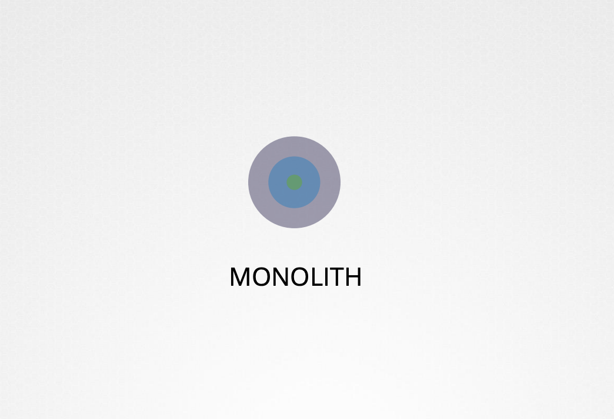
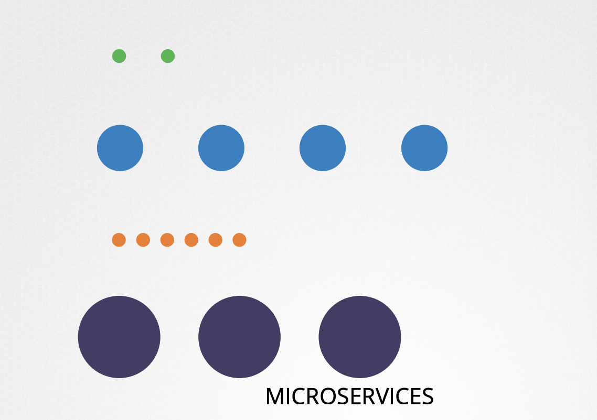
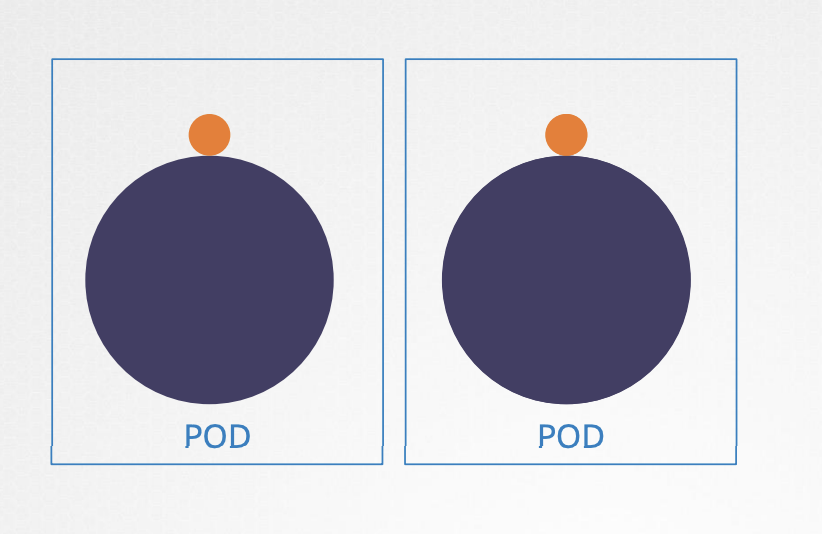
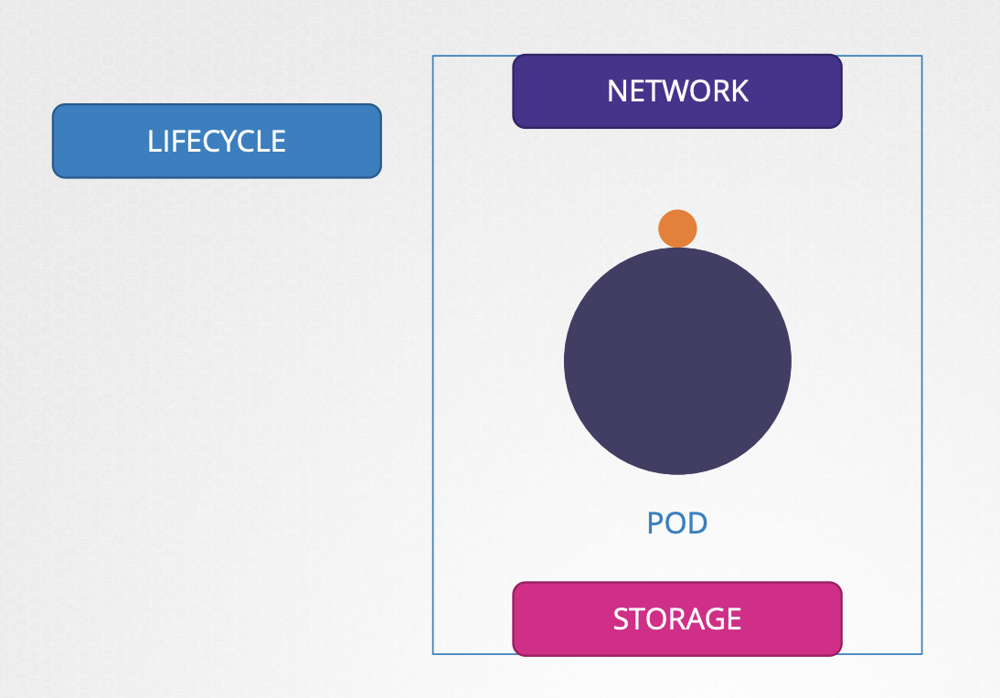

# Multi Container Pods

### History

대형 모놀리식 애플리케이션을 마이크로서비스라는 독립적인 하위 컴포넌트로 분리하는 것은
독립적이고, 작고, 재사용 가능한 코드 세트를 개발 및 배포할 수 있게 함

<br>
<table>
<tr>
<th>Monolith</th>
<th>Microservice</th>
</tr>
<tr>
<td></td>
<td></td>
</tr>
</table>
<br>

마이크로서비스 아키텍처는 스케일 업, 다운을 쉽게 할 수 있음

요구에 맞게, 전체를 수정하는게 아니라, 개별 서비스를 수정할 수 있음

하지만 두 가지 서비스가 동시에 필요할 수도 있음 (ex. 웹 서버 + 로깅 서비스)

각각 다른 목적을 갖고 있기 때문에 따로 개발하고 배포하길 원함

해결법은, 두 가지 기능이 항상 함께 작동하면 됨

<br><br>

함께 스케일 업하고 축소할 수 있는 웹 서버 인스턴스당 에이전트 하나가 필요

→ 같은 수명 주기를 공유하는 다중 컨테이너 Pod가 있음: 함께 생성되고 함께 파괴됨

<br>

### Multi Container Pod

<br><br>

- 같은 네트워크 공간을 공유
  - 즉, localhost 로 서로 통신 가능

- 저장소 볼륨에 액세스
  - Pod 사이 볼륨 공유하거나 서비스를 설정하지 않아도 됨

<br>

### Definition File

_pod-definition.yaml_

```yaml
apiVersion: v1
kind: Pod
metadata:
  name: simple-webapp
  labels:
    name: simple-webapp
spec:
  containers:
  - name: simple-webapp
    image: simple-webapp
    ports:
    - containerPort: 8080
  - name: log-agent
    image: log-agent
```

다중 컨테이너 포드를 만들려면 새 컨테이너 정보를 Pod 정의 파일에 추가

Pod 정의 파일의 `spec` 섹션 아래에 `containers` 섹션은 배열

단일 Pod에 다수의 컨테이너를 허용

위 경우, `log-agent`라는 새 컨테이너를 기존 포드에 추가

