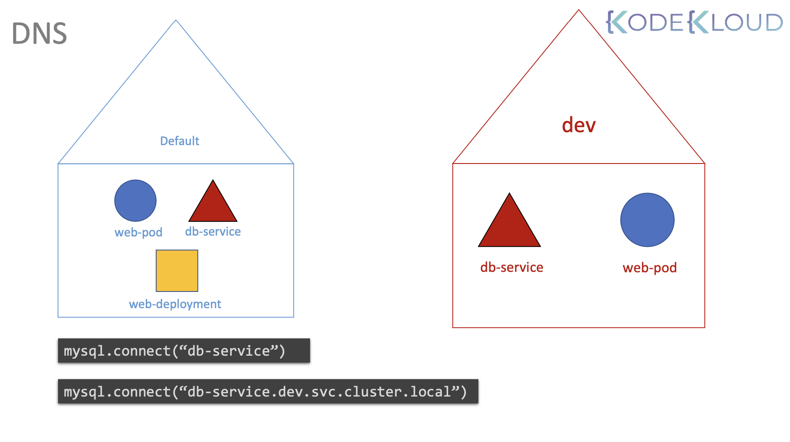

# Namespaces

Namespaces 는 여러 유저들 사이에서 cluster resources를 분리하는 방법

동일한 이름을 가진 두 개체가 있을 때, 이를 구분하기 위한 지정자가 필요

가령, Mark라는 이름을 가진 두 사람이 있을 때, 이 둘을 구분하기 위해 각각을 Mark Smith 와 Mark Williams 로 부름

이 둘은 각각 Smith 가(家)와 Williams 가(家)에 속함

이 때, 가족 구성원 사이에서는 Mark Smith가 아닌 Mark로 불러도 겹칠 수 없기 때문에 간단히 이름으로 부르며, 집 밖에서는 항상 풀네임으로 불러야 함

각 집마다는 소비가능한 자원이 지정되어 있음


### Namespace - Isolation

쿠버네티스에는 위 예시의 집과 같은 개념인 Namespace 존재 

클러스터에 포드, 배포, 서비스 같은 개체를 사용했을 때 항상 Namespace 내부에 정의가 된 것

규모나 환경에 따라, 쿠버네티스 클러스터를 사용 시 Namespace 사용을 고려해야 함

쿠버네테스는 클러스터 셋업 시, 특정 Namespace를 생성 - `default`, `kube-system`, `kube-public`, `kube-node-lease`

<br/>


✔️ **default** namespace: 특정 Namespace 지정하지 않았다면 `default` 에 할당됨 

> Kubernetes includes this namespace so that you can start using your new cluster without first creating a namespace.

✔️ **kube-node-lease** namespace

> This namespace holds Lease objects associated with each node. Node leases allow the kubelet to send heartbeats so that the control plane can detect node failure.

각 노드와 연결된 Lease 객체를 할당
노드 [Lease](https://kubernetes.io/docs/concepts/architecture/leases/)는 Kubelet이 hearbeats를 보낼 수 있게 해줌으로써, Control Plane이 노드 장애를 감지할 수 있도록 해줌.

✔️ **kube-public** namespace: 운영을 위한 서비스(네트워킹나 DNS 등)을 배치하기 위해 생성됨. 다른 쿠버네티스 서비스와 분리하여, 실수로 인한 삭제하거나 수정하는 걸 막음

> This namespace is readable by all clients (including those not authenticated). This namespace is mostly reserved for cluster usage, in case that some resources should be visible and readable publicly throughout the whole cluster. The public aspect of this namespace is only a convention, not a requirement.


✔️ **kube-system** namespace: 운영을 위한 서비스(네트워킹나 DNS 등)을 배치하기 위해 생성됨. 다른 쿠버네티스 서비스와 분리하여, 실수로 인한 삭제하거나 수정하는 걸 막음

> The namespace for objects created by the Kubernetes system.

```Bash
❯ kubectl get all -n kube-system
NAME                                         READY   STATUS    RESTARTS      AGE
pod/coredns-5d78c9869d-9mt7g                 1/1     Running   1 (14d ago)   19d
pod/coredns-5d78c9869d-j65vw                 1/1     Running   1 (14d ago)   19d
pod/etcd-docker-desktop                      1/1     Running   1 (14d ago)   19d
pod/kube-apiserver-docker-desktop            1/1     Running   1 (14d ago)   19d
pod/kube-controller-manager-docker-desktop   1/1     Running   1 (14d ago)   19d
pod/kube-proxy-bjk7p                         1/1     Running   1 (14d ago)   19d
pod/kube-scheduler-docker-desktop            1/1     Running   1 (14d ago)   19d
pod/storage-provisioner                      1/1     Running   2 (14d ago)   19d
pod/vpnkit-controller                        1/1     Running   1 (14d ago)   19d

NAME               TYPE        CLUSTER-IP   EXTERNAL-IP   PORT(S)                  AGE
service/kube-dns   ClusterIP   10.96.0.10   <none>        53/UDP,53/TCP,9153/TCP   19d

NAME                        DESIRED   CURRENT   READY   UP-TO-DATE   AVAILABLE   NODE SELECTOR            AGE
daemonset.apps/kube-proxy   1         1         1       1            1           kubernetes.io/os=linux   19d

NAME                      READY   UP-TO-DATE   AVAILABLE   AGE
deployment.apps/coredns   2/2     2            2           19d

NAME                                 DESIRED   CURRENT   READY   AGE
replicaset.apps/coredns-5d78c9869d   2         2         2       19d
```

<br/>

### DNS

development와 production 환경에 동일한 클러스터를 생성하려고 할 때 Namespace를 통해 분리할 수 있으며, 
development 환경에서 작업 시 production 리소스를 분리시켜 실수를 방지

각각의 Namespace는 고유한 정책을 정의해 리소스 영역을 보장할 수 있음 (가령, 각 리소스 할당량 제한)

동일한 Namespace에서는 각 서비스를 호출 시 단순 이름으로만 호출 가능하지만,
다른 Namespace도 접근 시에는 반드시 Namespace를 같이 명시해야 함


<br/><br/>

```Bash
# same namespace 
mysql.connect("db-service")

# another namespace 
mysql.connect("db-service.dev.svc.cluster.local")
```

`default` namespace에서 `dev` namespace에 존재하는 `db-service`를 호출하고 싶다면 `db-service.dev.svc.cluster.local` 포맷으로 호출 가능

<br/>

`«①:service-name».«②:namespace».«③:svc».«④:cluster.local»`

- ④ `cluster.local`: domain name
- ③ `svc`: service의 sub-domain
- ② `«namespace»`: Namespace
- ① `«service-name»`: Service Name


—

### Command

✔️ **namespace 지정 Pod 생성**

```Bash
kubectl create -f pod-definition —namespace=<insert-namespace-name-here>
kubectl get pods —namespace=<insert-namespace-name-here>
```

Alias `-n` 을 사용할 수 있음

```Bash
kubectl create -f pod-definition -n=<insert-namespace-name-here>
kubectl get pods -n=<insert-namespace-name-here>
```

✔️ **namespace 생성**

**① Declarative**

```yaml
# namespace-dev.yaml
apiVersion: v1
kind: Namespace
metadata:
  name: dev
```

```Bash
kuberctl create -f namespace-dev.yaml
```

**②Imperative**


```Bash
kuberctl create namespace dev
```

✔️ **namespace에 할당 된/되지 않은 api-resource 확인**

```Bash
# In a namespace
kubectl api-resources —namespaced=true

# Not in a namespace
kubectl api-resources —namespaced=false
```

✔️ **모든 namespace의 api-resource 확인**

```Bash
kubectl get all —all-namespaces

# using alias
kubectl get all -A
```

<br/>

### Namespace Preference

✔️ **namespace 지정**

만약, dev namespace을 영구적으로 설정하고 싶거나 옵션을 지정할 필요가 없어진다면,
`kubectl config` 명령으로 현재 컨텍스트에서 dev namespace를 설정할 수 있음


```Bash
kubectl config set-context $(kubectl config current-context) —namespace=dev

# using alias
kubectl get all -A
```

<br/>

### Resource Quota

[🔗 link](https://kubernetes.io/docs/concepts/policy/resource-quotas/)

Namespaces 는 여러 유저들 사이에서 cluster resources를 분리하는 방법

이제 세 개의 네임 스페이스에서 작업한다고 해보죠

아까 얘기했듯이 기본값으로 기본 네임스페이스에 있죠

그래서 기본 네임 스페이스 안의 리소스를 볼 수 있는 겁니다 큐브 컨트롤 포드 가져오기 명령을 사용해서요

```yaml
apiVersion: v1
kind: ResourceQuota
metadata:
  name: compute-quota
  namespace: dev

spec:
  hard:
    pods: "10"
    requests.cpu: "4"
    requests.memory: 5Gi
    limit.cpu: "10"
    limit.memory: 10Gi
```

```Bash
kubectl create -f compute-quot
```

